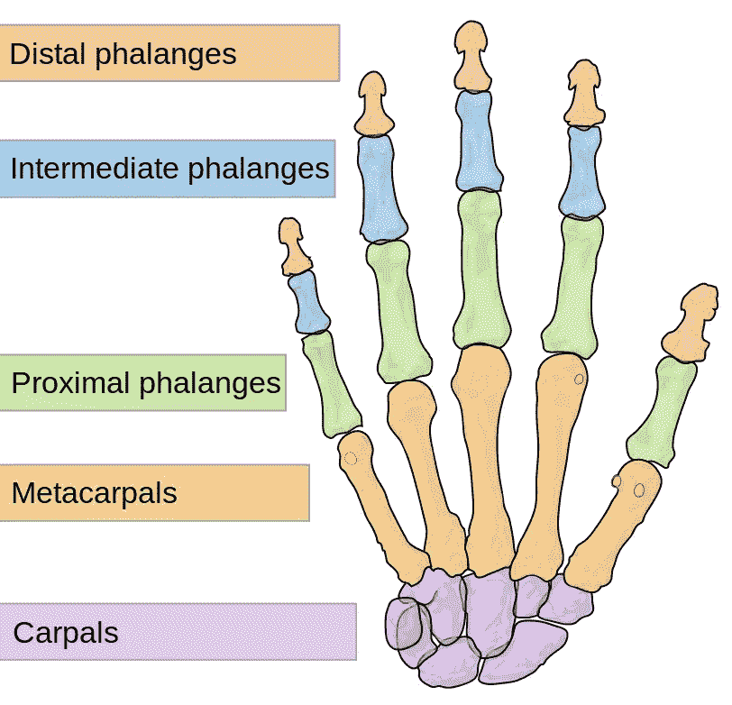
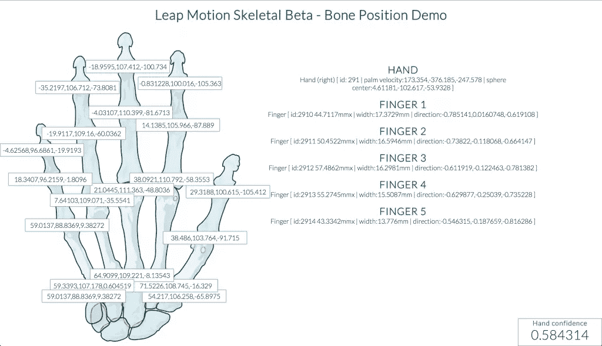

# 使用 JavaScript 和 Leap Motion 进行骨骼跟踪

> 原文：<https://www.sitepoint.com/skeletal-tracking-javascript-leap-motion/>

当谈到使用下一代技术的 JavaScript 时，Leap Motion 是我最喜欢使用的设备之一。有了 Leap Motion，JavaScript 不再是一个过时的想法。它不是由爱好者拼凑的第三方模块——它是由 Leap Motion 团队在每个新的 API 版本中精心开发的。他们的最新版本 2.1，目前处于测试阶段，非常令人兴奋。在本文中，我将概述 JavaScript 开发人员可以使用的新功能。

## 以更大的信心跟踪这些手牌

API 为每手牌提供了额外的数据。手数据在`frame.hands`中可用，就像在以前的 API 中一样，但是在更新中，我们得到了一个新数据的精彩集合，这将使 Leap Motion 开发人员的生活更容易。

### 手的信心

新 API 中我最喜欢的一个特性是能够知道 Leap Motion 对其数据有多确定。`hand.confidence`提供一个从 0 到 1 的值，让您知道它所看到的与它所理解的手的模型有多匹配。低值可能意味着不确定整个手部数据，或者可能意味着不确定手指/骨骼位置。这可以让你在采取行动前检查跳跃动作的把握程度。我希望看到这能带来更流畅的交互，并希望鼓励用户在他们的手势中非常清晰。

### 手型

`hand.type`计算出跳跃动作认为看到的是左手还是右手。如果你的手握成了拳头，那么这个区别会有点困难。

### 收缩强度

`hand.pinchStrength`是一个奇妙的新属性，它给出一个从 0 到 1 的值，代表拇指和手指之间的距离。这可能会为手势和控制应用程序带来一些有趣的可能性，因为捏是一种很好的自然的人类手势。

### 抓取力度

就像捏力度一样，返回一个从 0 到 1 的值，但它代表你的手是张开的还是握紧的。这里的可能性同样令人兴奋——让你的用户挤压一个虚拟的压力球，或者在虚拟的房间里抓东西扔东西。

## 新手指数据

在新的骨骼 API 变化中，每只手总是有五个手指，你可以为 Leap Motion 可以看到的每个手指获得一组全新的数据。

### 手指类型

您可以使用`finger.type`读取每一位数据代表哪种手指。该对象将是一个从零到四的值:

*   0 是拇指
*   1 是食指
*   2 是中指
*   3 是无名指
*   4 是小指

每次 Leap Motion 读入手部数据时，它都会用所有五个手指读入。

### 手指伸展

如果一些手指没有指向跳跃动作上方，设备会使用`finger.extended = false`将它们记录为没有伸展。

## 顾名思义，我们将数据细化到骨骼

我并不精通手部的骨骼结构，所以我有机会在这里学到一些新的东西。我的医生会为我丰富的知识感到骄傲。希望有一天掌骨能成为随意的话题。

Leap Motion 提供每个手指中四块指骨的数据，从手腕到每个手指的指尖依次为:掌骨、近端指骨、中间指骨和远端指骨。这对大多数社会来说毫无意义，所以这里有一个我在[维基共享资源](http://commons.wikimedia.org/wiki/File:Scheme_human_hand_bones-en.svg)上找到的可爱的图表:

### 指骨细节

它对每块骨头进行了更详细的描述(我从手腕到指尖排列了这些细节):

*   `finger.carpPosition`–掌骨底部的 x、y 和 z 位置。
*   `finger.mcpPosition`-手指指关节的位置-掌骨和近节指骨之间的位置。
*   `finger.pipPosition`–近端指骨和中间指骨之间的点的位置。
*   `finger.dipPosition`–连接中间趾骨的远端骨底部的位置。

它还为每个手指骨骼提供了更详细的对象—`finger.metacarpal`、`finger.proximal`、`finger.intermediate`和`finger.distal`。在 Leap Motion API 中，它们中的每一个都表示为一个骨骼，具有以下详细信息:

*   `bone.type`–从 0 到 4 的数值，代表骨骼的类型:

*   0–掌骨

*   1–近端指骨
*   2–中间方阵
*   3–远端指骨
*   4–前臂

*   `bone.basis`–提供一个表示骨骼向量的二维数组。你可以用这个做一些疯狂的数学运算来检测特定的手指位置。在我尝试使用这些值之前，我需要适应一些数学实践，但是它是辉煌的潜力在那里！

*   `bone.prevJoint`和`bone.nextJoint`–分别是最靠近手腕的骨头末端和最靠近指尖的骨头末端的坐标。
*   `bone.length`–骨头的长度，单位为毫米。
*   Leap Motion 在他们的文件中将其描述为“这块骨头周围肉质部分的平均宽度”。
*   `bone.left`–骨头是否在左手(如果不是，那就是在右手，好像没有`bone.right`
*   `bone.center`–骨头的中点
*   `bone.direction`–骨骼所在的方向向量

基本上，这就是大量的数据。

### 在一个有很多数字的演示中的数据

我做了一个快速演示来展示有多少坐标数据流过这个 API。以下演示显示了`finger.carpPosition`、`finger.mcpPosition`、`finger.pipPosition`和`finger.dipPosition`的坐标，以及手和手指的基本数据。这也只是可用数据的一小部分！

演示看起来有点像这样:

你可以试试你的跳跃动作[这里](http://www.patcat.com/lab/leapmotion/bonepositiondemo)。

## 接下来还有更多！

V2 Leap Motion API 不仅仅是这些功能，它还支持 Oculus VR 等 VR 头戴设备，并提供对 Leap Motion 实际图像数据的访问。遗憾的是，这些特性在 JavaScript API 中还不可用，但希望我们能在 API 退出测试版之前看到它们！

## 其他资源

如果您正在寻找关于这些 API 入门的更多详细信息，最好的去处是 Leap Motion 开发者网站:

*   [JavaScript SDK 文档](https://developer.leapmotion.com/documentation/skeletal/javascript/index.html)
*   Leap Motion JavaScript 演示图库，查看源代码，了解更多精彩内容！

## 分享这篇文章