# 使用 Braintree v.zero SDK 购买时间

> 原文：<https://www.sitepoint.com/buy-time-braintree-v-zero-sdk/>

*本文由[布伦特里](https://www.braintreepayments.com/)赞助。感谢您对使 SitePoint 成为可能的赞助商的支持！*

布伦特里标榜自己提供“简单、强大的支付”我们已经在我的公司 KYCK 使用 Braintree 很长时间了，我可以证明接受付款是多么容易。2013 年 12 月，Braintree 被 PayPal 收购。直到最近，由于收购，变化不大。作为第一个重大变化，Braintree 发布了一个新的客户端 SDK，旨在使事情变得更简单，并添加一些新功能。

新的 SDK 被称为“v.zero”，它提供:

*   一个新的嵌入式用户界面，允许你用“少至十行代码”就开始接受支付。
*   能够轻松接受贝宝作为支付方式。这是 SDK 的一大新特性，毫无疑问，也是收购 PayPal 的直接结果。
*   很快，通过与比特币基地的合作，可以通过比特币接受支付。
*   强大的，可定制的支付流程，以满足您的需求时，嵌入式用户界面不起作用。
*   未来对 SDK 的更改将变得“简单”换句话说，Braintree 的目标是让 SDK 与不断变化的技术保持同步，而不会迫使开发者修改他们的支付流程。
*   使用 PayPal 和 Venmo 的 One Touch 移动支付。一键操作让通过手机应用程序接受支付变得尽可能无缝。[这篇文章](https://www.braintreepayments.com/blog/goodbye-passwords-one-touch-hello-bitcoin)宣布 One Touch 有一个很棒的视频来解释这项服务。如果你是一个移动开发者，这是一件大事。

在这篇文章中，我将介绍 v.zero SDK 的一些特性。大部分的重点将是在下降的用户界面和接受贝宝，所以你可以快速启动和运行。

## 应用程序

为了接受支付，必须有一个产品。对于我们的应用程序，我想要一个引人注目的产品。每个人都想要或需要的东西，他们会涌向网站购买的东西。它像午夜的一道闪电击中了我:时间。每个人都想要更多的时间。这就是我们要卖的东西。我们的用户将能够在繁忙的生活中购买他们认为合适的额外时间。我们马上就要成为亿万富翁了。

该应用程序是一个普通的 Rails 应用程序，具有身份验证功能。我不打算介绍如何设置 Rails 应用程序。相反，我们的起点是一个 Rails 应用程序，其用户模型使用 Devise 的密码验证。我还添加了 Zurb 粉底来做一些简单的造型。大约有 120 万个关于如何设置[轨道](http://tech.pro/tutorial/1718/rails-4-authentication-using-devise)和[设计](https://github.com/plataformatec/devise/wiki/How-Tos)的教程，我已经在[库](https://github.com/sitepoint-examples/braintree-vzero-rails)中标记了我们的起点(“starting_point”)。

我们的用户将有一个非常简单的购买流程。一旦登录，用户可以选择一种支付方式(信用卡或 PayPal)并支付 1 小时 10 美元。首先，应用程序有一个带有`new`动作和视图的`OrdersController`。

## SDK 如何工作

布伦特里支付流程由四个步骤组成:

*   创建一个布伦特里账户。
*   向应用程序添加 Braintree Ruby 库。
*   向您的客户机(在我们的例子中是指浏览器)提供一个客户机令牌
*   授权支付后，从客户端(浏览器)接收支付方法随机数(注意:在这一步之前，如果你问我随机数是什么，我会说，“一种通常患有狂犬病的小型毛茸茸的动物，会无缘无故地攻击。”有很多我不知道的。)
*   使用支付方式 nonce 在 Braintree 上创建交易。

### 创建一个布伦特里账户

为了使用 Braintree 接受付款，您必须注册一个 Braintree 帐户。建议从布伦特里的“沙盒”开始，它允许你在没有金钱实际交易的情况下测试支付。沙盒是天赐之物，允许开发者在一个反映真实情况的环境中完善支付流程。

前往[入门](https://www.braintreepayments.com/get-started)页面，注册一个账户。

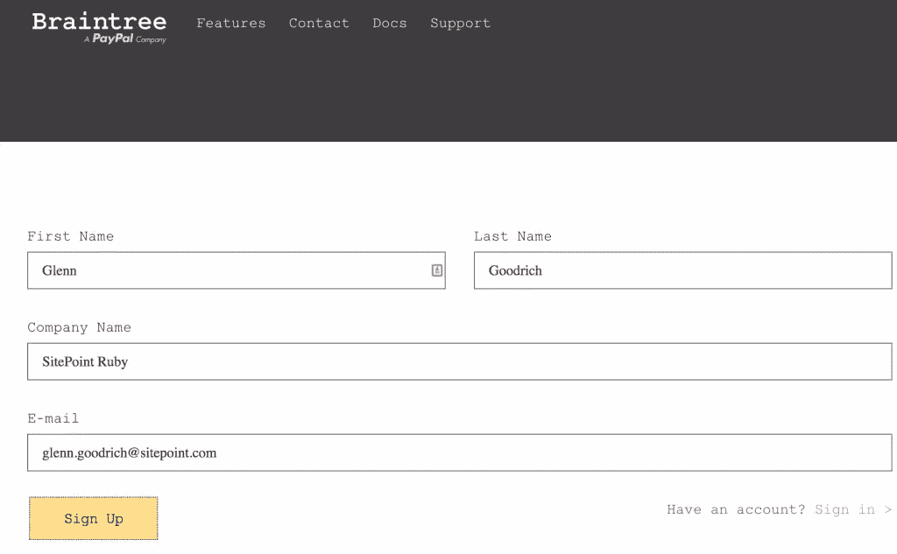

布伦特里将发送一封确认电子邮件，所以得到确认，我们准备向前迈进。

第一次登录会让您进入沙盒仪表板，如下所示:

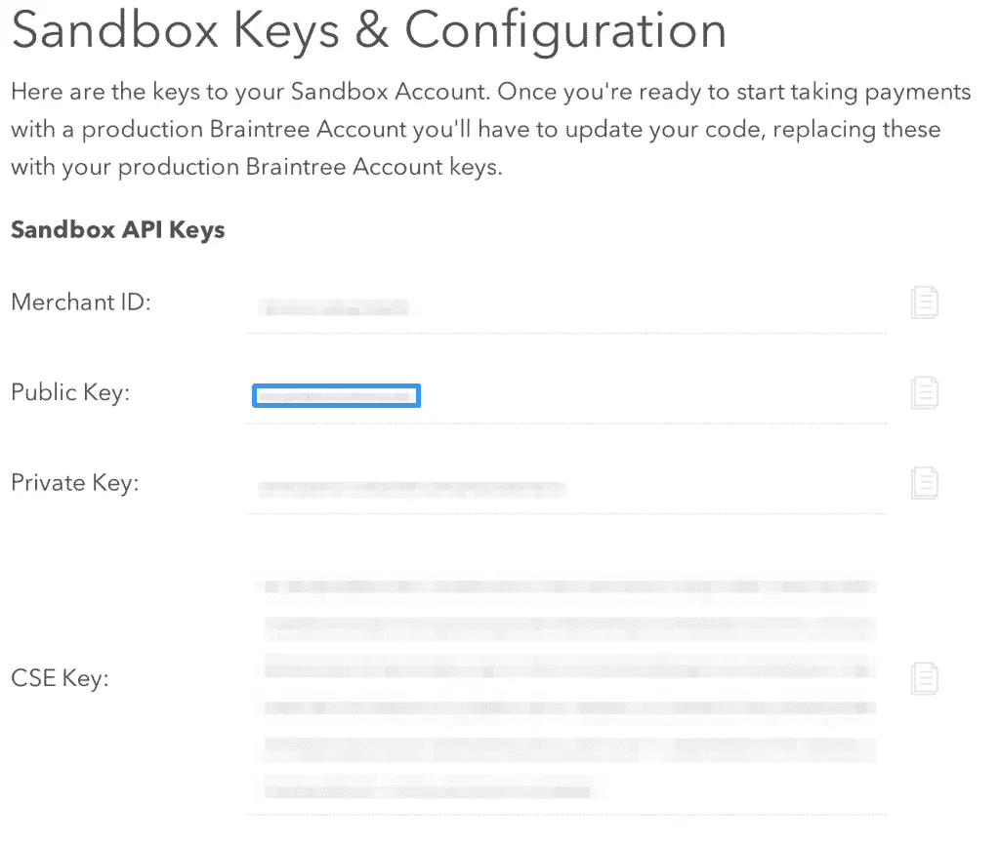

这个页面上重要的位是:**商户 ID:** 、**公钥**和**私钥**。这些值将用于在我们的 Rails 应用程序中配置 Braintree SDKs。事实上，如果你在同一个页面上看，有一个示例 Ruby 配置可以复制并粘贴到你的应用程序中。

### 获取布伦特里 Ruby 库

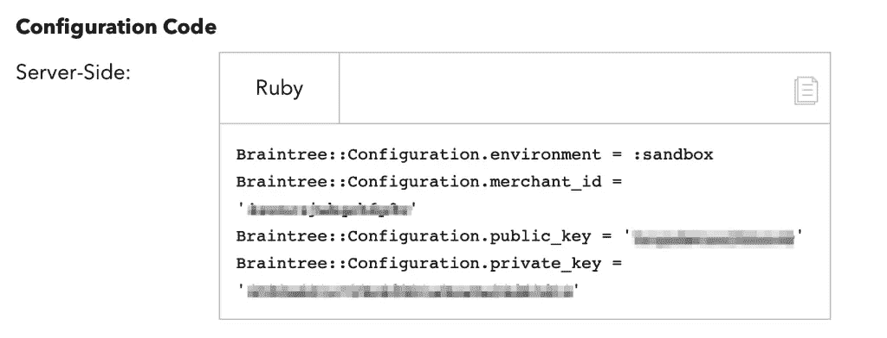

在 Rails 中，这种配置是在初始化器中处理的。然而，我们的代码库中还没有一个`Braintree`类。幸运的是，布伦特里有一个 Rubygem 供我们使用。将`gem "braintree"`添加到**gem 文件**和`bundle install`中。

用下面的代码创建一个**config/initializer/brain tree . Rb**:

```
Braintree::Configuration.environment  = ENV['BRAINTREE_ENV']         || :sandbox
Braintree::Configuratio.merchant_id   = ENV['BRAINTREE_MERCHANT_ID'] || 'your merchant id'
Braintree::Configuration.public_key   = ENV['BRAINTREE_PUBLIC_KEY']  || 'your public key'
Braintree::Configuration.private_key  = ENV['BRAINTREE_PRIVATE_KEY'] || 'your private key' 
```

### 生成客户端令牌

当我们的用户出现来购买更多的时间，Braintree 必须知道我们是谁，以便让我们获得数百万。基本上，用户将选择一种支付方式，并通过从我们的应用程序向布伦特里的服务器提交一份表格来授权支付。客户端令牌将与用户信息一起提供，它通过识别他们那边的商家帐户来告诉 Braintree 我们是谁。Braintree 返回一个支付方法 nonce，它表示对我们的应用程序的授权支付，我们稍后将对此进行讨论。

#### 嵌入式用户界面

这就是 v.zero SDK 中新的插件 UI 发挥作用的地方。创建一个名为**app/views/payment/_ form . html . erb**的分部:

```
<form id="checkout" method="post" action="/checkout">
  <div id="dropin"></div>
  <input type="submit" value="Pay $10">
</form>

<script type="text/javascript">
  function setupBT() {
    braintree.setup("<%=@client_token%>", 'dropin', {
      container: 'dropin'
    });
  }
  if (window.addEventListener)
    window.addEventListener("load", setupBT, false);
  else if (window.attachEvent)
    window.attachEvent("onload", setupBT);
  else window.onload = setupBT;
  </script>
</script> 
```

这个`form`直接取自[布伦特里文档](https://developers.braintreepayments.com/javascript+ruby/start/hello-client)。这里添加了`script`块来处理客户端令牌的生成。我想把它们都放在一个文件中，这样在本教程中会更清楚。令牌是在`OrdersController#new`方法中创建的:

```
def new
  @client_token = Braintree::ClientToken.generate
end 
```

这些相同的 Braintree 文档显示了添加 Braintree javascript 文件的需要，所以让我们现在就这样做。将 [braintree.js 文件](https://js.braintreegateway.com/v2/braintree.js)下载到**vendor/assets/JavaScript s**目录，并添加到我们的**app/assets/JavaScript s/applications . js**:

```
//= require braintree (ADD THIS LINE)
//= require_tree . (This line already exists) 
```

现在，我们的`setupBT`函数中的`braintree` javascript 变量将会存在。

如果您运行服务器(并在应用程序中注册一个帐户)，插件 UI 会呈现并看起来非常好:

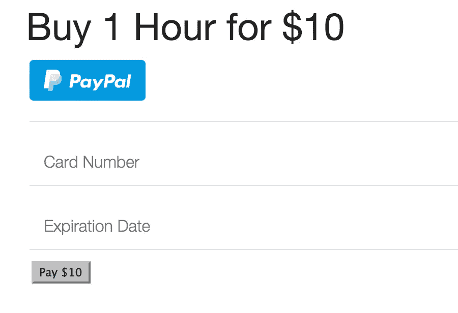

看起来我们有能力接受贝宝和信用卡开箱即用。但是如果没有 CVV 场，这种形式看起来有点奇怪。怎么才能加上 CVV 呢？

我们可以通过在 Braintree 沙箱中配置 CVV 来将其添加到我们的表单中。登录后，从“设置”菜单中选择“处理”:

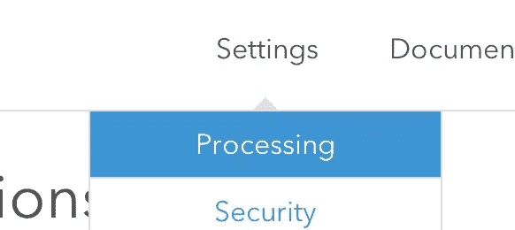

该页面有大量配置选项，包括:

*   重复事务检查，如果某个事务与前 30 秒内的某个事务相匹配，则停止创建该事务。
*   接受 [Venmo](https://venmo.com/) 。
*   基本的欺诈保护，包括 CVV。
*   自定义字段。
*   电子邮件收据。
*   非常非常多。

要将 CVV 添加到表单中，我们需要配置规则。点击“CVV”下的“编辑”按钮，添加您的规则。这是我的:

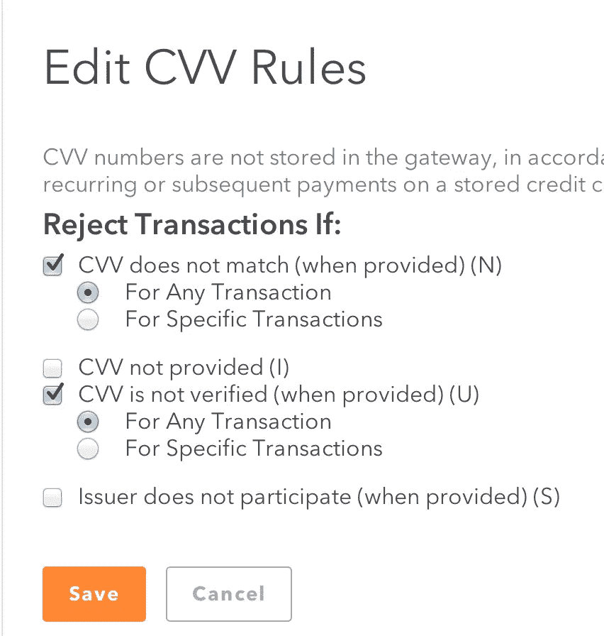

配置了 CVV 规则后，表单现在有了 CVV 字段:

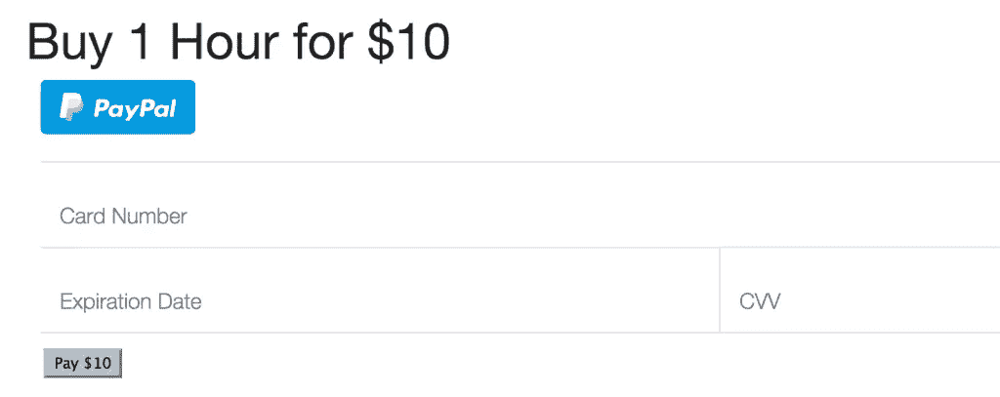

这很酷。

### 付款方式现时

接下来是我们基本流程的最后一步:从 Braintree 获取一个支付方法 nonce，我们将把它提供给我们的 Rails 服务器，然后返回给 Braintree 添加一个支付。

我希望我们的第一次付款尽可能简单。因此，我们将把表单上的`action`改为 post 到`/orders`，并渲染出`@params`。部分更改表单:

```
<%= form_tag orders_path, method: "post" do %>
  <div id="dropin"></div>
  <input type="submit" value="Pay $10">
<% end %>
<%= @params %> <!-- We'll remove this later, just testing now --> 
```

现在，表单已经有所改进，这样就不会出现任何真实性标记错误。此外，我添加了`@params`，这样我们可以更好地了解 Braintree 表单向服务器提供了什么。

发布到`/orders`将期望`OrdersController#create`存在。开始简单:

```
def create
  @params = params
  render action: :new
end 
```

为了用信用卡测试表单，我们需要一个假号码。你可以从 PayPal 网站上的[页面](http://www.paypalobjects.com/en_US/vhelp/paypalmanager_help/credit_card_numbers.htm)获取假信用卡号码。(它们对真实的东西不起作用……不是说我试过它们或什么的。)

填写表格，看看会发生什么。

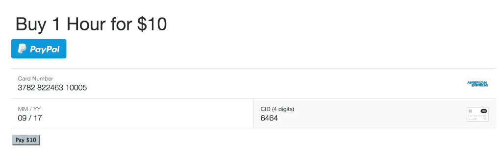

我立刻注意到了下面的凉意:

*   它不让我在信用卡或其他字段中输入任何垃圾。表单免费提供一些基本但可靠的输入验证。很好。
*   文本标签既有用又直观。事实上，这是一种很好的体验，比花了 KYCK 很多年来设计和实现的表单要好。

提交发送到我们的`create`方法的表单，并在视图中呈现参数:

```
{"utf8"=>"✓",
 "authenticity_token"=>"Yxt5NzsrKB4u/rEjmR3A7pIwVbcpGCL/lEBTMx7H8x0=",
 "payment_method_nonce"=>"1e6dfd62-f92e-4703-8807-b3f6b9b28c84",
 "action"=>"create",
 "controller"=>"orders"} 
```

这就是……支付方式随机数。你可以随心所欲地阅读有关 noncess 的文章，但是在野外看到 nonce 确实是一次令人激动的经历。

### 创建一个决策树事务

嗯，这很令人兴奋。我们已经进入了接受付款测试的最后一步。此时，只需在 Braintree 上创建一个事务。事实证明，这非常简单。像这样改变`OrdersController#create`:

```
def create
  nonce = params[:payment_method_nonce]
  render action: :new and return unless nonce
  result = Braintree::Transaction.sale(
    amount: "10.00",
    payment_method_nonce: nonce
  )

  flash[:notice] = "Sale successful. Head to Sizzler" if result.success?
  flash[:alert] = "Something is amiss. #{result.transaction.processor_response_text}" unless result.success?
  redirect_to action: :new
end 
```

回去用那个假信用卡号填你的表格，然后嘣！我们可以接受付款。


## 输入 PayPal

让我们看看使用 PayPal 是否像使用假信用卡号一样简单。回到应用程序，而不是填写表格，点击大，蓝色的贝宝按钮。您应该会看到一个弹出窗口，要求您登录:

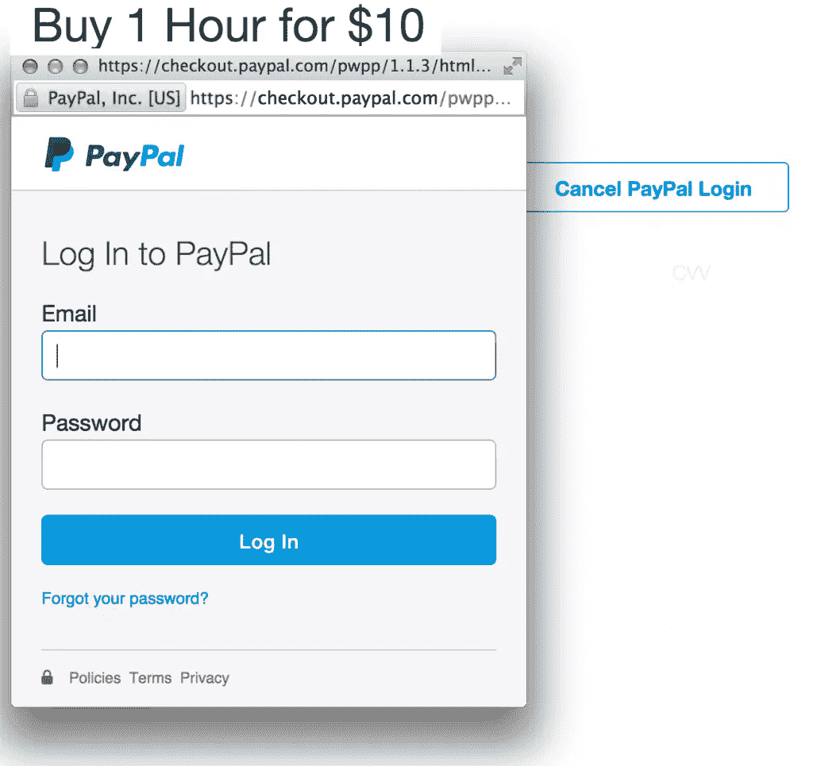

请注意，它在主窗体上放置了一个覆盖图，非常时髦。登录后，您会被告知供应商的确切要求:

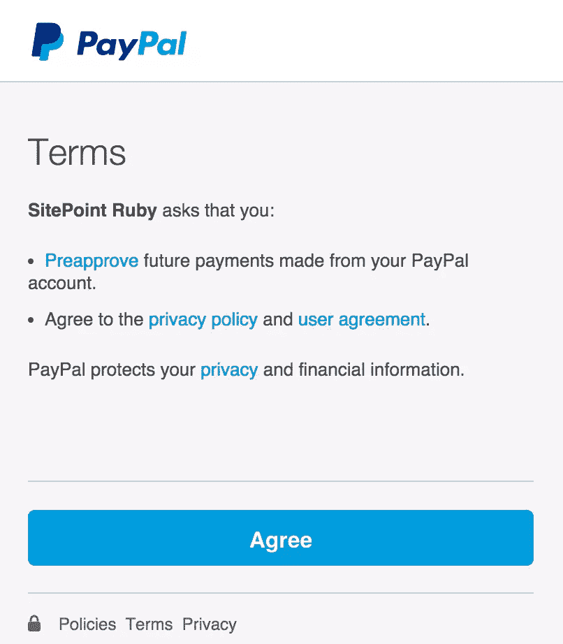

点击“同意”,您将返回表单。它会发生变化，以反映您正在使用 PayPal

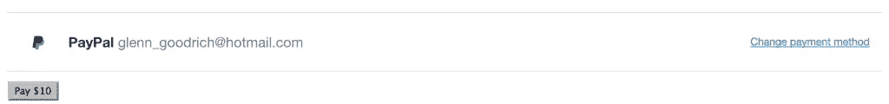

点击“支付 10 美元”并观看贝宝被接受。MMMM……这是一笔不错的报酬。

## 数钱

如果你去布伦特里沙盒仪表板，你可以看到我们正在前进！

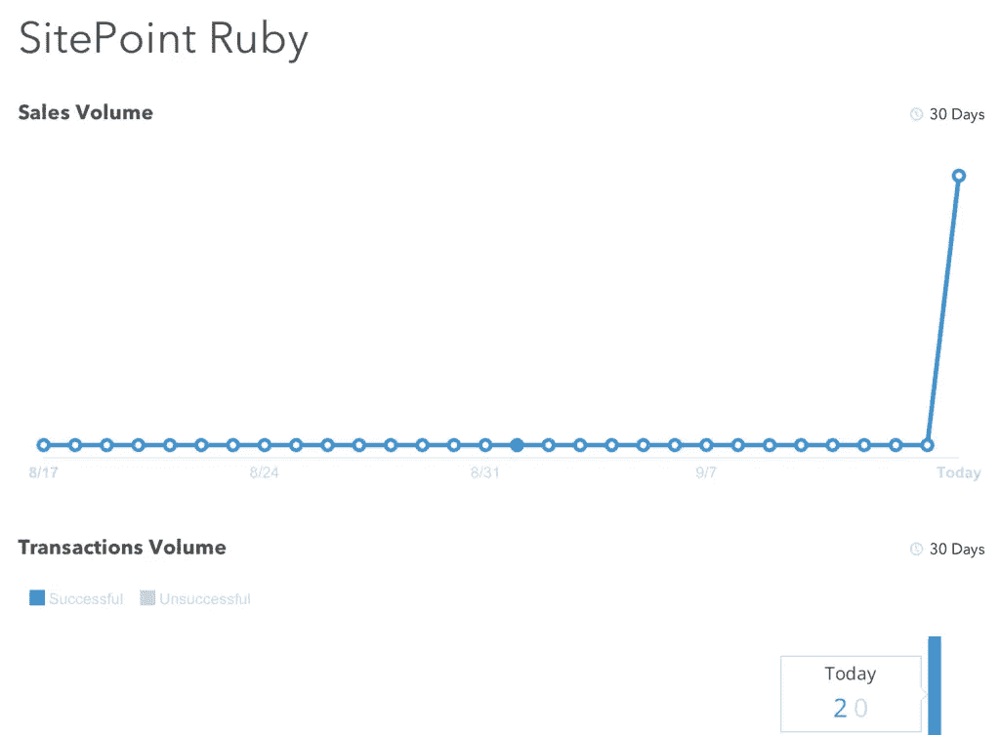

伙计，今天对我们来说很重要！

## 后续步骤

这篇文章只是触及了 Braintree v.zero SDK 的皮毛。如果我们想让我们的时间购买应用程序更上一层楼，我们可以:

*   在我们的本地用户上存储 Braintree 客户 id，允许这些用户重复使用支付方式。Braintree 提供了 [Vault](https://developers.braintreepayments.com/javascript+ruby/start/vault) ，它将为用户添加的每种支付方式存储代币。客户可以在回来购买更多时间时选择其中一种付款方式。
*   控制应用程序事务的事务生命周期。 [Braintree 交易处理流程](https://developers.braintreepayments.com/javascript+ruby/sdk/server/transaction-processing/overview)是复杂的，如果您正在使用 Braintree，您需要了解它。您可以进行结算、释放、退款等操作。学习它，生活它，热爱它。
*   向我们的客户提供订阅服务。也许他们可以花 90 美元每月工作 10 个小时。Braintree 提供的[循环计费](https://developers.braintreepayments.com/javascript+ruby/guides/recurring-billing)非常容易处理。这是真正的奶酪所在的地方。

也许你有其他的建议，我们可以在哪里花时间叫卖？让我知道我们下一步应该做什么，也许我会为最受欢迎的项目写一篇文章。

记住，本文的源代码在这个[存储库](https://github.com/sitepoint-examples/braintree-vzero-rails)中。

与此同时，要小心那些随机数。他们随时都可能爆发。

## 分享这篇文章