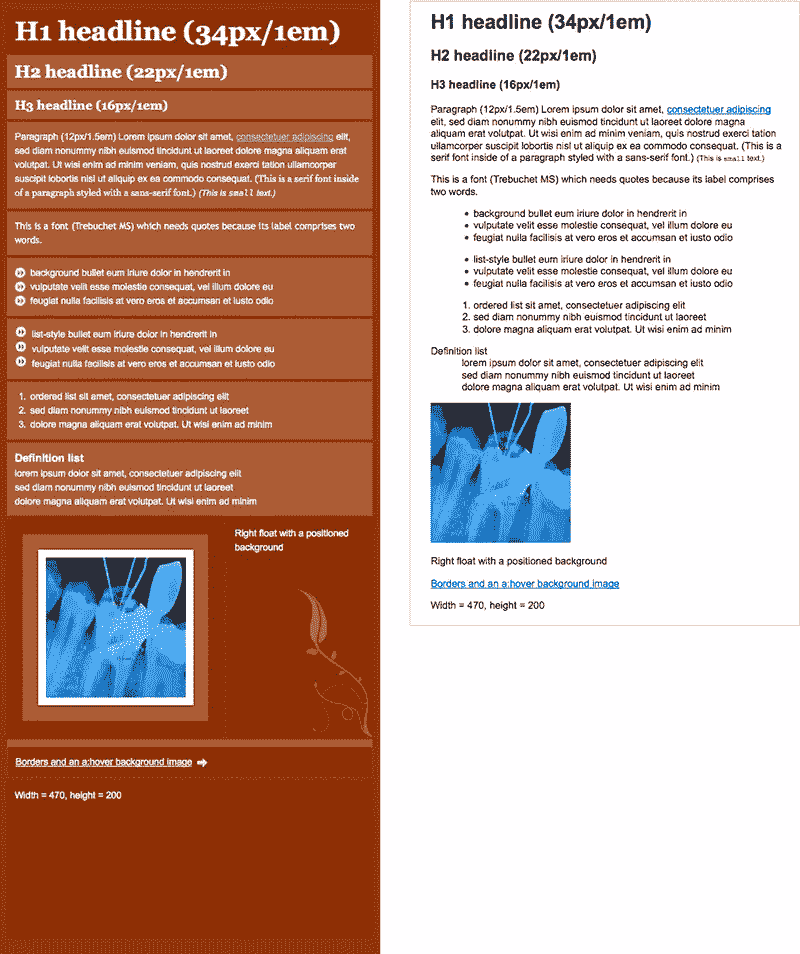
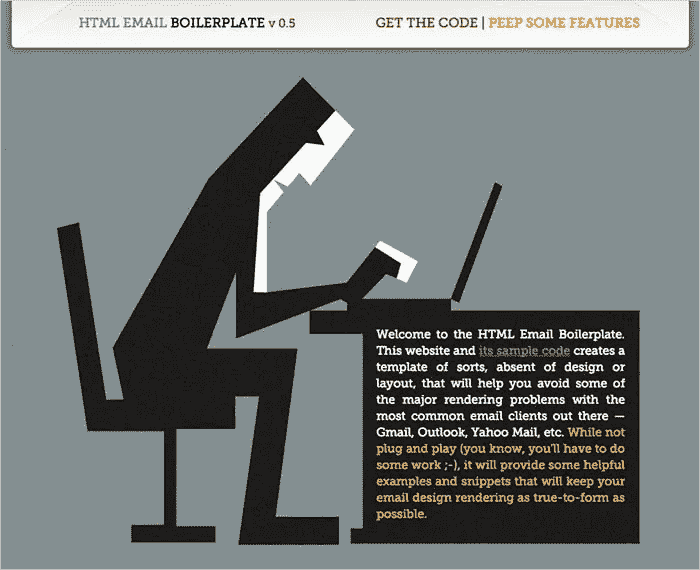
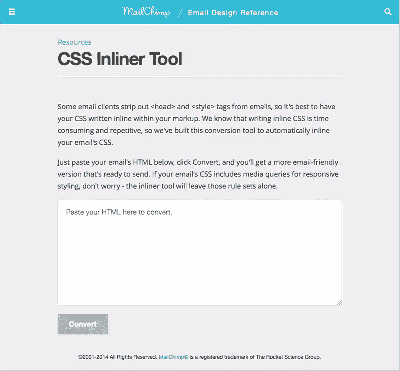
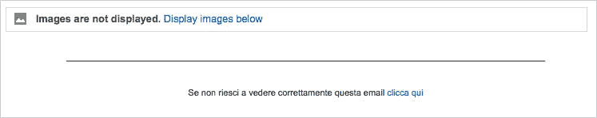

# 速成班:建立电子邮件简讯

> 原文：<https://www.sitepoint.com/first-email-newsletter/>

如果你在职业生涯中一直在处理网络标准，并且喜欢看着那些破旧、陈旧、遗留的浏览器逐渐消失，那么你第一次接触电子邮件简讯可能会有点痛苦。你需要抛弃很多网页设计的黄金法则来获得你需要的与电子邮件客户端的兼容性。

事实上，虽然在 2013 年，标准网络项目团队已经能够说[“我们在这里的工作已经完成了】](https://www.webstandards.org/2013/03/01/our-work-here-is-done/)，但通往电子邮件标准的道路似乎仍然非常漫长。

通过查看[电子邮件标准项目 Acid 测试](https://www.email-standards.org/acid-test/)，您可以看到电子邮件客户端如何呈现相同内容的示例。在下面的截图中，你可以看到相同的邮件是如何出现在 Apple Mail 和 Gmail 中的:



电子邮件设计确实需要你重新发明一些技能。但是不要认为这是对你创造力的限制——而是把它当作一个真正的挑战。

所以，让我们从总结电子邮件设计的要点开始，给你最广泛的跨电子邮件客户端兼容性:

## 不要:

*   使用 CSS3 规则和选择器
*   使用伪选择器或伪元素
*   使用浮动或定位对象
*   使用背景图像
*   使用表单
*   使用链接的 web 字体

## 做:

*   使用表格进行布局
*   使用**内联** CSS 规则
*   将电子邮件内容宽度限制在 600 像素左右
*   试验
*   试验
*   **测试！**

## 电子邮件构建工作流

### 建立一个原型

就像你做一个标准的 web 项目一样，我建议你从画一个原型开始。这将有助于你做出你所需要的每一个图形调整，也有助于你在开始编码之前向你的客户展示你的作品。

在此阶段，您需要创建一个设计:

*   吸引客户的注意力
*   把他们吸引到邮件的末尾(在读者决定是否删除邮件之前，你有最多 8-10 秒的时间)
*   传达一些行动号召(如“立即购买”或“联系我们”按钮)

你可以在网上找到很多灵感。我发现一些很好的资源是[htmlemaildesigns.com](https://htmlemaildesigns.com/)、[非常好的电子邮件](https://reallygoodemails.com/)或[简讯监测](https://www.newslettermonitor.com/)，由 [ContactLab](https://www.contactlab.com) 提供，这些主要集中在营销策略上。

### 给你的邮件编码

正如我们之前说过的，邮件客户端以许多非常不同的方式呈现电子邮件:我们的努力必须指向抵消，或者至少是*最小化*这些变化。

幸运的是，电子邮件往往有一个相对简单的结构，在大多数情况下，这项工作并不特别复杂。

在编码之前，看一下电子邮件客户端的统计数据(如果你能访问你正在做的项目的统计数据就更好了)，这将有助于你关注最常用的客户端。网上有许多电子邮件客户端市场份额报告。根据 2014 年 8 月[emailclientmarketshare.com](https://emailclientmarketshare.com/)(由[石蕊](https://litmus.com)提供)的数据，最大的电子邮件客户是:

1.  苹果 iPhone (26%)
2.  Gmail (15%)
3.  苹果 iPad (13%)
4.  前景(11%)
5.  苹果邮件(7%)
6.  谷歌安卓系统(6%)
7.  Outlook.com(5%)
8.  雅虎！邮件(5%)
9.  Windows Live Mail (2%)
10.  美国在线邮件(1%)

在此之后，您可以开始着手编写代码，特别要注意:

*   一些客户端(包括 Gmail)去掉了包含在`<style>`或`<link>`标签中的任何 CSS 规则(请看[石蕊:理解 Gmail 和 CSS](https://litmus.com/blog/understanding-gmail-and-css-part-1) ，所以你需要将每个 CSS 规则放在一个内嵌的`style`属性中(不要惊慌:有一个简单的方法可以做到这一点)
*   CSS 定位几乎不被支持，所以你必须使用表格来布局。

### 样板文件

由于电子邮件开发需要你处理几个电子邮件客户的需求，更好的方法是从一个[样板文件](https://en.wikipedia.org/wiki/Boilerplate_code)开始。你可以在网上找到许多样板和模板(你可以在下面找到一个必要的列表)，我的建议是，如果可能的话，把它们都尝试一下，找到更适合你工作的。

就我个人而言，我经常使用肖恩·鲍威尔的 HTML 样板文件或 T2 的电子邮件样板文件。



正如您在下面的几行示例中看到的，样板文件(在这种情况下是 Sean Powell 的)被强烈地注释了，它们是学习电子邮件编码的一个非常简单的方法。

```
<!DOCTYPE html PUBLIC "-//W3C//DTD XHTML 1.0 Strict//EN" "https://www.w3.org/TR/xhtml1/DTD/xhtml1-strict.dtd">

<html >
<head>
	<meta http-equiv="Content-Type" content="text/html; charset=utf-8" />
	<meta name="viewport" content="width=device-width, initial-scale=1.0"/>
	<title>Your Message Subject or Title</title>
	<style type="text/css">

		/***********
		Originally based on The MailChimp Reset from Fabio Carneiro, MailChimp User Experience Design
		More info and templates on Github: https://github.com/mailchimp/Email-Blueprints
		https://www.mailchimp.com &amp; https://www.fabio-carneiro.com

		INLINE: Yes.
		***********/
		/* Client-specific Styles */
		#outlook a {padding:0;} /* Force Outlook to provide a "view in browser" menu link. */
		body{width:100% !important; -webkit-text-size-adjust:100%; -ms-text-size-adjust:100%; margin:0; padding:0;}
		/* Prevent Webkit and Windows Mobile platforms from changing default font sizes, while not breaking desktop design. */
		.ExternalClass {width:100%;} /* Force Hotmail to display emails at full width */
```

#### 其他免费电子邮件模板

*   [Zurb 响应式模板](https://zurb.com/playground/responsive-email-templates)
*   [Zurb 墨水模板](https://zurb.com/ink/templates.php)
*   [Mailchimp 电子邮件蓝图](https://github.com/mailchimp/Email-Blueprints)
*   [基准自由模板](https://www.benchmarkemail.com/resources/Free-HTML-Email-Templates)

### 内联您的 CSS

尽管我们刚刚说过，你会注意到我们的样板文件确实为 CSS 使用了一个标准的`<style>`标签，即使我们知道我们的 CSS 需要在电子邮件的每个标签内进行编码。

事实上，不完全是这样的*所有的* CSS:媒体查询和所有特定于支持`<style>`的客户端的规则都必须保持原样。CSS 的其余部分必须内联编码。

显然,“内联”你的 CSS 代码的行为可能是极其乏味和复杂的(尤其是在非常复杂的项目中),但是这就是 CSS 内联器工具的用武之地。

它们都以同样的方式工作:你只需粘贴你的原始 HTML，CSS 就会自动内联。



如果您有特定的需求，我的建议是测试所有的需求(我在下面列出了一个简短的列表),找到最适合您特定需求的需求。例如，在我的情况下，我经常不得不处理 [Twig](https://twig.sensiolabs.org/) 或 [Smarty](https://www.smarty.net/) 文件，我发现我用 Mailchimp inliner 有更好的结果。

#### CSS 内联程序

*   [Mailchimp CSS 内嵌器](https://templates.mailchimp.com/resources/inline-css/)
*   [Mailchimp HTML 到文本邮件转换器](https://templates.mailchimp.com/resources/html-to-text/)
*   [活动监视器 CSS 内嵌器](https://inliner.cm/)
*   [Zurb CSS 内嵌器](https://zurb.com/ink/inliner.php)
*   [邮件程序邮件程序 CSS 内嵌器](https://www.mailermailer.com/labs/tools/magic-css-inliner-tool.rwp)
*   [方言前置码](https://premailer.dialect.ca/)
*   [火炬箱 CSS 内嵌器](https://inlinestyler.torchboxapps.com/)

### 图像呢？

电子邮件中的图像没有太多特别的要求:当然，你必须努力保持文件小，避免更新的文件格式，比如 *WebP* 。甚至有一种观点认为，最好避免使用 *PNG* 文件，而使用 *GIF* 文件。

你需要注意 ALT 文本:许多电子邮件客户端[默认屏蔽所有图片视图](https://litmus.com/community/learning/12-alt-text-in-html-email)(事实上，Gmail 在【2013 年 12 月之前一直这么做)。此外，用户自己经常屏蔽图片以防止外部跟踪，因此确保你的电子邮件在没有图片的情况下不会变得毫无意义非常重要——有时这被称为“优雅地降级”。如下例所示:



第一个预防措施是避免创建完全由图片组成的电子邮件(还有许多其他原因不这样做，比如可用性、可访问性等等)。

第二个是**总是**给你的图片加一个 ALT 文字，把不好的影响降到最低(看看[防御设计](https://www.emailmarketingrules.com/the-1-2-3-of-defensive-design/)的 1、2、3)。

### 积极响应

与网页一样，您可以优化您的邮件，使其在桌面和移动客户端都能正确显示。有许多技术和技巧可以做到这一点，我们将在另一个时间详细讨论，但是，现在，看一下这个基本的文档和文章列表:

*   [石蕊:五个回复邮件的技巧](https://litmus.com/community/learning/35-five-responsive-email-tips)
*   [活动监控:响应性电子邮件设计](https://www.campaignmonitor.com/guides/mobile/)
*   [响应电子邮件模式](https://responsiveemailpatterns.com/)
*   [石蕊:响应性电子邮件设计指南](https://litmus.com/blog/the-how-to-guide-to-responsive-email-design-infographic)

### 在线编辑

在线编辑器是手工编写电子邮件的一个非常有效的替代方法。如果你没有特别特殊的需求(或者你时间不够)，这可能就是诀窍。这些编辑器内置于这些电子邮件服务(Campaign Monitor、Mailchimp 等)提供的功能集中，但你显然需要一个帐户来使用它们。


### 电子邮件测试

测试是电子邮件设计的基础。您必须在各种各样的客户端中对您的设计进行路测，以确保一切运行良好。

您可以使用虚拟机或模拟器在您的计算机上安装许多客户端，并且您可以利用付费在线服务来帮助您完成这项工作。

Litmus 为电子邮件测试提供了一个很好的服务，还有 Acid 上的[电子邮件，虽然不是专门针对电子邮件客户端的，但是甚至](https://www.emailonacid.com/) [Browserstack](https://www.browserstack.com/) 也很有用。


## 一些(非常)简单的电子邮件设计原则

*   保持简单，但同时，尝试建立一个“情感设计”。你有几秒钟的时间，直到读者决定阅读或丢弃你的邮件，所以你必须在美观和加载速度之间找到合适的平衡。

*   **考虑移动电子邮件客户端**:在 2013 年底发布的 [Litmus 电子邮件客户端市场份额报告](https://litmus.com/blog/email-client-market-share-where-people-opened-in-2013)中，51%的电子邮件是通过移动设备阅读的。近年来，移动份额急剧增加，所以要时刻记住，你的电子邮件会经常被手机和平板电脑阅读。

*   **强烈关注你的内容**。虽然这不是严格意义上的设计任务，但内容当然是电子邮件写作的关键要素。避免语法错误，确保文本内容流畅。此外，为邮件选择一个合适的主题([石蕊主题行检查](https://litmus.com/resources/subject-line-checker)可以帮你做到这一点)。

*   专注于你的目标。如果你正在发送一份时事通讯，你可能希望你的读者做一些事情:把你的努力集中在这上面，要简洁，并试图获得用户的注意；添加一个行动号召按钮来实现您的目标。

## 资源

尽管电子邮件设计越来越受关注，但似乎目前几乎所有最好的文档都可以在公司博客中找到(如下所列)。

电子邮件标准项目可能是一个重要的资源，但是，尽管许多 acid 测试是最新的，站点博客似乎在 2010 年就停止了。我试图联系该网站，但没有任何有用的结果，所以我们无法确认该项目目前是否得到维护。

*   [电子邮件标准项目:流行客户端中的标准支持](https://www.email-standards.org/clients/)
*   [试金石:电子邮件客户端市场份额](https://emailclientmarketshare.com/)
*   [Campaign Monitor:CSS 的终极指南](https://www.campaignmonitor.com/css/)
*   [Mailchimp:电子邮件客户端 CSS 支持](https://templates.mailchimp.com/resources/email-client-css-support/)
*   [Mailchimp:电子邮件设计参考](https://templates.mailchimp.com/)
*   [活动监视器:指南](https://www.campaignmonitor.com/guides/)
*   竞选监督员:会有用吗？
*   [Mailchimp 指南](https://mailchimp.com/resources/)
*   电子邮件学:标准指南，一份在最流行的邮件客户端普遍支持的 HTML 和 CSS 的列表
*   [电子邮件学:邮件客户技巧&招数](https://www.emailology.org/#2)
*   [石蕊:电子邮件中的创意排版](https://litmus.com/blog/creative-typography-in-email-webinar-recap-slides)
*   [Sitepoint:如何编写 HTML 电子邮件简讯](https://www.sitepoint.com/code-html-email-newsletters/)

## 分享这篇文章