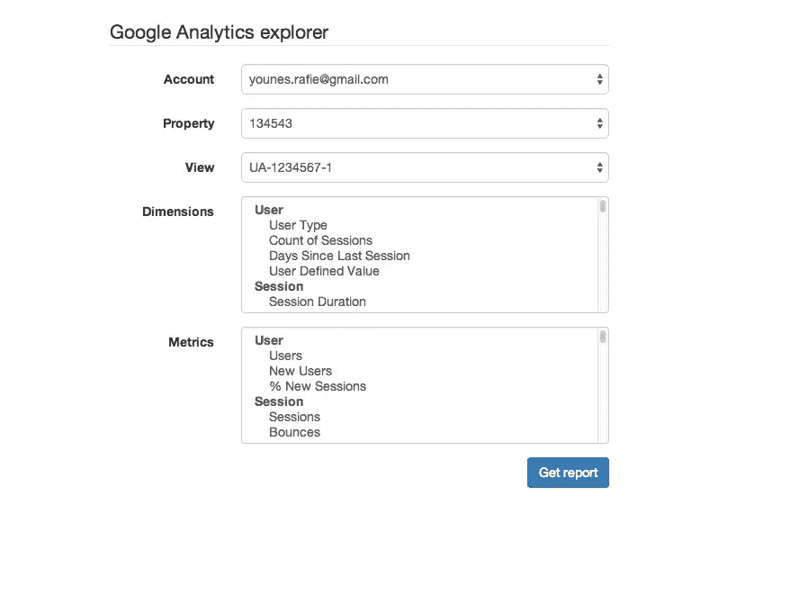
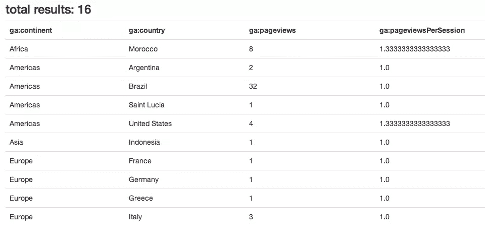

# 在 PHP 中使用 Google Analytics API v3:获取数据

> 原文：<https://www.sitepoint.com/using-google-analytics-api-v3-php-fetching-data/>

在我们系列的第一部分中，我们介绍了 Google Analytics API，包括基本用法。在这一部分中，我们将继续创建我们的演示，并看看我们如何用更多的功能来扩展它。

## 谷歌分析 API

### 管理 API

正如我们在第一部分中所讨论的，管理 API 负责获取用户帐户、属性、视图……对于我们的第一个例子，我们将检索经过身份验证的用户可用的帐户列表。

```
// app/src/GA_Service.php
public function accounts(){
	if( !$this->isLoggedIn() ){
		//login
	}

	$service = new Google_AnalyticsService($this->client);
	$man_accounts = $service->management_accounts->listManagementAccounts();
	$accounts = [];

	foreach ($man_accounts['items'] as $account) {
		$accounts[] = [ 'id' => $account['id'], 'name' => $account['name'] ];
	}

	return $accounts;
}//accounts

// app/controllers/HomeController.php
public function accounts(){
	$accounts = $this->ga->accounts();

	return $accounts;
}//accounts

// app/routes.php
Route::get('/accounts', 'HomeController@accounts');
```

在`GA_Service::accounts`中，我们用我们的授权客户端创建一个新的`Google_AnalyticsService`,然后向 API 查询帐户列表。

在这种情况下，结果是一个数组，但是 API 也使用对象，我们只需要在我们的`GA_Service::init`函数中指定它。在下面的例子中，我将使用数组结果。

```
$this->client->setUseObjects(true);
```

`listManagementAccounts`函数返回一个数组，其中包含:

```
{
    kind: "analytics#accounts",
    username: "me@mail.com",
    totalResults: 3,
    startIndex: 1,
    itemsPerPage: 1000,
    items: [
        {
            id: "4449308",
            kind: "analytics#account",
            selfLink: "https://www.googleapis.com/analytics/v3/management/accounts/4449308",
            name: "me@mail.com",
            permissions: {
                effective: [
                    "COLLABORATE",
                    "EDIT",
                    "MANAGE_USERS",
                    "READ_AND_ANALYZE"
                ]
            },
            created: "2013-10-01T11:04:28.478Z",
            updated: "2013-10-01T11:04:28.478Z",
            childLink: {
                type: "analytics#webproperties",
                href: "https://www.googleapis.com/analytics/v3/management/accounts/4449308/webproperties"
            }
        }
    ]
}
```

注意，当您返回一个数组作为响应时，Laravel 会自动将结果编码为 JSON 响应并发送给浏览器。

结果包含关于总结果的信息以及一些分页信息。`items`列包含帐户列表及其 id、权限等。但是我们循环通过`items`只从账户中提取`id`和`name`。

如果您想让结果分页，您总是可以将更多选项传递给`listManagementAccount`:

```
$service->management_accounts->listManagementAccounts( [ 'max-results' => $max_results, 'start-index' => $start_index ] );
```

假设我们要向用户显示他们的帐户列表，当他们选择一个帐户时，我们加载与之相关的属性列表。

```
// app/src/GA_Service.php
public function properties( $account_id ){
	if( !$this->isLoggedIn() ){
		//login
	}

	try {
		$service = new Google_AnalyticsService($this->client);
		$man_properties = $service->management_webproperties->listManagementWebproperties($account_id);
		$properties = [];

		foreach ($man_properties['items'] as $property) {
			$properties[] = [ 'id' => $property['id'], 'name' => $property['name'] ];
		}//foreach

		return json_encode($properties);
	} catch (Google_ServiceException $e) {
		return Response::json([
			'status'	=> 0,
			'code'		=> 3,
			'message'	=> $e->getMessage()
		]);
	}//catch

}//properties

// app/controllers/HomeController.php
public function properties( $account_id ){
	$properties = $this->ga->properties( $account_id );

	return $properties;
}//properties

// app/routes.php
Route::get( '/properties/{account_id}', [ 'uses' => 'HomeController@properties' ] )->where('account_id', '\d+');
```

`GA_Service::properties`接受一个帐户 ID，并返回该帐户的属性列表。我们基本上有相同的过程，就像检索帐户。

```
[
    {
        id: "UA-52317977-1",
        name: "Prop1"
    },
    {
        id: "UA-52317977-2",
        name: "Prop1"
    }
]
```

每个属性都有一个视图子集。默认情况下，Google 会为每个新的属性添加一个名为`All Web Site Data`的视图。

使用属性列表中的 ID 和从第一部分获取的帐户 ID，我们将查询 Google Analytics API 以获得给定帐户属性的可用视图列表。

```
// app/src/GA_Service.php
public function views( $account_id, $property_id ){
	if( !$this->isLoggedIn() ){
			//login
	}

	try {
		$service = new Google_AnalyticsService($this->client);
		$man_views = $service->management_profiles->listManagementProfiles( $account_id, $property_id );
		$views = [];

		foreach ($man_views['items'] as $view) {
			$views[] = [ 'id' => $view['id'], 'name' => $view['name'] ];
		}//foreach

		return json_encode($views);
	} catch (Google_ServiceException $e) {
		return Response::json([
			'status'	=> 0,
			'code'		=> 3,
			'message'	=> $e->getMessage()
		]);
	}//catch
}//views

// app/controllers/HomeController.php
public function views( $account_id, $property_id ){
	$views = $this->ga->views( $account_id ,$property_id );

	return $views;
}//properties

// app/routes.php
Route::get( '/views/{account_id}/{property_id}', [ 'uses' => 'HomeController@views' ] )->where([ 'account_id', '\d+', 'property_id', '\d+' ]);
```

在浏览器中，当点击`/views/{account_id}/{property_id}`路线时，我们应该得到类似于:

```
// http://localhost:8000/views/44493065/UA-44493083

[
 {
    id: "77278619",
    name: "All Web Site Data"
 }
]
```

### 元数据 API

为了从 Google Analytics 查询一些统计数据，我们需要提供一组维度和指标。

*   指标:指标是对你的酒店的用户活动的单独测量，比如会话和页面浏览量..
*   维度:维度分解了一些通用标准的指标，比如国家或浏览器。

要获取可用元数据的列表，只需使用`curl`从下面的 url `https://www.googleapis.com/analytics/v3/metadata/ga/columns`中查询数据。

Google Analytics 给了我们一个`etag`属性，可以用来缓存响应，这样我们就不必对每个请求都查询 API。

```
$gcurl = new Google_CurlIO;
$response = $gcurl->makeRequest( 
    			new Google_HttpRequest(
    			    "https://www.googleapis.com/analytics/v3/metadata/ga/columns" 
    		));
```

*   `Google_CurlIO`:一个包装了一些`curl`工具的类，用于处理缓存、认证等——通过使用这个类，我们确保使用`etag`属性缓存响应。
*   `Google_HttpRequest`:表示单个 HTTP 请求的类。

`makeRequest`方法返回一个`Google_HttpRequest`实例，我们可以使用`getResponseBody`来获得我们的元数据响应。

```
// app/src/GA_Service.php

public function metadata(){
	$gcurl = new Google_CurlIO;
	$response = $gcurl->makeRequest( 
		new Google_HttpRequest( "https://www.googleapis.com/analytics/v3/metadata/ga/columns" ) 
	);

	//verify returned data
	$data = json_decode($response->getResponseBody());

	$items = $data->items;
	$data_items = [];
	$dimensions_data = [];
	$metrics_data = [];

	foreach( $items as $item ){
		if( $item->attributes->status == 'DEPRECATED' )
			continue;

		if( $item->attributes->type == 'DIMENSION' )
			$dimensions_data[ $item->attributes->group ][] = $item;

		if( $item->attributes->type == 'METRIC' )
			$metrics_data[ $item->attributes->group ][] = $item;
	}//foreach

	$data_items['dimensions'] = $dimensions_data;
	$data_items['metrics'] = $metrics_data;

	return $data_items;
}//metadata

// app/controllers/HomeController.php
public function metadata(){
	$metadata = $this->ga->metadata();

	return $metadata;
}//metadata

// app/routes.php
Route::get('/metadata', 'HomeController@metadata');
```

现在，当您在浏览器中访问`/metadata` route 时，您应该得到一个维度数组和另一个度量数组，每个数组都包含一个分组元素列表。

```
{
dimensions: {
    User: [
        {
            id: "ga:userType",
            kind: "analytics#column",
                attributes: {
                type: "DIMENSION",
                dataType: "STRING",
                group: "User",
                status: "PUBLIC",
                uiName: "User Type",
                description: "A boolean indicating if a user is new or returning. Possible values: New Visitor, Returning Visitor.",
                allowedInSegments: "true"
                }
        },
        ...
    ]
},
metrics: {
    ...
    }
}
```

为了加速这个过程，我们将使用[bootsinpp](http://bootsnipp.com/)。如果用户登录，我们将显示主页。



我们需要更新我们的`HomeController@index`来显示主页视图。

```
// app/controllers/HomeController.php
public function index(){
    if( $this->ga->isLoggedIn() ){
    	$metadata = $this->metadata();
    	$dimensions = $metadata['dimensions'];
    	$metrics = $metadata['metrics'];

    	return View::make('home', [ 
    	    'dimensions' => $dimensions, 
    	    'metrics' => $metrics 
        ]);
    }//if
    else{
    	$url = $this->ga->getLoginUrl();
    	return View::make('login', [ 'url' => $url ]);
    }
}//index
```

正如您从屏幕截图中看到的，当用户选择一个帐户时，我们会相应地异步更改属性和视图。为了实现这一点，我写了一些简单的 JS，你可以在最终的 [repo](https://github.com/sitepoint-examples/laravel_google_analytics) 中查看。

### 报告 API

通过提供选定的视图、指标和维度，我们可以获得关于用户和交互的详细统计数据。用户提交后的结果将类似于:

```
array(3) {
  ["items"]=>
  array(10) {
    [0]=>
    array(2) {
      [0]=>
      string(9) "Argentina"
      [1]=>
      string(1) "2"
    }
    [1]=>
    array(2) {
      [0]=>
      string(6) "Brazil"
      [1]=>
      string(2) "31"
    }
    [2]=>
    array(2) {
      [0]=>
      string(6) "France"
      [1]=>
      string(1) "1"
    }
    [3]=>
    array(2) {
      [0]=>
      string(7) "Germany"
      [1]=>
      string(1) "1"
    }
    [4]=>
    array(2) {
      [0]=>
      string(6) "Greece"
      [1]=>
      string(1) "1"
    }
    //...
  }
  ["columnHeaders"]=>
  array(2) {
    [0]=>
    array(3) {
      ["name"]=>
      string(10) "ga:country"
      ["columnType"]=>
      string(9) "DIMENSION"
      ["dataType"]=>
      string(6) "STRING"
    }
    [1]=>
    array(3) {
      ["name"]=>
      string(12) "ga:pageviews"
      ["columnType"]=>
      string(6) "METRIC"
      ["dataType"]=>
      string(7) "INTEGER"
    }
  }
  ["totalResults"]=>
  int(15)
}
```

我们的`GA_Service::report`接受四个参数:一个视图 ID、一个开始和结束日期以及一个度量数组。

谷歌不能归还你所有的遗留数据——相反，我们会提供起止日期。在我的例子中，我查询了上个月的结果。

第三个参数是我们已经从用户选择中获得的指标列表。

第四个可选参数是一个选项数组。
–`max-results`:最大结果数。(我们用 10 来加快响应速度)。
–`dimensions`:逗号分隔的值列表。(`ga:country,ga:city`)
–`filters`:要应用于结果的规则的逗号分隔列表。(`ga:country!=usa,ga:pageviews>100` )
在这个例子中，我们从维度列表中排除了美国，只显示了浏览量大于 100 的页面。
–`segment`:应用于数据的高级段 ID。
–`sort`:按维度或度量对结果进行排序。可以结合多个维度和指标。(`ga:country,-ga:pageviews` =按`ga:country`升序排序，按`ga:pageviews`降序排序。
–`start-index`:可用于分页。

```
// app/src/GA_Service.php

public function report( $view, $dimensions, $metrics ){
	// to make the request quicker
	$max_results = 10;

	// query the last month analytics
	$now = new DateTime();
	$end_date = $now->format('Y-m-d');
	$start_date = $now->modify('-1 month')->format('Y-m-d');

	// if( !is_array( $dimensions ) )
	// 	$dimensions = array( $dimensions );

	$dimensions = implode( ",", $dimensions );
	$metrics = implode( ",", $metrics );

	try{
		$analytics = new Google_AnalyticsService($this->client);
		$options = [];

		$options['dimensions'] = $dimensions;
		$options['max-results'] = $max_results;

		$data = $analytics->data_ga->get( $view, $start_date, $end_date, $metrics,
			$options
		);

		$res = [
			'items' => isset($data['rows']) ? $data['rows'] : [],
			'columnHeaders'	=> $data['columnHeaders'],
			'totalResults'	=> $data['totalResults']
		];

	}catch( Google_ServiceException $ex ){
		return Response::json([
			'status'	=> 0,
			'code'		=> 2,
			'message'	=> 'Google analytics internal server error: (Technical details) ' . $ex->getErrors()[0]['message']
		]);
	}//catch

	return $res;
}//report

// app/controller/HomeController.php
public function report(){
	if( !$this->ga->isLoggedIn() )
		return Response::json([
			'status'	=> 0,
			'code'		=> 1,
			'message'	=> 'Login required'
		]);

	if( !Input::has('dimensions') || !Input::has('metrics') || !Input::has('view') )
		return Response::json([
			'status'	=> 0,
			'code'		=> 1,
			'message'	=> 'Invalid request parametter'
		]);

	$view = 'ga:' . Input::get('view');
	$dimensions = Input::get('dimensions');
	$metrics = Input::get('metrics');

	$report = $this->ga->report( $view, $dimensions, $metrics );

	return View::make('report', [ 'columns' => $report['columnHeaders'], 'items' => $report['items'], 'totalResults' => $report['totalResults' ] ]);
}//metadata

// app/routes.php
Route::post('/report', 'HomeController@report');
```

在调用 get `Google_AnalyticsService::get`方法之后，我们使用结果项、列标题和总结果的列表将结果输出为表格。



## 扩展演示

现在，让我们看看如何使用过滤器、排序和分段来扩展我们的演示。

### 过滤

过滤器是从返回的结果中排除一些数据的一种方式。它们采取以下形式:

```
ga:column operator value
```

*   `ga:column`:尺寸或公制 id(例如:`ga:country`)
*   `operator`:运算符取决于选择的公制或维度列 id，查看[文档](https://developers.google.com/analytics/devguides/reporting/core/v3/reference#filterOperators)中的运算符列表。
*   `value`:该值可以是数字、字符串或正则表达式。

您可以组合多个过滤器:您可以使用逗号(，)作为 OR 运算符和分号(；)作为 AND 运算符。

### 片段

默认情况下，谷歌分析将你的所有数据归入一个名为`All Sessions`的组。但是，您可以根据自己的需要，随时从内置段中选择或创建一个新段。您可以按转诊、设备类型、年龄、性别等对数据进行分组。

您可以通过在可用段列表中添加一个新的 select 元素来扩展演示，并将 ID 传递给前面讨论过的`get`方法。

```
// app/src/GA_Service.php
public function segments(){
	if( !$this->isLoggedIn() ){
		//login
	}

	$service = new Google_AnalyticsService($this->client);
	$segments = $service->management_segments->listManagementSegments();

	return $segments;
}//segments

// app/controllers/HomeController.php

public function segments(){
	$segments = $this->ga->segments();

	return $segments;
}//segments

// app/routes.php

Route::get('/segments', 'HomeController@segments');
```

您可以访问`/segments`页面，查看可用段及其 id 的列表，当然，您也可以像我们前面看到的那样使用这个选项。

### 包扎

Google Analytics API 非常灵活，提供了很多特性，但是文档还不完整，没有提供很好的使用示例。通过深入研究源代码并测试可能性和局限性，您会得到更多。

在本系列中，我们重点关注 Google Analytics 的基本用法，但是您可以使用 Google Analytics 仪表板中的选项来扩展演示。

本教程的源代码可以查看最后的 [repo](https://github.com/sitepoint-examples/laravel_google_analytics) 。

有问题吗？评论？让我知道！

## 分享这篇文章