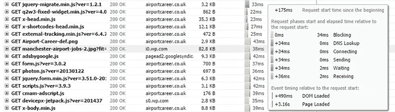
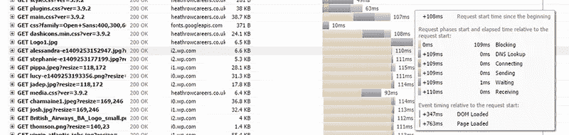
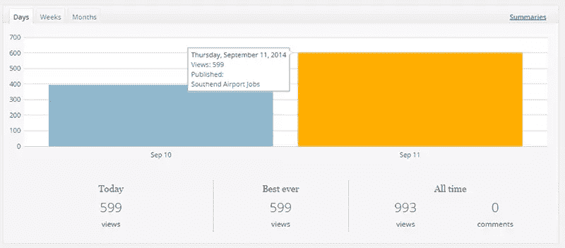
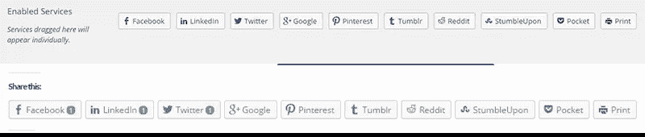
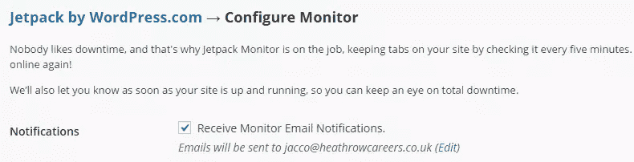

# 将 WordPress.com 特色添加到您的网站:Jetpack 指南

> 原文：<https://www.sitepoint.com/a-guide-to-jetpack/>

如果你想使用 WordPress.com 为你的自主 WordPress.org 网站提供的大部分功能，你会爱上 [Jetpack](http://jetpack.me/) 。Jetpack 是众多 WordPress 模块和你自己托管的 WordPress 站点之间的桥梁。Jetpack 附带了 WordPress.com 统计、光子 CDN 和自动化相关帖子，这只是其中几个突出的功能。

我过去曾在我的网站上使用过 Jetpack，但它对加载时间的显著负面影响让我决定放弃它。我总是喜欢在我的实时站点上尝试一些东西，所以使用我当前站点网络中的两篇样本文章，我将会看到 Jetpack 是否已经成熟。

Jetpack 目前有 33 个大小模块，其中五个我将进一步研究。我还会看看这些特性对我的网站加载时间有什么影响，如果有的话。

## 安装 Jetpack

Jetpack 的安装方式和任何其他 WordPress 插件一样。安装并激活后，您需要将其连接到 WordPress.com 帐户。连接后，您可以选择要激活的模块，并根据需要进行配置。不过，我提供了相关文档的链接，在那里可以找到如何设置每个模块的说明。

## [光子](http://jetpack.me/support/photon/)

[演示文章#1](http://www.airportcareer.co.uk/manchester-airport-jobs/)

光子是你的图像的 CDN，是 Jetpack 最受欢迎的功能之一。你所需要做的就是打开这个模块，它会自动将你所有的图片加载到 CDN 中。

当然，我进行了一些测试，看看它是否真的有利于网站加载时间。我不会在这里讨论你的 WordPress 网站是否需要 CDN，因为在之前我已经写过关于 CDN 的文章了。我只是想看看我的图片用 CDN 加载有多快。

我的演示站点位于英国，我用 GTMetrix.com 的测试地点进行测试。我不得不说，我印象深刻。从免费的光子 CDN 加载图片和从我的高价 WordPress 优化主机提供商加载一样快。

可以肯定的是，我决定在另一个页面上测试它，这个页面的加载时间已经不到一秒，但是上面有多个图像。

[演示文章#2](http://www.heathrowcareers.co.uk/get-best-cabin-crew-training-uk/)

令人惊讶的是，它带来了更好的结果。尽管我们在这里谈论的是毫秒级，但 Photon 快了大约 20%,并且在加载时间上更加一致。因为多重。wp 子域的使用，它还允许并行下载多个图像，以进一步增加加载时间。

我在过去测试了很多 cdn，很少看到如此令人印象深刻的结果，所以对光子说一个大大的“是”。

## [WordPress.com 统计数据](http://jetpack.me/support/wordpress-com-stats/)

当谷歌分析还不普遍的时候，WordPress.com 统计曾经是一个不错的功能。但是它的跟踪脚本总是有很长的加载时间，有时需要一秒钟。

那些日子一去不复返了。WordPress.com 统计数据的脚本加载速度和谷歌分析一样快，它的统计数据非常方便，可以在你的仪表板上快速查看。我特别喜欢的是，它显示了你的网站上被点击过的链接(类似于谷歌分析事件)。

你也可以在你的 WP.com 账户上查看你网站的“增强统计”，尽管增强可能有点夸张。它为你提供了一个关于你的人口统计的图形展示，以及在特定的一天发表了哪篇文章。

WordPress.com 的统计数据并不花哨，但它确实提供了足够的信息让你快速浏览你的统计数据。

## [宣传](http://jetpack.me/support/publicize/)

这是我特别感兴趣的一个模块；将一个网站连接到你的社交账户可能会很麻烦。Publicize 不支持，它允许您连接六个社交账户。几分钟后，它的工作就像一个魔咒(除了谷歌+)。我重新发布了我的演示文章，看到它立刻出现在几乎所有的账户上。

它也被发布到 Path，但你需要他们的应用程序才能看到它。发布到 Google+失败(原因不明)，这很不幸，因为设置看起来很容易。尽管如此，六分之五的社交媒体账户还是很不错的。

## [分享](http://jetpack.me/support/sharing/)

我不太喜欢在计数器中添加共享按钮，因为它们会带来额外的加载时间。但我必须说，Jetpack 共享使得在你的网站上包含所有流行的社交网络按钮变得非常容易。

你只需将所有你想包含的网络拖放到指定区域，然后分享按钮就会显示在你的帖子上。它带有所有相关的计数器，只是不能更容易。

当您再次在 GTMetrix 上运行您的页面时，您将会非常震惊，因为这些漂亮的小脚本中的每一个都会给您的页面增加几十秒的加载时间。这就是为什么我在截图之后又把它们关掉了。尽管添加它们很有效，但是考虑到负面的副作用。

## [监视器](http://jetpack.me/support/monitor/)

监控是一个简单而强大的功能。一旦打开，只要您的站点关闭，就会每隔五分钟以一小时为增量检查您的站点。您会收到网站状态的电子邮件通知。许多服务对这项功能要价很高，所以这是一个很好的免费选择。

你得不到任何每月正常运行时间报告，或任何历史的可视化演示。你只是收到电子邮件提醒，只要你没有收到任何电子邮件，你的网站仍然是活的。

## 更多模块！

虽然上述模块是最突出的特点，如果你问我，还有 28 个模块。我将快速浏览每一条，链接指向 Jetpack.me 上更详细的信息。

[美丽的数学](http://jetpack.me/support/beautiful-math-with-latex/)
利用 [Latex](http://www.latex-project.org/) 标记语言编写复杂的数学方程、公式等等。我自己从来没听说过，但是如果你正在运行一个数学博客，它可能会派上用场。

[Carousel](http://jetpack.me/support/carousel/)
制作一个全屏的照片滑块嵌入你的图库，包括 EXIF 的数据。

[联系表单](http://jetpack.me/support/contact-form/)
给你的站点添加一个简单的联系表单。

如今大多数主题都包含自定义 CSS
，但如果不是，这个模块允许添加自定义 CSS 而不需要子主题。

这个模块实际上应该包含在默认的 WordPress 安装中，因为它允许使用 WordPress.com 消防水管的用户获取你的内容。其他网站可以获得你的内容并链接回你。

额外的侧边栏小部件
提供了八个额外的小部件，以防你的主题没有提供这些(想想脸书的盒子，Twitter 的时间轴，等等)。)

[Google Integration](http://jetpack.me/support/google-plus/)
向 Google 确认您文章的作者身份，并在每篇文章下方提供您个人 Google+资料的直接链接。

Gravatar 悬浮卡
因为(外部托管的)图片加载时间过长，当我建立一个新网站时，Gravatar 是我关掉的第一件事。如果你打开了 Gravatars，这个模块是一个很好的扩展用户信息的方式。

[无限滚动](http://jetpack.me/support/infinite-scroll/)
自动将下一篇文章添加到访问者当前正在阅读的文章中。你的主题必须允许这种功能，这将严重减少你的页面浏览量(如果你运行广告，这很重要)。

[Jetpack 评论](http://jetpack.me/support/comments/)
通过允许用户使用他们的 WordPress.com、脸书、推特或 Google+账户登录来增强你的评论栏。

[WordPress.com 单点登录](http://jetpack.me/support/sso/)
从 WordPress.com 与登录系统连接，因此访问者无需在您的网站上单独注册进行互动。

JSON API
授权外部应用程序通过 WordPress.com 的 OAuth2 认证系统连接到你的博客。

不要和脸书的喜欢混淆，WordPress.com 有自己的喜欢系统，你可以为你的内容启用。

[Markdown](http://jetpack.me/support/markdown/)
允许在发表新帖子时使用 Markdown 内容。

[移动主题](http://jetpack.me/support/mobile-theme/)
如果你的常规主题没有移动主题，这是一个为你的网站使用移动主题的快捷方式。虽然不是最好看的主题。

[通知](http://jetpack.me/support/notifications/)
登录到导航栏中的 WordPress 时会收到通知，如果你安装了应用程序，也可以在手机上收到通知。您可以收到新评论、博客帖子甚至值得注意的统计数据增加的通知。

通过在你的 WordPress admin 中添加一个搜索框，Omnisearch
允许搜索你的所有内容(包括媒体)。你甚至可以包括外部资源。

通过电子邮件发表文章
通过把你的文章邮寄到指定的电子邮件地址来发表新文章。

[校对](http://jetpack.me/support/spelling-and-grammar/)
使用截止日期后校对服务来检查拼写、语法和风格。

[相关帖子](http://jetpack.me/support/related-posts/)
使用 WordPress.com 基础设施来确定与每篇文章最相关的帖子，并显示在每个帖子下。由于大量使用服务器资源，大多数主机提供商强烈推荐使用本地主机。

[短代码嵌入](http://jetpack.me/support/shortcode-embeds/)
使用方便的短代码嵌入来自 Youtube、Flickr、Vimeo、SoundCloud 等网站的内容。

[网站验证](http://jetpack.me/support/site-verification-tools/)
用谷歌、必应和 Pinterest 轻松验证你的网站。

[订阅](http://jetpack.me/support/subscriptions/)
允许你的访客通过电子邮件注册评论通知和新帖子。如需示例，请参见[本页](http://www.airportcareer.co.uk/birmingham-airport-jobs/)并向下滚动至评论。需要打开 Jetpack 注释。

[平铺图库](http://jetpack.me/support/tiled-galleries/)
以矩形马赛克、正方形马赛克和圆形网格的形式展示你的图像。

[VaultPress](http://jetpack.me/support/vaultpress/)
在与 WordPress.com 相同的基础架构上提供基于订阅的备份服务。

向 WordPress.com 上传视频并在你的网站上展示的付费服务。

[小部件可见性](http://jetpack.me/support/widget-visibility/)
使用显示规则来决定是否在哪里显示特定的小部件。

WP.me Shortlinks
世界上最短的 Shortlinks 之一，由 WordPress.com 的人保持整洁。

## 舍入

Jetpack 是一个非常广泛的插件，包含了大部分有用的工具，除了两个之外都是免费的。加载时间的恐怖是过去的事情；只要确保关注已加载的脚本，不要打开那些你并不真正使用的模块，你应该会没事的。

我建议你也读一读 Jetpack 团队的这篇文章:[在客户端网站上使用 Jetpack 的 5 大最佳实践](http://jetpack.me/2014/06/25/top-5-best-practices-when-using-jetpack-on-client-websites/)

光子是我最喜欢的模块，请在评论中告诉我哪个是你的。

## 分享这篇文章