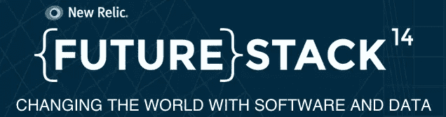

# 赠品:加入我们的未来挑战 14！

> 原文：<https://www.sitepoint.com/giveaway-join-us-futurestack14/>

无论你的激情是企业家精神、DevOps、数据 nerdery、食品卡车，还是 OK Go 的音乐，New Relic 都有最适合你的年度技术和用户大会。

10 月 8 日和 9 日在旧金山梅森堡中心举行的 FutureStack14 会议将汇集 1000 多名开发人员、系统管理员、开发人员、技术专家和商业领袖，他们都负责塑造技术的未来。

他们将听到来自 Stripe、Adobe、OkCupid、Rackspace、Amazon Github 和 New Relic 等初创公司和大公司的鼓舞人心和充满活力的演讲者。

这是第二届 FutureStack 大会，它建立在去年首次成功举办的基础上，当时有 800 人聚集在一起，听取谷歌和微软等公司的意见，根据一份新的 Relic 信息图，[吃大量的滑块](http://blog.newrelic.com/2013/11/26/futurestack13-attendees-activities-badges-buzz-numbers-infographic/)。

这是去年会议的视频集锦。

[//player.vimeo.com/video/78590581](//player.vimeo.com/video/78590581)

## 演讲者和主题

虽然将每一位演讲者列为亮点很有诱惑力，但一些突出的演讲包括 T2 新遗迹公司首席执行官卢·西恩发表关于“未来状态”的主题演讲； [Stripe 首席技术官 Greg Brockman](http://futurestack.io/speakers/greg-brockman) 讲述创新技术如何改变传统行业的运营方式；OkCupid 创始人克里斯蒂安·鲁德尔(Christian Rudder)，他的主题是“Dataclysm:我们是谁(当我们认为没有人在看的时候)”，以及 [GoPro SVP CJ 探测器](http://futurestack.io/speakers/cj-prober)，发表题为“镜头背后:GoPro 的故事”的演讲。

## SitePoint 早餐

我们很高兴赞助 10 月 9 日早上的“狗呆子”早餐会。加入我们的“头天晚上后的第二天”，恢复体力，准备迎接另一个激动人心的一天。

## 那里见！

这是你向那些用软件和数据做漂亮事情的人学习的机会——并获得业内人士对他们如何做的看法。如果你认为(或想要认为)自己是一名技术专家、开发人员、系统管理员、开发人员、IT 经理、企业家或未来主义者，或者以上几种人的混合体，那么这个会议就是为你举办的。

无论大小，从创业公司到企业，这是一个对学习如何用软件建立更光明的未来感兴趣的人的聚会。[加入他们，我们](https://ti.to/NewRelic/futurestack)。

## 重要链接

关于这次会议的更多信息，这里有[基本数据](http://futurestack.io/info)，这里有[日程](http://futurestack.io/schedule)，这里，同样，是[发言人名单](http://futurestack.io/speakers)。

## 赠品！

我们有两张票可以送给幸运的 SitePoint 读者。要参加，请对这篇文章发表评论，并告诉我们[您最希望看到哪个演讲者](http://futurestack.io/speakers)。由于 FutureStack 将在几天后举行，请仅在您能够在 10 月 8 日和 9 日前往旧金山的情况下报名。10 月 4 日周六将随机抽取两个参赛作品，并通过电子邮件通知。祝你好运！

## 分享这篇文章