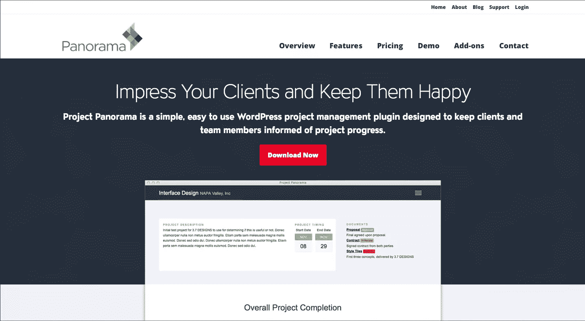
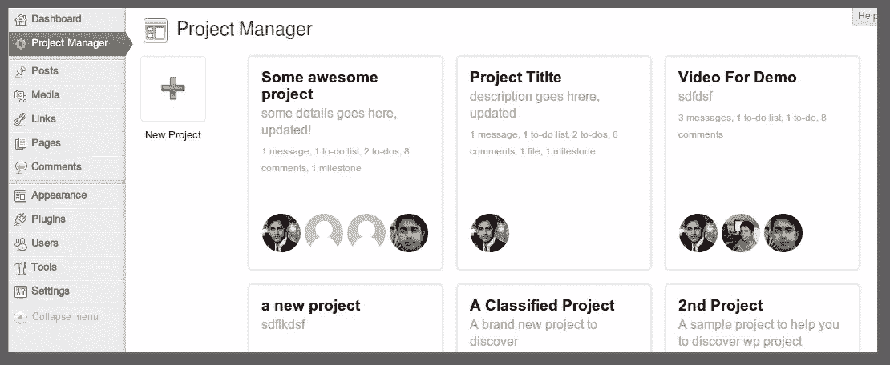
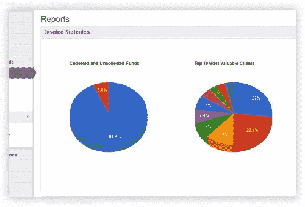
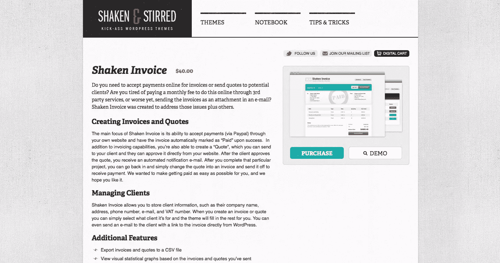
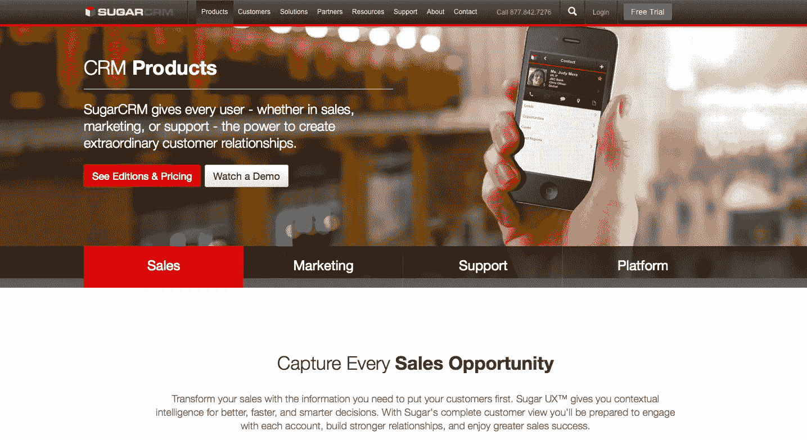
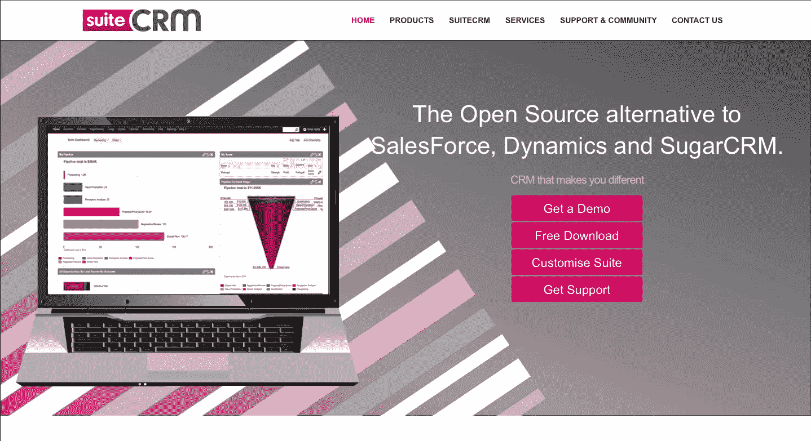

# 将 WordPress 变成一个独立的商业发电站

> 原文：<https://www.sitepoint.com/turning-wordpress-into-a-self-hosted-business-powerhouse/>

作为一个网站开发者，你可能有一个中高端的托管计划，有大量你可能不会用到的资源。

你可能还在使用客户关系管理(CRM)软件、发票套件、项目管理门户网站等等，这可能会烧光你的钱包。

虽然托管云服务很方便，但自托管解决方案同样易于使用。通过为您的公司找到合适的工具，您可以在保持生产效率的同时削减成本。

下面是不同的自托管业务解决方案的一小部分，它们脱颖而出。

## 项目管理

推出您自己的项目管理解决方案可以节省大量成本，因为许多托管套件根据用户数量或项目数量计费。即使对于一个小型的自由商店，成本也会增加，特别是如果你需要购买额外的存储空间或用户。幸运的是，下面的工具可以让你把几乎任何自托管的 WordPress 安装变成一个健壮的项目管理套件:

### 全景画

Panorama 是一个易于使用的 WordPress 项目管理平台，具有许多功能，如项目讨论区、项目分解成关键阶段、自动项目进度调整等等。Panorama 配备了一个易于使用的时尚界面，此外，它的响应速度很快，因此可以在移动网站上访问。

该套件的一个有用功能是能够使用短代码将软件嵌入到你的 WordPress 主题的不同部分，允许你定制适合你的品牌的 Panorama。克隆项目的能力是另一个有用的工具，它允许您为日常事务简化项目的创建。

Panorama 有免费版、个人版和专业版。如果您计划让客户访问他们自己的门户，您将需要付费版本的 Panorama，因为免费版本不支持限制登录特定项目。目前，Panorama 的单一许可价格为 45 美元，无限许可价格为 70 美元。

### WP 项目经理

WP 项目管理器是一个项目管理套件，具有多种功能，让你作为开发者或设计者的工作变得更加容易。主要功能包括:内部讨论板、文件管理工具、任务列表等等。

WP 项目管理器有免费版和付费版。自由软件的最大限制是它缺乏细粒度的访问控制。

即使有付费许可证，WP 项目管理器也缺乏基本的项目管理功能，如时间跟踪或套件内的发票。这些功能可作为额外收费的附加功能提供。

WP 项目管理器的专业版有三层。它们之间最大的区别是可以安装的网站数量。单站点许可证的价格是 59 美元，而无限许可证(包括所有附件)的价格是 199 美元。

## 货品计价

### WP-发票

WP-Invoice 是最受用户欢迎的基于 WordPress 的发票解决方案之一。

该解决方案允许用户拆分付款、定制发票模板、查看现金流报告以及在线接受付款，所有这些都通过一个易于使用的界面完成。该插件还包括短代码，可以在你现有的 WordPress 设置中集成发票查找和其他功能。

请记住，如果您希望能够导入或导出您的发票，或者对您的销售渠道进行高级可视化，您需要支付大约 50 美元的电动工具附加费用。额外的功能也包含在其他插件中，每个从 50 美元到 75 美元不等。你可以花 200 美元左右买一整套。

### 摇动发票

[摇过的发票](http://shakenandstirredweb.com/theme/shaken-invoice)与本文提到的大多数解决方案略有不同，因为它是 WordPress 主题而不是插件。

在这种情况下，Shaken Invoice 把你的整个 WordPress 安装变成了一个计费平台，而不是在一个现有的网站上工作。

虽然为你的系统设置一个专门的 WordPress 安装程序可能会很麻烦，但是有一个专门的界面来管理客户账单可以给人一个更专业的印象，同时也有助于简化你的工作流程。

由于 ShakenPress 是一个完整的 WordPress 主题，定制比大多数插件稍微容易一些，也更健壮。它目前售价约为 40 美元，包括终身更新。

## 联系人关系管理

尽管 WordPress 是一个多功能的平台，但没有一个可靠的基于 WordPress 的客户关系管理(CRM)平台可供用户使用。

幸运的是，下面的解决方案是高质量的 CRM 解决方案，可以毫无问题地安装在大多数标准服务器上。

### SugarCRM

[SugarCRM](http://www.sugarcrm.com/) 是市场上最大的开源 CRM 产品之一，是寻求实惠解决方案的自由职业者的理想解决方案。

虽然该软件有一个轻微的学习曲线，界面有点笨重，但 SugarCRM 是一个可靠的软件包。该平台的流行也使得获得社区支持成为一项简单的任务。

你可以通过使用自动化服务将 SugarCRM 集成到 WordPress 网站中，例如[za pier](https://zapier.com/zapbook/sugarcrm/)——一个提供多种方式在两个包之间链接数据的工具。唯一的警告是，你需要一个每月 15 美元左右的高级 Zapier 计划。

### SuiteCRM

SuiteCRM 是 SugarCRM 的一个流行分支，前者附带了额外的功能，如:报价、发票、报告、事件等等。

SuiteCRM 最好总结为 SugarCRM 专业版的开源版。由于 SuiteCRM 是基于 SugarCRM 构建的，因此贵公司仍然可以使用 SugarCRM 开发人员来定制该套件，以满足您的需求。界面比 SugarCRM 干净得多，额外的功能对许多自由职业者来说也是一笔巨大的财富。

尽管使用分叉代码会带来一些可靠性风险，但 SuiteCRM 是建立在 SugarCRM 之上的，为其提供了坚实的基础。

如果你觉得你需要专业支持，SugarCRM 可能是你的解决方案。另一方面，如果您不需要由大型实体支持的软件，SuiteCRM 可能是一个不错的选择。

## 了解你的优势

虽然在托管解决方案上挥霍金钱是很诱人的，因为它们以相对较低的价格为您提供了强大的工具，但请记住，每月订阅费用确实会随着时间的推移而增加，并会显著减少您的利润。

虽然推出您自己的托管解决方案可能需要一点学习曲线，但自托管解决方案允许您充分利用您的服务器资源。别忘了准备一个可靠的[后备系统](https://www.sitepoint.com/effortless-website-backups-with-mover/)来确保你在灾难发生时得到保护。

尽管可以节省成本，但托管解决方案可能会因您的需求而有意义。最终，如果您发现管理自托管解决方案会占用您的计费时间，那么您最好将 CRM、发票和项目管理套件外包出去。

## 分享这篇文章