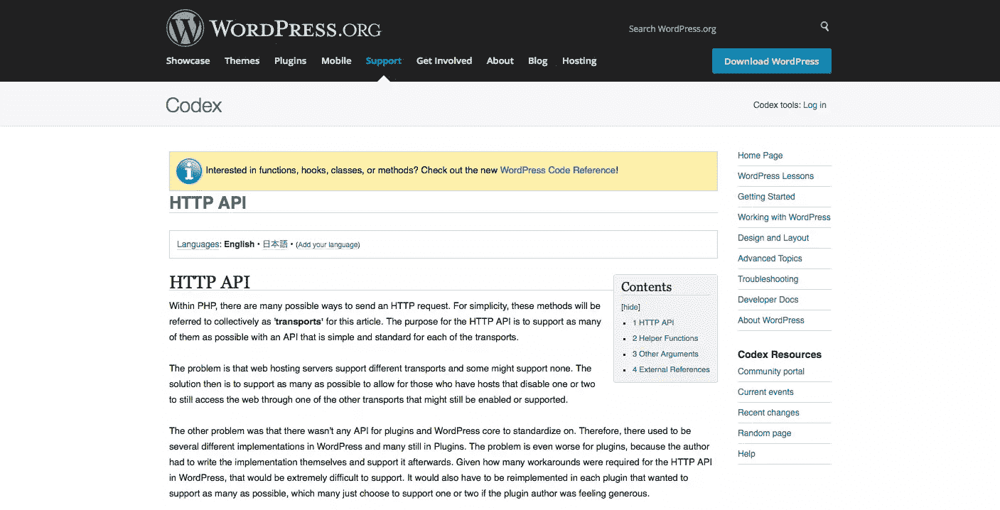

# 深入研究 WordPress HTTP API

> 原文：<https://www.sitepoint.com/the-wordpress-http-api/>

超文本传输协议(HTTP)无疑是当今互联网上使用的最重要的协议。

Web 服务、支持网络的设备和网络计算的增长继续将 HTTP 协议的角色扩展到用户驱动的 web 浏览器之外，同时增加了需要 HTTP 支持的应用程序的数量。

最近，向最终用户提供产品或服务的公司正在“模仿”他们的网站和/或应用程序。

> API——应用程序编程接口——在最基本的层面上允许产品或服务与其他产品或服务进行交流。
> 
> 通过这种方式，API 允许您向其他开发人员、其他企业甚至您公司内部的部门和地点开放数据和功能。
> 
> 它越来越成为公司交换数据、服务和复杂资源的方式，包括内部、与合作伙伴的外部以及与公众的公开交流。
> 
> 信用: [API 布道者](http://apievangelist.com/)

在 PHP 中，有许多发送 HTTP 请求的方法。例子包括 [file_get_contents](http://php.net/manual/en/function.file-get-contents.php) 、 [fsockopen](http://php.net/manual/en/function.fsockopen.php) 和 [cURL](http://php.net/manual/en/book.curl.php) 。

在 **WordPress 2.7** 之前，插件开发者都有他们自己的发送 HTTP 请求和接收响应的实现，这对他们来说是一个额外的负担，因为他们必须在之后支持它才能保持工作。

创建 HTTP API 是为了标准化一个 API，尽可能简单地处理所有关于 HTTP 的事情。HTTP API 支持各种 PHP HTTP 传输或实现，以适应不同的主机环境和配置。



## 使用 HTTP API 发送请求

要使用 WordPress HTTP API 向 web 服务或 API 发送或发出请求，下面的助手函数会派上用场。

*   [WP _ remote _ GET()](http://codex.wordpress.org/Function_Reference/wp_remote_get)–发送 HTTP GET 方法请求。
*   [WP _ remote _ POST()](http://codex.wordpress.org/Function_Reference/wp_remote_post)–发送 HTTP POST 请求。
*   [WP _ remote _ HEAD()](http://codex.wordpress.org/Function_Reference/wp_remote_head)–发送 HTTP HEAD 请求。
*   [WP _ remote _ request()](http://codex.wordpress.org/Function_Reference/wp_remote_request)–使用任何自定义 HTTP 方法发送请求，可以是 GET、POST、HEAD、PUT 或 DELETE。

很快，我们将检查上述函数，看看它们是如何工作的。

出于本教程的目的，所有请求都将被发送到[httpbin.org](http://httpbin.org/)——一个 HTTP 请求&响应服务。

## 基本示例

```
wp_remote_get( $url, $args )
```

上面的函数用于发送 GET 请求。它有两个参数:要操作的 URL 或端点(`$url`)和一组参数细节(`$args`)。

让我们看一些例子来了解这些函数。

```
$url = 'http://httpbin.org/get?a=b&c=d';

$response = wp_remote_get( $url );
```

代码所做的只是向端点`http://httpbin.org/get`发送一个 GET 请求，其中查询字符串是 GET 参数`?a=b&c=d`

使用 PHP [print_r](http://php.net/manual/en/function.print-r.php) 函数以人类可读的格式打印 HTTP 数据(`$response`)显示了以下内容:

```
Array
(
    [headers] => Array
        (
            [access-control-allow-credentials] => true
            [access-control-allow-origin] => *
            [content-type] => application/json
            [date] => Mon, 22 Sep 2014 15:46:40 GMT
            [server] => gunicorn/18.0
            [content-length] => 407
            [connection] => Close
        )

    [body] => {
  "args": {
    "a": "b", 
    "c": "d"
  }, 
  "headers": {
    "Accept": "*/*", 
    "Accept-Encoding": "deflate;q=1.0, compress;q=0.5, gzip;q=0.5", 
    "Connection": "close", 
    "Host": "httpbin.org", 
    "User-Agent": "WordPress/4.0; http://localhost/blog", 
    "X-Request-Id": "bb98282e-f428-48c8-a7d4-07660a70cf37"
  }, 
  "origin": "41.203.67.131", 
  "url": "http://httpbin.org/get?a=b&c=d"
}
    [response] => Array
        (
            [[code]] => 200
            [message] => OK
        )

    [cookies] => Array
        (
        )

    [filename] => 
)
```

仔细看看人类可读的信息，您会看到响应是一个多维数组，分为五个部分:标题、正文、响应、cookies 和文件名。

*   `headers`包含请求和响应的 HTTP 头字段。
*   `body`是 API 服务器或 web 服务发送的响应消息。
*   `response`包含请求 [HTTP 状态码](http://en.wikipedia.org/wiki/List_of_HTTP_status_codes)。
*   `cookies`包含由 web 服务或端点服务器(如果存在)设置的 cookies。
*   `filename`包含发送到 API 端点的文件的位置或路径。这可以通过例如 POST 请求来完成。

让我们假设您想要通知 API 您正在发送一个请求，这样被发送的内容体就是一个 JSON 对象，在 argument function 参数的数组中包含`Content-type`头，如下所示。

```
$url = 'http://httpbin.org/get?a=b&c=d';

$args = array(
	'headers' => array( "Content-type" => "application/json" )
);

$response = wp_remote_get( $url, $args );
```

为了方便地检索响应的不同部分，也为了测试任何结果错误，WordPress HTTP API 提供了以下帮助函数:

*   [WP _ remote _ retrieve _ body()](http://codex.wordpress.org/Function_Reference/wp_remote_retrieve_body)–仅从响应中检索正文。
*   [WP _ remote _ retrieve _ headers()](http://codex.wordpress.org/Function_Reference/wp_remote_retrieve_headers)–返回所有响应 HTTP 头的数组。
*   [WP _ remote _ retrieve _ header()](http://codex.wordpress.org/Function_Reference/wp_remote_retrieve_header)–根据提供的名称返回 HTTP 头的值。
*   [WP _ remote _ retrieve _ response _ code()](http://codex.wordpress.org/Function_Reference/wp_remote_retrieve_response_code)–返回 HTTP 请求的响应状态代码。

为了只检索对`http://httpbin.org/get`的 GET 请求的响应体，`wp_remote_retrieve_body()`(接受响应作为参数)就派上了用场。

```
$url = 'http://httpbin.org/get?a=b&c=d';

$args = array(
	'headers' => array( "Content-type" => "application/json" )
);

$response = wp_remote_get( $url, $args );

$body = wp_remote_retrieve_body( $response );
```

要仅检索响应头，使用如下的`wp_remote_retrieve_headers()`。

```
$response_headers =  wp_remote_retrieve_headers( $response );

print_r( $response_headers );
```

**结果:**

```
Array
(
    [access-control-allow-credentials] => true
    [access-control-allow-origin] => *
    [content-type] => application/json
    [date] => Mon, 22 Sep 2014 19:25:57 GMT
    [server] => gunicorn/18.0
    [content-length] => 448
    [connection] => Close
)
```

要返回单个标题的值，比如说`content-type`，需要使用函数`wp_remote_retrieve_header()`。

```
$response_header =  wp_remote_retrieve_header( $response, 'content-type' );

print_r( $response_header );
```

**结果:**

```
application/json
```

要仅检索响应状态代码，使用`wp_remote_retrieve_response_code()`功能。

```
$response_code =  wp_remote_retrieve_response_code( $response );

print_r( $response_code  );
```

当`wp_remote_retrieve_response_code()`检索响应状态代码时，`wp_remote_retrieve_response_message`检索状态消息。

下面是一个 HTTP 请求返回的头响应。

```
[response] => Array
        (
            [[code]] => 200
            [message] => OK
        )
```

前者将返回`200`(状态码)，后者返回`OK`(状态消息)。

到目前为止，我们已经概述了 WordPress HTTP API 提供的各种助手函数，如何通过`wp_remote_get()`发出 GET 请求，以及如何使用响应助手函数检索响应头和主体。

### 发布请求

函数`wp_remote_post()`用于发送 POST 请求。

```
$url = 'http://httpbin.org/post';

$args = array(
	'body' => array(
		"name" => "collins",
		"url"  => 'http://w3guy.com'
	)
);

$response = wp_remote_post( $url, $args );
```

上面的代码是对端点`http://httpbin.org/post`的基本 POST 请求，同时发送一组参数或主体。

要检索响应正文、标头、状态代码和消息，请使用 HTTP API 提供的适当的响应助手函数。

## 标题请求

要使用 HEAD 方法发送 HTTP 请求，需要使用函数`wp_remote_head()`。

```
$url = 'http://httpbin.org';

$args = array(
	'body' => array(
		"name" => "collins",
		"url"  => 'http://w3guy.com'
	)
);

$response = wp_remote_head( $url, $args );

$response_code = wp_remote_retrieve_response_message( $response );
```

### 使用其他 HTTP 方法的请求

要发送 PUT、DELETE 或任何其他自定义 HTTP 方法请求，请使用`wp_remote_request()`函数。

一个看跌请求的例子:

```
$url = 'http://httpbin.org';

$args = array(
	'method' => 'PUT'
);

$response = wp_remote_request( $url, $args );
```

删除请求的示例:

```
$url = 'http://httpbin.org';

$args = array(
	'method' => 'DELETE'
);

$response = wp_remote_request( $url, $args );
```

函数`wp_remote_request()`也可以用于发出 GET 和 POST 请求。

**获取请求**

```
$url = 'http://httpbin.org/get';

$args = array(
	'method' => 'GET'
);

$response = wp_remote_request( $url, $args );
```

**发布请求**

```
$url = 'http://httpbin.org/post';

$args = array(
	'method' => 'POST'
);

$response = wp_remote_request( $url, $args );
```

### 高级配置

*   参数`timeout`允许设置断开连接和返回错误之前的时间(秒)。
    注意:该值的默认值为`5 seconds`。
*   下面 GET 请求中的超时已经增加到`45 seconds`。

```
$url = 'http://httpbin.org/get';

$args = array(
	'method' => 'GET',
	'timeout' => 45,
);

$response = wp_remote_request( $url, $args );
```

*   `user-agent`参数用于设置用户代理。
*   默认值是`WordPress/4.0; http://w3guy.com`，其中 4.0 是 WordPress 的版本号，w3guy.com 是博客的网址。

```
$args = array(
	'user-agent' => 'Crawler by w3guy',
);
```

*   `sslverify`参数检查 SSL 证书是否有效(不是自签名的),如果无效，将拒绝响应。
*   如果您知道该站点是自签名的，但可以信任，则设置为`false`。
    默认值始终为`true`

```
$args = array(
	'sslverify' => true
);
```

## 包裹

咻！我们已经到了本教程的结尾。到目前为止，你应该知道什么是 API，对 WordPress HTTP API 及其工作原理有一个基本的了解。

在随后的教程中，我们将看到更多的 HTTP API。一定要留意 [WordPress 频道](https://www.sitepoint.com/wordpress/)。

## 分享这篇文章