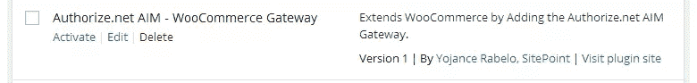
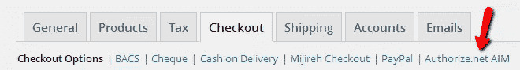
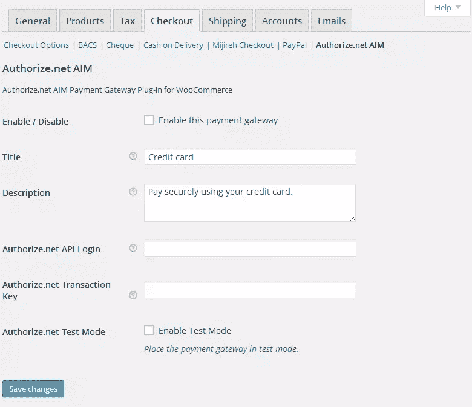
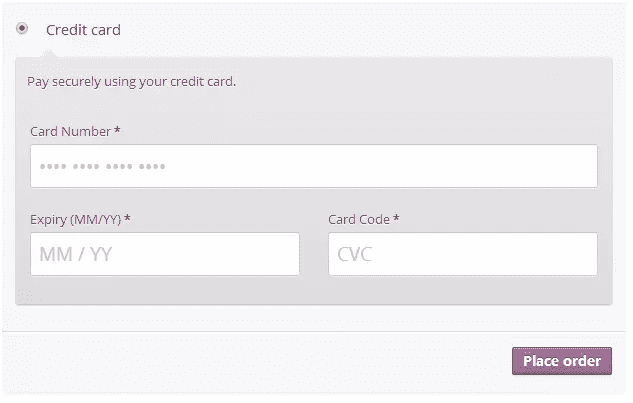
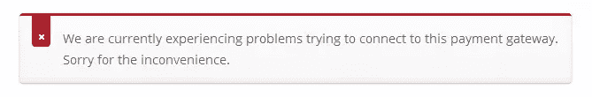
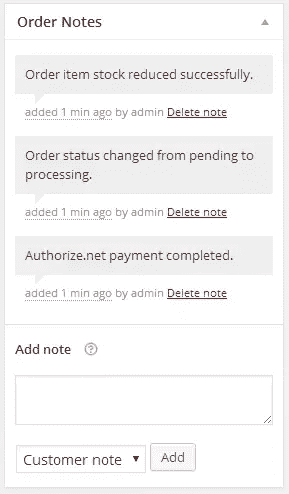
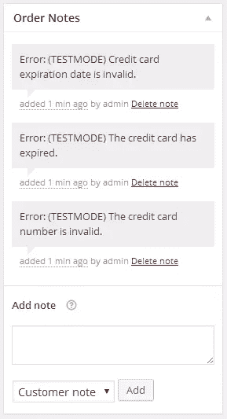
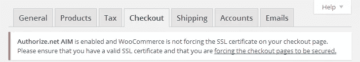

# 构建 WooCommerce 支付扩展

> 原文：<https://www.sitepoint.com/building-a-woocommerce-payment-extension/>

构建一个支付扩展在很大程度上是一个简单的过程。您可能会遇到的最困难的问题是学习如何与商家的 API 交互以提交付款并解析返回的响应。在本文中，我们将构建一个真实的东西:一个工作的 WooCommerce 支付扩展。然后，我们甚至将它连接到一个真正的支付处理器，我们将向它提交支付并解析响应。


## 电子商务支付网关的不同风格

我们可以构建四种不同类型的 WooCommerce 支付网关来处理您商店的支付。让我们首先来看看我们将在本文中使用的一个；直接方法。

*   直接-这种付款方式允许付款字段直接显示在结账页面上，只要按下“下订单”按钮，付款就会发生。这种类型的网关要求您在您的站点上安装 SSL 证书，还可能要求您符合 PCI 标准。您的商家会为您评估是否符合 PCI 标准。这种网关的一个很好的例子是 Authorize.net AIM，我们将在稍后构建 WooCommerce 支付扩展时使用它。

*   基于表单—在这种方法中，用户必须单击表单上的按钮，然后被重定向到实际的支付流程网站。然后在那里获得付款；想想贝宝标准。

*   基于 iFrame——通过这种方法，整个网关支付系统被加载到商店的 iFrame 中，类似于 PayPal Advanced 的工作方式。

*   线下——最后但并非最不重要的一点，线下方式是完全不进行在线支付的方式。支票或银行转账就是这种支付方式的典型例子。

## 为什么使用直接法

直接方法允许更大程度的定制，因为支付字段由您处理，最重要的是，客户永远不会离开您的网站。与其他三种选择相比，客户会非常喜欢这种体验。

## 本文中使用的方法

有可能有不止一种方法可以做到这一点，并且结果可能是相同的。任何关于如何完成这项任务或进一步改进的建议都是受欢迎的。在你的回答中要有礼貌和提供信息。

以下代码已经在 WordPress (4.0)和 WooCommerce (2.2.2)的最新版本中进行了测试，并在安装插件时使用了为 WooCommerce 提供的虚拟数据。

## 获得 Authorize.Net 开发者账户

如果你还没有 Authorize.net 的开发者/测试帐号，你需要一个来完整地完成和测试这个插件。要获得一个 Authorize.net 开发者/测试或沙盒账户(如他们所描述的)，只需去他们的[开发者中心](https://developer.authorize.net/sandbox/ "Authorize.net Developer Center")并填写表格。

开发者沙箱是一个全功能的 Authorize.Net 支付网关，支持当前的 API 方法。沙盒的功能类似于我们的生产环境。但是，有两个主要区别:

1.  不执行实际的卡处理。沙箱仅模拟卡网络的连接，但不处理实际的卡支付。

2.  开发人员可以触发特定的错误条件和事务响应来帮助测试。

## 规划我们的 WooCommerce 支付扩展插件

为了更容易阅读和理解，我们将插件分成两个不同的文件。其中一个文件将注册我们的支付网关和自定义操作链接。另一个将是一个简单的类，它将包含一些方法，这些方法将负责创建管理字段、处理支付处理和字段验证，如果您没有在结帐页面上强制使用 SSL，还会显示一条错误消息。看看下面我们的文件结构:

```
woocommerce-authorizenet-aim-gateway (folder)

-- woocommerce-authorizenet-aim-gateway.php

-- woocommerce-authorizenet-aim.php 
```

## 构建我们的插件

既然我们已经清楚地了解了插件将如何设置以及哪些文件做什么，我们可以开始编写整个插件的基本框架了；基本代码，我们将继续扩展，直到插件完成。

```
<?php
/*
Plugin Name: Authorize.net AIM - WooCommerce Gateway
Plugin URI: https://www.sitepoint.com/
Description: Extends WooCommerce by Adding the Authorize.net AIM Gateway.
Version: 1
Author: Yojance Rabelo, SitePoint
Author URI: https://www.sitepoint.com/
*/

// Include our Gateway Class and Register Payment Gateway with WooCommerce
add_action( 'plugins_loaded', 'spyr_authorizenet_aim_init', 0 );
function spyr_authorizenet_aim_init() {}

// Add custom action links
add_filter( 'plugin_action_links_' . plugin_basename( __FILE__ ), 'spyr_authorizenet_aim_action_links' );
function spyr_authorizenet_aim_action_links( $links ) {}
```

我们现在可以在插件页面上看到我们的插件，但是它还不能做任何事情。我们还没有准备好激活它。



让我们从第一个文件开始:包含 PHP 类，向 WooCommerce 注册这个新的支付网关，并添加您的操作链接，以便客户一激活插件就可以进入设置页面。

```
<?php
/*
Plugin Name: Authorize.net AIM - WooCommerce Gateway
Plugin URI: https://www.sitepoint.com/
Description: Extends WooCommerce by Adding the Authorize.net AIM Gateway.
Version: 1.0
Author: Yojance Rabelo, SitePoint
Author URI: https://www.sitepoint.com/
*/

// Include our Gateway Class and register Payment Gateway with WooCommerce
add_action( 'plugins_loaded', 'spyr_authorizenet_aim_init', 0 );
function spyr_authorizenet_aim_init() {
	// If the parent WC_Payment_Gateway class doesn't exist
	// it means WooCommerce is not installed on the site
	// so do nothing
	if ( ! class_exists( 'WC_Payment_Gateway' ) ) return;

	// If we made it this far, then include our Gateway Class
	include_once( 'woocommerce-authorizenet-aim.php' );

	// Now that we have successfully included our class,
	// Lets add it too WooCommerce
	add_filter( 'woocommerce_payment_gateways', 'spyr_add_authorizenet_aim_gateway' );
	function spyr_add_authorizenet_aim_gateway( $methods ) {
		$methods[] = 'SPYR_AuthorizeNet_AIM';
		return $methods;
	}
}

// Add custom action links
add_filter( 'plugin_action_links_' . plugin_basename( __FILE__ ), 'spyr_authorizenet_aim_action_links' );
function spyr_authorizenet_aim_action_links( $links ) {
	$plugin_links = array(
		'<a href="' . admin_url( 'admin.php?page=wc-settings&tab=checkout' ) . '">' . __( 'Settings', 'spyr-authorizenet-aim' ) . '</a>',
	);

	// Merge our new link with the default ones
	return array_merge( $plugin_links, $links );	
}
```

请注意，动作链接，在这种情况下是“设置”链接，只有当插件被激活时才会显示。这将引导客户进入 WooCommerce 结帐管理页面。让我们继续，这样我们就离激活插件更近了一步，并且至少可以查看一些默认字段。

## 设置我们的类构造函数

既然我们要开始实际的支付类的工作，我们必须从为这个支付网关设置一些默认值开始。我们将定义一些设置:

*   id-此付款方式的全球 ID。

*   method_title —显示在支付网关页面顶部所有其他支付网关旁边的标题。

*   method_description —对该支付网关的描述，显示在后端的实际支付选项页面上。

*   标题—用于可从上到下排序的垂直选项卡的标题。

*   图标—如果您想要在前端的网关名称旁边显示图像。图像的 URL。

*   has_fields — Bool。如果您希望付款字段在进行直接集成时显示在结账台上，可以设置为“true ”,我们在本例中就是这样做的。

*   支持—支持默认信用卡表单。稍后会有更多的介绍。在这个阶段，你只需要知道它超级酷。

接下来是在我们的构造函数中表达这一点，以及我们需要的其他一些有用的函数，以便让一切都和谐地工作。注释会帮助你理解目的，以及为什么它在那里。

```
// Setup our Gateway's id, description and other values
function __construct() {

	// The global ID for this Payment method
	$this->id = "spyr_authorizenet_aim";

	// The Title shown on the top of the Payment Gateways Page next to all the other Payment Gateways
	$this->method_title = __( "Authorize.net AIM", 'spyr-authorizenet-aim' );

	// The description for this Payment Gateway, shown on the actual Payment options page on the backend
	$this->method_description = __( "Authorize.net AIM Payment Gateway Plug-in for WooCommerce", 'spyr-authorizenet-aim' );

	// The title to be used for the vertical tabs that can be ordered top to bottom
	$this->title = __( "Authorize.net AIM", 'spyr-authorizenet-aim' );

	// If you want to show an image next to the gateway's name on the frontend, enter a URL to an image.
	$this->icon = null;

	// Bool. Can be set to true if you want payment fields to show on the checkout 
	// if doing a direct integration, which we are doing in this case
	$this->has_fields = true;

	// Supports the default credit card form
	$this->supports = array( 'default_credit_card_form' );

	// This basically defines your settings which are then loaded with init_settings()
	$this->init_form_fields();

	// After init_settings() is called, you can get the settings and load them into variables, e.g:
	// $this->title = $this->get_option( 'title' );
	$this->init_settings();

	// Turn these settings into variables we can use
	foreach ( $this->settings as $setting_key => $value ) {
		$this->$setting_key = $value;
	}

	// Lets check for SSL
	add_action( 'admin_notices', array( $this,	'do_ssl_check' ) );

	// Save settings
	if ( is_admin() ) {
		// Versions over 2.0
		// Save our administration options. Since we are not going to be doing anything special
		// we have not defined 'process_admin_options' in this class so the method in the parent
		// class will be used instead
		add_action( 'woocommerce_update_options_payment_gateways_' . $this->id, array( $this, 'process_admin_options' ) );
	}		
} // End __construct()
```

## 激活你的插件

继续激活你的插件。确保没有抛出错误，然后单击新的“设置”链接。这将带你到结帐管理选项。现在，您应该可以在那里看到新注册的支付扩展。



滚动到页面的底部，你也可以在那里看到它。


## 构建管理页面

为了构建管理页面，我们需要知道 WooCommerce 本身需要哪些字段，支付处理器的 API 需要哪些字段。在我们的例子中，由于我们使用的是 Authorize.net AIM，我们只需要 Authorize.net API 登录和交易密钥。

因为我们使用我们的测试帐户来构建插件，所以包含一个将网关设置为测试模式的选项也是一个好主意。不管您在做什么，提供一种方法来轻松地将网关转换到测试模式是非常有用的，并且您应该考虑在构建您的网关时将它作为一个需求。大多数网关将为您提供两个不同的链接，您可以将事务发送到这两个链接:一个用于测试目的，另一个用于生产环境。

经过一番头脑风暴后，我想到了我们将在管理页面中包含的字段:

*   启用—启用/禁用此支付网关。

*   标题——顾客在结账过程中将看到的付款标题。

*   描述—顾客在结账过程中将看到的付款描述。

*   api_login —注册帐户时，Authorize.net 提供的 api 登录。

*   trans _ Key——注册账户时由 Authorize.net 提供的交易密钥。

*   环境—将支付网关置于测试模式或生产模式。

让我们把这些转换成 WooCommerce 理解的代码，并解析成将在后端呈现的选项。这就是`init_form_fields()`发挥作用的地方。

```
// Build the administration fields for this specific Gateway
public function init_form_fields() {
	$this->form_fields = array(
		'enabled' => array(
			'title'		=> __( 'Enable / Disable', 'spyr-authorizenet-aim' ),
			'label'		=> __( 'Enable this payment gateway', 'spyr-authorizenet-aim' ),
			'type'		=> 'checkbox',
			'default'	=> 'no',
		),
		'title' => array(
			'title'		=> __( 'Title', 'spyr-authorizenet-aim' ),
			'type'		=> 'text',
			'desc_tip'	=> __( 'Payment title the customer will see during the checkout process.', 'spyr-authorizenet-aim' ),
			'default'	=> __( 'Credit card', 'spyr-authorizenet-aim' ),
		),
		'description' => array(
			'title'		=> __( 'Description', 'spyr-authorizenet-aim' ),
			'type'		=> 'textarea',
			'desc_tip'	=> __( 'Payment description the customer will see during the checkout process.', 'spyr-authorizenet-aim' ),
			'default'	=> __( 'Pay securely using your credit card.', 'spyr-authorizenet-aim' ),
			'css'		=> 'max-width:350px;'
		),
		'api_login' => array(
			'title'		=> __( 'Authorize.net API Login', 'spyr-authorizenet-aim' ),
			'type'		=> 'text',
			'desc_tip'	=> __( 'This is the API Login provided by Authorize.net when you signed up for an account.', 'spyr-authorizenet-aim' ),
		),
		'trans_key' => array(
			'title'		=> __( 'Authorize.net Transaction Key', 'spyr-authorizenet-aim' ),
			'type'		=> 'password',
			'desc_tip'	=> __( 'This is the Transaction Key provided by Authorize.net when you signed up for an account.', 'spyr-authorizenet-aim' ),
		),
		'environment' => array(
			'title'		=> __( 'Authorize.net Test Mode', 'spyr-authorizenet-aim' ),
			'label'		=> __( 'Enable Test Mode', 'spyr-authorizenet-aim' ),
			'type'		=> 'checkbox',
			'description' => __( 'Place the payment gateway in test mode.', 'spyr-authorizenet-aim' ),
			'default'	=> 'no',
		)
	);		
}
```

如果您现在访问 Authorize.net AIM 管理页面，您的字段将使用本地 WooCommerce 模板系统显示管理选项。



## 填写管理选项

继续使用您的凭证填写管理选项。不要忘记将网关设置为测试模式，这样我们就可以安全地工作，并在工作过程中测试所有的代码。继续之前，请按“保存更改”按钮。

## 处理付款

支付处理通过`process_payment($order_id )`完成。需要指出的是，它获得了传递给它的当前顺序，这样我们就可以得到我们需要的值。信用卡字段可以从$_POST 获得。

许多网关插件，包括我们的，在结帐表单中使用类似的卡支付字段接口，所以 WooCommerce 添加了一个表单供我们在需要时使用。这种默认表单自动格式化信用卡号、有效期，甚至当客户输入信用卡号的前几个数字时，它会自动显示正在使用的卡的类型。为了能够使用该表单，请确保您的网站运行的 WooCommerce 版本至少为 2.1。

默认情况下，表单将创建以下表单字段，这些字段可以从$_POST 中获得:

*   登机口身份证号码

*   登机口 ID 卡-cvc

*   登机口身份证-到期

下面是一个没有自定义 CSS 的默认表单的例子。



现在我们知道了这一点，我们可以继续下一步，构建`process_payment()`函数来处理事务。

```
// Submit payment and handle response
public function process_payment( $order_id ) {
	global $woocommerce;

	// Get this Order's information so that we know
	// who to charge and how much
	$customer_order = new WC_Order( $order_id );

	// Are we testing right now or is it a real transaction
	$environment = ( $this->environment == "yes" ) ? 'TRUE' : 'FALSE';

	// Decide which URL to post to
	$environment_url = ( "FALSE" == $environment ) 
					   ? 'https://secure.authorize.net/gateway/transact.dll'
					   : 'https://test.authorize.net/gateway/transact.dll';

	// This is where the fun stuff begins
	$payload = array(
		// Authorize.net Credentials and API Info
		"x_tran_key"           	=> $this->trans_key,
		"x_login"              	=> $this->api_login,
		"x_version"            	=> "3.1",

		// Order total
		"x_amount"             	=> $customer_order->order_total,

		// Credit Card Information
		"x_card_num"           	=> str_replace( array(' ', '-' ), '', $_POST['spyr_authorizenet_aim-card-number'] ),
		"x_card_code"          	=> ( isset( $_POST['spyr_authorizenet_aim-card-cvc'] ) ) ? $_POST['spyr_authorizenet_aim-card-cvc'] : '',
		"x_exp_date"           	=> str_replace( array( '/', ' '), '', $_POST['spyr_authorizenet_aim-card-expiry'] ),

		"x_type"               	=> 'AUTH_CAPTURE',
		"x_invoice_num"        	=> str_replace( "#", "", $customer_order->get_order_number() ),
		"x_test_request"       	=> $environment,
		"x_delim_char"         	=> '|',
		"x_encap_char"         	=> '',
		"x_delim_data"         	=> "TRUE",
		"x_relay_response"     	=> "FALSE",
		"x_method"             	=> "CC",

		// Billing Information
		"x_first_name"         	=> $customer_order->billing_first_name,
		"x_last_name"          	=> $customer_order->billing_last_name,
		"x_address"            	=> $customer_order->billing_address_1,
		"x_city"              	=> $customer_order->billing_city,
		"x_state"              	=> $customer_order->billing_state,
		"x_zip"                	=> $customer_order->billing_postcode,
		"x_country"            	=> $customer_order->billing_country,
		"x_phone"              	=> $customer_order->billing_phone,
		"x_email"              	=> $customer_order->billing_email,

		// Shipping Information
		"x_ship_to_first_name" 	=> $customer_order->shipping_first_name,
		"x_ship_to_last_name"  	=> $customer_order->shipping_last_name,
		"x_ship_to_company"    	=> $customer_order->shipping_company,
		"x_ship_to_address"    	=> $customer_order->shipping_address_1,
		"x_ship_to_city"       	=> $customer_order->shipping_city,
		"x_ship_to_country"    	=> $customer_order->shipping_country,
		"x_ship_to_state"      	=> $customer_order->shipping_state,
		"x_ship_to_zip"        	=> $customer_order->shipping_postcode,

		// Some Customer Information
		"x_cust_id"            	=> $customer_order->user_id,
		"x_customer_ip"        	=> $_SERVER['REMOTE_ADDR'],

	);

	// Send this payload to Authorize.net for processing
	$response = wp_remote_post( $environment_url, array(
		'method'    => 'POST',
		'body'      => http_build_query( $payload ),
		'timeout'   => 90,
		'sslverify' => false,
	) );

	if ( is_wp_error( $response ) ) 
		throw new Exception( __( 'We are currently experiencing problems trying to connect to this payment gateway. Sorry for the inconvenience.', 'spyr-authorizenet-aim' ) );

	if ( empty( $response['body'] ) )
		throw new Exception( __( 'Authorize.net\'s Response was empty.', 'spyr-authorizenet-aim' ) );

	// Retrieve the body's resopnse if no errors found
	$response_body = wp_remote_retrieve_body( $response );

	// Parse the response into something we can read
	foreach ( preg_split( "/\r?\n/", $response_body ) as $line ) {
		$resp = explode( "|", $line );
	}

	// Get the values we need
	$r['response_code']             = $resp[0];
	$r['response_sub_code']         = $resp[1];
	$r['response_reason_code']      = $resp[2];
	$r['response_reason_text']      = $resp[3];

	// Test the code to know if the transaction went through or not.
	// 1 or 4 means the transaction was a success
	if ( ( $r['response_code'] == 1 ) || ( $r['response_code'] == 4 ) ) {
		// Payment has been successful
		$customer_order->add_order_note( __( 'Authorize.net payment completed.', 'spyr-authorizenet-aim' ) );

		// Mark order as Paid
		$customer_order->payment_complete();

		// Empty the cart (Very important step)
		$woocommerce->cart->empty_cart();

		// Redirect to thank you page
		return array(
			'result'   => 'success',
			'redirect' => $this->get_return_url( $customer_order ),
		);
	} else {
		// Transaction was not succesful
		// Add notice to the cart
		wc_add_notice( $r['response_reason_text'], 'error' );
		// Add note to the order for your reference
		$customer_order->add_order_note( 'Error: '. $r['response_reason_text'] );
	}

}
```

让我们进一步分解代码，以便更容易理解。

**第 5-15 行**

我们分配给`$customer_order`一个新的`WC_Order`来保存我们将要处理付款的订单的所有信息。然后，我们决定是否处于测试模式，并最终为事务选择正确的 URL。

**第 18-66 行**

这些是我们可以发送给 Authorize.net 的任意字段，以便他们可以记录这些信息。我们将它构建到一个数组中，以便稍后可以使用`http_build_query()`构建一个合适的查询。

**第 69-74 行**

由于我们使用 WordPress，我们可以利用所有的 HTTP API 与其他网站进行交互，在这种情况下，我们可以在 Authorize.net 上发布有效载荷进行处理。点击此链接了解更多关于 [HTTP API 和`wp_remote_post()`T2 的信息。](http://codex.wordpress.org/HTTP_API "WordPress' HTTP API")

**第 76-80 行**

这里有两个重要的检查。首先，我们确保 WordPress 在发布我们的有效载荷时没有遇到任何错误，其次；我们要确保得到回应。在任何时候，我们都会抛出一个异常错误，让客户知道交易是否有问题。请看下面这些错误的一个例子:



**第 83-94 行**

如果我们已经做到这一步，没有任何错误，那么我们可以检索响应的主体，并将其解析为我们可以读取的内容。响应中的前四个值是我们唯一需要的。我们将这四个值添加到一个数组中，以便于测试，也使它更容易阅读。

**第 98-112 行**

测试`response_code`值。代码 1 或 4 表示交易已被批准。如果交易被批准，我们会添加一个友好的订单说明供您参考，将订单标记为已支付，清空购物车的内容，最后将客户重定向到“感谢”页面。如果您对完成这四个步骤后订单的外观感到好奇，请看看下面的内容:



**第 114-118 行**

如果交易不成功，我们会向客户显示错误通知，并用从 Authorize.net 收到的错误更新订单。这里有一个客户尝试了几次都没有成功完成交易后的后端订单记录示例。



付款流程到此结束。

## 验证提交的字段

我们没有进行任何类型的字段验证，因为我们依赖于默认的信用卡表单。尝试在任何字段中输入字母或符号，你会发现这是不可能的。在某些情况下，我可以看到这将是非常有用的，例如；用于验证到期日期，到期日期必须采用特定的格式，而不是我们通常看到的标准。

为了本文的简单起见，我们只返回‘true’并绕过字段验证。

```
// Validate fields
public function validate_fields() {
	return true;
}
```

## 结帐页面使用 SSL 吗？

能够为客户提供无缝的结账体验并允许他们在您自己的网站上结账，这需要使用 SSL 证书。通过勾选 WooCommerce ->设置->结账下的强制安全结账，WooCommerce 允许你快速强制只在结账页面使用 SSL。

我们只是要检查这是否已被检查。如果没有选中，那么我们将在后端显示一个错误，警告您需要 SSL。

```
// Check if we are forcing SSL on checkout pages
// Custom function not required by the Gateway
public function do_ssl_check() {
	if( $this->enabled == "yes" ) {
		if( get_option( 'woocommerce_force_ssl_checkout' ) == "no" ) {
			echo "<div class=\"error\"><p>". sprintf( __( "<strong>%s</strong> is enabled and WooCommerce is not forcing the SSL certificate on your checkout page. Please ensure that you have a valid SSL certificate and that you are <a href=\"%s\">forcing the checkout pages to be secured.</a>" ), $this->method_title, admin_url( 'admin.php?page=wc-settings&tab=checkout' ) ) ."</p></div>";	
		}
	}		
}
```

假设我们没有强制进行安全结帐，这条消息显示在后端。



如果你已经做到了这一步，给自己一个鼓励:按照这个指南，你已经建立了一个 WooCommerce 支付网关。

## 下一步是什么？

挑战自我。试着按照这篇文章创建另一个支付网关，并将同样的技术应用到你的插件中。如果要我做推荐的话，我会推荐尝试为 [Simplify Commerce](https://www.simplify.com/commerce/) 构建自己的扩展。这现在被捆绑到 WooCommerce 中，所以不要害怕偷看代码。

Simplify Commerce 有一个很好的 API 和 SDK 供您使用，并且有很好的文档记录。此外，注册一个测试账户只需要几分钟，你就可以在心跳中开始编写下一个插件了。

## 结论

如您所见，编写 WooCommerce 支付扩展并没有您想象的那么难。只要稍加练习，您就可以在几个小时内编写一个新的，只是要记住在向公众发布之前要做大量的测试，或者在任何生产环境中使用它。将`WP_DEBUG`设置为 true 进行开发，这样您可以在需要时获得额外的反馈。

## 插件代码

下面你会发现本文中使用的完整形式的样本代码。如果您有任何问题或意见，请在下面评论。

### Authorize.net AIM

```
<?php
/* Authorize.net AIM Payment Gateway Class */
class SPYR_AuthorizeNet_AIM extends WC_Payment_Gateway {

	// Setup our Gateway's id, description and other values
	function __construct() {

		// The global ID for this Payment method
		$this->id = "spyr_authorizenet_aim";

		// The Title shown on the top of the Payment Gateways Page next to all the other Payment Gateways
		$this->method_title = __( "Authorize.net AIM", 'spyr-authorizenet-aim' );

		// The description for this Payment Gateway, shown on the actual Payment options page on the backend
		$this->method_description = __( "Authorize.net AIM Payment Gateway Plug-in for WooCommerce", 'spyr-authorizenet-aim' );

		// The title to be used for the vertical tabs that can be ordered top to bottom
		$this->title = __( "Authorize.net AIM", 'spyr-authorizenet-aim' );

		// If you want to show an image next to the gateway's name on the frontend, enter a URL to an image.
		$this->icon = null;

		// Bool. Can be set to true if you want payment fields to show on the checkout 
		// if doing a direct integration, which we are doing in this case
		$this->has_fields = true;

		// Supports the default credit card form
		$this->supports = array( 'default_credit_card_form' );

		// This basically defines your settings which are then loaded with init_settings()
		$this->init_form_fields();

		// After init_settings() is called, you can get the settings and load them into variables, e.g:
		// $this->title = $this->get_option( 'title' );
		$this->init_settings();

		// Turn these settings into variables we can use
		foreach ( $this->settings as $setting_key => $value ) {
			$this->$setting_key = $value;
		}

		// Lets check for SSL
		add_action( 'admin_notices', array( $this,	'do_ssl_check' ) );

		// Save settings
		if ( is_admin() ) {
			// Versions over 2.0
			// Save our administration options. Since we are not going to be doing anything special
			// we have not defined 'process_admin_options' in this class so the method in the parent
			// class will be used instead
			add_action( 'woocommerce_update_options_payment_gateways_' . $this->id, array( $this, 'process_admin_options' ) );
		}		
	} // End __construct()

	// Build the administration fields for this specific Gateway
	public function init_form_fields() {
		$this->form_fields = array(
			'enabled' => array(
				'title'		=> __( 'Enable / Disable', 'spyr-authorizenet-aim' ),
				'label'		=> __( 'Enable this payment gateway', 'spyr-authorizenet-aim' ),
				'type'		=> 'checkbox',
				'default'	=> 'no',
			),
			'title' => array(
				'title'		=> __( 'Title', 'spyr-authorizenet-aim' ),
				'type'		=> 'text',
				'desc_tip'	=> __( 'Payment title the customer will see during the checkout process.', 'spyr-authorizenet-aim' ),
				'default'	=> __( 'Credit card', 'spyr-authorizenet-aim' ),
			),
			'description' => array(
				'title'		=> __( 'Description', 'spyr-authorizenet-aim' ),
				'type'		=> 'textarea',
				'desc_tip'	=> __( 'Payment description the customer will see during the checkout process.', 'spyr-authorizenet-aim' ),
				'default'	=> __( 'Pay securely using your credit card.', 'spyr-authorizenet-aim' ),
				'css'		=> 'max-width:350px;'
			),
			'api_login' => array(
				'title'		=> __( 'Authorize.net API Login', 'spyr-authorizenet-aim' ),
				'type'		=> 'text',
				'desc_tip'	=> __( 'This is the API Login provided by Authorize.net when you signed up for an account.', 'spyr-authorizenet-aim' ),
			),
			'trans_key' => array(
				'title'		=> __( 'Authorize.net Transaction Key', 'spyr-authorizenet-aim' ),
				'type'		=> 'password',
				'desc_tip'	=> __( 'This is the Transaction Key provided by Authorize.net when you signed up for an account.', 'spyr-authorizenet-aim' ),
			),
			'environment' => array(
				'title'		=> __( 'Authorize.net Test Mode', 'spyr-authorizenet-aim' ),
				'label'		=> __( 'Enable Test Mode', 'spyr-authorizenet-aim' ),
				'type'		=> 'checkbox',
				'description' => __( 'Place the payment gateway in test mode.', 'spyr-authorizenet-aim' ),
				'default'	=> 'no',
			)
		);		
	}

	// Submit payment and handle response
	public function process_payment( $order_id ) {
		global $woocommerce;

		// Get this Order's information so that we know
		// who to charge and how much
		$customer_order = new WC_Order( $order_id );

		// Are we testing right now or is it a real transaction
		$environment = ( $this->environment == "yes" ) ? 'TRUE' : 'FALSE';

		// Decide which URL to post to
		$environment_url = ( "FALSE" == $environment ) 
						   ? 'https://secure.authorize.net/gateway/transact.dll'
						   : 'https://test.authorize.net/gateway/transact.dll';

		// This is where the fun stuff begins
		$payload = array(
			// Authorize.net Credentials and API Info
			"x_tran_key"           	=> $this->trans_key,
			"x_login"              	=> $this->api_login,
			"x_version"            	=> "3.1",

			// Order total
			"x_amount"             	=> $customer_order->order_total,

			// Credit Card Information
			"x_card_num"           	=> str_replace( array(' ', '-' ), '', $_POST['spyr_authorizenet_aim-card-number'] ),
			"x_card_code"          	=> ( isset( $_POST['spyr_authorizenet_aim-card-cvc'] ) ) ? $_POST['spyr_authorizenet_aim-card-cvc'] : '',
			"x_exp_date"           	=> str_replace( array( '/', ' '), '', $_POST['spyr_authorizenet_aim-card-expiry'] ),

			"x_type"               	=> 'AUTH_CAPTURE',
			"x_invoice_num"        	=> str_replace( "#", "", $customer_order->get_order_number() ),
			"x_test_request"       	=> $environment,
			"x_delim_char"         	=> '|',
			"x_encap_char"         	=> '',
			"x_delim_data"         	=> "TRUE",
			"x_relay_response"     	=> "FALSE",
			"x_method"             	=> "CC",

			// Billing Information
			"x_first_name"         	=> $customer_order->billing_first_name,
			"x_last_name"          	=> $customer_order->billing_last_name,
			"x_address"            	=> $customer_order->billing_address_1,
			"x_city"              	=> $customer_order->billing_city,
			"x_state"              	=> $customer_order->billing_state,
			"x_zip"                	=> $customer_order->billing_postcode,
			"x_country"            	=> $customer_order->billing_country,
			"x_phone"              	=> $customer_order->billing_phone,
			"x_email"              	=> $customer_order->billing_email,

			// Shipping Information
			"x_ship_to_first_name" 	=> $customer_order->shipping_first_name,
			"x_ship_to_last_name"  	=> $customer_order->shipping_last_name,
			"x_ship_to_company"    	=> $customer_order->shipping_company,
			"x_ship_to_address"    	=> $customer_order->shipping_address_1,
			"x_ship_to_city"       	=> $customer_order->shipping_city,
			"x_ship_to_country"    	=> $customer_order->shipping_country,
			"x_ship_to_state"      	=> $customer_order->shipping_state,
			"x_ship_to_zip"        	=> $customer_order->shipping_postcode,

			// Some Customer Information
			"x_cust_id"            	=> $customer_order->user_id,
			"x_customer_ip"        	=> $_SERVER['REMOTE_ADDR'],

		);

		// Send this payload to Authorize.net for processing
		$response = wp_remote_post( $environment_url, array(
			'method'    => 'POST',
			'body'      => http_build_query( $payload ),
			'timeout'   => 90,
			'sslverify' => false,
		) );

		if ( is_wp_error( $response ) ) 
			throw new Exception( __( 'We are currently experiencing problems trying to connect to this payment gateway. Sorry for the inconvenience.', 'spyr-authorizenet-aim' ) );

		if ( empty( $response['body'] ) )
			throw new Exception( __( 'Authorize.net\'s Response was empty.', 'spyr-authorizenet-aim' ) );

		// Retrieve the body's resopnse if no errors found
		$response_body = wp_remote_retrieve_body( $response );

		// Parse the response into something we can read
		foreach ( preg_split( "/\r?\n/", $response_body ) as $line ) {
			$resp = explode( "|", $line );
		}

		// Get the values we need
		$r['response_code']             = $resp[0];
		$r['response_sub_code']         = $resp[1];
		$r['response_reason_code']      = $resp[2];
		$r['response_reason_text']      = $resp[3];

		// Test the code to know if the transaction went through or not.
		// 1 or 4 means the transaction was a success
		if ( ( $r['response_code'] == 1 ) || ( $r['response_code'] == 4 ) ) {
			// Payment has been successful
			$customer_order->add_order_note( __( 'Authorize.net payment completed.', 'spyr-authorizenet-aim' ) );

			// Mark order as Paid
			$customer_order->payment_complete();

			// Empty the cart (Very important step)
			$woocommerce->cart->empty_cart();

			// Redirect to thank you page
			return array(
				'result'   => 'success',
				'redirect' => $this->get_return_url( $customer_order ),
			);
		} else {
			// Transaction was not succesful
			// Add notice to the cart
			wc_add_notice( $r['response_reason_text'], 'error' );
			// Add note to the order for your reference
			$customer_order->add_order_note( 'Error: '. $r['response_reason_text'] );
		}

	}

	// Validate fields
	public function validate_fields() {
		return true;
	}

	// Check if we are forcing SSL on checkout pages
	// Custom function not required by the Gateway
	public function do_ssl_check() {
		if( $this->enabled == "yes" ) {
			if( get_option( 'woocommerce_force_ssl_checkout' ) == "no" ) {
				echo "<div class=\"error\"><p>". sprintf( __( "<strong>%s</strong> is enabled and WooCommerce is not forcing the SSL certificate on your checkout page. Please ensure that you have a valid SSL certificate and that you are <a href=\"%s\">forcing the checkout pages to be secured.</a>" ), $this->method_title, admin_url( 'admin.php?page=wc-settings&tab=checkout' ) ) ."</p></div>";	
			}
		}		
	}

} // End of SPYR_AuthorizeNet_AIM
```

### Authorize.net AIM 门户网站

```
<?php
/*
Plugin Name: Authorize.net AIM - WooCommerce Gateway
Plugin URI: https://www.sitepoint.com/
Description: Extends WooCommerce by Adding the Authorize.net AIM Gateway.
Version: 1.0
Author: Yojance Rabelo, SitePoint
Author URI: https://www.sitepoint.com/
*/

// Include our Gateway Class and register Payment Gateway with WooCommerce
add_action( 'plugins_loaded', 'spyr_authorizenet_aim_init', 0 );
function spyr_authorizenet_aim_init() {
	// If the parent WC_Payment_Gateway class doesn't exist
	// it means WooCommerce is not installed on the site
	// so do nothing
	if ( ! class_exists( 'WC_Payment_Gateway' ) ) return;

	// If we made it this far, then include our Gateway Class
	include_once( 'woocommerce-authorizenet-aim.php' );

	// Now that we have successfully included our class,
	// Lets add it too WooCommerce
	add_filter( 'woocommerce_payment_gateways', 'spyr_add_authorizenet_aim_gateway' );
	function spyr_add_authorizenet_aim_gateway( $methods ) {
		$methods[] = 'SPYR_AuthorizeNet_AIM';
		return $methods;
	}
}

// Add custom action links
add_filter( 'plugin_action_links_' . plugin_basename( __FILE__ ), 'spyr_authorizenet_aim_action_links' );
function spyr_authorizenet_aim_action_links( $links ) {
	$plugin_links = array(
		'<a href="' . admin_url( 'admin.php?page=wc-settings&tab=checkout' ) . '">' . __( 'Settings', 'spyr-authorizenet-aim' ) . '</a>',
	);

	// Merge our new link with the default ones
	return array_merge( $plugin_links, $links );	
}
```

## 分享这篇文章