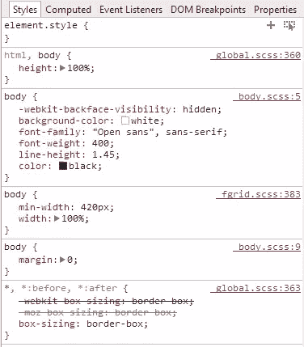
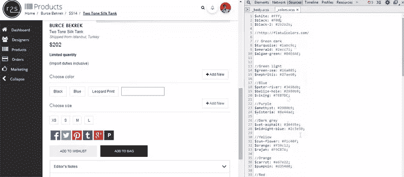
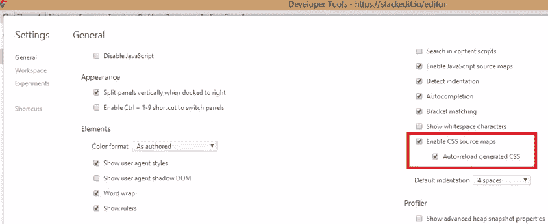
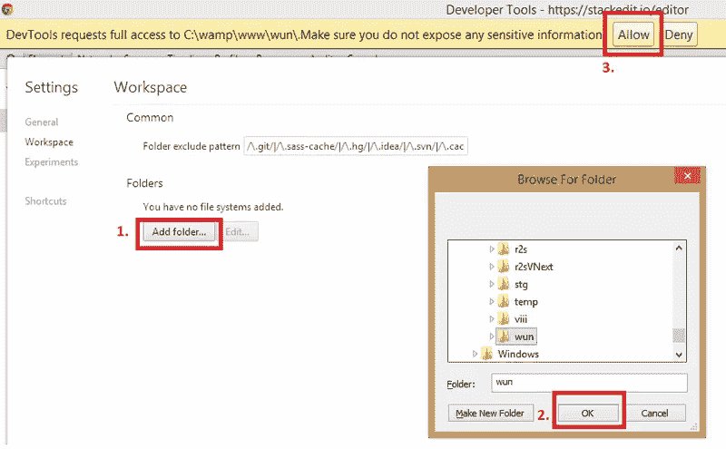
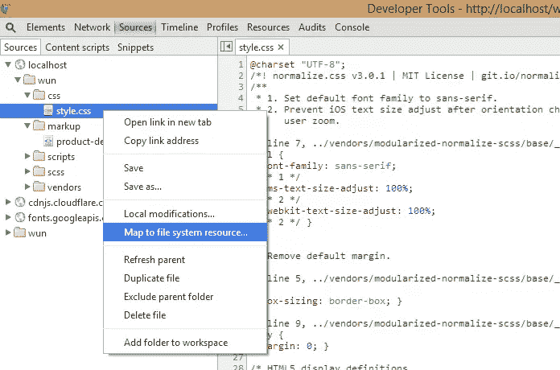
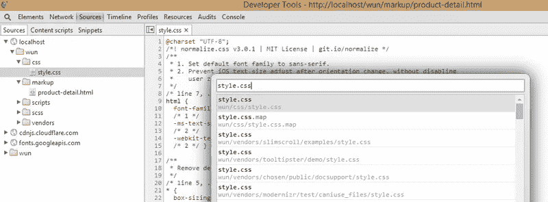

# 使用源码图调试 Chrome 中的 Sass

> 原文：<https://www.sitepoint.com/using-source-maps-debug-sass-chrome/>

如果您在您的前端项目中使用 Sass，那么您的部分可能会基于一个可靠的 [Sass 架构](https://www.sitepoint.com/look-different-sass-architectures/)以一种清晰且有逻辑的方式被拆分。

在这种情况下，调试编译后的 CSS 既麻烦又耗时。Sass [提供了一个标志](http://sass-lang.com/documentation/file.SASS_REFERENCE.html#line_numbers-option)来启用行号(`--line-numbers`)，它包括 CSS 中的注释(如下所示)。

```
/* line 303, molecules\accordions\_accordions.scss */
```

尽管这很有帮助，但您仍然需要手动追踪 CSS 中的错误，直到源文件。使用开发人员工具在浏览器中编辑 CSS 是不能持久的，因为它将被下一次 Sass 编译覆盖。

那么我们怎样才能让这个过程变得更简单呢？

我将向您展示如何结合使用 source maps 和 Chrome 的 Workspaces 来允许您在浏览器中调试和编辑 Sass。

## 浏览器和 Sass 要求

当 source maps 特性被首次引入时，它获得了很多关注，从那以后发生了很多变化。它现在可以在 Chrome、Firefox 和 Safari 的最新稳定版本中使用。

你不需要**要求 Chrome Canary，也不需要编辑`chrome://flags`来使用它。您只需应用正确的设置来启用它。**

 **源图要求 Sass 3.3 以上( [Sass 3.4](https://www.sitepoint.com/sass-3-4-is-out/) 最近发布)。

## 什么是源地图？

源映射是一个 JSON 格式的`.map`文件，它是在您的 Sass 文件被编译成 CSS 时生成的。它包含将 CSS 文件中的每一行(输出)链接到 SCSS 源文件中相应行(输入)的信息。

这意味着当您的 CSS 被编译时，您将在编译后的 CSS 文件的末尾看到如下注释:

```
/*# sourceMappingURL=style.css.map */
```

下面是一个被截断的`.map`文件的内容。

```
{
"version": 3,
"mappings": ";AAiIA,qDAAsD;EACpD,OAAO,EAAE,GAAG"
"sources": ["../scss/foundation/components/_breadcrumbs.scss","../scss/foundation/components/_icon-bar.scss","../scss/foundation/components/_offcanvas.scss","../scss/foundation/components/_visibility.scss","../scss/foundation/components/_global.scss","../scss/foundation/pages/_index.scss"],
"names": [],
"file": "foundation.css"
}
```

## 源地图有什么帮助？

当使用 Chrome 的开发者工具使用源地图调试网页时，样式面板将显示 CSS 来自哪个 Sass 部分，而不是指向 CSS 文件。意思是，不是把源显示为`style.css`，而是显示为`_buttons.scss`。

在下面截图的例子中，`body`元素的样式来自一个名为`_body.scss`的分部。



检查时，我想知道我在这里定义了`color: black`部分。

要获得此信息，我可以执行以下操作之一来进一步检查:

1.  按住 CTRL 键并点击单词**颜色**。它将在 sources 选项卡中打开适当的 partial，并将光标放在定义样式的那一行。在这种情况下，颜色是在名为`$black`的变量中定义的。
2.  按住 CTRL 键并点击单词**黑色**。它将在 sources 选项卡中打开`_colors.scss`，在这里定义变量`$black`的值。如果黑色来自 mixin 而不是变量，CTRL +单击它将打开定义 mixin 的文件。点击下面的图片查看[一个动画 GIF](https://uploads.sitepoint.com/wp-content/uploads/2014/09/1411481139sourcemaps-2.gif) 展示了这个可能的样子。

[](https://uploads.sitepoint.com/wp-content/uploads/2014/09/1411481139sourcemaps-2.gif)

使用带有工作区的源地图，你可以在 Chrome 的开发者工具中编辑和保存修改。如果`sass --watch`正在运行，它将检测到变化并重新编译 CSS。浏览器将自动重新加载这个新的 CSS。

## 在 node-sass 插件中启用源映射

所有 node-sass 插件都有 API 来启用 sass 源映射选项。

*   **grunt-contrib-sass**–启用 Gruntfile.js 的`options`部分的源地图来设置`sourcemap: true`。

*   **gulp-sass** `sourceComments: 'map'`在 gulp-sass 中会启用源地图。这内联了源映射，意味着它们被附加到 CSS 文件本身的末尾。在这种情况下，不会有单独的`.map`文件。

*   **西兰花-萨斯**将启用源地图。

## 使用 Sass Ruby Gem 启用源地图

如果您使用 Sass Ruby gem 进行编译，您可以使用以下终端命令来启用源映射:

```
sass style.scss:../css/style.css --sourcemap
```

## 使用指南针启用源地图

如果您使用的是 Compass，可以运行以下命令:

```
sass style.scss:../css/style.css --compass --sourcemap
```

或者您可以将`sass_options = {:sourcemap => true}`添加到您的`config.rb`文件中，并照常运行`compass watch`。

## 在 Chrome 中启用源地图

启用源映射将编译带有引用的映射。该编译将产生两个文件，一个`.css`文件和一个`.css.map`文件。`.map`文件将包含相关的细节，允许你调试一个风格起源的确切位置。

要在 Chrome 中实现这一点，请遵循以下步骤:

1.  打开开发者工具。
2.  点按齿轮图标(右上角)以打开“设置”。
3.  在“常规”下，查找“源”部分。在该部分中，选择“启用 CSS 源映射”。
4.  确保附带的“自动重新加载生成的 CSS”也被启用。



最后一步有助于在 CSS 发生变化时重新加载它。你可以把它想象成 CSS 的一个实时重载功能。

注意:你仍然需要使用 Grunt、Gulp、sass watch 或 compass watch 单独编译 SCSS。一旦 CSS 已经生成，功能将自动为您重新加载。

## 在浏览器中实时编辑 SCSS

启用 Chrome Workspaces 将允许你在 Chrome web inspector 中保存(如果你愿意)你对实际文件所做的更改。这样，您就不必在浏览器中尝试您的更改，看看什么有效，然后返回到您的编辑器来保存这些更改。

要在 Chrome 中启用工作区，请执行以下操作:

1.  打开 Chrome 开发者工具。
2.  单击齿轮图标，调出设置面板。
3.  选择设置面板左侧的“工作区”选项。
4.  在“文件夹”部分选择项目的根文件夹。
5.  授予 Chrome 访问本地文件系统的权限。



这会将您的所有项目文件添加到开发人员工具的“源代码”面板中。

## 从本地主机映射到磁盘上的文件

在浏览器中编辑 SCSS 的最后一步要求您将文件从本地主机映射到源文件。执行以下操作将启用此映射:

1.  在本地主机服务器上查看页面时，检查页面上的任何元素。
2.  在开发人员工具中，选择源代码选项卡。
3.  在左侧的文件树中，右键单击您的样式表并选择“映射到文件系统资源…”。
    
4.  这将打开文件搜索对话框。选择适当的文件(您的样式表)。
    
5.  重新启动开发者工具。

这将把文件从本地主机连接到实际驱动器上的文件。现在你可以在浏览器中编辑你的 SCSS，当你保存时，Chrome 会把这些修改写到实际的文件中。

如果您正在查看 Sass 的变化，SCSS 将被编译，CSS 将在您的页面中自动刷新，包括您的更改。

## 结论

源地图使您能够避免在编辑器和开发工具之间切换的麻烦。它使您能够直接编辑源 SCSS，并允许您立即在浏览器中看到这些更改。

虽然这篇文章关注的是如何在 Chrome 中制作源地图，但是你也可以在 [Firefox](https://hacks.mozilla.org/2014/02/live-editing-sass-and-less-in-the-firefox-developer-tools/) 和 [Safari](https://developer.apple.com/library/safari/documentation/AppleApplications/Conceptual/Safari_Developer_Guide/ResourcesandtheDOM/ResourcesandtheDOM.html#//apple_ref/doc/uid/TP40007874-CH3-SW4) 中做同样的事情。 [Internet Explorer 11](http://blogs.msdn.com/b/davrous/archive/2014/08/22/enhance-your-javascript-debugging-life-thanks-to-the-source-map-support-available-in-ie11-chrome-opera-amp-firefox.aspx) 也支持源地图，但似乎没有任何关于在带有 Sass 的浏览器中使用源地图的信息，所以你必须自己尝试一下。

如果你喜欢直观地学习，可以看看 Micah Godbolt 的 SassBites #21，它讨论了如何在 Chrome 中启用和使用源地图。

我希望这能成为你工作流程中有价值的、节省时间的一部分。

## 分享这篇文章**