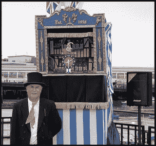
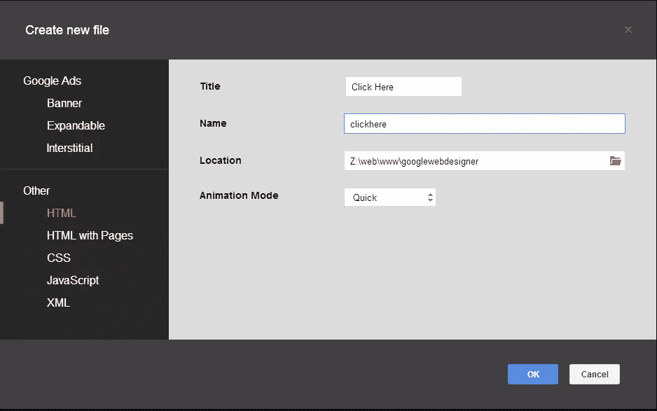
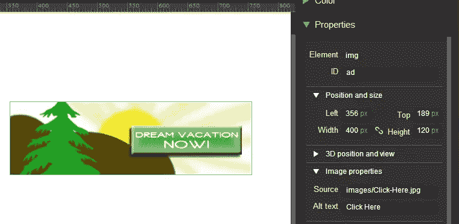
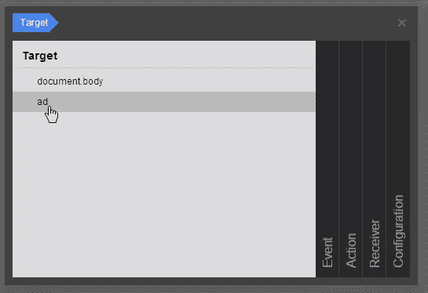
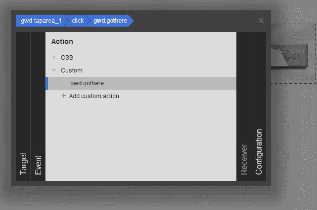
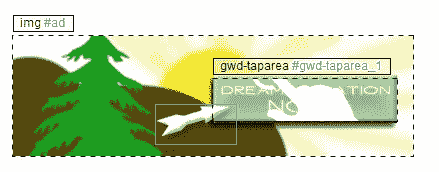
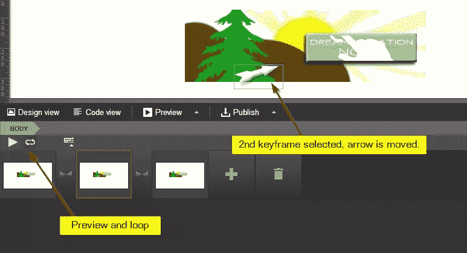
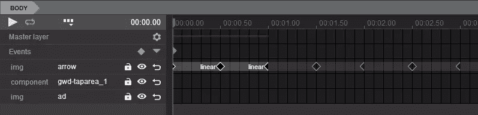

# 谷歌网页设计师:生产就绪的工具还是玩具？

> 原文：<https://www.sitepoint.com/google-web-designer-production-ready-tool-toy/>

[](https://www.flickr.com/photos/chalkie_circle2000/2493034460/)

图片:Chalkie_CC

**[Google Web Designer](http://www.google.com/webdesigner/ "Website: Google Web Designer")**是一款图形设计工具，使用动画和 3D 变换创建 HTML5/CSS3/Javascript 横幅和广告。使用图形工具，如绘图、文本和 3D 对象，您可以使用关键帧在时间轴上制作这些对象和事件的动画。

GWD 显然不是为创建成熟的应用程序或整个网站而设计的，而是横幅、弹出广告、侧边栏、甚至动画按钮，重点是 Doubleclick 和 AdWords 活动项目。

似乎没有太多关于这个工具的讨论，我也没有找到很多充分利用它的示例项目。Craig Buckler 在 2013 年 10 月为 SitePoint 写了一篇关于 GWD 的[评论，它并没有得到最好的评论。](https://www.sitepoint.com/google-web-designer-review/)

公平地说，Craig 的评论是在发布初始测试版几天后写的。我运行的版本是 1.1.2.0814，仍在测试阶段。这个项目现在已经快一年了。据谷歌所知，当我们得到火狐 3076 版本时，它可能会退出测试版！

**注意:**当我需要帮助使用或解释某个功能时，我几乎完全依赖于谷歌自己的[帮助中心](https://support.google.com/webdesigner/#topic=3178270)。他们还有一个 [Youtube 频道](https://www.dropbox.com/s/7sjhj2p5uinn87x/Finished%20Product.mp4?dl=0)，里面有几个几周前的视频。我很惊讶这个程序得到的帮助是如此之少，但是也许这个程序比它看起来要简单？

## 该项目

[](http://www.google.com/webdesigner/)

因为这是一个制作动画的工具，我想我应该制作一些简单的带有“点击这里”热点的广告。我想制作一个光标箭头的动画，让它在光标悬停在热点上时反弹。

听起来很简单，对吗？

我所要做的就是动画一个小图形，让它循环，然后创建热点，并在用户点击时将他们发送到某个网页。让我们看看它有多容易创建！

首先，使用 Photoshop CS6 中一些令人惊叹的内置形状和画笔，我为你制作了这个快速原型广告，让你获得一个梦想中的假期。


这个想法是当你将光标悬停在按钮上时，让白色箭头在按钮上反弹；当你点击按钮时，打开另一页。

我希望你会比我花更多的时间在你的图形上！

## 编辑模式

每次创建新文件时，您都可以选择使用哪种编辑模式，下面是对每种模式的简要说明:

*   **Banner** (应用内特定维度的简单广告)
*   **可扩展**(点击时广告扩展，有一个关闭按钮可收缩回来)
*   **插播**(在应用程序的某个点出现的整页广告，例如在页面转换之间，点击关闭按钮继续应用程序的流动)
*   HTML (简化的 HTML 起点，不像谷歌广告环境和花哨的功能那样集中)
*   **带页面的 HTML】(使用“页面”结构，允许您的广告包含多个页面，无需刷新浏览器)**
*   CSS (本质上是一个非常基本的文本编辑器，除了行号和颜色高亮之外没什么)
*   **JavaScript** (基本编辑器相同)
*   **XML** (相同的基本编辑器)

这里唯一值得注意的是，横幅、可扩展和间隙模式对谷歌广告来说更加具体。横幅的最初来源是 107 行 HTML，它发布了 8 个文件和 1 个文件夹，总大小为 70.2KB。当打开一个简单的 HTML 文档时，它并不关注 Google 广告，HTML 中有 24 行，发布了 3 个文件和 1 个文件夹，大小为 1.57KB。

每种模式的界面本身似乎没有任何区别，而是提前创建了多少初始代码和模板。我为我的小项目选择了 *HTML* ,因为我不会发布到 DoubleClick。

CSS、JavaScript 和 XML 的简单编辑器几乎毫无价值。我确信它们只是向人们展示代码是可编辑的，但是任何习惯于现代 IDE 的人都会发现它们功能严重不足。

例如，如果你编辑一个 CSS 文件，没有助手，上下文菜单，自动化，按钮，颜色选择器或任何东西。它只提供一个特性——添加和删除评论的能力。就是这样。

## 创建我的广告

我打开一个新的 HTML 项目，给它一个名称和位置，然后单击 OK。



项目打开到*设计视图*，我正看着一个空白的白色画布。我知道我需要我的广告在这里的某个地方，所以我点击了左边栏的“*标签工具*按钮。使用这个工具，你可以绘制一个 div，图像，视频，或者一些自定义的东西。

您可以在这里设置背景颜色和一些基本选项，包括圆角。我直接在画布上画了一个图像。它将绝对定位元素，无论你画在哪里。我的图像是 400×120 像素，但我必须在画完之后手动编辑，因为你不能在画的时候设置尺寸。

### 新手须知

值得记住的一点是，如果您希望您的元素在 GWD 注册，以便在事件中选择，您必须向它添加一个 ID 属性。

我几次忘记了这个要求，不明白为什么 GWD 似乎没有找到我的元素。如果使用内置的 GWD 组件，ID 会自动生成，但使用绘图工具时不会发生这种情况。GWD 还会自动添加类别。

大小、位置、ID、3D 位置、边距、填充、样式和图像源都可以在属性侧边栏面板中找到。我发现使用他们的面板比直接编辑代码或 CSS 要安全得多。如果界面提供选项，避免手动编辑代码。如果你不这样做，事情可能不会成功！

在设置我的图像的属性后，它出现在画布中。



通过设置 ID，现在也可以在事件对话框中选择它。



不过，我有点言过其实了。

接下来，我认为热点区域是最容易创建的部分。在*组件*侧边栏中有一个“*点击区域*，所以我把它拖到画布上，它以默认大小创建，你需要根据你的要求调整它的大小。

与左侧窗格中的工具不同，您不需要*【draw】*组件，它们必须被拖到画布上。

放下热点并编辑其属性后，对其进行操作的唯一方法是创建一个事件。

*   在“事件”面板中，单击加号图标添加事件，然后浏览对话框页面。

*   对于目标，单击新创建的热点(具有自动生成的名称)。

*   对于事件，我们需要鼠标->单击。

对于这个动作，我添加了一个自定义动作，并用这一行 Javascript 代码将该函数命名为“gothere ”:

```
window.open("http://www.google.com", "_self");

```



现在，当我预览文档时，我可以点击热点，它会像预期的那样打开谷歌。到目前为止一切顺利！该项目现在由一个图像、一个热点和一个单击事件组成。

## 动画

现在好戏开始了。让我们来制作我的箭头的动画，当它们停留在热点上时让它反弹。

我再次使用标签工具添加另一个图像，并把它放在画布上我想要的位置，刚好与热点重叠。



我给了箭头图像一个 ID，这样它就可以作为一个事件被选择。

接下来的部分出乎意料的简单。我打开了*‘简单’*时间轴，它自动准备好了一个关键帧。我所需要做的就是点击大的加号来创建第二个关键帧，然后当第二个关键帧被选中时我移动箭头图像。创建关键帧后，您可以设定缓动选项，如转场所需的时间长度。

然后，我创建了第三个关键帧，并将箭头移回到它的起始位置，与第一个关键帧的坐标相同。这样箭头会离开，但又会回来。使用预览*‘播放’*按钮和循环按钮，我可以预览箭头动画，并看到它确实如我所愿。



现在是棘手的部分。我需要设置一个事件，以便在按钮悬停状态下，动画循环，但当它失去焦点时，它停止动画。

我转到事件面板，创建了一个新事件。在对话框中，我选择了以前的热点，到一个`mouseover`事件，到一个播放的时间线动作。然后我为`mouseout`创建了第二个动作来暂停它。

奇怪的是，他们没有提供`onBlur`事件，但我认为`mouseout`必须做同样的事情。

除了两个问题，这一切都很好。

*   动画没有循环播放，
*   页面一加载，动画就开始播放。

通过切换到*高级时间轴*并点击轨道上的循环按钮，循环问题很容易得到解决。

**【注:在克雷格的评论中，他说你不能在简单视图和高级视图之间切换，现在你可以随意切换】**

第二个问题不那么容易解决。

我首先查看了自动播放的任何明显开关的源代码。我没有看到任何，GWD 也没有任何全球项目选项或设置。

然后我想我可以创建一个动作来在文档加载时暂停回放，但是在文档加载时选择'*'没有这样的事件存在。*

最终，解决方案是再次使用高级时间轴，在事件层，我在时间轴的开头添加了一个新事件。

对于这个事件，目标是`Document.body`。虽然我最初认为它会成为热点，但我发现这并不奏效。对于事件，我选择了“时间线- >事件-1”，它本质上是非事件，因为它不涉及用户操作，而是时间线操作。这实质上翻译成“在‘事件-1’时间线触发时”。

当然，这个动作被设定为暂停。那么接收者就是文档，就像目标一样。

这有效地使动画从第一个关键帧暂停，完成了我想要的。

这是我完成的时间线的一个镜头，看起来并不复杂。



### 清理时间

当我最初为箭头设定关键帧时，程序自然地为其他名为' *gwd-taparea1* '和' *ad* '的轨道创建了相应的关键帧。由于这两个元素实际上都没有动画，我删除了那些关键帧，认为这样可以在源代码中节省一点文本。

注意事件轨迹上的灰色半菱形。这是一个从头开始暂停动画的事件。你会看到三个菱形代表我的三个关键帧。由于选择了循环，右侧是重影关键帧。

我发布了产品，并设置了选项来将代码内联和缩小。该动画可以在 Firefox、Chrome、Internet Explorer、Opera 和 Safari 上运行。实际上，这种经历在每个人身上都是一样的。

这是最终的产品，我拍了一个截屏，因为这个项目对 Codepen 来说有点难处理。

<video class="wp-video-shortcode" id="video-90758-1" width="548" height="254" preload="metadata" controls=""><source type="video/mp4" src="https://uploads.sitepoint.com/wp-content/uploads/2014/09/1411368374Finished-Product.mp4?_=1">[https://uploads.sitepoint.com/wp-content/uploads/2014/09/1411368374Finished-Product.mp4](https://uploads.sitepoint.com/wp-content/uploads/2014/09/1411368374Finished-Product.mp4)</video>

## 最后的想法

在我完成这个项目的过程中，我看到了很多可以让我变得更有想象力的机会。例如，您可以对动画进行分层，以便每个父容器都有自己的时间轴。我可以看到各种视差动画在这里使用分层图形动画不同。

我本可以将我的图形扩展得更好，有一些微小的效果，比如山脉移动或者一棵树前后摇摆。我也没有碰任何内置的 3D 控件。

时间轴上可以有事件，这意味着动画本身可以触发事件，并且事件可以调用时间轴的命名区域。这意味着你可以根据用户事件在时间轴上跳来跳去。

和许多自动化编码工具一样，GWD 容易吐出堆积如山的代码，我的项目也是如此，创建了 3 个 JS 文件、一个 CSS 文件和一个 HTML 文件。这在缩小的形式下相当大，为 27.8KB。即使它创建了一个单独的 CSS 文件和 JS 文件，在 HTML 源代码中仍然有大量的 CSS 和 JS 文件。

尽管 Google Web Designer 似乎是为创建像我这样的小广告而设计的，但他们创建了一个完整的 HTML 页面——从 DOCTYPE 到结束标记——这一事实让我有点困惑，他们希望我如何在自己的项目中部署它。

我怀疑他们打算让你在 iframe 或弹出窗口中部署它，但如果他们能以某种方式封装一切，让我可以将它作为一个对象直接嵌入到我自己的项目中，而无需任何多余的代码或管理多个文件，那就更好了。

如果在 GWD 框架内这是可能的，我肯定没有看到。也许这是另一天和另一个版本。目前我只能猜测你的产品需要 iframed。

这是一个有趣的项目，GWD 只是有点直观，它花了我大约 5 个小时的时间，包括阅读帮助文件和观看几个 Youtube 视频来找出这些怪癖(以及写这篇文章和创建图形)。

现在我更习惯这个界面了，我可以看到自己尝试用它来做一些更大更有趣的事情。例如，我想构建一个具有悬停和点击效果的精美菜单，我想看看 3D 功能能做些什么，以及推动绘图工具。

*   你怎么看？
*   你会使用这样的工具吗？
*   这样的动画值得它创造的额外开销吗？

## 分享这篇文章