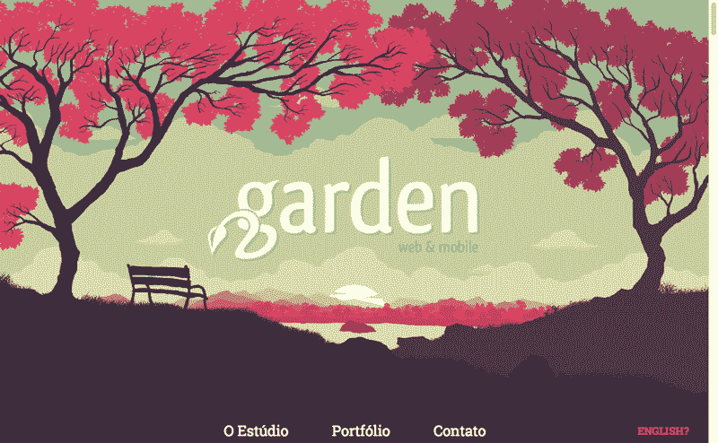
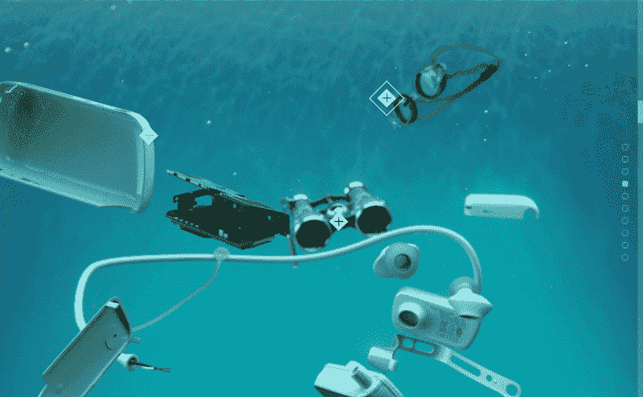
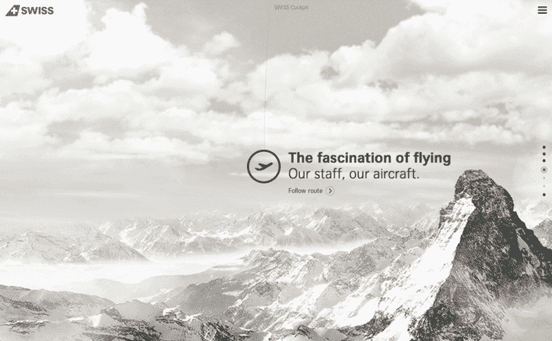
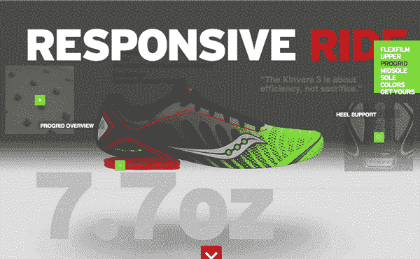
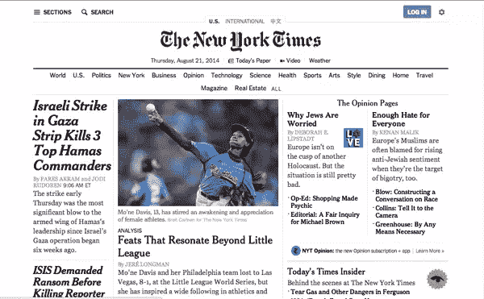

# 视差设计的危险和好处

> 原文：<https://www.sitepoint.com/peril-perk-designing-with-parallax/>

摄影:科斯莫谢列维克

有多少次不同部门的客户、经理或同事因为时尚而让你送东西？

他们已经看到了，他们想要它。相关性，该死的。

这种趋势有多少次完全不适合你的网站项目？说“不”并解释为什么一种趋势对你的网站没有意义可能是一个挑战，所以了解一种趋势可以增加什么价值，以及如何在你的情况下有效地应用它是有帮助的。

视差滚动作为一种网页设计趋势诞生于 2D 视频游戏世界，最初是作为一种平台的黑客来创造场景的深度感。注意到视差滚动在过去两年中的增长，一名设计师最近决定将这种风格应用到他的最新 web 项目中:一个小型零售产品的登录页面。

滚动时，产品的生活方式照片应该在背景中缓慢移动，而产品的描述应该在前景中快速移动，从而产生视差效果。然而，实际上，视差滚动本质上会阻止快速移动的描述与慢速移动的照片对齐。

这突出了当应用一个流行的技术时会出错，因为它是流行的，而不是因为它适合工作而使用它。所以让我们看看它什么时候会有帮助。

## 使用视差创建深度

动物使用运动视差来确定它们与物体的距离——想象一只鸟上下摆动它的头来计算它们与周围动物的距离。当你滚动网页时，视差效应会产生深度错觉，因为你的直接动作(滚动，而不是摇头)会影响元素的相对位置，就像在现实世界中移动一样。

这种互动会让你感觉自己是场景的一部分，让你沉浸在内容中，诱使你进一步探索。滚动可以让您积极参与到您所看到的内容中，并立即获得更多可视内容的回报:

http://gardenestudio.com.br/

因此，视差效果是在视觉故事讲述中使用的一种极好的技术。它非常吸引人，鼓励互动，让你通过一个故事来引导你的用户。实际上，这可能是:

*   主页:讲述品牌故事，分享你的价值观，建立信誉；
*   产品页面:直观地展示产品的优点；
*   用户指南:用容易理解的块阐明过程的每一步；或者
*   登陆页面:在引导你进入一个更大、内容更丰富的网站之前，以一种非常吸引人的方式引导访问者浏览一个单一的、狭窄的概念。

让我们依次看看这些用例的例子。

## 品牌

索尼在其“被移动”登录页面的场景中混合了视差效果和滚动激活动画，这是分享品牌价值观的一个出色例子。登录页面讲述了索尼如何努力将工程和艺术相结合的故事，并展示了该品牌通过精心制作流畅的大视觉互动来践行这一价值观。

索尼还允许您通过滚动激活的动画来分解和组装他们的产品，从不同角度并相对于其他可识别的对象向您显示 3D 设备:

http://discover.store.sony.com/be-moved/

## 制品

瑞士航空公司使用视差效果来制造深度，并通过天空中的运动来展示他们的航空公司。从本质上说，他们的产品是飞行的魔力，所以他们用这种视觉上讲故事的形式让你一窥这种体验:

http://www.world-of-swiss.com/en

除了登陆页面之外，瑞士的主要网站也在小范围内使用视差效果来增强用户体验。

Saucony 利用视差效应让你的注意力集中在他们的核心产品上:鞋子本身。其他一切都是对这个单一焦点的补充信息:

http://community.saucony.com/kinvara3/

在产品销售页面上使用 parallax 时，注意不要减慢购买过程。这种效果应该有助于客户更快地做出购买决定，因为他们可以直观地看到产品，因此透明度更高。用户到达收银台的时间不会比平时长。

## 处理

通常情况下，您会发现视差滚动应用于长的单页设计，内容稀疏，视觉效果大，有许多动画或花哨的过渡。[让你的钱物有所值](http://makeyourmoneymatter.org/)展示了你如何将视差效果与其他设计元素结合起来演示一个过程。您可以将该样式应用于任何一步一步的过程，例如用户指南、表单填写或商品购买，以引导用户完成整个过程。

视差的这个例子通常以其他有说服力的设计技术为特色。例如，你可以通过视差页面显示进度来使你的网站游戏化，鼓励用户完成任务。这导致了更多的参与或转化。你可以使用倒计时、可见的导航进度条来显示进度，或者从一开始就明确表示你必须滚动才能了解更多。

## 登录页面

最后，视差滚动非常适合登录页面。你可以让用户专注于一个故事，首先获得他们的认同，然后再提供更多选择来参与你的产品、服务或社区。例如，看看纽约时报*的番茄罐头布鲁斯*:

http://www.nytimes.com/projects/2013/tomato-can-blues/?hp

在你的登陆页面故事的结尾，链接到你的完整的、内容丰富的站点，它有扩展的导航、复杂的结构和详细的内容:

http://www.nytimes.com/projects/2013/tomato-can-blues/?hp

这种方法的另一个优点是，你可以从你的主网站创建非常独立和独特的页面。你可以在一个单独的域中托管登陆页面，不受一个 <abbr title="Content Management System">CMS</abbr> 的限制，也不受现有风格指南或网站结构的约束。

考虑一下瑞士航空公司早期的例子:他们时髦的视差登陆页面停留在`www.world-of-swiss.com/en`，而他们网站的其余部分停留在`www.swiss.com/us/en`。

内容营销也受益于带视差滚动的独立登录页面。品牌可以创造美妙的、可分享的内容体验。这些登录页面主要面向社交媒体战略，以“分享”为主要行动号召，鼓励品牌忠诚度。这种方式最适用于重复购买率高(或参与订阅模式)和推荐流量高的企业。尝试使用一个[有趣的、交互式的登陆页面和视差滚动](http://www.exsus.com/highway-one-roadtrip/)来提高参与度。

## 视差的未来

视差趋势现在可能要过时了，但谷歌趋势预测它还有一些生命力。希望你已经从上面的概述中看到，每一个来来去去的趋势都可以被检查出有价值的、显著的细节。

这些基本元素可能会在下一个趋势中获得新生。

## 分享这篇文章