# 原型工具:从 Fireworks 到 Illustrator

> 原文：<https://www.sitepoint.com/prototyping-tools-moving-fireworks-illustrator/>

我一直用 Fireworks 做原型。我发现它对这项工作来说更简单、更有效，同时也比它的“竞争对手”Photoshop 更面向网络图形。Fireworks 还拥有强大的开发人员网络，他们创建了许多插件，可以显著增强其功能。

但是吸引我更喜欢 Fireworks 的一个主要因素是它创建多页文档的能力:它使得在原型的每个页面之间共享资源和样式非常容易，并且允许您生成一个独特的 PDF 文档，该文档可以随时发送给客户进行审批。

当 Adobe 决定停止 Fireworks 开发时，我开始考虑使用 Illustrator 进行原型开发。Illustrator 允许创建多页文档，并包含了许多特别适合这项工作的功能。

让我们比较一下 Fireworks、Illustrator 和 Photoshop 的原型功能:

| 特征 | Illustrator CC 2014 | Photoshop CC 2014 | 烟花 CS6 |
| :-- | :-- | :-- | :-- |
| 多页文档 | 是 | 不 | 是 |
| 网格系统指南的创建 | 内置的 | 带插件 | 带插件 |
| 创建交互式原型 | 不 | 不 | 是 |
| 导出为多页 pdf | 是 | – | 是 |

网格系统指南的*创建*功能涉及构建一组指南来表示网格系统布局的能力:Photoshop 和 Fireworks 都需要一个插件来完成此任务，而在 Illustrator 中，我们可以使用内置的“拆分为网格”命令。

创建交互式原型这是 Illustrator 和 Photoshop 中都缺少的一个非常有用的功能。在 Fireworks 中，您可以通过原型页面创建链接来模拟导航:这使得构建多页面交互式原型变得非常容易。也许您可以在 Illustrator 中找到一些解决方法(您也可以在 Acrobat 中编辑 PDF，添加导航链接)，但可能无法使用 Fireworks 提供的简单工作流程。

尽管如此，Illustrator 和 Photoshop 都有很强的设计能力，所以从 Fireworks 过渡肯定不会那么痛苦。

## 让我们从 Illustrator 开始

第一步是创建一个新文档。

Illustrator 附带了一些预定义的配置文件，可以帮助您快速设置新文档。您还可以在一些预设的设备配置文件(平板电脑和智能手机)中进行选择。

在本例中，我们从一个通用的 web 配置文件开始，然后将大小设置为 1280x800px:

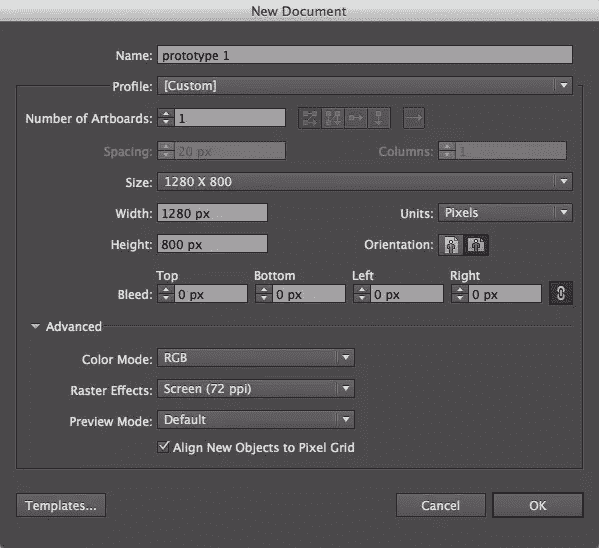

您可以在典型的*移动优先*工作流程中从智能手机画板开始，然后添加更大的画板，或者以您喜欢的任何方式开始:您将能够随时更改每个设置并重新排列画板。

您也可以从一个模板或者一个现有的`.ai`文档中加载一个概要文件(但是那是另外一个故事了……)。

现在，我们想为适用于≥1200 像素宽度的 [Bootstrap 3 大型桌面网格](http://getbootstrap.com/css/#grid)设置参考线。

我们必须考虑:

*   总宽度为 1170 像素(包括网格左右两边各 15 像素的边距)
*   12 列
*   每列大约 67px 宽
*   列间 30px 装订线

如下图所示。

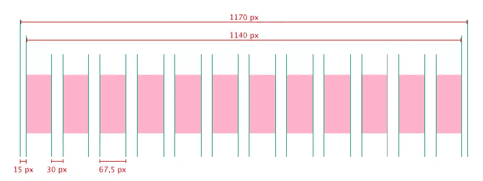

考虑到这些测量，我们可以建立我们的原型网格。

首先，我们要画两个矩形:一个宽度为 1170 像素(代表包括 15 像素左右边距的外部宽度),一个宽度为 1140 像素。我已经将它们的高度都设置为 800 像素(但是您可以根据需要排列它们)，然后将它们放在画板的中心:

这是结果:

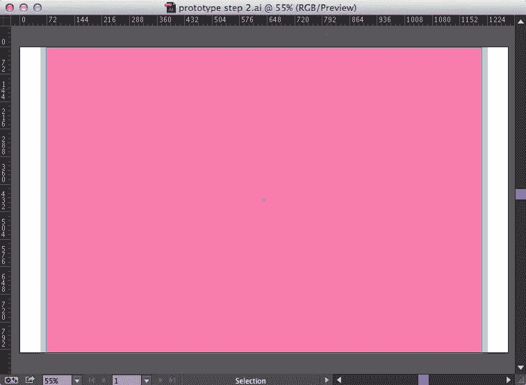

画板代表*视口*和构成网格区域的两个矩形。您可以保持灰色矩形不变，将其用作背景，也可以根据您的喜好用一些参考线来替换它。

## 设置网格

现在，我们必须将粉色矩形分割成一个网格。我们可以选择它，然后选择**对象→路径→分割成网格…** :

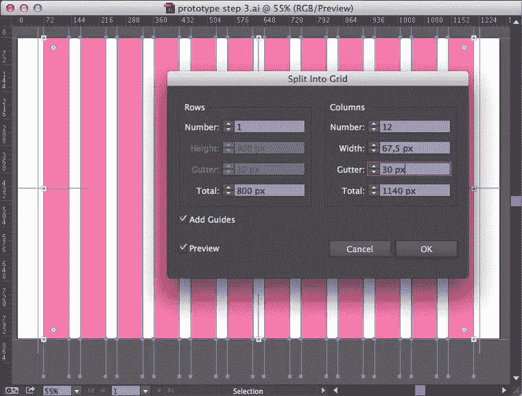

使用**分割成网格**面板，可以将一个对象分割成一系列的行和列。检查**预览**选项，您可以在应用之前看到您的设置结果。

在这个例子中，我简单地设置了列数和装订线宽度，Illustrator 完成了剩下的工作。

您也可以使用面板的**行**部分设置水平网格；无论如何，这会导致一个非常混乱的布局，所以我只在真正需要的时候才使用这个选项。

最后，您可以选择**添加参考线**选项来生成一系列网格线(尽管不认为合适的*参考线*)。

应用该命令后，您可以按照自己最喜欢的方式排列网格:我更喜欢删除矩形，并将所有线条转换为参考线。

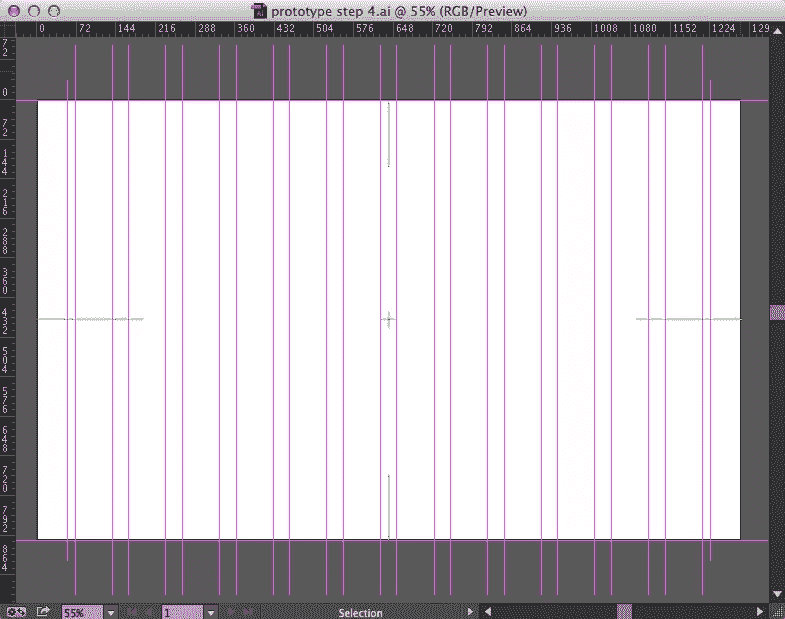

你可以在画板中心看到一个绿色标记，在每条边的中点看到四条绿色线条:我发现这个选项非常有用，它可以应用于打开**画板面板**(双击**画板工具**)并检查**显示中心标记**和**显示十字线**选项:

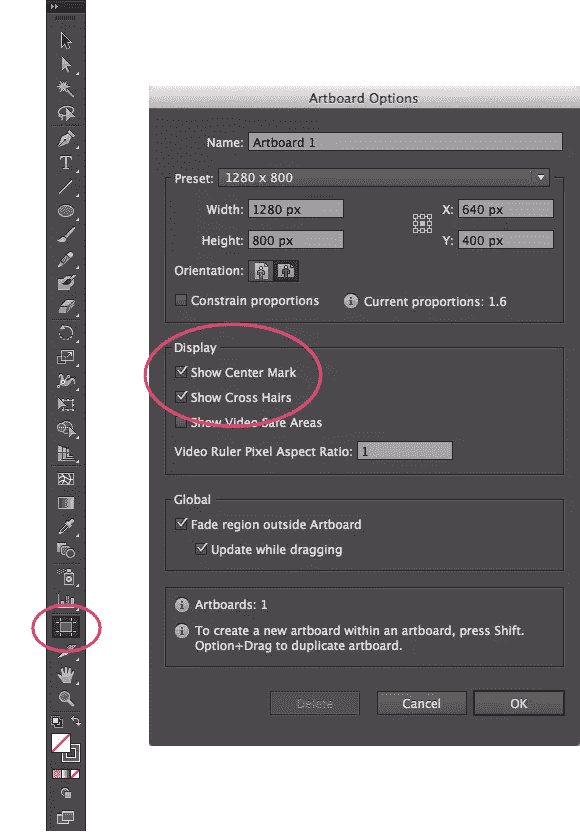

现在可以轻松复制画板，按住 option/alt 键并使用**画板工具**拖动画板:每个拖动的画板将包含第一个画板的所有对象(要复制参考线，您必须在拖动前解锁它们)。

您还可以创建其他大小的新画板，以便在原型中显示所有断点大小和终端设备。

每个画板都可以使用**画板面板**单独命名:

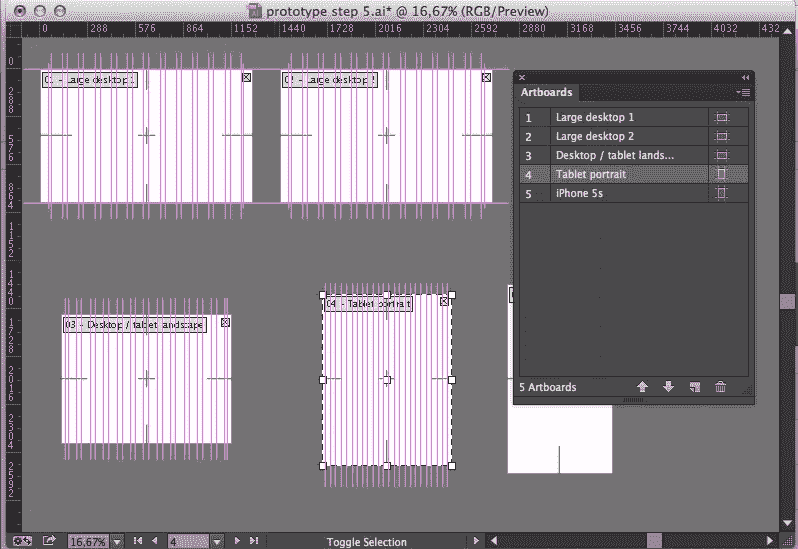

最后，您可以将画板系列保存为 Illustrator 模板文件(**文件→另存为模板…** )，以快速创建新的线框或原型。

## 使用符号

假设您有一个包含许多画板的原型，并且这些画板有一些共享组件(页眉、页脚、菜单等)。).

当你必须修改其中一个时会发生什么？通常，您需要对每个画板重复相同的更改。或者可以用**符号**。

Fireworks 有一个很好的系统来管理原型的各个部分:你可以在页面之间共享层(就像我喜欢做的那样)，设置一个**母版页**或者在文档**库中定义可重用的符号**。

Illustrator 以不同的方式管理元件，使用画板(对应于 Fireworks 页面)和图层。Fireworks 的每个页面都有一组不同的图层，而在 Illustrator 中，图层在所有的*画板之间共享。*

令人高兴的是，在 Illustrator 和 Fireworks 中，符号的行为方式是相同的。

符号只是可以重复使用的对象。当你添加一个符号到你的插图时，你实际上是添加了它的一个*实例*，如果你改变了一个符号，它的所有实例也会随之改变。

Illustrator 附带一组预定义的符号和许多库(您可以在**窗口→符号库**中找到它们)。您可以通过**符号面板**来管理和应用符号:

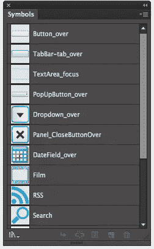

创建新符号并将其放入您的作品非常简单:选择您想要变成符号的对象，然后单击符号面板上的**新符号**图标(您也可以将对象直接拖到您的面板中)。

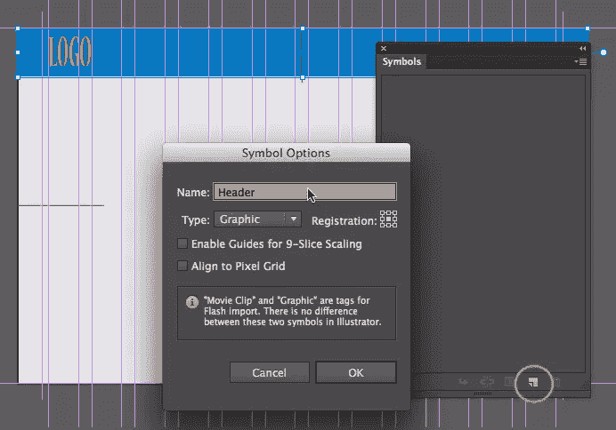

现在，您可以在每个画板中拖动新的元件，如果您需要进行一些更改，只需双击一个实例并进行更改:所有元件的实例都将被修改。

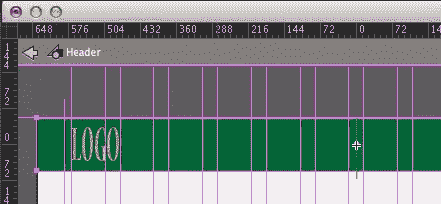

符号对于 UI 元素也非常有用。

例如，您可以创建一个用于原型的引导表单元素库。在这些情况下，很难激活 **9 切片缩放**选项，这样你就可以缩小它们的尺寸而不失真。

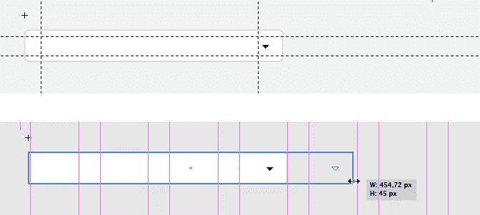

## 从原型到代码

到了开始编码的时候，你需要把你的设计“翻译”成 HTML 和 CSS。Illustrator 可以用 **CSS 属性面板**再次帮你(Fireworks 和 Photoshop 也都有)。

你只需要选择一个对象，CSS 面板就会给你相应的 CSS 代码。

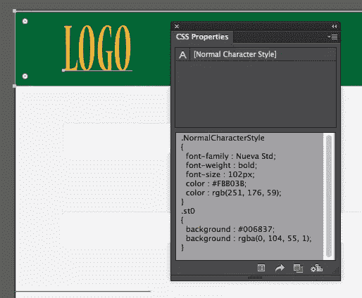

您还可以设置许多关于要导出的属性的选项:

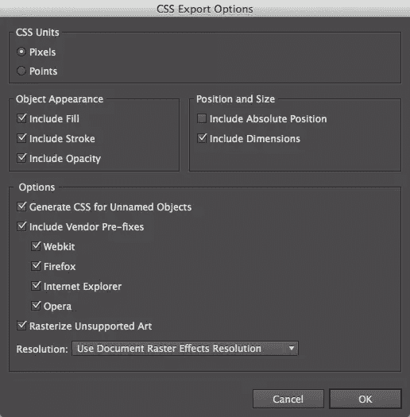

然后，您可以复制或保存生成的 CSS 片段，并将其粘贴到您的 CSS 文件中。

当然，有时这可能还不够:你可能需要将你的原型交付给一个没有 Illustrator 的程序员，或者你可能需要一份完整快速的设计规范参考。

在这些情况下 [Specctr](http://www.specctr.com) 可能就是你所需要的。

Specctr 是一个 Illustrator 插件(同样，也有适用于 Photoshop 和 Fireworks 的版本)，可以自动生成规格。只需将 Specctr 应用于原型中的对象，文档就会打印到画板中(Specctr 还可以帮助您扩展它，为 specs 腾出空间)。

Specctr 是一个商业插件，但是您可以下载一个功能有限的免费 lite 版本，看看它是否适合您。

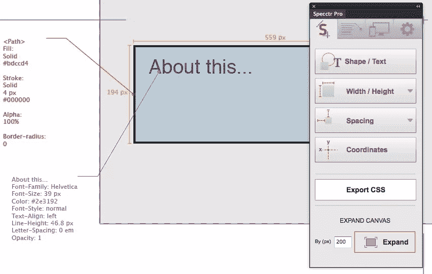

使用 Specctr，您可以添加许多属性的文档:宽度和高度、颜色、字体等。您可以生成四种不同的规格类型(*形状/文本*、*宽度/高度*、*间距*和*坐标*)，并且您可以设置必须打印的属性(填充、笔画、字体系列等)。

通过设置**响应选项**面板，Specctr 还可以提供相对测量值(`%`或`em`)来代替`px`。

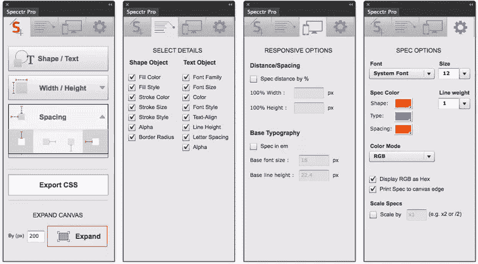

这允许您生成一个 PDF 或打印出包含您需要编码的所有信息的原型，或者您可以以类似于本地 *CSS 属性*面板的方式导出一个 CSS 文件。

简而言之，Specctr 是一个非常方便的原型构建工具。

## 从烟花到插画

虽然 Illustrator 可能是这项重要任务的一个有价值的 Fireworks 替代品，但它缺少一些我经常使用的功能(例如，“图层到图像导出”)，但也有许多其他添加的宝石，使它成为一个真正伟大的原型工具。

## 分享这篇文章