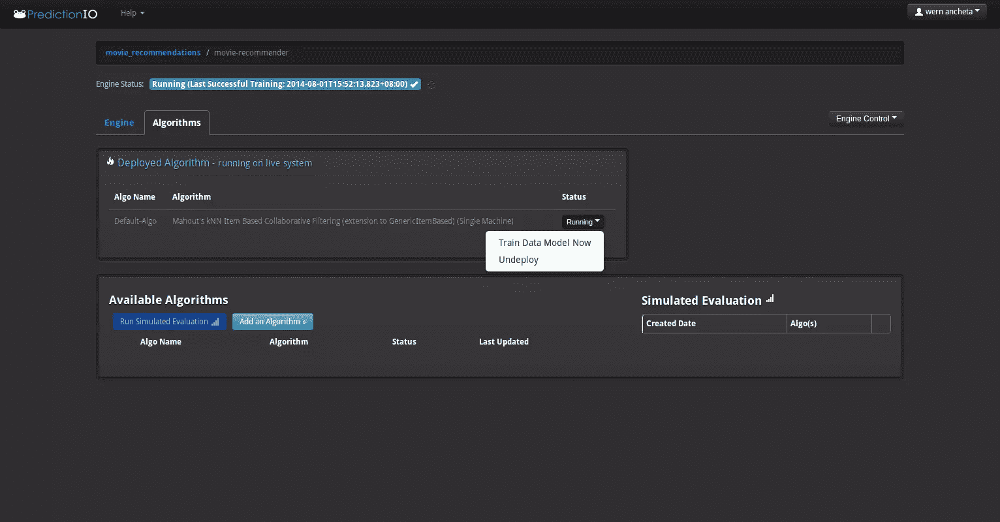

# 使用 Prediction.io 创建电影推荐应用程序–实现

> 原文：<https://www.sitepoint.com/create-movie-recommendation-app-prediction-io-implementation/>

在第一部分中，我们介绍了预测 IO 的基础知识，并安装了它的依赖项。在这一部分，我们将构建应用程序。

## 从 TMDB 导入数据

我们将使用预测 IO SDK 导入数据，因此我们首先需要告诉 Flight 使用它。在您的`index.php`文件的开头添加以下代码:

```
<?php
session_start(); //start a session
require 'vendor/autoload.php'; //autoload dependencies

use PredictionIO\PredictionIOClient; //import the prediction IO client
```

接下来，将预测 IO 客户端注册到 Flight，以便我们可以在整个应用程序中使用它:

```
Flight::register('prediction', 'PredictionIO\PredictionIOClient');
```

既然我们在这里，让我们也注册 MongoDB 类，以便我们稍后可以查询 MongoDB:

```
Flight::register('mdb', 'Mongo', array('mongodb://localhost'));
```

接下来，我们将工厂方法映射到一个飞行方法，并将其命名为`prediction_client`。我们稍后将使用它来调用预测 IO 客户端。

```
Flight::map('prediction_client', function(){
  $client = Flight::prediction()->factory(array("appkey" => "YOUR_PREDICTION_IO_APP_KEY"));
  return $client;
});
```

最后，我们也让飞行知道狂饮。这样我们就不需要在每次需要使用 Guzzle 的时候初始化它。我们可以打电话给`Flight::guzzle()->some_guzzle_method()`就完事了。

```
Flight::register('guzzle', 'GuzzleHttp\Client');
```

我们现在可以开始编写从 TMDB 导入数据的代码了。首先，声明一个到`movies/import`路径的路由。我们稍后将从浏览器访问它，开始导入。

```
Flight::route('GET /movies/import', array('Admin', 'import'));
```

在上面的代码中，我们指定了 Flight 将在数组中使用的控制器和方法。继续在项目文件夹的根目录下创建一个`controllers`目录。然后创建一个`admin.php`文件，它将作为控制器。打开文件并声明一个与文件同名的类:

```
<?php
class Admin {
    public static function import() {

    }
}
```

在`import`方法中，初始化预测 IO 客户端。然后创建一个循环 100 次的`for`循环。在循环内部，我们调用 TMDB API 为我们返回最受欢迎电影的数据。每个 API 调用返回 20 部电影，所以如果我们循环 100 次，我们总共得到 2000 部电影。

```
$client = PredictionIOClient::factory(array("appkey" => "YOUR_PREDICTIONIO_APP_KEY"));

    $index = 0;
    for($x = 3; $x <= 100; $x++){

      $movies_url = 'https://api.themoviedb.org/3/movie/popular?api_key=YOUR_TMDB_API_KEY&page=' . $x;

      $movies_response = Flight::guzzle()->get($movies_url); //get most popular movies
      $movies_body = $movies_response->getBody(); //get response body

    }
```

在上面的代码中，我们使用 Guzzle 从 TMDB API 中获取一些电影。然后，我们使用`json_decode`将 JSON 格式的返回数据转换成一个数组:

```
$movies_result = json_decode($movies_body, true);
$movies = $movies_result['results'];
```

一旦完成，我们就可以遍历所有的电影并提取我们想要的字段。在这种情况下，我们需要电影海报的 id、标题和路径:

```
if(!empty($movies)){

  //loop through all the movies
  foreach($res as $row){

    $id = $row['id'];
    $title = $row['title'];
    $poster_path = '';
    if(!empty($row['poster_path'])){
      $poster_path = $row['poster_path'];
    }
  }
```

为了获得更多的细节，我们需要使用电影的 id 对每部电影进行单独的调用。然后，我们将返回的 JSON 数据转换为一个数组，方法与前面相同:

```
$moviedetails_url = 'https://api.themoviedb.org/3/movie/' . $id . '?api_key=YOUR_TMDB_API_KEY';

$moviedetails_response = Flight::guzzle()->get($moviedetails_url);
$movie_details_body = $moviedetails_response->getBody();

$movie = json_decode($movie_details_body, true);
```

对电影资源的调用会返回一大堆关于电影的数据，但是对于这个应用程序，我们将只使用概述和发布日期:

```
$overview = $movie['overview'];
$release_date = $movie['release_date'];
```

现在我们已经有了所有需要的数据，我们可以使用 Prediction IO SDK 中的`create_item`方法将其保存到数据库中。这个调用接受两个参数:`pio_iid`和`pio_itypes`。`pio_iid`是物品的 ID；在这种情况下，我们将简单地使用我们之前声明的变量`$movie_id`。我们将在循环的每次迭代中递增这个变量，这样我们就有了每部电影的唯一 id。另一个必需的参数是`pio_itypes`。这是我们指定项目类型的地方。您可以为此使用任何描述性名称，如`movie`。但是对于这个应用程序，我们只是将`pio_itypes`设置为 1。接下来，我们使用`set`方法设置电影细节。一旦完成，我们只需调用`execute`方法将电影添加到数据库中。然后我们使用`print_r`打印出我们得到的响应，以确保操作成功。

```
$command = $client->getCommand('create_item',  array('pio_iid' => $movie_id, 'pio_itypes' => 1));
$command->set('tmdb_id', $id);
$command->set('title', $title);
$command->set('poster_path', $poster_path);
$command->set('overview', $overview);
$command->set('release_date', $release_date);

$client_response = $client->execute($command);
print_r($client_response);
```

最后，我们将`$movie_id`加 1。

```
$movie_id += 1;
```

将所有内容放在一起，我们有以下代码:

```
$client = PredictionIOClient::factory(array("appkey" => "YOUR_PREDICTIONIO_APP_KEY"));

$index = 41;
for($x = 3; $x <= 100; $x++){

  $movies_url = 'https://api.themoviedb.org/3/movie/popular?api_key=YOUR_TMDB_API_KEY&page=' . $x;

  $movies_response = Flight::guzzle()->get($movies_url);
  $movies_body = $movies_response->getBody();

  $movies_result = json_decode($movies_body, true);
  $movies = $movies_result['results'];

  if(!empty($movies)){

    foreach($movies as $row){

      $id = $row['id'];
      $title = $row['title'];
      $poster_path = '';
      if(!empty($row['poster_path'])){
        $poster_path = $row['poster_path'];
      }

      $moviedetails_url = 'https://api.themoviedb.org/3/movie/' . $id . '?api_key=YOUR_TMDB_API_KEY';

      $moviedetails_response = Flight::guzzle()->get($moviedetails_url);
      $movie_details_body = $moviedetails_response->getBody();

      $movie = json_decode($movie_details_body, true);

      $overview = $movie['overview'];
      $release_date = $movie['release_date'];

      $command = $client->getCommand('create_item', array('pio_iid' => $index, 'pio_itypes' => 1));
      $command->set('tmdb_id', $id);
      $command->set('title', $title);
      $command->set('poster_path', $poster_path);
      $command->set('overview', $overview);
      $command->set('release_date', $release_date);

      $client_response = $client->execute($command);
      print_r($client_response);
      echo "<br><br>";
      $index++;
    }
  }
}
```

一旦完成，打开项目目录的根目录下的`index.php`,在最后一行输入以下内容。这将启动飞行框架。按照惯例，这应该总是位于文件的最后一行:

```
Flight::start();
```

之后，你现在可以在浏览器中访问`/movies/import`路径，开始从 TMDB 导入一些电影。这可能需要一段时间才能完成，所以去喝杯咖啡或看一集你最喜欢的节目。

## 随机挑选电影

现在我们有了一些电影，我们准备向用户展示一些随机的电影。首先，为索引页面创建一个路由:

```
Flight::route('GET /', array('Home', 'index'));
```

这使用了`Home`控制器，因此继续使用`index`方法在`controllers`目录中创建一个`home.php`。

```
<?php
class Home {
  public static function index() {

  }
}
```

在`index`方法中，使用`uniqid`方法生成一个惟一的 id，然后将其分配给`user_id`会话项。同样，用值`0`初始化`movies_viewed`。这将代表到目前为止我们已经向用户展示的电影数量。当随机的电影被推荐给用户时，我们会增加它。接下来，我们使用预测客户端将用户保存到数据库中。预测 IO SDK 为我们提供了`create_user`方法，它将与[用户 API](http://docs.prediction.io/current/apis/user.html) 交互。`create_user`方法需要`pio_uid`作为它的参数。这几乎是我们需要的所有信息，所以一旦我们添加了用户 id，我们只需调用`execute`方法。如果您想添加更多的用户信息，您可以使用`set`方法来设置自定义用户信息。

```
$user_id = uniqid();
$_SESSION['user_id'] = $user_id;
$_SESSION['movies_viewed'] = 0;

$client = Flight::prediction_client();

$command = $client->getCommand('create_user', array('pio_uid' => $user_id));
$client->execute($command);
```

一旦新用户被添加到数据库中，我们可以使用 Flight 提供的`render`方法呈现索引页面。这里我们呈现两个视图，第一个是实际页面，第二个是布局。我们需要首先在实际页面上调用`render`,因为布局取决于我们正在设置的`content`变量。在对布局的`render`调用中，我们设置页面的标题以及页面中链接的 CSS 和 JS 文件的基本路径:

```
Flight::render('index', array(), 'content');

Flight::render('layout', array('title' => 'Home', 'base_path' => '/movie_recommender'));
```

`render`方法期望视图的名称作为它的第一个参数。正在运行的视图应该在相对于项目根目录的`views`目录中。所以在上面的例子中，视图使用的文件名是`index.php`，它将包含以下 HTML:

```
<div class="row">

  <div id="movie-container" class="col-md-10 col-centered">

  </div>

</div>
<div class="row">
  <div id="recommended-movie-container" class="col-md-12 col-centered">

  </div>
</div>

<script id="movie-template" type="text/x-handlebars-template"> <div class="col-md-8">
    
  </div>
  <div class="col-md-4">  
    <h3>{{ca_title}}</h3>
    <div class="release-date">
      {{ca_release_date}}
    </div>
    <div class="overview">
      {{ca_overview}}
    </div>
    <div class="button-container">
      <button class="btn btn-success btn-block btn-next" data-id="{{_id}}" data-action="like">Like</button>
      <button class="btn btn-danger btn-block btn-next" data-id="{{_id}}" data-action="dislike">Dislike</button>
      <a href="/movie_recommender/movies/recommended" class="show-recommendations">Show Recommendations</a>
    </div>
  </div> </script>

<span class="label label-success"></span>

<script id="recommended-movie-template" type="text/x-handlebars-template"> <div class="col-md-4">
    
    <h5>{{ca_title}}</h5>
    <div class="release-date">
      {{ca_release_date}}
    </div>
    <div class="overview">
      {{ca_overview}}
    </div>  
  </div> </script>
```

从上面的代码中可以看出，我们主要使用客户端模板来呈现电影的细节。对于这个应用程序，我们使用[手柄](http://handlebarsjs.com/)。每部后续电影都将通过 AJAX 加载，所以一旦页面加载完毕，我们也将通过 AJAX 加载第一部电影。

对于布局，文件名将是`layout.php`。布局文件包含以下内容:

```
<!DOCTYPE html>
<html lang="en">
<head>
  <meta charset="UTF-8">
  <title><?= $title; ?></title>
  <link rel="stylesheet" href="<?= $base_path; ?>/assets/css/bootstrap.min.css">
  <link rel="stylesheet" href="<?= $base_path; ?>/assets/css/style.css">
</head>
<body>
  <div id="wrapper">
    <div class="navbar navbar-default">
      <div class="navbar-header">
        <button type="button" class="navbar-toggle" data-toggle="collapse" data-target=".navbar-responsive-collapse">
          <span class="icon-bar"></span>
          <span class="icon-bar"></span>
          <span class="icon-bar"></span>
        </button>
        <a class="navbar-brand" href="<?= $base_path; ?>">Movie Recommender</a>
      </div>
      <div class="navbar-collapse collapse navbar-responsive-collapse">
        <ul class="nav navbar-nav">
          <li><a href="/">Home</a></li>
        </ul>
      </div>
    </div>

    <div class="container">
    <?= $content; ?>
    </div>
  </div>
  <script src="<?= $base_path; ?>/assets/js/jquery.min.js"></script>
  <script src="<?= $base_path; ?>/assets/js/bootstrap.min.js"></script>
  <script src="<?= $base_path; ?>/assets/js/handlebars.min.js"></script>
  <script src="<?= $base_path; ?>/assets/js/main.js"></script>
</body>
</html>
```

从上面的代码中，你可以看到我们正在使用 [Bootstrap](http://getbootstrap.com/) 作为造型的框架。我们还有整个应用程序的基本样式，它被添加到`style.css`文件中:

```
.col-centered {
  float: none;
  margin: 0 auto;
}

.button-container {
  margin-top: 20px;
}

.show-recommendations {
  display: none;
}

#recommended-movies > div {
  height: 1000px;
}
```

对于脚本，我们使用 [jQuery](http://jquery.com/) 、Bootstrap 的 JavaScript 文件、[手柄](http://handlebarsjs.com/)和应用程序的主 JavaScript 文件。

对于主 JavaScript，我们添加以下代码:

```
var movie_src = $("#movie-template").html();
var movie_template = Handlebars.compile(movie_src);

function getRandomMovie(request_data){

  request_data = typeof request_data !== 'undefined' ? request_data : {};

  $.post('movie/random', request_data, function(response){
    var data = JSON.parse(response);

    var movie_html = movie_template(data);
    $('#movie-container').html(movie_html);

    if(data.has_recommended){
      $('.show-recommendations').show();
    }

  });
}

getRandomMovie();

$('#movie-container').on('click', '.btn-next', function(){
  var self = $(this);
  var id = self.data('id');
  var action = self.data('action');
  getRandomMovie({'movie_id' : id, 'action' : action});

});
```

分解一下，我们首先编译 Handlebars 模板，它存储在 ID 为`movie-template`的 div 中:

```
var movie_src = $("#movie-template").html();
var movie_template = Handlebars.compile(movie_src);
```

然后我们声明`getRandomMovie`方法。这将`request_data`作为可选参数。在函数内部，我们使用 jQuery 的`post`方法向`movie/random`路径发出一个`POST`请求。这将从服务器返回 JSON 格式的随机电影数据。然后我们使用`JSON.parse`方法将它转换成 JavaScript 可以使用的对象。一旦完成，我们只需将它提供给我们之前编译的 Handlebars 模板，然后更新`movie-container` div 的内容。如果返回的数据有`has_recommended`项，我们会显示一个链接，该链接会将用户引导至显示预测 IO 推荐的电影的页面:

```
function getRandomMovie(request_data){

  request_data = typeof request_data !== 'undefined' ? request_data : {};

  $.post('movie/random', request_data, function(response){
    var data = JSON.parse(response);

    var movie_html = movie_template(data);
    $('#movie-container').html(movie_html);

    if(data.has_recommended){
      $('.show-recommendations').show();
    }

  });
}
```

一旦脚本被加载，我们执行函数来加载第一个随机电影:

```
getRandomMovie();
```

然后我们用`btn-next`类监听按钮上的`click`事件。如果你记得之前的应用概述，我们有两个按钮:喜欢和不喜欢。那些按钮有`btn-next`类。因此，每次点击这些按钮时，都会执行下面的代码。它所做的是调用`getRandomMovie`函数并提供电影 id 和动作。动作的值可以是喜欢或不喜欢:

```
$('#movie-container').on('click', '.btn-next', function(){
  var self = $(this);
  var id = self.data('id');
  var action = self.data('action');
  getRandomMovie({'movie_id' : id, 'action' : action});
});
```

回到服务器端，我们现在准备编写从数据库中获取一部随机电影的代码。首先，声明一个新的路由来响应对`movie/random`路径的`POST`请求:

```
Flight::route('POST /movie/random', array('Home', 'random'));
```

在上面的代码中，我们使用了之前用于呈现应用程序主页的同一个控制器。但是这次我们使用的是`random`方法。因此，请在您的`controllers/Home.php`文件中声明它:

```
public static function random() {

}
```

在`random`方法中，我们获得请求的细节，然后检查是否已经设置了用户会话。如果有一个用户会话，我们会得到当前用户看过的电影。接下来，我们使用之前分配给 Flight 的变量`mdb`连接到 MongoDB 数据库。然后我们生成一个从 1 到 2000 的随机数。1 表示我们之前使用的初始电影 id，2000 是我们导入的电影总数。我只是硬编码在那里，因为我们已经知道电影的总数，我们不会真的增加它。之后，我们只需查询 MongoDB，告诉它找到所有具有`1`的`itypes`值的项目。然后，我们使用生成的随机数作为偏移量，并告诉它将结果限制为 1。执行查询会返回一个迭代器对象，所以我们仍然需要使用`iterator_to_array`方法将迭代器转换为数组。完成后，我们调用`array_values`方法将关联数组转换为数值数组，这样我们就可以通过访问数组的第一个索引来获得我们需要的数据。

```
$request = Flight::request();

if(!empty($_SESSION['user_id'])){

  $movies_viewed = $_SESSION['movies_viewed'];

  $dbname = 'predictionio_appdata';
  $mdb = Flight::mdb();
  $db = $mdb->$dbname;

  $first_movie_id = 1;
  $last_movie_id = 2000;
  $skip = mt_rand($first_movie_id, $last_movie_id); //generate a random number that is between the first and last movie id

  $items = $db->items;

  //offset using the random number
  $cursor = $items->find(array('itypes' => '1'))->skip($skip)->limit(1);

  $data = array_values(iterator_to_array($cursor)); //convert iterator object to an array then convert associative array to numeric
  $movie = $data[0];
```

接下来，我们检查请求数据是否包含一个`movie_id`。如果您还记得前面的主 JavaScript 文件，我们在第一次加载页面时没有向`getRandomMovie`函数提供任何数据。但是当用户开始用喜欢和不喜欢按钮与应用程序交互时，我们传递了`movie_id`和动作。这就是我们在这里要检查的。如果`movie_id`存在，那么我们使用预测 IO 客户端将用户交互保存在数据库中。但是首先我们必须提取电影 id，因为 Prediction IO 为我们之前导入一些电影时提供的电影 id 添加了一个前缀。电影 id 以应用程序 id 为前缀，后跟下划线。所以我们使用`substr`方法来提取电影 id。我们通过获得下划线的位置，然后给它加 1 来实现这一点。

```
if(!empty($request->data['movie_id'])){

  $params = $request->data;
  $client = Flight::prediction_client();

  $user_id = $_SESSION['user_id'];
  $movie_id = substr($params['movie_id'], strpos($params['movie_id'], '_') + 1);
  $action = $params['action'];
```

一旦完成，从预测 IO SDK 调用`identify`方法。这告诉 Prediction IO 将一个特定的用户分配给我们将要执行的操作。接下来，我们使用`getCommand`方法创建一个命令，该命令将执行[预测 IO API](http://docs.prediction.io/current/apis/u2i.html) 中的`record_action_on_item`方法。这就像它听起来一样:记录一个用户动作。有效值包括:喜欢、不喜欢、评级、查看和转换。`record_action_on_item`方法需要用户动作`pio_action`和电影 id`pio_iid`。一旦我们分配了这些，所有需要做的就是调用`execute`方法来提交用户动作。

```
$client->identify($user_id);
$user_action = $client->getCommand('record_action_on_item', array('pio_action' => $action, 'pio_iid' => $movie_id))
$res = $client->execute($user_action);
```

接下来，我们将观看的电影增加 1。然后我们检查当前观看的电影总数。如果已经观看了 20 个，我们将`has_recommended`项设置为`true`。如果您还记得前面的主 JavaScript 文件，我们正在检查该项的存在。如果存在，我们会显示推荐电影页面的链接。之后，我们只需更新`movies_viewed`会话来存储观看过的增量电影。

```
$movies_viewed += 1;
if($movies_viewed == 20){
  $movie['has_recommended'] = true;     
}

$_SESSION['movies_viewed'] = $movies_viewed;
```

在检查`movie_id`存在的条件之外，我们只是使用 Flight 的`json`方法回显电影数据的 JSON 字符串表示。这与 PHP 可用的`json_encode`方法非常相似:

```
if(!empty($request->data['movie_id'])){
  ...
}

Flight::json($movie);
```

将所有内容放在一起，我们得到以下结果:

```
public static function random() {

  $request = Flight::request();

  if(!empty($_SESSION['user_id'])){

    $movies_viewed = $_SESSION['movies_viewed'];

    $dbname = 'predictionio_appdata';
      $mdb = Flight::mdb();
      $db = $mdb->$dbname;

      $skip = mt_rand(1, 2000);

    $items = $db->items;
    $cursor = $items->find(array('itypes' => '1'))->skip($skip)->limit(1);
    $data = array_values(iterator_to_array($cursor));
    $movie = $data[0];

    if(!empty($request->data['movie_id'])){

      $params = $request->data;
      $client = Flight::prediction_client();

      $user_id = $_SESSION['user_id'];
      $movie_id = substr($params['movie_id'], strpos($params['movie_id'], '_') + 1);
      $action = $params['action'];

      $client->identify($user_id);
      $user_action = $client->getCommand('record_action_on_item', array('pio_action' => $action, 'pio_iid' => $movie_id));
      $client->execute($user_action);

      $movies_viewed += 1;
      if($movies_viewed == 20){
        $movie['has_recommended'] = true;     
      }

      $_SESSION['movies_viewed'] = $movies_viewed;
    }

    Flight::json($movie);
  }

}
```

#### 推荐电影

既然我们已经完成了学习阶段，是时候继续编写推荐阶段的代码了。实际向用户推荐相关电影的部分。请注意，预测 IO 返回的结果的相关性取决于我们之前提供给电影推荐引擎的设置以及收集的实际数据。数据越多，结果就越好。但是我们不能真的要求用户评价一大堆电影来达到目的。我认为 20 是一个理想的数字。

在`/movies/recommended`路径上创建一个响应 GET 请求的新路由:

```
Flight::route('GET /movies/recommended', array('Home', 'recommended'));
```

该路线使用`Home`控制器中的`recommended`方法。
在方法内部，初始化到数据库的连接，然后获取 items 集合。同样，初始化预测 IO 客户端，然后将一个空数组分配给`$recommended_movies`数组。这是我们以后存储推荐电影数据的地方。

```
$dbname = 'predictionio_appdata';

$mdb = Flight::mdb();
$db = $mdb->$dbname;

$items = $db->items; //get the items collection

$client = Flight::prediction_client();

$recommended_movies = array();
```

接下来，创建一个`try catch`语句。在`try`块中，从会话中获取当前用户 id，然后使用`identify`方法分配当前用户。然后，使用`getCommand`方法创建一个命令，该命令将调用预测 IO API 中的`itemrec_get_top_n`方法。该方法为我们所识别的用户返回最佳推荐电影。该方法接受`pio_engine`和`pio_n`作为其参数。`pio_engine`是我们之前创建的引擎的名称。`pio_n`是要返回的结果数。在这种情况下，我们只推荐九部电影。一旦完成，我们只需调用`execute`方法来发出实际的请求。

如果调用成功，它将返回一个包含`pio_iids`项的数组。这包含推荐电影的 id。既然我们为`pio_n`指定了 9，我们应该得到 9 个电影 id。然后我们使用`array_walk`在电影 id 前加上应用程序 id。我们需要给电影 id 加上前缀，因为预测 IO 只返回实际的电影 id。这并不好，因为实际上作为电影 ID 值保存在数据库中的内容是以 app id 为前缀，后跟一个下划线。这就是为什么我们需要在查询 MongoDB 之前添加前缀。如果您不知道应用 ID 是什么，请从您的浏览器访问预测 IO web 管理界面，然后选择您之前创建的应用，并单击您拥有的任何引擎。一旦出现在引擎页面上，URL 将如下所示:

```
http://localhost:9000/web/?appid=4&engineid=4&engineinfoid=itemrec#engine
```

查询参数中`appid`的值就是你的 app 的 id。你可以把它作为前缀。在这种情况下，`appid`就是`4`。

一旦我们用 app id 作为每个数组项的前缀，我们就可以查询 MongoDB 来获取每个电影 id 的数据。我们使用了`$in`操作符。`$in`操作符需要一个我们想要匹配的项目数组。接下来，我们将迭代器转换为数组。如果我们不知何故发现自己处于`catch`的封锁之下，我们只是附和说有问题:

```
try{
  $user_id = $_SESSION['user_id'];

  $client->identify($user_id);
  $command = $client->getCommand('itemrec_get_top_n', array('pio_engine' => 'movie-recommender', 'pio_n' => 9));
  $recommended_movies_raw = $client->execute($command);

  $movie_iids = $recommended_movies_raw['pio_iids'];

  array_walk($movie_iids, function(&$movie_iid){
    $movie_iid = '4_' . $movie_iid;
  });     

  $cursor = $items->find(array('itypes' => '1', '_id' => array('$in' => $movie_iids)));

  $recommended_movies = array_values(iterator_to_array($cursor)); 

}catch(Exception $e){
  echo "Sorry there's a problem";
}
```

如果你发现自己在`catch`块中，这意味着我们提供的数据还没有被“训练”。这意味着当用户完成电影评级时，预测 IO 仍然没有进行数字运算。对此有两种解决方案。首先是增加用户必须评价的电影数量。60 是相当安全的，因为一分钟有 60 秒。我们已经将训练计划设置为每分钟执行一次，所以这是一个非常好的数字，除非用户在电影播放时立即点击随机按钮。第二种方法是手动告诉预测 IO 对数据模型进行定型。您可以通过点击引擎页面上的“算法”选项卡来实现。在使用的默认算法上，单击“运行”按钮。将出现一个下拉菜单，您所要做的就是点击“现在训练数据模型”。这将告诉预测 IO 立即训练数据模型。



最后，我们重置会话中的`movies_viewed`和`user_id`的值，然后呈现推荐电影的页面，传递我们从数据库中获得的数据:

```
$_SESSION['movies_viewed'] = 0;
$_SESSION['user_id'] = '';

Flight::render('recommended', array('recommended_movies' => $recommended_movies), 'body_content');
```

以下是推荐电影页面的 HTML:

```
<div class="row">
  <h1>Recommended Movies</h1>
  <div id="recommended-movies" class="col-md-12">
  <?php
  foreach($recommended_movies as $rm){
  ?>

  <div class="col-md-6">
    " alt="<?= $rm['ca_title'] ?>">
    <h4><?= $rm['ca_title'] ?></h4>
    <div class="release-date">
    <?= $rm['ca_release_date'] ?>
    </div>
    <div class="overview">      
    <?= $rm['ca_overview'] ?>
    </div>
  </div>

  <?php 
  }
  ?>    
  </div>
</div>
```

我们正在做的是遍历`$recommended_movies`数组，然后回显相关字段的值；即标题、发布日期、概述和图像。

### 结论

就是这样！在本教程中，您学习了如何使用预测 IO 为您的应用程序提供机器学习功能。你可以在 Github repo 中查看这个项目[。
在这个系列中，我们仅仅触及了皮毛，您还可以利用它做更多的事情。如果你想了解更多，我建议你查看一下](https://github.com/anchetaWern/sitepoint_codes/tree/master/prediction_io/movie_recommender)预测的官方文件。

如果你知道任何预测 IO 的替代方法或者一些有趣的用例，请在评论中告诉我们！

## 分享这篇文章