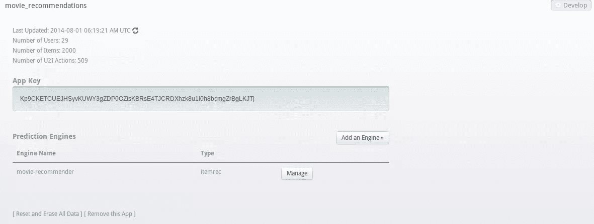
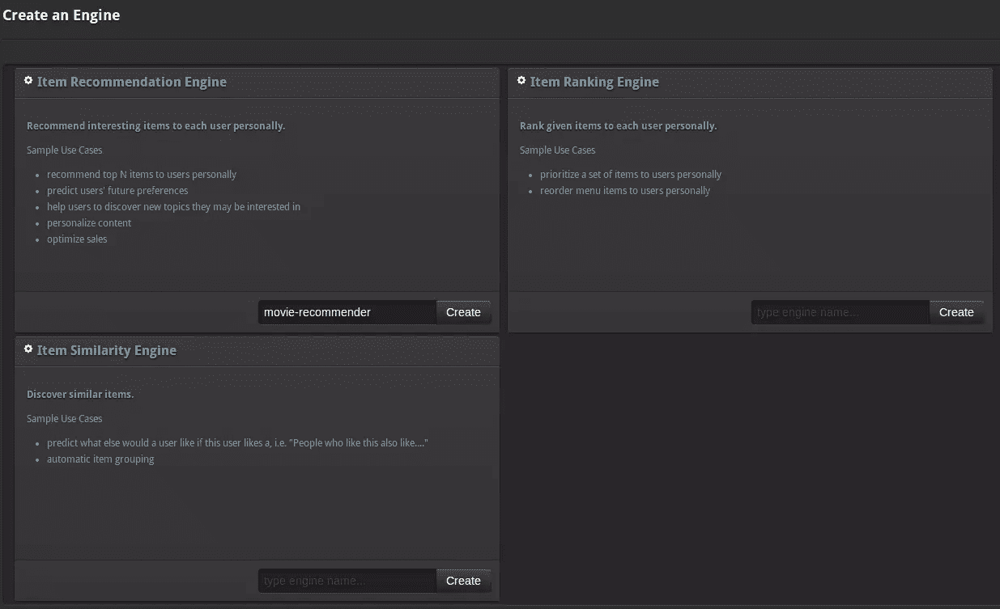
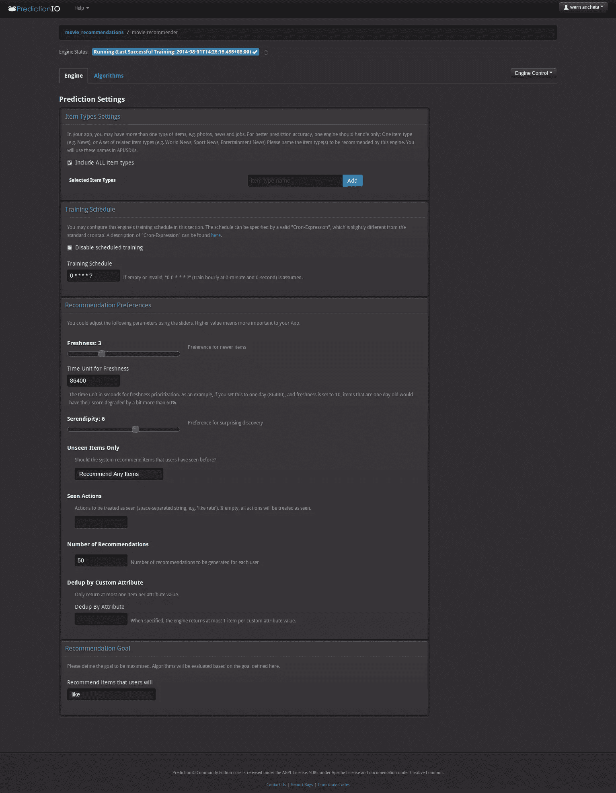
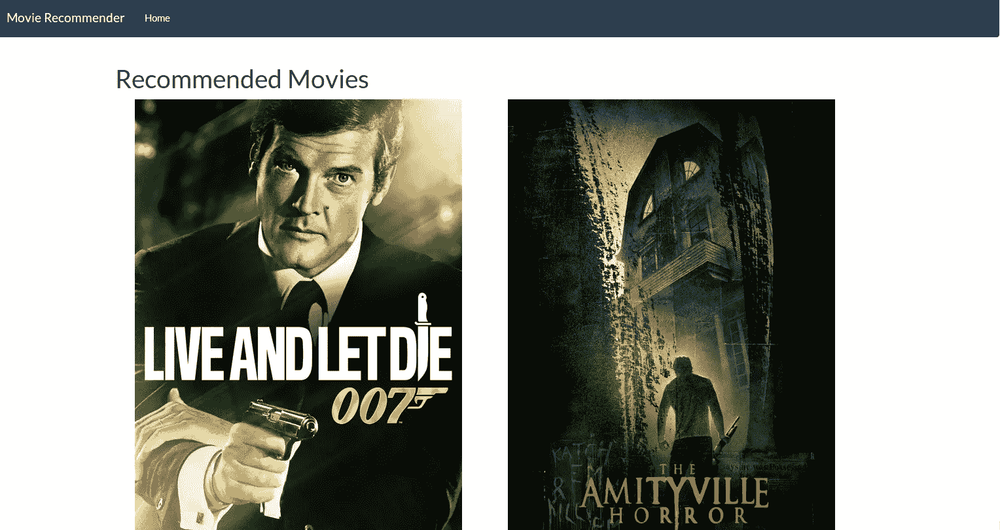

# 使用 prediction . io-Setup 创建电影推荐应用程序

> 原文：<https://www.sitepoint.com/create-movie-recommendation-app-prediction-io-setup/>

在本教程中，我将带您了解一个开源机器学习服务器[预测 IO](http://prediction.io/) 。它允许您创建具有以下功能的应用程序:

*   推荐项目(如电影、产品、食物)
*   预测用户行为
*   确定项目相似性
*   排列项目

使用 Prediction IO，您几乎可以轻松构建任何机器学习应用程序。你不必处理数字和算法，你可以专注于开发应用程序本身。

### 装置

本教程假设您的基本操作系统是 Linux。如果不是这样，请考虑使用 [Homestead Improved](https://www.sitepoint.com/quick-tip-get-homestead-vagrant-vm-running/) 作为一个标准化且易于使用的流浪者盒子，让你在五分钟内启动并运行 MySQL、PHP 5.6 和 Nginx。

你需要做的第一件事是安装预测 IO。你可以从他们的[下载页面](http://prediction.io/download)下载预测 IO。下载完成后，您可以将其解压缩到您喜欢的安装路径。预测 IO 现已安装，但需要先安装以下依赖项，然后才能使用它:

*   Java(版本 6 以上)
*   MongoDB

您可以通过提供的安装脚本安装这些必备组件。导航到预测 IO 安装路径的根目录，并执行以下命令:

```
bin/setup-vendors.sh
```

这将为您安装所有的依赖项。

### 运行预测 IO

安装完所有依赖项后，您可以通过导航到安装路径的根目录并从终端执行以下命令来运行预测 IO:

```
bin/start-all.sh
```

一旦所有服务都在运行，您就可以从端口`9000`访问预测 IO web 界面，例如`http://localhost:9000`。

当你在浏览器中打开它时，你会看到一个登录界面。预测 IO 中没有默认用户，所以您必须先创建一个。您可以通过从 prediction IO 安装的根目录执行`bin/users`来做到这一点。执行它会给你三个选择:

```
1  -  Add a new user 2  -  Update email of an existing user 3  -  Change password of an existing user
```

创建用户后，登录。要创建新的应用程序，只需点击“添加应用程序”按钮，它会要求您输入应用程序的名称。由于我们正在创建一个电影推荐应用程序，我们将把我们的应用程序命名为“movie_recommendations”。

完成后，点击“开发”按钮。在那里，您可以看到应用程序密钥，您可以使用它向预测 IO 服务器发出请求。App key 是典型的 API 令牌。



接下来，单击“添加引擎”按钮。在那里，您可以从三个可用的引擎中选择一个。由于我们正在创建一个电影推荐应用程序，请通过键入您要为引擎指定的名称来选择项目推荐引擎。让我们把它命名为“电影推荐”，然后点击“创建”。



一旦引擎被创建，预测会给你以下界面:



您可以在这里自定义电影推荐引擎的设置。让我们浏览一下可用的设置:

*   **项目类型设置**–您可以在这里添加和选择引擎推荐的项目类型。我们让它包含所有的项目类型。

*   **培训时间表**–这是您输入培训时间表的地方。这里使用术语“训练”,因为这是预测发挥其魔力的地方。它主要做的是将机器学习算法应用到目前为止收集的数据中。预测需要对其施展魔法的数据是你的网站中常见的用户行为。比如查看特定页面、喜欢、不喜欢或评价某样东西。

#### 时间单位

预测使用的默认训练计划是`0 0 * * * ?`。这意味着培训每小时进行一次。让我们把它分解一下，这样才有意义:

*   0-秒
*   0 分钟

*   ？–星期几

这就是所谓的[克隆表达式](http://quartz-scheduler.org/api/2.1.7/org/quartz/CronExpression.html)。上面任何一项的值为`0`意味着它将只在更大时间单位的第一个实例上执行。所以用分钟和秒表示一个`0`值，然后用小时表示`*`,这意味着每小时只执行一次。一个月中的某一天的值也是`*`，这意味着它在一个月中的每一天执行。每月有一个`*`值意味着每月执行一次。最后，星期几的`?`值意味着它没有特定的值。星期几不是可选字段，但是如果我们不希望它有任何值，那么唯一的选择就是输入`?`。这意味着培训计划将取决于指定的其他值。把所有的事情放在一起，训练每天都在每小时的第一分钟和第一秒进行。对于该引擎，我们将训练计划设置为每分钟执行一次:

```
0  *  *  *  *  ?
```

回到预测 IO 为我们提供的选项:

*   **推荐偏好**–这允许您对特定的推荐设置进行优先级排序。以下是可用的设置:

    *   **新鲜度**–这优先考虑新添加的项目。将其值设置为 3。
    *   **意外收获**——这优先考虑令人惊讶的发现。将其值设置为 7。
    *   **仅推荐看不见的项目**–这可以是两个值之一:推荐所有项目，仅推荐看不见的项目。通常情况下，您会希望将此设置为“仅推荐看不见的”，然后为“看见的操作”字段设置值。但对于这个应用程序，我们将选择“推荐任何商品”。
    *   **已看到的动作**–可以被用户视为“已看到”的动作。如果您在“仅隐藏项目”字段中选择了“推荐任何项目”，则无需填写此字段。该字段的值可以是下列值之一:喜欢、不喜欢、评价、查看、转换。你可以在[预测 io 数据收集页面](http://docs.prediction.io/current/concepts/data.html)中了解更多关于这些内置动作的信息。
    *   **推荐数量**–您希望为每个用户生成的推荐数量。
    *   **通过自定义属性**进行重复数据删除–可用于指定用于建议的字段。
*   **推荐目标**–可用于确定特定用户操作的优先级，作为推荐目标。对于这个应用程序，我们将使用`like`。

### 电影数据库应用编程接口

由于我们正在建立一个电影推荐应用程序，我们需要有一个像样的电影列表，我们可以用于我们的应用程序。为此，我们将使用[电影数据库 API](http://www.themoviedb.org/documentation/api) 。

为了访问他们的 API，你首先要注册他们的网站。注册完成后，登录您的帐户。在您的帐户页面上，只需点击“API”链接。然后会提示您输入个人信息以及使用类型。完成后，您将收到一封电子邮件，其中包含您可以用来执行请求的 API 密钥。

### 构建应用程序

在我们开始实际构建应用程序之前，我将为您提供一个概述。
应用程序应该尽可能简单，所以我们将只实现绝对必要的功能:

*   **学习阶段**–这是应用程序将从数据库中随机挑选一部特定电影并展示给用户的阶段。然后，我们将要求用户输入他是否喜欢或不喜欢这部电影。

*   **推荐阶段**–这是应用程序根据用户在学习阶段的输入实际推荐电影的部分。

如果你是一个视觉型的人，下面是学习阶段的样子:


这是推荐阶段:



我们不会实现登录系统。这意味着每次访问应用程序时，用户都被视为新用户。

#### 安装依赖项

现在我们已经准备好构建应用程序了。将以下依赖项添加到您的`composer.json`文件中:

```
{
  "require": {
     "damel/flight-skeleton": "dev-master",
     "predictionio/predictionio": "~0.6.0",
     "guzzlehttp/guzzle": "4.*"
  }
}
```

我们将使用 [Flight 骨架](https://github.com/daniel-melzer/flight-skeleton)，这是 Flight PHP 项目的一个很好的起点，因为它为 Flight 提供了一个 MVC 结构。Flight Skeleton 将 Flight PHP 框架作为其依赖项，因此我们不必在我们的`composer.json`文件中指定它。

我们需要安装的另一个东西是 PHP SDK 的[预测。这使我们能够轻松地与预测 IO 服务器进行对话。](https://github.com/PredictionIO/PredictionIO-PHP-SDK)

我们需要安装的最后一个东西是 [Guzzle](https://github.com/guzzle/guzzle) 。这使我们能够轻松地执行 HTTP 请求，因为我们将与 API 对话来获取一些电影数据。想了解更多关于 Guzzle 的信息，请看我们之前的帖子[这里](https://www.sitepoint.com/blog/)。

一旦将依赖项添加到`composer.json`文件中，打开终端并执行`composer install`来安装它们。

一旦安装了所有的依赖项，向您的`composer.json`文件添加一个`autoload`指令。然后在其中声明一个类别映射。这包含您希望 composer 自动加载的目录数组。在这种情况下，我们只想自动加载`controllers`目录，这样我们所有的控制器都会自动加载:

```
"autoload": {
  "classmap": [
    "controllers"
  ]
}
```

之后，在您的终端上执行以下命令，让 composer 为您完成自动加载工作:

```
composer dump-autoload
```

接下来，在项目目录的根目录下创建一个`.htaccess`文件，并添加以下内容:

```
RewriteEngine On
RewriteCond %{REQUEST_FILENAME} !-f
RewriteCond %{REQUEST_FILENAME} !-d
RewriteRule ^(.*)$ index.php [QSA,L]
```

这为我们重写了 URL，因此我们不必在每次需要访问特定路线时输入`index.php`。如果你正在使用 Nginx，请看这里的。

一旦完成，我们就可以开始编写应用程序了。您需要做的第一件事是在项目目录的根目录下创建一个`index.php`文件。这将作为应用程序的主文件。在这里，我们将绘制我们需要在整个应用程序中使用的方法、路线以及应用程序的整体初始化。

### 结论

在本系列的这一部分中，我们已经了解了预测 IO 的基础知识，如何设置它以及它的依赖关系。我们还研究了如何调整它的一些设置，以产生更相关的推荐。请继续关注下一部分，我们将真正开始构建电影推荐应用程序。

## 分享这篇文章