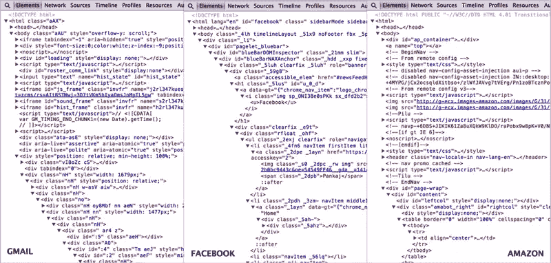
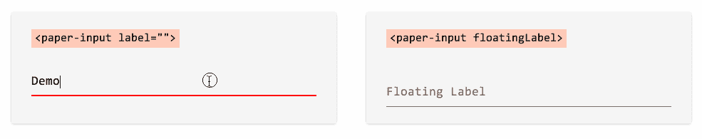
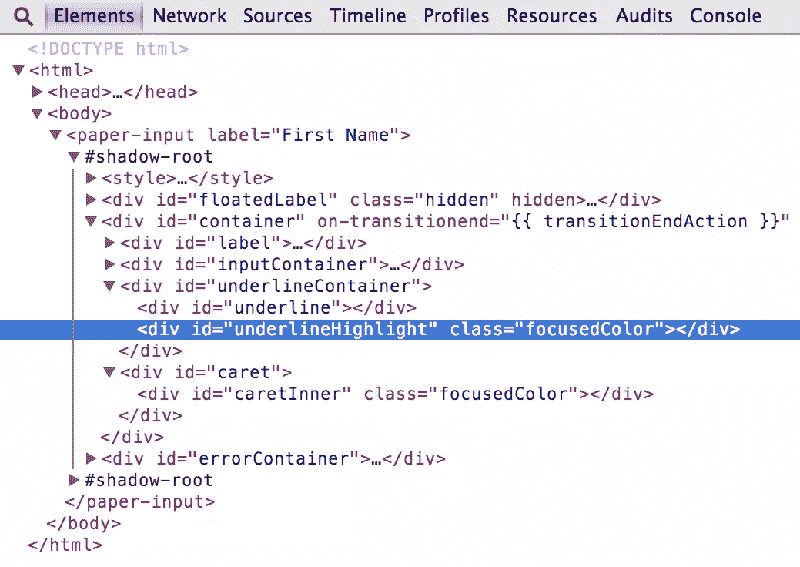
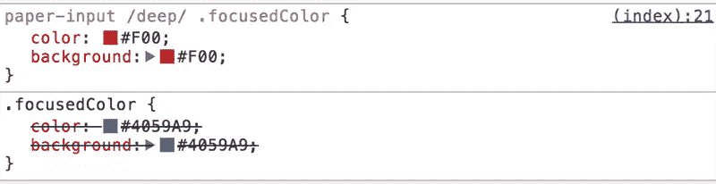
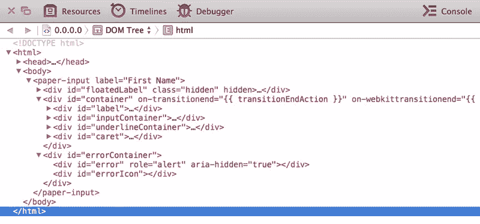
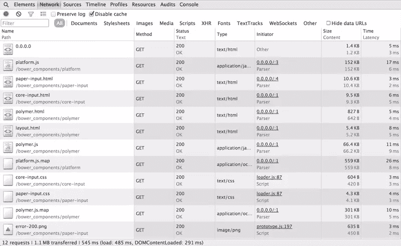

# Web 组件和聚合物介绍(教程)

> 原文：<https://www.sitepoint.com/introduction-to-web-components-and-polymer-tutorial/>

现代 web 应用程序不仅设计复杂，而且开发起来相当困难。考虑到所涉及的工具范围、所需的测试数量以及所使用的库/框架的组合，开发过程变得更加困难。随着应用程序在一段时间内的扩展，维护代码和进行增强变得更加困难。

例如，看看这几个流行网站的前端代码:



开发人员工具可能不一定表明实际源代码的复杂性，但这肯定会让您深入了解现代 web 应用程序的复杂 DOM 结构。这很大程度上是由于在您的标记中不加选择地使用了`div(s)`和`span(s)`,导致了一个无法管理的代码。关于 HTML5 标签的语义价值已经讨论了很多，但是它们仍然不能提供有意义的标记，主要是因为两个原因:

1.  在我们的网页中，有太多相似的组件属于相同的语义结构。为了区分它们，我们使用类、id 或其他属性。
2.  可用的语义标签列表根本不足以针对构成我们设计的各种各样的组件。因此，我们退回到传统的标签，如`div`或`span`。

## 语义疯狂的解决方案

W3C 旨在通过引入 Web 组件来解决这个问题。Web 组件是规范的集合，使开发人员能够将他们的 web 应用程序创建为一组可重用的组件。Web 组件从根本上改变了我们构建和构思 web 应用程序的方式，从而提供了一种不同于传统 web 设计方法的范式转变。

每个组件都存在于其自定义的封装单元中，具有相应的风格和行为逻辑。这些组件不仅可以在单个 web 应用程序之间共享，还可以分布在 web 上供其他人使用。

Web 组件由四种不同的规范组成:

1.  定制元素(Custom Elements)–这些元素使开发人员能够创建他们自己的元素，这些元素与他们的设计相关，作为 DOM 结构的一部分，能够像任何其他 HTML 标签一样对它们进行样式化/脚本化。
2.  HTML 模板(HTML Templates)——这些模板允许您定义标记片段，这些标记片段能够在网页之间保持一致，并能够使用 JavaScript 注入动态内容。
3.  [Shadow DOM](http://w3c.github.io/webcomponents/spec/shadow/)–这是为了通过定义隐藏在影子根后面的 DOM 树和子树之间的功能边界，从标记中抽象出所有的复杂性。
4.  [HTML 导入](http://w3c.github.io/webcomponents/spec/imports/)–类似于将一个 CSS 文件导入到另一个文件中，这允许您在其他 HTML 文件中包含和重用 HTML 文件。

## 什么是聚合物？

上面介绍的规范相当新，知道[浏览器支持不是很好](http://caniuse.com/#search=web%20components)也就不足为奇了。但是，多亏了谷歌令人敬畏的人们创建的[聚合物](http://www.polymer-project.org/)库，我们今天可以在现代浏览器中使用所有这些功能。Polymer 提供了一组 polyfills，使我们能够在不兼容的浏览器中使用具有易用框架的 web 组件。聚合物通过以下方式做到这一点:

1.  允许我们用用户定义的命名方案创建定制元素。然后，这些定制元素可以在网络上分发，并由其他人通过 **HTML 导入**来使用。
2.  允许每个定制元素拥有自己的模板，并附带使用该元素所需的样式和行为。
3.  提供一套现成的 UI 和非 UI 元素，以便在项目中使用和扩展。

*注意: [X-Tag](http://x-tags.org/) 是 Mozilla 的一个类似项目，它为所有现代浏览器带来了定制元素的承诺。*

这篇文章主要关注使用可视化元素，这些元素是聚合物库的一部分。elements 集合分为两个部分:

1.  **核心元素**–这些是一组视觉和非视觉元素，设计用于布局、用户交互、选择和搭建应用程序。
2.  **纸元素**——实现了谷歌最近在 [Google I/O 2014](https://www.google.com/events/io) 上推出的[材料设计理念](http://www.google.com/design/)，其中包括从简单的按钮到具有简洁视觉效果的对话框的一切。

## 安装聚合物

安装聚合物(v0.3.4)的推荐方式是通过 Bower。Bower 是一个包管理器，它管理你的项目的依赖关系。如果你不熟悉 Bower，那么我推荐你[阅读其网站上的说明](http://bower.io/#install-bower)，学习如何安装和开始使用它。

假设您有一个带有`bower.json`文件的项目文件夹设置，您可以通过命令行运行以下命令来安装最新版本的 Polymer:

```
bower install --save Polymer/polymer
```

这将在`bower-components`文件夹中安装聚合物库和平台聚合填充。

```
bower_components/
├── core-component-page
├── platform
└── polymer
```

*注意:`--save`将把这个包作为一个依赖项添加到`bower.json`文件中。当您想要更新项目中使用的包时，这很有用。*

由于安装了 Polymer，您可以从在项目文件夹的根目录下创建`index.html`文件开始。
。
index.html├──鲍尔 _components/
├──鲍尔. json
└──

将`platform.js` polyfill 添加到文档的`<head>`中，然后就可以在文档中使用预定义的自定义元素了。

```
<script src="bower_components/platform/platform.js"></script>
```

## 使用自定义元素

在标记中使用自定义元素通常包括以下步骤:

1.  通过 Bower 下载定制元素包。
2.  在文档中导入相应的`.html`文件。
3.  在文档中的任意位置使用自定义元素标记。

在这个例子中，我们将尝试使用定制元素`paper-input`并在我们的 HTML 页面中使用它。你可以直接从 Bower 安装`paper-input`，它会自动下载其他需要的依赖项。

```
bower install --save Polymer/paper-input
```

在页面中使用任何定制元素之前，您需要导入相应的`.html`文件:

```
<link href="bower_components/paper-input/paper-input.html" rel="import">
```

现在您可以在`<body>`标签中的任何地方使用`paper-input`元素:

```
<paper-input></paper-input>
```

伴随这个定制元素的大量属性可能有相当多的变化。[组件页面](http://www.polymer-project.org/docs/elements/paper-elements.html#paper-input)有可以和`paper-input`一起使用的属性的完整列表。在[聚合物设计工具](http://www.polymer-project.org/tools/designer/)的帮助下，我创建了一个[演示页面](http://www.polymer-project.org/tools/designer/preview.html#77629c30e48bd0f7dcd4)，提供了各种属性的使用示例。



我特别喜欢的一个是浮动标签技术，它已经变得非常流行，许多人[写了](http://css-tricks.com/float-labels-css/)关于它的文章。所有这些技术都很棒，但是没有一个比仅仅向标签添加属性更简单的了:

```
<paper-input floatingLabel label="Floating Label"></paper-input>
```

## 样式自定义元素

自定义元素是一级 HTML 元素，这意味着它们可以像任何其他 HTML 元素一样，通过 CSS 设置样式，通过 JavaScript 编写脚本。

例如，为了样式化我们的`paper-input`定制元素，我们可以使用标签名称作为选择器来样式化所有的`paper-input`元素:

```
paper-input { 
    width: 400px;
    height: 15px;
}
```

或者用相同的类设计一堆:

```
.first-name {
    width: 400px;
    height: 15px;
}
```

或者将 ID 为的特定`paper-input`元素作为目标:

```
$('#first-name').addClass('show');
```

有些情况下，您可能想要覆盖自定义元素的默认样式，而这些样式可能不一定会受到上述选择器的影响。这是因为组成自定义元素的标记位于影子 DOM 之下，不受直接应用于自定义元素的样式的影响。

幸运的是，Polymer 提供了`::shadow`伪元素和`/deep/`组合子来穿透阴影 DOM 的边界，并允许我们在自定义元素之外的不同阴影树下对元素进行样式化。

例如，假设您想要将我们的`paper-input`的默认蓝色方案覆盖为绿色。



查看 Shadow DOM 下定制元素的标记，您可以发现需要改变`.focusedColor`的样式来改变配色方案。

因此，`paper-input::shadow`将匹配`paper-input`元素中的`#shadow-root`。从那里，您可以编写一个普通的后代选择器来定位单个元素:

```
paper-input::shadow .focusedColor {
    color: white;
    background: red;
}
```

类似地，`/deep/`组合子可以完全忽略所有的阴影边界，让您穿过任意数量的阴影树以到达目标元素:

```
paper-input /deep/ .focusedColor { 
    color: white;
    background: red;
}
```

*注意:在本例中，`::shadow`和`/deep/`的工作方式相同。当您想要定位位于同心阴影边界下的自定义元素的后代元素时，`/deep/`将变得非常有用。*

组合使用`::shadow`和`/deep/`选择器可以让你设计组件中的元素。但同时，从外部设计自定义元素的样式确实会添加先前为自定义元素创作的已取消的被覆盖样式的层。



## 浏览器兼容性

Polymer 旨在支持最新版本的 [evergreen 浏览器](http://tomdale.net/2013/05/evergreen-browsers/)(意思是自动更新的浏览器)。实际上，`paper-input`定制元素在所有主流浏览器的最新版本中都应该是一样的。

不过这有一个警告，因为我们用来覆盖`paper-input`元素默认配色方案的特定样式在 Safari 中并不像预期的那样工作。如果你不知道，苹果已经从 Safari 中移除了影子 DOM[，这意味着`::shadow`和`/deep/`代表 Safari 的无效选择器，这迫使 CSS 解析器完全忽略用这些选择器定义的规则集。](http://trac.webkit.org/changeset/164131)



目前，最新版本的 Safari (v7.0.4)将 Shadow DOM 内部的元素暴露在外部，这意味着我们可以使用标准的 CSS 后代选择器来实现相同的效果。

```
paper-input .focusedColor { 
    color: white;
    background: red;
}
```

*注意:不要将其他浏览器的带有选择器的规则集与这个结合，否则 Safari 会忽略整个规则集[。](http://stackoverflow.com/questions/13816764/invalid-css-selector-causes-rule-to-be-dropped-what-is-the-rationale)*

## HTTP 请求太多？

很难想象使用像`paper-input`这样简单的元素会导致如此多的 HTTP 请求！



这可以归因于聚合物的模块化性质，其中每个组件由几个其他功能单元组成，每个单元具有独立运行的能力。

在大型 web 应用程序中使用这些自定义元素可能会大大降低网站的网络性能。为了解决这个问题，聚合物团队建造了[硫化](https://github.com/Polymer/vulcanize)。硫化内联所有的 HTML 导入，消除它们的依赖性，并产生一个生成更少网络请求的输出。

Addy Osmani 在 Polymer 博客上写了一篇关于硫化的深度文章，描述了使用硫化连接和内联资产的过程。

重要的是不要忘记 Polymer 仍然在开发者预览版中，并且社区还在继续开发(你也可以[贡献](https://github.com/Polymer/tools/blob/master/CONTRIBUTING.md)！).

也就是说，这不应该阻止我们用聚合物和 web 组件的强大功能来构建今天的 web 应用程序。

## 分享这篇文章