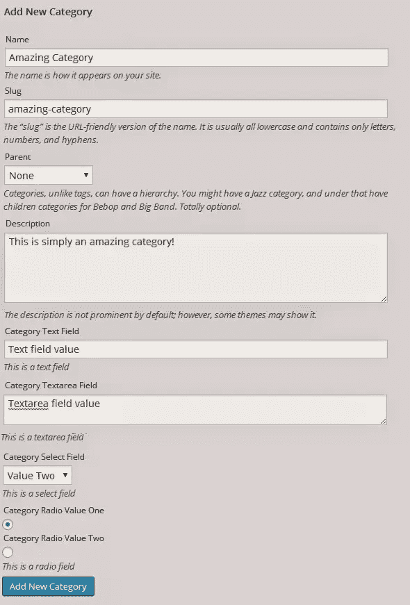
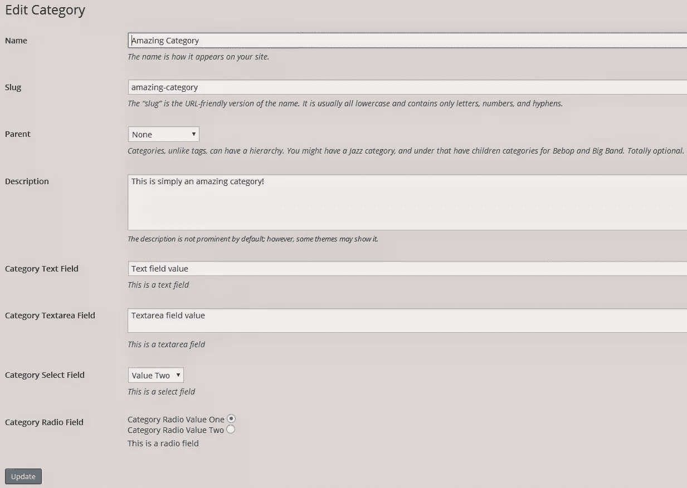

# 扩展 WordPress 分类法

> 原文：<https://www.sitepoint.com/extending-wordpress-taxonomies/>

## 什么是 WordPress 分类法/自定义分类法？

分类法本质上是一种将信息集合组织在一起的方法。

正如我在[上一篇关于自定义 WordPress 分类法](https://www.sitepoint.com/custom-wordpress-taxonomies/)的文章中所提到的，WordPress 使用其内置分类法`categories`和`tags`来为你的内容类型提供分组，并且默认情况下将它们应用于`posts`内容类型。这些分类法由一个或多个`terms`组成，它们基本上是用来将您的项目分组在一起的名称。

虽然标准分类法可能很好，但有时您可能需要额外的方法来将内容分组在一起，这符合您的需求。这就是定制分类法非常有用的地方。

自定义分类法允许你创建自己的名字和结构来组织你的文章。您可以创建一个名为`grade_ranking`的新分类，它将根据等级分数对您的帖子进行排序，例如`pass`、`credit`、`distinction`和`high distinction`。

## 分类标准信息

当你定义分类法时，你决定它是`hierarchical`还是`non-hierarchial`。这决定了将收集哪些关于您的分类的信息。

`hierarchical`分类法的作用类似于`categories`，允许不同级别的术语(您可以为术语指定父项和子项)。
`Non-hierarchical`分类法的作用类似于`tags`，其中所有术语都是相同的平面级别。

您的自定义分类法将允许您为每个术语输入以下信息

*   名字
    *   定义术语本身的名称，显示给最终用户。适用于类别和标签
*   鼻涕虫
    *   确定用于术语的 url(通常小写，空格用破折号替换)。适用于类别和术语
*   父母
    *   让您决定您的术语是顶级父术语还是子术语。仅适用于分层分类法，如类别
*   描述
    *   这个术语的简短描述。这显示在术语列表页面上(当您点击查看术语本身时)

这就是 WordPress 将为你提供的关于你的条款的全部内容。

## 扩展分类法

虽然默认信息可能是您分类所需的全部信息，但您可能希望保存其他信息，以便在网站的其他地方使用。

WordPress 提供了一系列的`hooks`,可以用来修改你的分类屏幕的管理区域，并在保存额外信息的过程中帮助你。

在我们的教程中，我们将扩展默认的`category`分类法。您可以轻松地扩展内置分类法或您自己创建的分类法，但是为了简单起见，我们将修改现有的分类法。

### 我们从哪里开始？

WordPress 将为你提供两种主要的方法来创建你的分类法的术语:

*   通过分类管理屏幕创建它们
*   动态编辑您的分类所绑定的文章类型。

例如，您可以在类别管理菜单中(通过定义名称、slug、父描述等)或通过直接在您的帖子或页面中(通过使用类别元框并动态添加新类别)为您的类别分类创建术语，如`featured`和`sponsored`。

由于我们希望保存关于术语的附加信息，我们将使用分类管理屏幕，因为它们提供了添加、编辑和删除术语的最佳方式。

### 需要修改什么？

当您使用分类法时，您将同时与`add`和`edit`管理屏幕进行交互。这些屏幕分别处理添加新术语和编辑现有术语的过程。WordPress 提供了一系列的`hooks`,帮助你连接到特定的功能，并为你提供一个简单的方法来修改核心功能。

由于我们将保存额外的信息，我们将需要修改两个屏幕，以便我们可以附加、收集和交互我们保存的信息。

在本教程中，我们将添加额外的表单元素，以便我们可以收集更多关于我们的类别的信息。为此，我们将获取以下要素:

*   文本
*   文本区域
*   挑选
*   检验盒

这些是最常见的表单元素，应该有助于您更好地理解如何扩展分类法来保存附加信息。

### 修改添加类别管理菜单

我们需要修改的第一个地方是添加类别管理菜单。这个菜单通常是你添加所有类别的地方，也是我们需要保存额外信息的地方。

我们需要使用`category_add_form_fields`钩子。

`category_add_form_fields`挂钩用于向类别管理屏幕添加附加信息。这个钩子接受一个参数，这个参数是分类法本身的名称。这个钩子允许我们向 add category 屏幕添加额外的信息，所以首先我们需要定义一个函数来显示一些字段供我们保存。**下面的代码应该放在你的主题的 functions.php 文件中(或者另一个你用来自定义代码的文件)**

```
function add_extra_fields_to_category($taxonomy_name){
    ?>
    <div class="form-field">
        <label for="category-text">Category Text Field</label>
        <input type="text" name="category-text" id="category-text"/>
        <p>This is a text field </p>
    </div>
    <div class="form-field">
        <label for="category-textarea">Category Textarea Field</label>
        <textarea name="category-textarea" id="category-textarea"></textarea>
        <p>This is a textarea field </p>
    </div>
    <div class="form-field">
        <label for="category-select">Category Select Field</label>
        <select name="category-select" id="category-select">
            <option value="select-value-one"> Value One </option>
            <option value="select-value-two"> Value Two </option>
        </select>
        <p>This is a select field </p>
    </div>
    <div>
        <label for="category-radio-value-one">Category Radio Value One</label>
        <input type="radio" name="category-radio" id="category-radio-value-one" value="category-radio-value-one"/>
        <label for="category-radio-value-two">Category Radio Value Two</label>
        <input type="radio" name="category-radio" id="category-radio-value-two" value="category-radio-value-two"/>
        <p>This is a radio field </p>
    </div>
    <?php
}
```

现在我们已经定义了我们的函数，我们需要做的就是将它连接到我们的`category_add_form_fields`钩子，一旦添加类别屏幕显示出来，它就会激活。我们将通过调用`add_action()`函数来实现这一点。

`add_action('category_add_form_fields','add_extra_fields_to_category');`

一旦你完成了这个，你的类别管理屏幕应该显示你在你的函数中定义的附加字段。我的如下所示:



顺便提一下，当定义要添加到屏幕中的字段时，通常会将它们包装在一个`form-field`类中，这样可以确保所包含的输入元素覆盖整个屏幕。正如你在我们的例子中看到的，我已经启用了这个类，除了单选按钮。我们不希望我们的单选按钮横跨整个宽度(因为它看起来很奇怪)。

此外，如果您添加了类`form-required`，它将确保在添加新术语之前输入您的元素。

### 保存我们的新类别信息

既然我们已经修改了添加类别屏幕，我们需要保存我们的附加信息，以便我们可以使用它。

我们需要给另一个钩子附加一个函数来触发我们的保存操作，这个钩子叫做`create_category`。我们创建的这个函数将处理术语信息的保存。

当收集将直接用于更新 WordPress 数据库的信息时，净化值总是一个好的实践。我们可以使用' sanitize_text_field($string)'来净化一个字符串，去除所有标签，删除换行符、制表符并转换字符实体，例如

。

```
function save_extra_taxonomy_fields($term_id){

    //collect all term related data for this new taxonomy
    $term_item = get_term($term_id,'category');
    $term_slug = $term_item->slug;

//collect our custom fields
$term_category_text = sanitize_text_field($_POST['category-text']);
$term_category_textarea = sanitize_text_field($_POST['category-textarea']);
$term_category_select = sanitize_text_field($_POST['category-select']); 
$term_category_radio = sanitize_text_field($_POST['category-radio']);

 //save our custom fields as wp-options
update_option('term_category_text_' . $term_slug, $term_category_text); 
update_option('term_category_textarea_' . $term_slug, $term_category_textarea);
update_option('term_category_select_' . $term_slug, $term_category_select);
update_option('term_category_radio_' . $term_slug, $term_category_radio);

}
```

*`sanitize_text_field`将完美地为这些值工作。但是，处理不同数据类型的附加函数可以在这里看到:【http://codex.wordpress.org/Data_Validation】[。感谢 Ryan Hellyer 的建议和评论。](http://codex.wordpress.org/Data_Validation)*

这个函数接受一个参数，即正在保存的新术语的 ID。

有了这个 ID，我们就可以调用`get_term($term_id,$taxonomy_name)`函数。

这个函数接受两个参数，术语本身的 ID 和分类法名称。因为我们知道术语本身的 ID，并且我们正在使用`category`分类法，所以我们现在将能够访问术语对象。

我们从 term 对象中收集`slug`值并保存它。然后，我们从$_POST 对象中收集所有四个新字段值。最后我们调用了另一个名为`update_option($option_name,$option_value)`的函数。

这个函数允许我们在 WordPress 选项表中创建一个新的条目，这样我们就可以保存我们的值。这个函数需要的只是新选项的名称和它的值。我们调用这个函数四次，每次调用一个我们正在保存的新字段。

例如，如果我们正在创建一个名为`test`的新类别，当我们保存我们的文本区域字段时，选项名称将变成`term_category_textarea_test`，我们的选择字段选项将变成`text_category_select_test`等等。我们将`slug`添加到这些字段名称的末尾，以确保没有两个值是相同的(因为所有的 slugs 都是唯一的)。

现在我们所要做的就是将这个函数挂接到`create_category`钩子上，这样我们就完成了排序

```
add_action('create_category','save_extra_taxonomy_fields');
```

### 修改编辑类别管理菜单

现在，我们已经在 add category 屏幕上显示了新的字段元素，并将它们保存为选项，我们需要修改编辑屏幕，并在此处预填充新值(以便在需要时可以更新它们)。

我们需要连接到`category_edit_form_fields`钩子上来显示我们的附加字段。

`category_edit_form_fields`挂钩用于将附加字段输出到类别的编辑管理屏幕。这个钩子接受一个值，就是术语 object 本身。因为这个钩子可以访问术语 object 本身，所以收集它的信息非常简单。

我们需要创建一个函数，该函数将输出我们的附加字段，并用我们的信息预先填充它们。既然我们现在可以访问术语 object，这就很容易了。

```
function edit_extra_fields_for_category($term){

    //collect the term slug
    $term_slug = $term->slug;

    //collect our saved term field information
    $term_category_text = get_option('term_category_text_' . $term_slug); 
    $term_category_textarea = get_option('term_category_textarea_' . $term_slug); 
    $term_category_select = get_option('term_category_select_' . $term_slug); 
    $term_category_radio = get_option('term_category_radio_' . $term_slug); 

    //output our additional fields?>
    <tr class="form-field">
        <th valign="top" scope="row">
            <label for="category-text"> Category Text Field </label>
        </th>
        <td>
            <input type="text" name="category-text" id="category-text" value="<?php echo $term_category_text; ?>"/>
            <p class="description">This is a text field </p>
        </td>
    </tr>
    <tr class="form-field">
        <th valign="top" scope="row">
            <label for="category-textarea"> Category Textarea Field </label>
        </th>
        <td>
            <textarea name="category-textarea" id="category-textarea"><?php echo $term_category_textarea; ?></textarea>
            <p class="description">This is a textarea field </p>
        </td>
    </tr>
    <tr class="form-field">
        <th valign="top" scope="row">
            <label for="category-select"> Category Select Field </label>
        </th>
        <td>
            <select name="category-select" id="category-select" value="<?php echo $term_category_select; ?>">
                <option value="select-value-one" <?php if($term_category_select=='select-value-one'){ echo 'selected';}?>> Value One </option>
                <option value="select-value-two" <?php if($term_category_select=='select-value-two'){ echo 'selected';}?>> Value Two </option>
            </select>
            <p class="description">This is a select field </p>
        </td>
    </tr>
    <tr>
        <th valign="top" scope="row">
            <label> Category Radio Field </label>
        </th>
        <td>
            <label for="category-radio-value-one">Category Radio Value One</label>
            <input type="radio" name="category-radio" id="category-radio-value-one" value="category-radio-value-one" <?php if($term_category_radio=='category-radio-value-one'){ echo 'checked'; }?> />
            <br/>
            <label for="category-radio-value-two">Category Radio Value Two</label>
            <input type="radio" name="category-radio" id="category-radio-value-two" value="category-radio-value-two" <?php if($term_category_radio=='category-radio-value-two'){ echo 'checked'; }?>/>
            <p>This is a radio field </p>
        </td>
    </tr>

    <?php
}
```

该函数使用其传入的`term`对象来访问术语本身的`slug`。使用这个 slug，它使用`get_option($option_name)`函数搜索我们保存的四个定制字段值。

该函数搜索具有指定名称的选项并赋值。在我们的例子中，我们寻找四个字段值，并将它们赋给变量。

这个函数的最大部分是输出我们的 HTML 表单元素，它们是作为表格元素添加的。对于我们的每个字段，我们显示标签和适用的文本、文本区域、选择或单选元素。

对于我们处理的每种类型，我们预填充自定义字段的方式是不同的。这是我们要做的

*   文本字段——对于文本字段，我们将其值直接分配给它的`value`属性，这将预先填充字段本身

*   Textarea field——对于 textarea 字段，我们直接在`<textarea>`和`</textarea>`标签之间回显它的值，这将它的值直接输出到 textarea 元素中。

*   选择字段–对于选择字段，我们首先创建选择元素及其所有相关选项。我们为名为`value`的 select 元素添加了一个属性，并用我们保存的值填充它(这与我们处理文本字段的方式非常相似)。即使我们将值输出到选择列表中，我们仍然需要确定最初选择哪个选项。我们现在要做的是，对于 select 元素中的每个选项，我们确定它的值是否与我们收集的值相同，如果是，则它被选中。我们使用一个基本的`IF`语句，如果它们匹配，我们将`selected`属性回显到选项上，这将使浏览器默认选择这个选项。

*   单选字段——对于单选字段，我们将它们直接输出到页面上，并确定它们的值是否与保存的值匹配，如果匹配，我们使用一个基本的`IF`语句将`checked`属性输出到它上面，该属性使浏览器默认选择该值(在许多方面，这类似于选择元素，因为我们需要告诉浏览器显示哪个选项)

确保这些值被正确预填充是至关重要的，如果你不选择它们，当用户更新他们的术语时，他们的数据可能不一致。

我们所要做的就是把我们的新函数连接到`category_edit_form_fields`钩子上，当我们点击`edit`屏幕输入我们的术语时，这个函数就会执行。

```
add_action('category_edit_form_fields','edit_extra_fields_for_category');
```

挂钩此函数后，您的类别编辑屏幕应该会更新，并显示您的附加字段和值。我的如下所示:



### 保存我们更新的类别信息

当我们更新类别信息时，我们需要一个函数来保存新的字段值。

谢天谢地，我们已经有了一个函数。之前我们创建了`save_extra_taxonomy_fields($term_id)`函数，当我们添加一个新的类别术语时会用到它。

当我们通过将类别附加到另一个钩子上来更新类别时，我们可以调用这个函数。我们将把我们的`save_extra_taxonomy_fields`函数添加到`edit_category`钩子上，当我们更新我们的类别时，这个函数将保存我们的信息。

```
add_action('edit_category','save_extra_taxonomy_fields');
```

## 扩展自定义分类法

定制分类法可以按照与内置分类法(类别和标签)完全相同的方式进行扩展。

您需要做的唯一修改就是修改所使用的钩子的名称。

对于类别，您可以使用以下挂钩:

*   `category_add_form_fields`–向您的类别新术语屏幕添加字段
*   `category_edit_form_fields`–向您的类别编辑术语屏幕添加字段
*   `create_category`–当您想要保存新的类别术语时使用
*   `edit_category`–当您想要保存更新的类别术语时使用

这些钩子将把你连接到你需要编辑的区域，允许你保存和检索你的附加信息。

对于自定义分类，它们非常相似，您将使用的挂钩是动态的，并且基于您的分类的名称，它们将是:

*   `$TAXONOMY_NAME_add_form_fields`
*   `$TAXONOMY_NAME_edit_form_fields`
*   `create_$TAXONOMY_NAME`，
*   `edit_$TAXONOMY_NAME`

例如，如果你注册了名为`members`的分类法，你的钩子将被命名为:

*   `members_add_form_fields`
*   `members_edit_form_fields`
*   `create_members`，
*   `edit_members`

您需要遵循基本模式，并将它们应用到您的自定义分类中，然后您将能够编辑这些屏幕，并根据需要保存您的信息。

## 把一切都包起来

既然你已经知道了如何为你的分类法/术语保存额外的信息，你可以扩展 WordPress 来做更多的事情。

你可以使用`get_term($term_name,$taxonomy_name)`访问你的个人术语，然后从那里你可以像我们一样使用你的 slug 来访问从 WordPress 选项表中提取的额外信息。

您可以编辑您的子主题文件和其他资源来利用这些新信息。如果你修改了这些分类法来吸收新的信息，我会从编辑你的 category.php 或 tag.php 文件开始。

现在，您可以使用分类法完成的复杂性几乎没有限制，因为您可以保存您喜欢的任何信息，并根据需要输出。

如果您对定制分类法的更多信息感兴趣，请查看 Justin Tadlock 的[“定制分类法复习”。](http://justintadlock.com/archives/2010/06/10/a-refresher-on-custom-taxonomies)

## 分享这篇文章