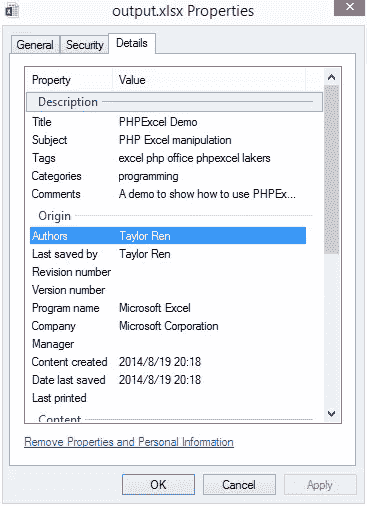
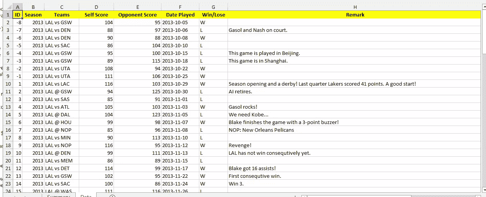
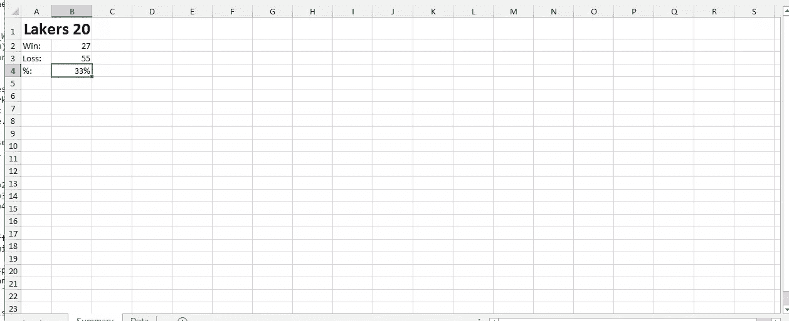
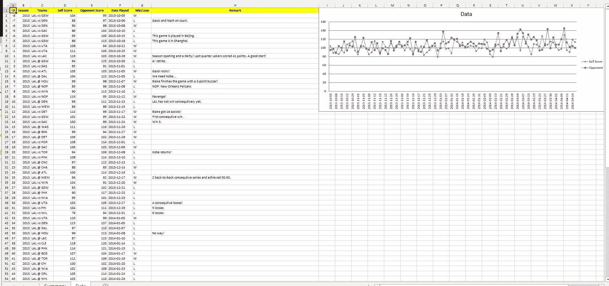
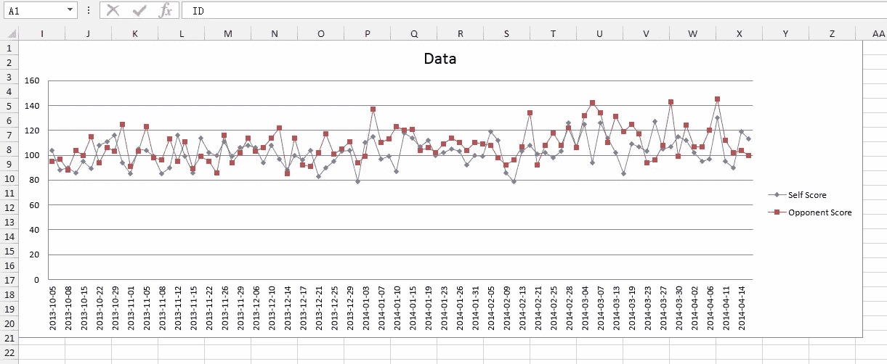

# 用 PHPExcel 生成 Excel 文件和图表

> 原文：<https://www.sitepoint.com/generate-excel-files-charts-phpexcel/>

在我的文章“[如何用 PHP](https://www.sitepoint.com/make-microsoft-word-documents-php/) 制作 Microsoft Word 文档”(在 Windows 下使用 Interop 功能)之后，有相当多的评论强烈要求纯 PHP 实现，即只使用一个通用的 PHP 库来操作 Office 文件。

在本文中，我们将了解如何使用 PHPExcel 库在 web 应用程序中提供“导出到 Excel”功能，以便用户可以将数据导出到 Excel 2007/2013 文件中进行进一步分析。

注意:有一些 PHP 库可以提供 Excel(和 Office)文件操作。我们这里使用的 lib 叫做 PHPExcel，是 PHPOffice 的一个子集，可以在这里克隆[。](https://github.com/PHPOffice)

## 目标

完成本教程后，我们将获得:

*   一张显示我最喜欢的 NBA 球队洛杉矶湖人队在 2013-14 赛季的比赛信息(比赛日期、球队、比分、输赢状态)的表格。
*   将数据导出到 Excel 2013 文件的按钮。
*   这个 Excel 文件将填充一些额外的分析数据和一个同样由 PHP 和 Excel 生成的图表。

让我们开始吧。

## 准备

要使用 PHPExcel，我们必须有 5.2.0 以上的 PHP 版本。还需要启用 3 个 PHP 扩展:`php_zip`(这是操作 Office 2007 格式所必需的)`php_xml`和`php_gd2`(可选，但对于精确的列宽自动计算是必需的)。

接下来，通过 Composer 安装库[。](https://packagist.org/packages/phpoffice/phpexcel)

当然，我们应该有我们的数据库启动和运行。本教程(`lakers.sql`)的数据转储已经上传到[与本文](https://github.com/taylorren/phpexcel)相关的 repo。用一个简单的 SQL 语句检索数据:“`select * from lakers`”(总共 90 条记录，包括 8 场季前赛和 82 场常规赛)。

此外，这个演示使用 Silex 作为 MVC 框架。Twig 将被用作模板引擎。确保在您的 [`composer.json`文件中正确指定了必要的依赖关系。](https://github.com/taylorren/phpexcel/blob/master/composer.json)

## 索引文件

`index.php`将是我们 Silex 应用程序的入口点。将定义两条路线:

```
$app->get('/', function () use ($app)
{
    $c=new trExcel\Excel();
    return $c->index($app);
});

$app->post('/export', function () use ($app)
{
    $c=new trExcel\Excel();
    return $c->export($app);
});
```

路线`'/'`将是我们的入口点，并显示数据和“导出”按钮。Route `'/export'`将执行实际导出到 Excel 的后端处理过程。这两个函数都包装在一个用户定义的类中(`classExcel.php`)。在本文的剩余部分，我们将关注这个文件——或者更准确地说，这个文件中定义的`export`函数和相关函数，并讨论使用 PHPExcel 库进行 Excel 操作的几个重要方面。

## Excel 应用程序及其元数据

当我们单击图标启动 Excel 时，Excel 应用程序启动。正常情况下，它还会包含一个包含 3 个(在 Excel 2013 中，只有 1 个)工作表的工作簿。工作表是我们玩的“画布”。这是 Excel 中最重要的两个术语。其他重要术语可能包括:小区、范围等。

为了实例化一个 Excel 文件，我们使用:

```
$ea = new \PHPExcel(); // ea is short for Excel Application
```

Excel 应用程序实例通常映射到物理 Excel 文件。它有自己的元数据来描述我们创建的文件。当我们“Alt-Enter”一个 Excel 文件时(或者右键单击该文件并选择“Properties”)，会显示元数据:



上面对话框中显示的属性会有相应的`setXXXX`方法来设置这些属性，其中`XXXX`与对话框中列出的属性名称几乎相同:

```
$ea->getProperties()
   ->setCreator('Taylor Ren')
   ->setTitle('PHPExcel Demo')
   ->setLastModifiedBy('Taylor Ren')
   ->setDescription('A demo to show how to use PHPExcel to manipulate an Excel file')
   ->setSubject('PHP Excel manipulation')
   ->setKeywords('excel php office phpexcel lakers')
   ->setCategory('programming')
   ;
```

这些方法(`setXXXX`)是不言自明的，并且很好地映射到“属性”对话框。在映射中有一些差异，但是对于我们来说建立联系并不太困难(例如，“Authors”将被映射到`setCreator`)。

## 工作表和单元格群体

工作表可能是我们最常操作的对象:用数据或公式填充单元格、应用样式、进行数据过滤、插入图表等。

为了获得对工作表的引用，我们使用:

```
$ews = $ea->getSheet(0);
$ews->setTitle('Data');
```

工作簿中的工作表总是以 0 为索引。所以第一张(也是到目前为止唯一的一张)将是零张。这个工作表的默认名称总是“工作表”,我们可以用`setTitle`方法更改它。

要填充一个或多个单元格，我们至少有两个选项:

1.  对于那些标题、题目和其他描述项，我们将使用`setCellValue`方法逐个填充它们。
2.  对于结构化数据，大部分来自 SQL `select`语句，我们将使用`fromArray`方法。

```
$ews->setCellValue('a1', 'ID'); // Sets cell 'a1' to value 'ID 
    $ews->setCellValue('b1', 'Season');
	...
    //Fill data 
    $ews->fromArray($data, ' ', 'A2');
```

`fromArray`方法有 3 个参数:
1。数组形式的数据源；
2。在数据为空的情况下的“填充”值；
3。开始填充的单元格引用(从左到右，然后从上到下)。

**注意:**当我们使用 PDO 获取数据时，一个简单的`$res = $q->fetchAll(\PDO::FETCH_ASSOC);`调用将强制返回的结果数据集只包含一个关联数组，而没有索引。如果在没有选项`PDO::FETCH_ASSOC`的情况下调用`fetchall`，结果集将实际包含两组相同的数据，一组以关联数组的形式，一组以索引的形式，并且当使用`fromArray`时将在 Excel 文件中创建副本。

我们可能还想设计标题行的样式( **ID** 、**季节**等)。为此，我们也有两种方法:

```
$header = 'a1:h1';
$ews->getStyle($header)->getFill()->setFillType(\PHPExcel_Style_Fill::FILL_SOLID)->getStartColor()->setARGB('00ffff00');
$style = array(
    'font' => array('bold' => true,),
    'alignment' => array('horizontal' => \PHPExcel_Style_Alignment::HORIZONTAL_CENTER,),
    );
$ews->getStyle($header)->applyFromArray($style);
```

一种方法是使用一些`get`方法来检索我们想要更改的样式对象，并对其进行更改。我们这样做是为了“背景填充”样式。

另一个是声明一个“style”数组，并指定我们想要更改的样式以及将它们更改为什么。然后，我们使用`applyFromArray`批量应用样式。这里我们改变了字体和对齐方式。

两种方法都支持 range 作为它们的参数(`$header='a1:h1';`)，非常方便。

最后，我们可能需要调整列宽，使其符合每列的最大显示长度:

```
for ($col = ord('a'); $col <= ord('h'); $col++)
{
    $ews->getColumnDimension(chr($col))->setAutoSize(true);
}
```

不幸的是，这不支持范围参数，所以我们使用一个`for`循环来实现这一点。

如果我们现在保存文件——我们将在稍后讨论保存——我们将看到 XLSX 文件中填充了数据并且格式正确:



## 添加另一个工作表并插入公式

我总是用一个单独的表来存储原始数据，并且至少再用一个表来显示汇总和/或分析信息。

要插入新工作表，我们需要:

```
$ews2 = new \PHPExcel_Worksheet($ea, 'Summary');
$ea->addSheet($ews2, 0);
$ews2->setTitle('Summary');
```

`addSheet`方法有两个参数。

*   `$ews2`:我们要插入的 Excel 工作表实例；
*   `$location`:该工作表的索引。所以 0 意味着它应该成为第一个。-1 表示应该是最后一个。

插入工作表后，我们可以像往常一样填充工作表中的单元格并应用样式。在本表中，我们将使用公式:

```
$ews2->setCellValue('b2', '=COUNTIF(Data!G2:G91, "W")-COUNTIF(Data!G2:G9, "W")');
$ews2->setCellValue('b3', '=COUNTIF(Data!G2:G91, "L")-COUNTIF(Data!G2:G9, "L")');
$ews2->setCellValue('b4', '=b2/(b2+b3)');
```

你看，和我们上一节做的没什么区别。公式字符串就像我们将输入到 Excel 文件中以执行必要计算的字符串一样。

**注意:**请特别注意单元格引用(`G2:G91`)。编写该公式的一种简单方法是使用类似于`G:G`的范围。当工作表中没有**图表时，这很好。如果有一个图表，`G:G`符号将失败，抛出一个异常。**

这个“摘要”表看起来像这样:



单元格`B4`中显示的百分比由以下代码设置:

```
$ews->getStyle('b4')->getNumberFormat()->setFormatCode(\PHPExcel_Style_NumberFormat::FORMAT_PERCENTAGE);
```

请注意这里的一些样式问题。对于`A1`，我应用了以下样式:

```
$ews2->setCellValue('a1', 'Lakers 2013-2014 Season');
$style = array(
    'font' => array('bold' => true, 'size' => 20,),
    'alignment' => array('horizontal' => \PHPExcel_Style_Alignment::HORIZONTAL_LEFT,),
);
$ews2->mergeCells('a1:b1');
$ews2->getStyle('a1')->applyFromArray($style);
$ews2->getColumnDimension('a')->setAutoSize(true);
```

结果显示，字体粗细、字体大小和对齐方式都得到正确应用。将`A1`和`B1`合并成`A1`也是正确的。但是，`setAutoSize`方法在这个合并的单元格上失败了。结果是这个细胞(`A1`)仍然被挤压。这意味着自动宽度计算并不总是有效。不管怎样，没什么大不了的。

## 一幅画胜过千言万语

对我们的数据有一个可视化的表示总是好的，所以图表会派上用场。Excel 有丰富的内置图表供我们选择。PHPExcel 几乎可以利用所有这些。我们要创建的第一个图表是一个折线图，显示了湖人队及其对手在每场比赛中的得分起伏。

创建图表是一项冗长的编码工作，即使有库的支持。这个过程的完整代码可以在我们的`classExcel.php`文件中的`addChart1`和`addChart2`方法中找到。我将只解释关键步骤。

*   数据系列标签

数据系列标签通过给数据系列命名(标签)来标识数据系列。在我们的例子中，如果我们想要显示湖人和他们对手的得分，我们会看到两个标签:`Self Score`和`Opponent Score`。它们的标签分别在`D1`和`E1`中；

```
$dsl=array(
                new \PHPExcel_Chart_DataSeriesValues('String', 'Data!$D$1', NULL, 1),
                new \PHPExcel_Chart_DataSeriesValues('String', 'Data!$E$1', NULL, 1),

            );
```

数据系列标签实际上是一个`\PHPExcel_Chart_DataSeriesValues`实例。该构造函数包含四个参数:

1.  类型。对于一个标签，毫无疑问应该是“串”；
2.  来源。是在`D1`还是`E1`；
3.  格式。通常，提供 NULL 就足够了，将使用默认格式；
4.  数数。源中有多少数据。通常应该是 1。

* * *

*   x 轴值标签

这标识了 X 轴的标签。比如“2013-11-15”上，湖人 86 分，对手 89 分。“ **2013-11-15** 是那两个分数的标签。对于我们的例子，我们将使用从第 2 行到第 91 行的“播放日期”列:

```
$xal=array(
                new \PHPExcel_Chart_DataSeriesValues('String', 'Data!$F$2:$F$91', NULL, 90),
            );
```

构造函数是一样的，参数也是一样的。

*   数据系列值

我们将使用“自我得分”(D 列)和“对手得分”(E 列)。两个都是从第 2 排到第 91 排。

```
$dsv=array(
                new \PHPExcel_Chart_DataSeriesValues('Number', 'Data!$D$2:$D$91', NULL, 90),
                new \PHPExcel_Chart_DataSeriesValues('Number', 'Data!$E$2:$E$91', NULL, 90),
            );
```

有了以上 3 个关键变量后，我们就可以建立数据序列了。在 Excel 中，数据系列包含以下创建图表所必需的信息:

*   图表类型
*   分组
*   数据系列值的计数
*   数据系列标签
*   x 轴值标签
*   数据系列值

并且通过简单地传递所有这些参数来调用构造函数:

```
$ds=new \PHPExcel_Chart_DataSeries(
                    \PHPExcel_Chart_DataSeries::TYPE_LINECHART,
                    \PHPExcel_Chart_DataSeries::GROUPING_STANDARD,
                    range(0, count($dsv)-1),
                    $dsl,
                    $xal,
                    $dsv
                    );
```

接下来，我们将创建地块区域和图例:

```
$pa=new \PHPExcel_Chart_PlotArea(NULL, array($ds));
$legend=new \PHPExcel_Chart_Legend(\PHPExcel_Chart_Legend::POSITION_RIGHT, NULL, false);
```

绘图区包含图表和数据系列的布局。布局可以指定图表是否应该显示值、百分比等。我们可以使用 NULL 以便使用默认布局。

图例用于提供数据组的可视化表示。

现在，我们终于可以创建图表了:

```
$chart= new \PHPExcel_Chart(
                    'chart1',
                    $title,
                    $legend,
                    $pa,
                    true,
                    0,
                    NULL, 
                    NULL
                    );

$chart->setTopLeftPosition('K1');
$chart->setBottomRightPosition('M5');
$ews->addChart($chart);
```

这个构造函数中唯一的新参数是图表的`name`。“图表 1”就足够了。图表标题可通过以下方式创建:

```
$title=new \PHPExcel_Chart_Title('Any literal string');
```

创建图表后，我们通过设置其左上角和右下角的坐标来设置其位置和大小，并将其插入到工作表中。

**注意:**大多数时候，单元格引用是不区分大小写的，但是当工作表中有图表时，请使用**大写**字母+数字。

## 保存文件

最后一步，我们保存文件以便用户可以下载:

```
$writer = \PHPExcel_IOFactory::createWriter($ea, 'Excel2007');

$writer->setIncludeCharts(true);
$writer->save('output.xlsx');
```

它使用工厂模式创建一个 writer 对象来保存文件。将指定一种格式(在我们的例子中，我们使用“Excel2007”格式)。

确保我们在保存过程中有`setIncludeCharts(true)`，否则图表不会在那里。

还记得我说过 PHPExcel 可以利用几乎所有的图表类型吗？这个库在 Excel 2013 中做得不好的一个例外是，它不能生成可用的饼状图。在我们的`output.xlsx`和代码中，我们实际上已经创建了一个饼图(在`addChart1`中完成)，但是当打开`output.xlsx`时，Excel 2013 会提示一个错误。如果我们选择继续，饼图将会丢失，只有折线图(在`addChart2`中完成)会被保留。[一份错误报告](https://github.com/PHPOffice/PHPExcel/issues/426)已经被归档到它的 Git 回购中。

现在“数据”表将看起来像这样:



和图表的放大视图。其位置和尺寸正确:



## 结论

在本文中，我们演示了如何使用纯 PHP 和一个纯 PHP 库(PHPExcel)来操作 Excel。我们创建了一个新文件，填充了数据，添加了一个新的工作表和分析数据，插入了一个图表，最后保存文件以供下载。

总的来说，我发现这个 PHPExcel 库值得一试，并且很容易学习。它在 IDE 中的代码洞察力可以在编程时帮助我们很多。

我们还没有讨论 Excel 文件中的其他常见特性——如果兴趣足够高，我们将写一篇后续文章。让我们知道！

它的官方文档和示例是一个很好的地方，可以找到详细的 API 用法解释和常见任务的可行代码片段。通读它们。它们可以在克隆的回购中找到。试试这个库，让我们知道你自己的用例！

## 分享这篇文章