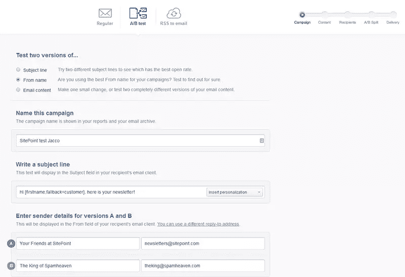
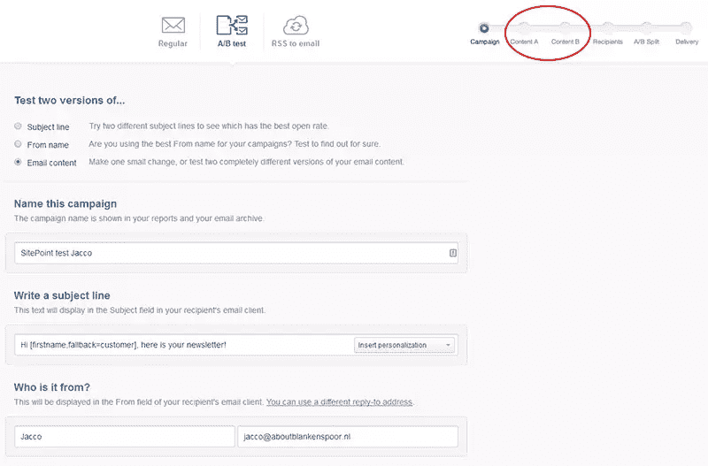
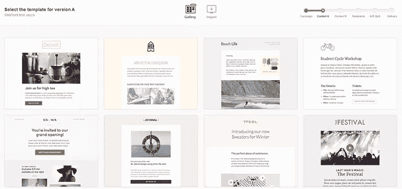
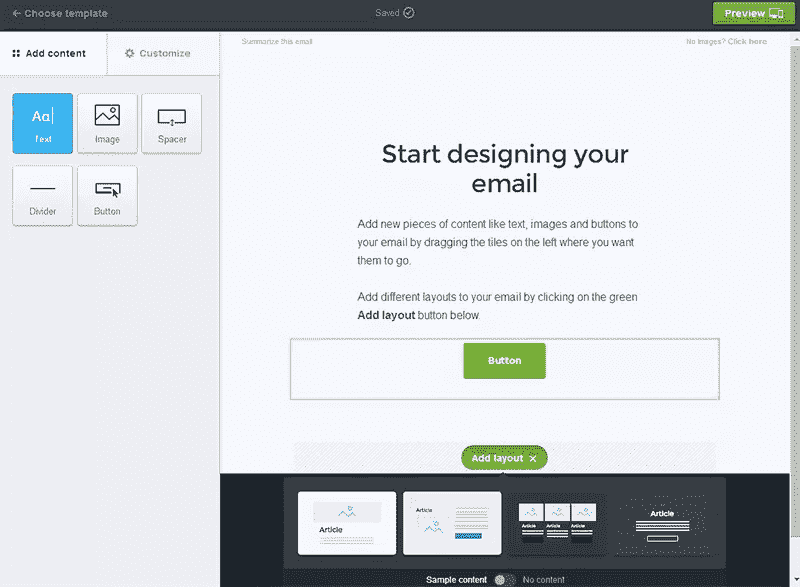
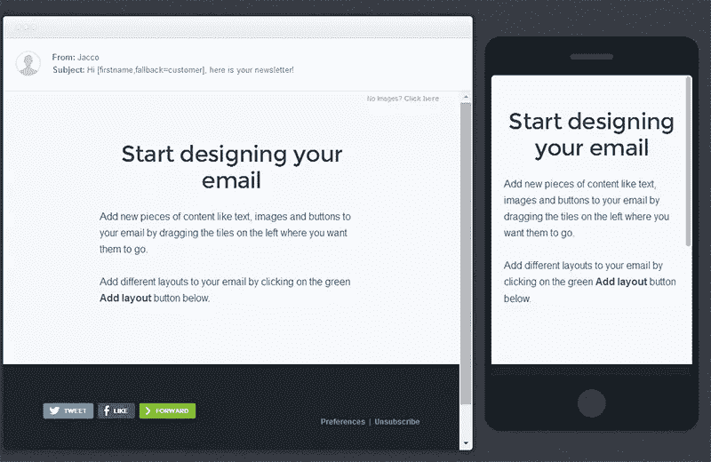
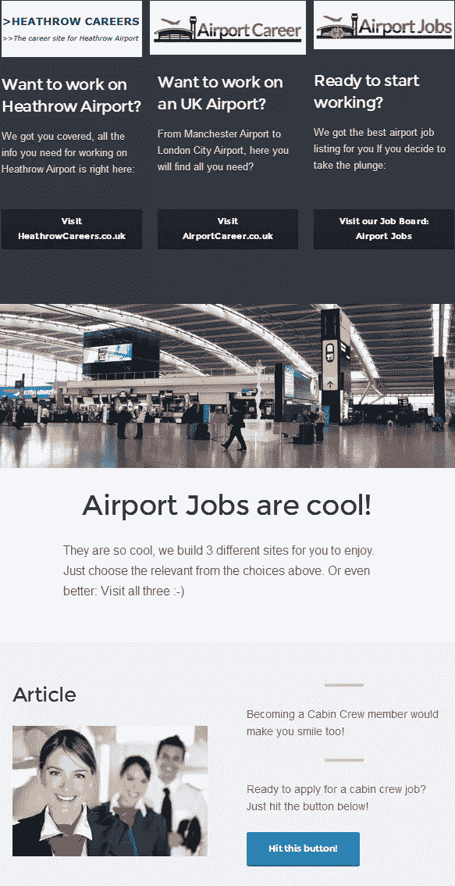
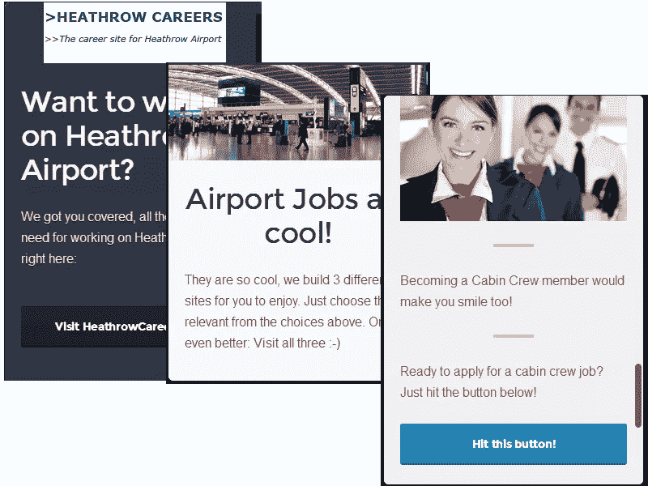
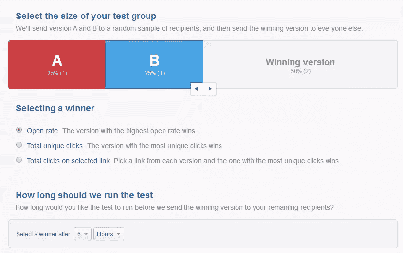

# 运动监视器的画布:电子邮件设计变得简单

> 原文：<https://www.sitepoint.com/campaign-monitors-canvas-makes-email-design-easy/>

如今，[每个人](http://techcrunch.com/2014/08/23/why-everyone-is-obsessed-with-e-mail-newsletters-right-now/) [都在](http://www.theatlantic.com/technology/archive/2014/08/why-email-will-never-die/375973/) [说](https://medium.com/@adam__roberts/inbox-hero-7235ea21291a)你应该建立自己的邮件列表——他们甚至让这听起来很容易。但是建立一份订阅者名单和实际制作一份时事通讯是两码事，后者几乎比前者更难。制作一份像样的时事通讯确实是一项令人生畏的任务。

过去，你只需要确保你的电子邮件在最流行的电子邮件客户端看起来很漂亮，所有的客户端显示的都差不多。这意味着你可以给自己发一封测试邮件，如果它在你的收件箱里看起来不错，你可以保证它在其他任何人的收件箱里看起来都一样。

不再是了。由于大量用户只在手机或平板电脑上阅读电子邮件，您现在面临许多不同的屏幕尺寸。这意味着要么拥有所有流行的设备(如果你负担得起，这不一定是个坏主意)，要么找到一个拥有相关预览和模板与之匹配的提供商。制作精美的时事通讯是一回事，在所有类型的设备上保持统一的外观更加困难。

如果没有丰富的经验，编写电子邮件不是你想做的事情。你很容易搞砸布局，使用图片可能会非常困难(我们过去都收到过图片位置链接到发件人本地驱动器的简讯)，或者确保所有内容都排列正确。

使用[活动监视器](https://www.campaignmonitor.com/)发送 SitePoint 时事通讯。如果你订阅了[版本](https://www.sitepoint.com/versioning/)，那么你实际上是七月份几个测试的一部分。这些测试了用 Campaign Monitor 的新电子邮件模板工具 [Canvas](https://www.campaignmonitor.com/canvas/) 创建的各种设计。

Canvas 正好解决了我上面描述的问题。这是一个可视化编辑器，允许你选择一个模板，然后你只需拖放必要的组件。活动监视器已经内置了 A/B 测试。SitePoint 的 Adam Roberts 在竞选监督博客上就此写了一篇出色的文章。

## 分割测试

让我们看看制作一份在每台设备上都很棒的精美简讯有多简单。Campaign Monitor 还允许您进行自己的测试。设置新的电子邮件活动从运行不同测试的选项开始。

活动监视器允许从三个不同的角度进行测试:

### 1.主题行

主题可以极大地影响你的打开率，从而影响你的简讯活动的成功。这是最简单的测试方法，设置起来更加容易。

### 2.从名称

使用可信的发件人不如拥有一个好的主题行更有益。你可以用这个进行一些测试，选择不同的名字和电子邮件地址作为发件人，只是不要期望你的打开率会有大的变化。

### 3.内容

如果你想让你的收件人关注你的时事通讯的内容，最重要的一种比较测试就是改变内容。如果你仔细看我的截图，你会看到你可以设置内容 A 和内容 B，指出不同的内容块。

## 使用画布修改模板

您可以从 12 个模板中选择，或者导入您自己的模板。我决定用“石板”因为…我喜欢！每个模板的基本布局大致相同。模板以预定义的颜色组合开始，之后您无法更改。

在底部你会看到一个叫做“添加布局”的按钮。这个小按钮是一个非常方便的方式来添加一个专业的布局到您的新闻稿，所有的元素完美地排列在一起。您甚至可以选择包含占位符内容来查看它的外观。

每个模板都有不同的页脚，以及默认的徽标位置。很棒的一点是，你可以尝试每一个模板，即使没有真正建立一个活动，所以你可以用它来玩。

这个工具的完美之处在于，你还可以使用它来预览给定模板在移动设备上的外观，以及更多的灵感示例。

当你开始编辑时，你有无数的选项来编辑你的内容。在左边你会发现各种按钮来添加文本，按钮，潜水员，间隔和图像。你可以把它们插入到你的画布中，然后你可以把它们拖放到任何你喜欢的地方。然后，你只需添加你的内容，标志或可操作的按钮。在顶部，您可以找到一个添加简讯摘要的部分，供您自己参考。

还可以选择添加一些编码魔法，让[个性化](https://www.campaignmonitor.com/create/personalization/)每条信息。通过一些简单的片段(如`[firstname,fallback=your content here]`)，你可以在你的简讯中添加名字和/或姓氏以及电子邮件地址。您还可以添加当前的日、月和年。

为了让事情更加有趣，您还可以使用[自定义字段](https://www.campaignmonitor.com/guides/dynamic-content/)来添加动态内容。这样你就可以为你的所有观众建立一个时事通讯，但是让输出由他们注册时填写的自定义字段决定。自定义字段可以是您喜欢的任何内容，从性别到购物兴趣。

让我们以 [SitePoint 的时事通讯](https://www.sitepoint.com/newsletter/)为例。他们为移动、设计、Ruby 等等有单独的时事通讯。使用动态内容，他们可以包括每个频道的内容，但只有那些选择了每个特定主题的人才能看到相关内容。您可以通过为每个部分添加适当的标记来做到这一点。还可以使用 [IF / ELSEIF / ElSE 语句](https://www.campaignmonitor.com/create/dynamic-content/)根据不同的条件显示内容。

Canvas 还允许轻松制作吸引人的标题，包括您的徽标、标语、摘要或特殊促销。只需放入一个带有一些图片或按钮的文本部分，你就可以立刻吸引人们的注意力。

在“自定义”选项卡下，您还可以找到电子邮件页脚的设置。这里有相当多的选择。例如，你可以添加推文、赞或转发按钮，方便分享。您还可以选择包含更新电子邮件首选项的链接，以及指向您的电子邮件的 web 版本的链接。有输入您公司名称和地址的字段，还有提醒订阅者为什么会收到您的简讯的字段(这对于防止人们退订非常重要，因为链接就在它的下面)。

在右上角，您会发现“预览”按钮，它会弹出一个桌面/平板电脑和移动版本的窗口。桌面版实际上是反应灵敏的(因此有了/tablet ),所以你可以通过调整你的浏览器屏幕来看看它是什么样子。移动版在这样做的时候保持不变，真的很聪明。

几分钟之内，我就能做出一个看起来很专业的模板(顺便说一下，我没有改变 logo 的尺寸)。因为有了垫片(这是一个很棒的功能)，你可以确保它们都完美地排列在一起。如果你仔细看，你会看到第三个标志的高度略有不同。这样做是有意的，这样你就可以看到如何编辑像素间距。

移动模板也完美地出来了。这都是适当的重新调整大小，看起来非常干净。我自己的网站(截图中提到的)也很有响应性([在手机上访问](http://www.heathrowcareers.co.uk))，如果你在你的电子邮件模板上多花一点时间，你可以复制你网站的布局和设计。这种一致的体验怎么样？

编辑完模板的版本 A 后，您可以将其保存为新模板，允许您为版本 B 复制它(记住，我们仍在进行 A/B 测试)并修改内容。你也可以选择使用完全不同的模板，当然这取决于你。

在之前的一篇文章中，我测试了几个 [A/B 测试工具](https://www.sitepoint.com/3-ab-testing-tools-compared/)。你可以相信我的话，A/B 测试不会比使用 Campaign Monitor 更容易。之后你还会收到详细的测试报告。

## 结论

Campaign Monitor 的画布真的很容易建立一个响应性的简讯活动。让我印象深刻的是，以你想要的方式展示你的内容是多么的方便。他们让这件事看起来如此简单，以至于你甚至忘记了自己做这件事有多可怕。因为这个困难，到目前为止我并不热衷于制作时事通讯。其他工具也提供可视化编辑，但我更喜欢这种画布方法。

A/B 测试功能是一个有用的补充，他们实现它的方式值得大加赞赏。它如此直观，以至于你可能真的喜欢测试你的不同变体。

整体运动监测提供了一个伟大的工具，建立通讯，我当然会建议你尝试一下自己。

你试过 Canvas 吗？你有什么设计电子邮件简讯的技巧或诀窍吗？

## 分享这篇文章