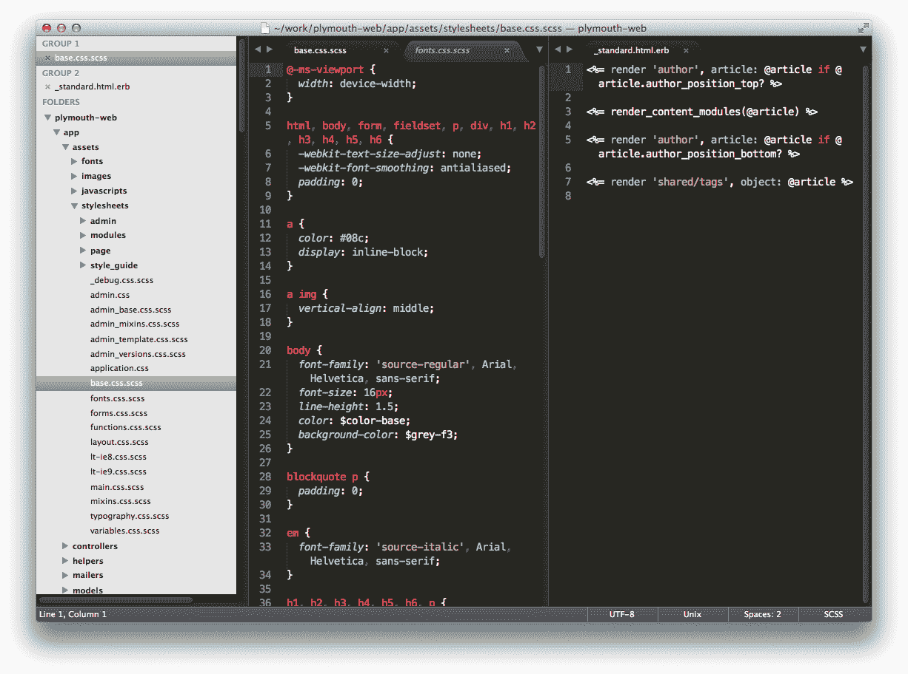
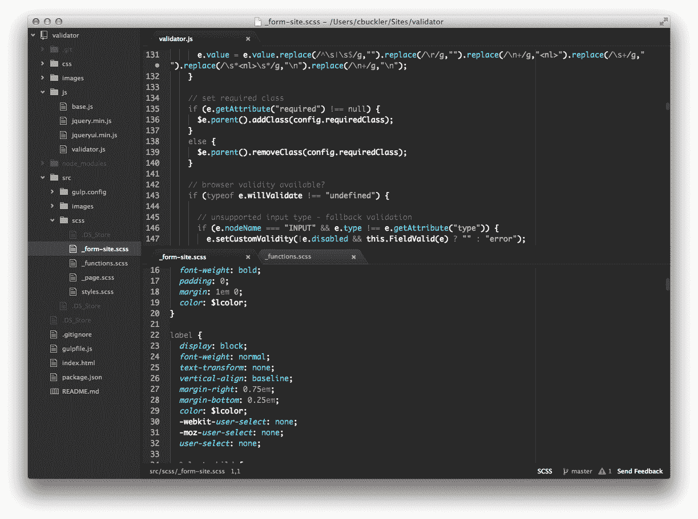
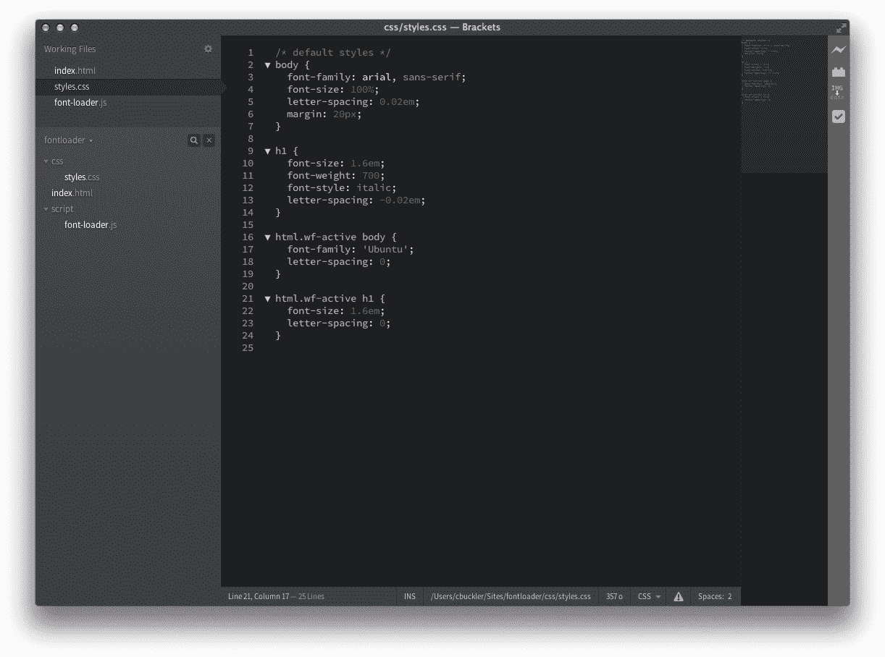
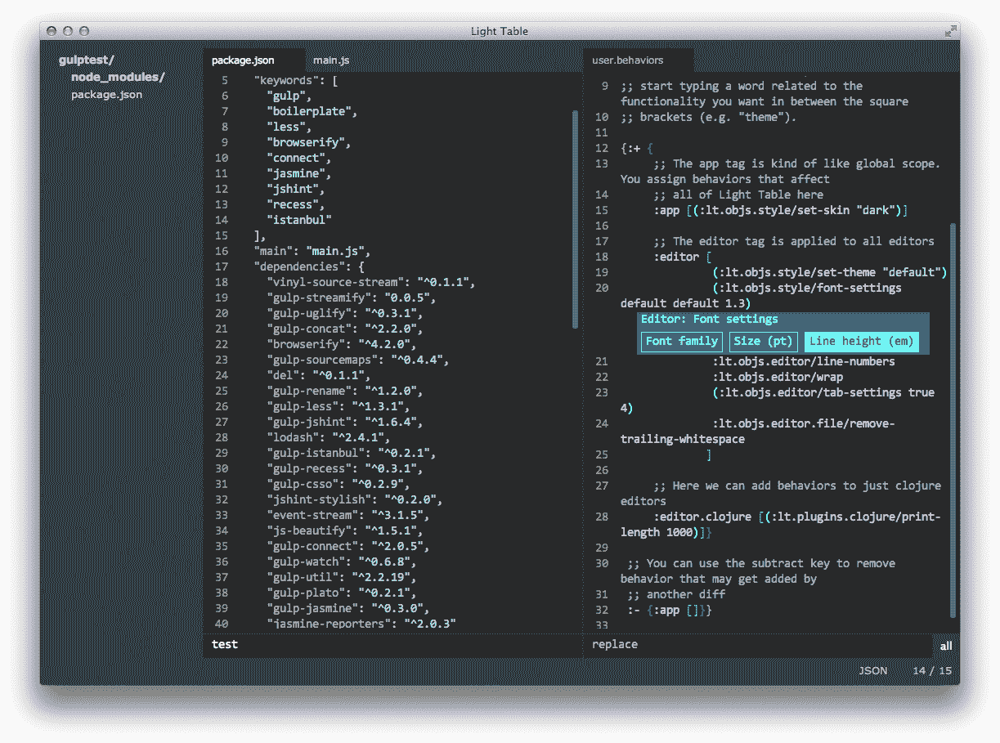

# SitePoint 对决:原子 vs 括号 vs 看片台 vs 崇高文本

> 原文：<https://www.sitepoint.com/sitepoint-smackdown-atom-vs-brackets-vs-light-table-vs-sublime-text/>

* * *

今日 SitePoint 上的热门帖子:

*   [如何同步 WordPress Live 和开发数据库](https://www.sitepoint.com/synchronize-wordpress-live-development-databases/)
*   [使用 Gulp 更快地开发 WordPress 主题](https://www.sitepoint.com/fast-gulp-wordpress-theme-development-workflow/)
*   [优化网页字体以提高性能:最新技术](https://www.sitepoint.com/optimizing-web-fonts-for-performance-the-state-of-the-art/)
*   [如何优化你的 WordPress 网站的性能](https://www.sitepoint.com/optimize-wordpress-sites-performance/)
*   [如何控制 WordPress 中的页面和文章修订](https://www.sitepoint.com/wordpress-post-revision-control/)

* * *

新一代的编辑已经到来。它填补了基本文本应用程序(记事本、文本编辑、gedit 等)之间的空白。)和完全集成的开发环境(VisualStudio、Eclipse、NetBeans 等)。)比较简单的应用缺乏多文档、行号、代码着色等基本的开发需求。ide 往往是适合特定语言、框架或平台的整体应用程序。

这篇综述根据以下标准考虑了复杂的代码编辑器。所有必须是:

1.  适合 web 开发
2.  跨平台，可以在 Windows、Mac 和 Linux 上工作。无论您使用哪种操作系统，您的偏好设置和设置都应该可用。
3.  支持典型 web 语言的通用文本编辑器。你应该能够使用 HTML，CSS，JavaScript，PHP，Ruby，SQL，markdown 等相同的应用程序。
4.  高度可定制的跨平台插件和主题。
5.  又快又稳。启动永远不应该像某些想法一样是一天一次的恐惧。
6.  立即可用，无需陡峭的学习曲线或必须记住许多键盘快捷键。

抱歉，Vim 和 Emacs 的粉丝们——基于控制台的应用程序已经被排除在外了——但是你们无论如何也不会考虑一个替代的编辑器！我也拒绝了基于浏览器的编辑器，如 [Cloud9](https://c9.io/) 和 [CodeEnvy](https://codenvy.com/) ，因为它们有点过于面向网络，不能离线使用。最后，不可能涵盖每一个符合这些标准的编辑器，但是让我们知道你是否有任何想要在未来的审查中考虑的编辑器(例如新的 [Lime Text](http://limetext.org/) 项目)。

## 关于 SitePoint 对决

开发人员花费大量时间使用他们选择的编辑器。这是一个主观的决定，一旦你有了完美的配置，就很难切换到另一个应用程序。也就是说，SitePoint 的抨击不是*“用任何适合你的，伙计”*评论；作者(在这种情况下是我)将根据他们自己的经验、要求和偏见提出建议。你会同意一些观点，不同意另一些观点；太好了—添加您的评论，这样我们可以帮助其他人做出明智的选择。我们还将努力保持这些文章的更新，并根据需要添加新的信息。

让我们看看竞争者。

## [崇高的文字](http://www.sublimetext.com/)

首先，我们有崇高的文本。该 C++和 Python 应用程序由 Jon Skinner 编写，自 2008 年推出以来已吸引了超过 250 万用户。评论大多是正面的，虽然它不是第一个复杂的文本编辑器，但它为后来的人树立了标杆。

主要特性包括:

*   通过兼容 TextMate 的语法提供全面的语言支持
*   多重选择和列编辑
*   “转到任何地方”快速导航定位文件和代码
*   用于访问所有功能的命令选项板
*   小地图和代码片段
*   广泛的定制，伟大的主题和众多的插件
*   好看，又快又稳

与其他竞争者不同，Sublime Text 是一个商业产品，每个用户的成本为 70 美元(你可以随意安装)。您可以根据需要对产品进行评估；偶尔买个许可证会让你很烦。70 美元比免费的要贵得多，但是除以使用的小时数，成本就可以忽略不计了。

Sublime Text 是最成熟的应用程序，也是唯一一个没有处于预发布阶段的应用程序(尽管我在这篇评论中使用的是版本 3 beta)。因此，它有一点优势，但所有的竞争者今天都是可用的。

## [Atom](http://atom.io/)

Atom 是来自 [GitHub](http://github.com/) 的新编辑。开源的 beta 应用是用 Node.js、CoffeeScript、LESS 和 webkit wrapper 中的 C++开发的。说 Atom 受到崇高文本的影响是一种保守的说法:

主要特性包括:

*   在所有平台上免费开放源代码
*   与 Git 和 GitHub 的集成
*   一个为插件开发者准备的记录良好的开放 API
*   立即可用，减少对配置文件的依赖
*   一个内置包管理器的主题和插件的好选择
*   崇高的文本和 vim 兼容的快捷方式
*   吸引人的界面

在撰写本文时，Atom 很容易安装在 Mac 上，并且有一个内置的更新程序。Windows 和 Linux 版本有点落后，后者需要[源代码构建指令](https://github.com/atom/atom/blob/master/docs/build-instructions/linux.md)。

## [括号](http://brackets.io/)

括号是 Adobe 的一个开源编辑器。它是专门为 web 开发人员创建的，使用 Node.js 容器中的 [CodeMirror](http://codemirror.net/) 用 HTML、CSS 和 JavaScript 编写。

主要特性包括:

*   在所有平台上免费开放源代码
*   良好的语言和林挺支持，特别是对网络开发
*   无需服务器的实时浏览器预览和更新(需要 Chrome)
*   内嵌 CSS 编辑
*   一个为插件开发者准备的记录良好的开放 API
*   立即可用，减少对配置文件的依赖
*   一个内置包管理器的主题和插件的好选择
*   多重选择编辑、自动完成和颜色选择器
*   吸引人的界面

该项目是在 sprints 中开发的，每 2-3 周就有一个新版本。现在还没有自动更新，但是当新版本的应用程序和插件可用时，编辑器会警告你。

## [光桌](http://www.lighttable.com/)

轻表是一个迟到的竞争者。众筹 Kickstarter 活动为 Chris Granger 和 Robert Attorri 筹集了超过 30 万美元，用于开发 ClojureScript 中的开源编辑器和 Node-webkit 包装器。

主要特性包括:

*   在所有平台上免费开放源代码
*   轻型安装
*   好看，快速简约的界面
*   到处自动完成
*   在线评估和观察
*   拆分视图和即时反馈
*   命令面板和模糊查找器
*   提供了很好的主题选择
*   一个插件管理器，有一个合理的选择扩展和一个即将到来的开放 API
*   应用程序自动更新(我还没有体验过！)

轻表自称*“下一代代码编辑器”*。它旨在提供一个灵活的界面、实时评估、实时可视化和文档。编辑器仍处于开发的早期阶段，语言支持比其他竞争者更加有限。

## 评价方法

我一直在三台机器上使用 HTML、CSS/Sass、JavaScript、PHP、Node.js、Ruby 和 SQL 开发的所有编辑器:

*   Windows 8.1 —功能相当强大的 18 个月前的笔记本电脑
*   Mac OS X 10.8——一款中档两年前的 Mac Pro
*   Lubuntu 14.04 —一台使用了五年的老旧笔记本电脑

不可避免的是，由于发布时间表的原因，有些编辑比其他编辑用得多:

*   Sublime Text 3 beta 安装在所有平台上，使用了六个月。
*   Atom 0.123(及以下)只装在 Mac 上，用了四个月。
*   支架 0.42(及以下)安装在所有平台上，使用了 12 个月(虽然[我最初是在 2012 年](https://www.sitepoint.com/brackets-html-css-javascript-web-code-editor/)试用的)
*   所有平台都安装了 Light Table 0.6.7，用了六周。这是一个较晚的竞争者，所以它没有接受太多的测试。

让战斗开始吧！

## 第一轮:界面

文本编辑器不一定要漂亮，但你会整天盯着它，所以如果界面干净和可用，它会有所帮助，而且在马拉松式的编码会议期间它不会碍事。颜色编码和可定制的主题是必不可少的，虽然 Sublime Text 提供了最多的选项，但其他编辑器有一个很好的范围，可以根据您的喜好进行调整。

很难选择最喜欢的，因为它们看起来都很相似。此外，我更喜欢 Sublime Text 的默认 Monokai 主题，但其他人提供了类似的变化。

获胜者:**括号**——但仅仅是。它提供了最一致的跨平台体验，看起来很棒。字体渲染让它失望，它看起来不如其他编辑器流畅，但一些调整可以解决这个问题。

Atom 紧随其后。它在崇高的文本上有一点优势，在窗口上看起来有点不合适。最后，看片台几乎没有可供评判的界面，但这可能是一项资产。

## 第二轮:语法支持

不管语法如何，所有竞争者都可以编辑源文件。然而， **Sublime Text** 赢得了这个类别，因为它为几十种流行和神秘的语言提供了颜色编码和帮助。

Atom 和 Brackets 紧随其后，并对较少使用的语法提供插件支持。Light Table 主要关注 Clojure、ClojureScript、Javascript、Python、HTML 和 CSS，但随着编辑器的发展，情况会有所改善。

## 第 3 轮:易用性和学习曲线

理想的编辑器会让你在第一天就富有成效，并允许你随着时间的推移发现特性。**括号**轻松取胜；大多数选项都可以从菜单和界面中获得，而不必编辑配置文件(尽管它们仍然可用)。

Sublime Text 充满了各种特性，但是发现、配置和使用它们是另一回事。Atom 在这方面稍好一些，但与括号相比，它的学习曲线仍然相对较陡。

另一方面，Light Table 隐藏了它的功能，你需要阅读文档和观看视频来学习基本操作，如启用自动换行或更改缩进设置。

## 第 4 轮:速度和稳定性

毫无疑问: **Sublime Text** 比其他编辑快得多，我不记得有一次崩溃或工作丢失。

光表也快。它打开 25Mb 大文件的速度比 Sublime Text 快，尽管编辑速度更慢。Atom 明显变慢了。虽然打开大文件是不可能的，但它是可用的——编辑器目前有 2Mb 的限制。

最后，括号有更高的硬件要求，启动速度较慢，我已经经历了几次多个大文件的崩溃。我很乐意用它来编辑 HTML、CSS 和 JavaScript，但在打开一个冗长的 SQL 转储时可能会三思。

## 第 5 轮:本机功能集

在你开始添加插件之前，编辑器有多好？获胜者是 **Sublime Text** :它提供了开箱即用的广泛功能。也许这对于一个商业产品来说是不可避免的。

其他竞争者采取了一种更简单的方法，一个基本的编辑器辅以插件，提供你需要的高级选项。甚至 auto-complete 也是 Atom 的插件，括号还没有拆分视图。总的来说，我更喜欢这种哲学，但是尽管有额外的功能，Sublime Text 仍然保持了敏捷和轻便。

## 第 6 轮:特定于网络的功能

**括号**轻松获胜。编辑器是用 web 技术开发的，以帮助构建 web 技术。前端编码人员可以享受新颖的功能，包括:

*   实时预览:在浏览器中启动页面，并在编辑时实时观察变化。
*   CSS 快速编辑:在编辑 HTML 时按 Ctrl/Cmd+E 来显示和编辑与该元素相关的 CSS 样式。
*   代码完成，颜色选择器，图像预览器和动画定时贝塞尔曲线编辑器。
*   一些伟大的扩展，如 Theseus JavaScript 调试器和 CSS 形状编辑器。

方括号不太强调服务器端语言，但提供基本的语法支持。

看片台之后是工作区、浏览器预览窗格、实时编辑、代码评估、自动完成和文档。令人惊讶的是，尽管编辑器有一个浏览器库，却无法查看图像文件。

Atom 和 Sublime Text 是更通用的编辑器。他们可能不太注重网络，但有更多的选择。

## 第 7 轮:插件和扩展

崇高文本似乎是明显的赢家——编辑器[有将近 2500 个扩展](https://sublime.wbond.net/)。也就是说，质量是可变的，包装控制比竞争对手更困难。Sublime Text 的 API 文档很少，插件不可能与整个界面交互，并且需要 Python 知识。

因此，我给了**原子**和**括号**额外的信任。虽然两者都没有扩展的范围或种类，但插件管理要好得多，并且都有开放的、文档完善的 API。用 JavaScript 开发扩展对 web 开发者来说是一个受欢迎的额外收获。

Light Table 有少量插件，API 在编写时还不完整。

## 第 8 轮:定制和可黑客性

这个类别更难评估，因为所有的编辑器都被设计成高度可定制的。经过深思熟虑，获胜者是**原子**。它有类似的配置文件来升华文本，但是在界面中可以发现许多选项。[文档](https://atom.io/docs/latest/customizing-atom)更好，如果你需要更深层次的改变或插件开发，编辑器的源代码是可用的。

括号有很多选项，也是开源的，但它不像 Atom 和 Sublime Text 那样可配置。Light Table 的定制水平很好，但它更复杂，即使有全面的自动完成和帮助。

## 第 9 轮:未来

Sublime Text 的发展速度已经放缓，尽管这是可以理解的，因为它已经成熟。它作为商业产品的未来不太确定，因为这个类别的获胜者 Atom T1 得到了 GitHub 的支持，GitHub 免费提供它。一旦最终版本在所有平台上发布，编辑器将很难被击败。

括号也有一个积极的未来:它有 Adobe 的支持，有几十个贡献者。在过去的几个月里，特性和插件的数量显著增长。

现在预测 Light Table 的未来还为时过早。该编辑器很有前途，在功能不太强大的硬件上运行良好，但它走了一条相当激进的道路，我不相信它会获得大众的青睐。

## 第 10 轮:总赢家

这两轮投票出奇的接近。如果我们假设第七轮是三方平手，Atom 赢得了三个括号和崇高的文本各四个。所有的编辑都很好，但是，如果我今天不得不选择一个编辑，这将是一个容易的决定。崇高的文本仍然是编辑击败，尽管金钱成本。该编辑器速度快、稳定，并且拥有数量惊人的功能和插件。缺点:特性很难发现，你会一直怀疑你没有充分利用编辑器的优势。

### 小气鬼选项

如果你不想为崇高的文本付钱，你有几个选择。如果你用的是 Mac，Atom 很有前途。虽然它赢得的回合数少于括号，但它在大多数类别中都是第二名。如果它能在 Windows 和 Linux 上安装得更快更容易一些，Sublime Text 将很难与之竞争。web 开发社区几乎肯定会更喜欢开放的 JavaScript API 插件架构。

括号做得很好。它发展迅速，拥有你在其他地方找不到的 web 开发特性，在所有平台上都感觉很棒。速度和稳定性可能会破坏体验，但对于拥有相当强大机器的前端开发人员来说，这是一个可行的选择。

虽然 Light Table 没有赢得任何回合，但这是一个有趣的项目，采用了激进的方法。它是轻量级的，在普通的硬件上速度很快，但是你需要花时间学习如何使用和配置编辑器。我们中很少有人有耐心，但我怀疑它可能会获得一批地下维姆式的准宗教追随者。

编辑器是免费的，所以你可以安装和互换使用。当我在 Mac 上做项目工作时，我通常会使用 Atom。对于客户端项目或 markdown 文件，我更喜欢在 PC 上使用括号(有一个很棒的预览插件)。最后，我使用 Light Table 在所有操作系统上快速查看和编辑。

最后，恭喜 Sublime Text，它仍然是首选的编辑器！

你同意克雷格的选择吗？请留下您的评论，并让我们知道在未来的 SitePoint 对决中您想要比较哪些产品(不仅仅是文本编辑器)。

## 分享这篇文章