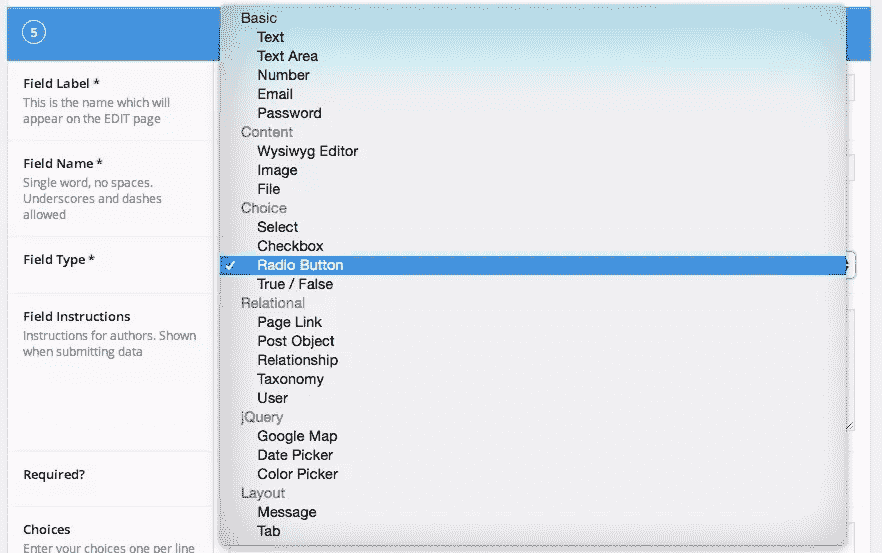
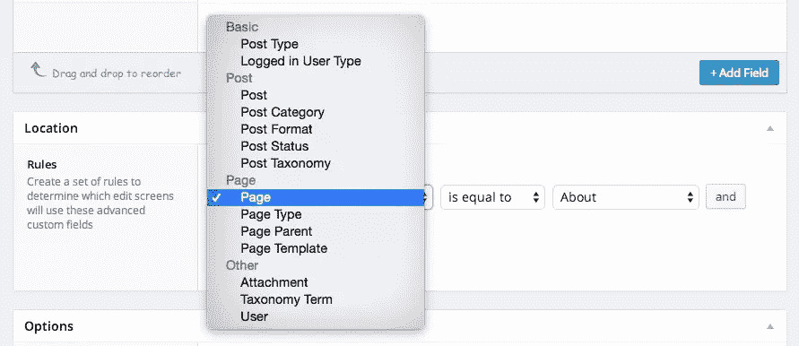

# 高级自定义域入门(ACF)

> 原文：<https://www.sitepoint.com/getting-started-with-advanced-custom-fields/>

## 为什么要使用自定义字段？

当我开始使用**高级定制字段(ACF)** 时，我简直无法表达我有多激动。当我开始使用 WordPress 的时候，我发现了如何弯曲文章和页面来做更多的事情。我会给客户非常具体的指示，让他们以复杂的方式使用类别和父页面。然后我发现了[自定义帖子类型](https://www.sitepoint.com/custom-post-types-take-wordpress-beyond-blogging/)，我的指令变得简单多了。

但是，即使有独立的文章类型，也不是每一篇内容都适合一个标题+内容+摘录+缩略图模型。事件需要开始日期和时间。员工通常需要电子邮件地址或头衔。产品可能有价格、颜色变化或尺寸。所有这些内容类型使 WordPress 超越了简单的自定义文章类型。

## 插件呢？

解决这个问题的一个办法是为你需要的每一种自定义内容找到一个插件。为产品安装 WooCommerce，为活动安装 Events Calendar，为员工安装 Meet My Team，为幻灯片安装独白，为投资组合项目安装 WPP。这对很多人都适用:一开始这样开发会更快。

然而，我不喜欢插件自助餐，原因有二。首先，你添加的每一个插件都会影响网站速度(几乎不会加速！).你添加的每一个内容类型插件都有可能在前端添加自己的 JS 和 CSS 文件。当你添加这些插件时，你可以看到你的页面速度分数直线下降。第二，你使用的大多数插件看起来会与你的主题不同(与主要插件“兼容”的高级主题除外)。这将有两个负面结果:要么你的网站看起来像是由三四个插件拼凑而成，要么你将花费大量时间覆盖插件 CSS，使插件内容类型看起来像是属于你的主题。

## ACF 字段类型

[高级自定义字段(ACF)](https://www.sitepoint.com/custom-post-types-take-wordpress-beyond-blogging/) 提供了一种方法，可以将几乎任何类型的自定义字段附加到您的帖子类型中。

### 包括的字段类型

默认情况下，ACF 插件有 20 多种字段类型:



*   **文本**:单行文本字段，可选 HTML 支持，字符限制
*   **文本区**:多行文本字段，可选 HTML 支持，字符限制
*   **数字**:数字，最小/最大值
*   **电子邮件**:验证电子邮件输入
*   **密码**:屏蔽输入密码的文本
*   **所见即所得编辑器**:可选的 WP 媒体插入、基本/完整编辑器按钮
*   **图像**:上传图像或从 WP 库中选择，返回对象、url 或 ID
*   **文件**:上传文件或从 WP 库中选择，返回对象、url 或 ID
*   **选择**:提供下拉选项，支持多选
*   **复选框**:允许在复选框列表中选择多项
*   **单选按钮**:允许从单选按钮列表中选择单项
*   **真/假**:简单的真/假选择器
*   **页面链接**:返回任意帖子或页面的 URL，可以限于特定的帖子类型
*   **Post 对象**:返回任何帖子或页面的 WP 对象，可以限制为特定的帖子类型或分类
*   **关系**:与 post 对象相同，但改进了界面和拖放重新排序
*   **分类法**:返回一个或多个分类法术语的对象或 ID，可以限于标签、类别或自定义分类法
*   **用户**:选择一个或多个用户，可以按角色限制
*   **谷歌地图**:设置横向/纵向中心、缩放级别和宽度
*   **日期选择器**:选择日历日期，返回格式化的日期字符串
*   **颜色选择器**:选择十六进制颜色
*   **消息**:无选项，给用户留言
*   **页签**:将以下字段收集到一个页签界面中

### 免费附加字段

WordPress 插件 repo 和 ACF 插件页面有许多对 ACF 有用的插件。这些插件允许用户[选择菜单](http://wordpress.org/plugins/advanced-custom-fields-nav-menu-field/)、[选择工具条](http://wordpress.org/plugins/acf-sidebar-selector-field/)、[选择重力表格](http://www.advancedcustomfields.com/add-ons/gravity-forms-field/)、[折叠复杂字段组](https://github.com/urre/acf-fold-flexible)和[导入电子表格](http://wordpress.org/plugins/spreadsheet-acf-import/)。

### 付费附加字段

有几个高级的 ACF 插件非常有用。在我看来，大多数花费在 25 美元左右，非常值得。

**中继器:**ACF[中继器字段](http://www.advancedcustomfields.com/add-ons/repeater-field/)允许用户开发任意数量字段的复杂布局。例如，repeater 字段可以包含一个文本字段、一个图像字段和一个 WYSIWYG 字段，允许用户创建一个带有图标、标题和描述的“服务”列表。

**灵活内容:**ACF[灵活内容](http://www.advancedcustomfields.com/add-ons/flexible-content-field/)字段允许用户设置多个布局(每个由多个字段组成)，然后可以在页面上以任何顺序选择和使用这些布局。参见[降雪量教程](https://www.sitepoint.com/acf-flexible-content-fields/)中灵活内容域的例子。

**选项页面:**ACF插件允许开发人员在仪表板中创建自定义选项页面，然后将任意一组自定义字段附加到这些页面。这对于收集网站范围的数据非常有用，比如公司地址、社交媒体链接、电话号码或主题颜色选项。

## 将字段组附加到内容

ACF 字段组可以通过任何标准附加到内容:文章类型、页面模板、父页面、文章类别或标签、分类法本身、媒体和用户。



在附加了字段组的内容的编辑页面上，任何默认的 WordPress admin 都可以隐藏(编辑器、特色图片、Slug、作者等)，字段组可以放在标题下面、编辑器下面或右边的栏中。

## 在模板中使用 ACF 字段

ACF 提供了几个有用的 PHP 函数，用于在 WordPress 模板文件中包含自定义字段数据。ACF 文档页面有大量有用的信息。以下是一些最常用的函数。

### `get_field()`

[`get_field('field_name', $post->ID, 'option')`](http://www.advancedcustomfields.com/resources/get_field/) 函数返回定制字段的格式化内容，其名称作为参数传递。post ID 参数是可选的:如果在循环之外使用该函数，或者从另一篇文章或页面访问字段，则 ID 是必需的。如果该字段在选项页面上，则在该函数中包含`'option'`。

由于该函数返回数据，因此可以将其赋给一个变量，或者用`print`或`echo`显示。

```
if ( get_field('sub_title') ) :
	print '<h2 class="sub-title">'.get_field('sub_title').'</h2>;
endif;
```

### `the_field()`

[`the_field()`](http://www.advancedcustomfields.com/resources/the_field/) 函数显示根据自定义字段组管理区中的参数格式化的字段内容。它可以采用与`get_field()`相同的`$post->ID`和`'option'`参数。这基本上和`echo get_field()`是一回事。

```
if ( get_field('staff_image') ) :
	the_field('staff_image');
endif;
```

### 分区

如果自定义字段在重复字段或灵活内容字段中，请使用 [`get_sub_field()`](http://www.advancedcustomfields.com/resources/get_sub_field/) 和 [`the_sub_field()`](http://www.advancedcustomfields.com/resources/the_sub_field/) 来代替。`$post-ID`和`'option'`参数的工作方式相同。

### 在字段中循环

要循环遍历重复字段或灵活内容字段中的所有行，请使用 [`have_rows('field_name', $post->ID, 'option')`](http://www.advancedcustomfields.com/resources/have_rows/) 和`the_row()`。这些函数的工作方式与 WordPress 循环函数非常相似:

```
if ( have_rows('image_rows') ) :
	while ( have_rows('image_rows') ) : the_row();
		the_sub_field('row_icon');
		the_sub_field('row_title');
		the_sub_field('row_text');
	endwhile;
endif;
```

灵活内容字段有多种布局。函数 [`get_row_layout()`](http://www.advancedcustomfields.com/resources/get_row_layout/) 返回循环迭代中使用的布局名称。

## 结论

当谈到使用高级定制字段使 WordPress 成为一个高度可配置的 CMS 时，天空是极限。这些字段可用于创建精确的自定义内容输入和样式，以创建复杂的自定义布局。在评论中分享你最好的支持 ACF 的项目之一，或者问一个关于在你的网站中使用这些字段的问题。

## 分享这篇文章