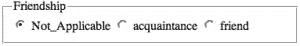
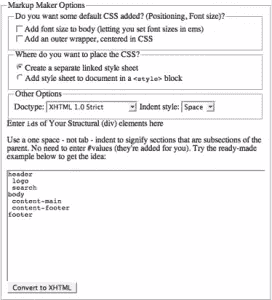

# 字段集(HTML 元素)

> 原文：<https://www.sitepoint.com/fieldset-html-element/>

## 描述

`fieldset`是一个用于组织和分组表单中相关条目的有用工具，在桌面应用程序中已经使用了很长时间。当它与图例(包含在`fieldset`中，如果使用`fieldset`的话，它是一个必需的元素)结合时，它的效果是在分组的项目周围创建一个框，并在每个项目的右边显示一个描述，如下所示。


也可以嵌套字段集作为子组项目的一种方式，如下所示:



## 例子

这个`fieldset`元素用于分组三个相关的 XFN 属性(参见关于 XFN 的[微格式部分):](https://reference.sitepoint.com/html/xfn/)

```
<form>
  *<fieldset>*
      <legend>Friendship</legend>
      <input type="radio" name="radFriendship" value="Not_Applicable"
          id="radFriendNot_Applicable"/>
      <label for="radFriendNot_Applicable">Not_Applicable</label>
      <input type="radio" name="radFriendship" value="acquaintance"
          id="radFriendaquaintence"/>
      <label for="radFriendaquaintence">acquaintance</label>
      <input type="radio" name="radFriendship" value="friend"
          id="radFriendfriend"/>
     <label for="radFriendfriend">friend</label>
  *</fieldset>*
⋮
</form>
```

## 将此用于…

`fieldset`属性用于对共享某些特征的数据项进行逻辑分组。例如，当在应用程序表单中捕获关于访问者的信息时，您可以将一个`fieldset`放在个人详细信息周围，而将另一个放在工作详细信息周围。

## 分享这篇文章