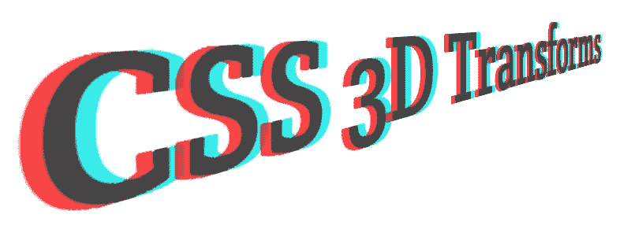
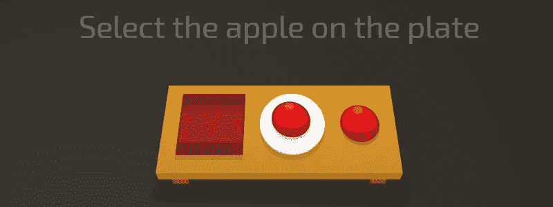
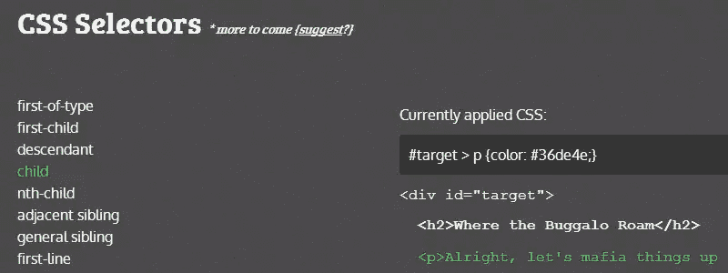
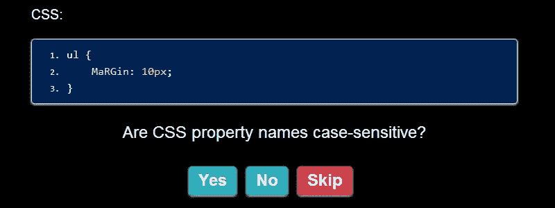
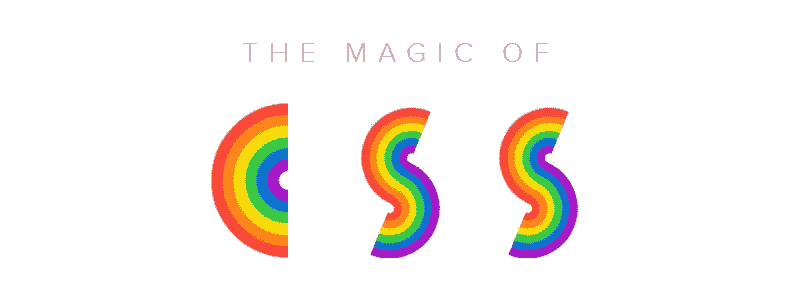
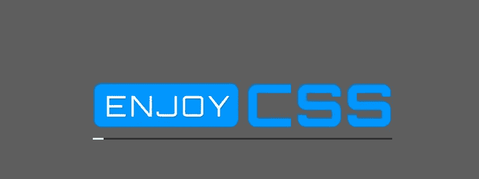
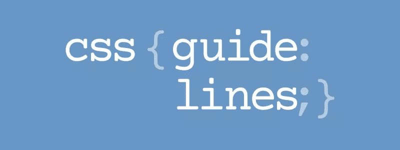
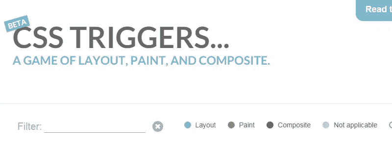
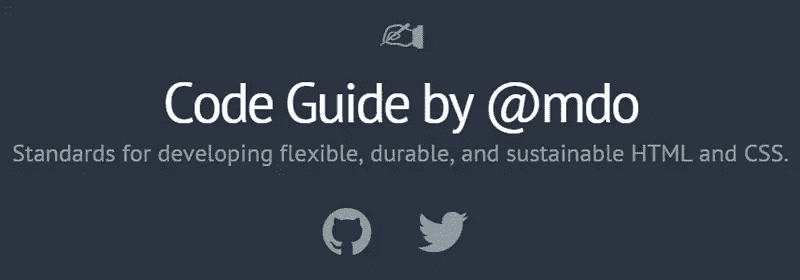
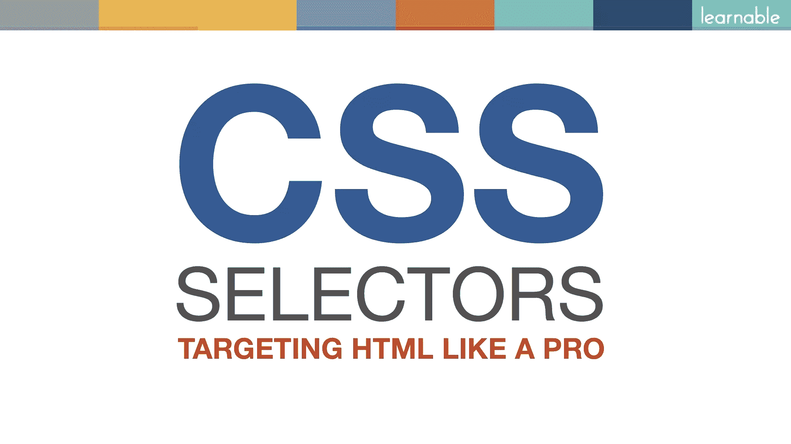

# 11 CSS 学习工具和资源

> 原文：<https://www.sitepoint.com/11-css-learning-tools-and-resources/>

最近，这个行业充斥着关于 Sass 的文章、教程和工具，[甚至在 SitePoint](https://www.sitepoint.com/sass-basics-operators/) 上，我们也发布了比以往更多的 Sass 内容。

但是我们没有忘记我们的根:CSS。

对于那些仍在学习 CSS，或者想更深入地了解特定 CSS 主题的人，我想我已经整理了一份我在最近几个月遇到的 CSS 学习资源列表。

尽情享受吧！

## [1。展开盒子模型](http://rupl.github.io/unfold/)

探索 CSS 3D 变换的交互式幻灯片。按向左或向右箭头键前进。全屏观看以获得最佳效果。

## [2。CSS 餐车](http://flukeout.github.io/)

一个精心设计的小游戏，帮助你学习 CSS 选择符。输入正确的选择符以完成每个级别。您也可以通过打开菜单(菜单右侧带有汉堡包图标)跳转到一个级别。

## [3。交互式学习 CSS 选择器](http://benhowdle.im/cssselectors/)

CSS 中选择器的简单可视化。在左边的菜单中选择选择器，正确选择的项目会出现在右边，菜单下会有选择器的简要说明。

## 4.前端 Web 开发测验

一个前端编码测试，这并不容易。第一部分是关于 CSS 的。

## [5。CSS 的魔力](http://adamschwartz.co/magic-of-css/)

关于 CSS 基础的 6 章教程，后面还有更多章节。这里有一些很有深度的东西。

## [6。享受 CSS](http://enjoycss.com/)

学习 CSS 的类似 CodePen 的游乐场。有趣的是，它专注于 CSS，有一个菜单，您可以在其中选择 CSS 功能，然后使用 GUI 在文档中编辑该功能。

## [7。CSS 指南](http://cssguidelin.es/)

Harry Roberts 更新了他的 CSS 指南。以前只是一个 GitHub repo，现在指南有了自己的领域，并得到了扩展和改进。Harry 还实施了“按需付费”模式来帮助支持开发。

## [8。CSS 触发器…](http://csstriggers.com/)

Chrome Dev Relations 的 guy Paul Lewis 为那些对给定 CSS 属性改变时页面上触发的内容感兴趣的人创建了一个快速参考。例如，有些属性会触发重画和合成，但不会触发布局。该参考涵盖所有属性，易于搜索。

## [9。@mdo 的代码指南](http://mdo.github.io/code-guide/)

Bootstrap 的 Mark Otto 整理了他自己的 HTML 和 CSS 样式指南，其中有很多技巧，包括属性的顺序、HTML 属性的顺序、选择器、注释等等。

## 10。Flexplorer

一个简单的应用程序来摆弄各种 flexbox 功能，并看到结果与完整的代码一起实时出现在页面上。最酷的是，您还可以编辑页面上框中的文本，让您看到这些变化如何影响不同数量的内容。

## [11。CSS 选择器:像专家一样瞄准 HTML】](https://learnable.com/courses/css-selectors-targeting-html-like-a-pro-2876)

Russ Weakley 在 SitePoint 的姐妹网站 Learnable 上开设了关于 CSS 选择器的新课程，其中有 20 多个视频介绍了使用 CSS 选择元素的不同方式。而这不仅仅是不要脸的塞；我了解 Russ——他是真正的 CSS 专家。因此，如果您刚刚开始使用 CSS，还没有掌握选择器，这可能是一个不错的选择。

## 知道其他的吗？

无论你处于 CSS 的哪个层次，我相信这里列出的资源中至少有一个会对你有所帮助。

如果你已经开发了一些东西，写了一些东西，或者知道任何其他的工具，应用程序，或者资源来帮助开发者快速掌握 CSS 的某些方面，请在评论中分享。

## 分享这篇文章