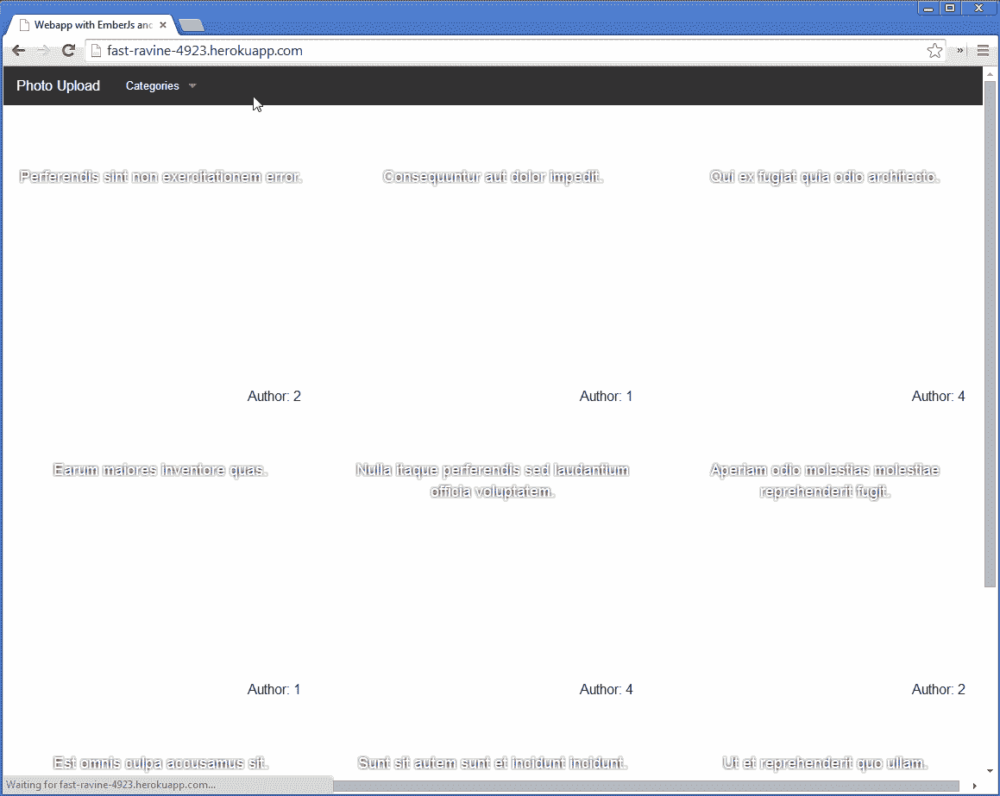

# 带有 Laravel 和 EmberJS 的单页应用程序

> 原文：<https://www.sitepoint.com/single-page-app-laravel-emberjs/>

在这一部分，我们将看到 Ember 是如何工作的，如何使用 Ember 数据，以及如何用它来构建一些简单的东西。路由器、路由、模型、模板和存储是 Ember 的一些概念。我不打算解释每一个，所以如果你觉得卡住了，使用[文档](http://emberjs.com/guides/)。像往常一样，你可以在这里下载这部分[的代码。](https://github.com/sitepoint-examples/sitepoint-RESTAPI-laravel-emberJs-part4)

## 让我们编码

请注意，在使用 Ember 开发时，下载 Ember 检查器是个好主意。他们发布了带有 Chrome 扩展的 Ember，现在这个扩展也在 Firefox 上。

对于这个例子，我们将把 JS 的每一行放在`/public/static/app.js`里面。在实际项目中，这不是一个好主意。这简化了我们的例子，但是问问你自己——你曾经在一个大文件中用 MVC 架构做过一些严肃的工作吗？我们看到了 Laravel 是如何工作的:控制器在一个文件夹中，每个控制器在一个文件中，配置在它自己的文件夹中，模型也是如此。我建议你在投入一个合适的项目时，对 Ember 做同样的事情。

启动 Ember 的第一件事就是创建应用程序。它是你用 Ember 编写的所有东西的全局名称空间。可以像这样创建应用程序:

```
App = Ember.Application.create();
```

我建议在创建应用程序时，通过添加一行代码来激活一点调试。

```
App = Ember.Application.create({
        LOG_TRANSITIONS: true
    });
```

它只不过是通过控制台中的 URL 和模板输出你的动作。此外，我们将使用 Ember 数据，它是 Ember 的一个独立模块，提供了与 REST 的良好集成，翻译从存储对象到服务器请求的所有内容。默认情况下，Ember Data 使用 Rest 适配器。您还可以使用 Fixture 适配器进行测试和本地开发。基本上，Ember 数据是服务器(Rest API)和带有 Store 对象的本地存储之间的桥梁。

正如我们前面看到的，我们的 API 使用了一个名称空间。Ember 的数据带有一个 Rest 适配器，它接受一个名称空间，一个我们在 Laravel 路由组上看到的前缀。让我们将名称空间作为参数传入。

```
App.ApplicationAdapter = DS.RESTAdapter.extend({
        namespace: 'api/v1'
    });
```

适配器现在通过`example.com/api/v1/`请求所有数据。

将 App Store 与适配器链接，就可以开始开发了。

```
App.Store = DS.Store.extend({
        adapter: 'App.ApplicationAdapter'
    });
```

Ember 的一个主要概念就是 URL。一切都围绕着这个想法。路由器保持 URL 和模板同步。在路由器内部，您可以定义一个资源并将该资源映射到一个特定的 URL。在这个例子中，我们将只使用照片资源和用户资源。请随意添加类别资源，并与 Ember 建立一对多的关系。不要忘记，早先我们创建了一些与 Laravel 的关系(一对多和属于),但是我们没有使用它们。在 Laravel 中使用一对多关系非常容易，但是我不想让您不知所措。如果评论中产生了足够的兴趣，我们将在后续帖子中将其添加到我们的应用程序中，并标上页码。

路由器是定义所有路由的地方。这里，我们用它们的 URL 定义了两个资源。URL 在这里是可选的。`:photo_id`是一个论点。假设我们导航到`example.com/photo/2`。会发生什么？我们有一个资源将我们的请求传递给模型或控制器，在那里我们从存储中获取一些数据。如果商店没有找到它，它就在服务器上查找。`:photo_id`可以用来检索这些数据。在这种情况下，它会寻找`example.com/api/v1/photos/2`。你看那张照片是复数。Ember 本身寻找资源的复数。

```
App.Router.map(function() {
        this.resource('photo', {path: "/photo/:photo_id"});
        this.resource('user', {path: "/user/:user_id"});
    });
```

路由以大写的资源的第一个字母开始，并且应该在 App 命名空间中。此外，在资源名称后添加单词“Route”。因此，对于照片资源，路径应该是这样的:`App.PhotoRoute`

它还应该扩展路由对象。

```
App.PhotoRoute = Ember.Route.extend({});
```

对于不同的事物，Route 对象可以有不同的挂钩。其中两个钩子用于定义资源的控制器名和定义模型。让我们坚持这个模型。

```
App.PhotoRoute = Ember.Route.extend({
        model: function(params){
            return this.store.find('photo', params.photo_id);
        }
    });
```

在内部，我们已经指定了模型挂钩并传递了一个参数。这个参数放在哪里？照片资源有一个带参数的 URL:`/photo/:photo_id`。`photo_id`存储在`params`中，可以在函数内部使用。不要忘记，每一个资源和每一条路线都可以访问商店。Store 对象保存其中的所有信息，并使用本地存储以获得更好的性能。这样，它减少了服务器上的请求数量。这就是为什么用 Ember 开发会加速你的应用程序——最终，用户会更开心。

通过使用`store.find('resource')`,您可以从 store 对象中检索该资源的所有数据。您也可以只检索一行。例如，如果您想只接收一张具有给定 id 的照片，使用 store 对象并找到具有给定 id 的**照片**资源作为第二个参数。

```
return this.store.find('photo', params.photo_id);
```

Ember 搜索`example.com/api/v1/photo_id`中的数据。默认情况下，Ember 通过查找 id 来处理数据。如果您已经为该资源插入了一些关系，那么您还可以检索与其相关联的数据。这是所有路线的代码，每种情况都非常相似且简单明了:

```
App.IndexRoute = Ember.Route.extend({
        model: function(){
            return this.store.find('photo');
        }
    });

    App.PhotoRoute = Ember.Route.extend({
        model: function(params){
            return this.store.find('photo', params.photo_id);
        }
    });

    App.UserRoute = Ember.Route.extend({
        model: function(params){
            return this.store.find('user', params.user_id);
        }
    });
```

快速注意:IndexRoute 是一个默认路由，与根 URL 链接。我说的根是指`example.com/` URL。还有其他默认路由，比如在应用程序启动时执行的 ApplicationRoute。

## 模型对象

在 Ember 的模型对象中，您可以指定数据及其资源类型。Ember 的一个很好的特性是，当一个资源的值被改变，而另一个值依赖于改变后的值时，它会通过一些观察者魔术自动更新。模型应该以大写字母开头，并且应该扩展模型对象。

```
App.Photo = DS.Model.extend({});
```

在该对象中，您应该指定所有依赖于这些核心值的字段和其他值。您也可以在模型内部添加关系。

照片模型应该是这样的:

```
var attr = DS.attr;             // This cuts my writting. Inside the model i use attr instead of DS.attr

    App.Photo = DS.Model.extend({
        user_id: attr("number"),    // The expected value is a number
        url: attr("string"),        // The expected value is a string
        title: attr("string"),
        description: attr("string"),
        category: attr("number"),

        fullUrl: function(){        // Another value that depends on core values.
            return "/files/" + this.get("url");
        }.property('url'),

        backgroundImage: function(){// This depends on another value but not on core ones
            return 'background: url("' + this.get("fullUrl") + '") no-repeat; ';
        }.property('fullUrl')

    });
```

使用`attr` ( `DS.attr`)您可以指定您希望这些数据如何到达。例如，我们希望`user_id`值是一个数字。这样，我们就不会受到外部数据的影响。

用户模型是相似的。记住，Ember Data 会在`/api/v1/users`中寻找。命名约定有点复杂。例如，如果你请求一个名为**用户**的资源，Ember Data 将寻找`example.com/prefix/users`，如果你请求一个特定的资源，它将请求`example.com/prefix/users/user_id`。了解 Laravel 如何暴露数据以及 Ember 如何想要它的数据可以让你免除头痛。

```
App.User = DS.Model.extend({
        name: attr("string"),
        lastname: attr("string"),
        username: attr("string"),

        fullname: function(){
            return this.get('name') + " " + this.get('lastname');
        }.property("name", "lastname")
    });
```

## 视图

在进入模板之前，我建议使用 Ember 检查器来查看应用程序的状态。在那里，您可以找到路线、视图和控制器。您还可以找到控制器和路线之间的关系。花些时间用检查器四处看看，这将对你以后开发自己的 Ember 应用程序有很大的帮助。

你还记得我们在第三部分写的第一个模板吗？这就是应用程序模板。当在浏览器中访问`example.com`时，将呈现该模板。

如果不在模板中进行修改，就不能进一步开发应用程序。将`<!-- The content will be here -->`注释替换为:`{{outlet}}`。

为什么？我们所有的资源都嵌套在应用程序路径中。但是如果我查看我的代码，我在路由器上没有看到索引。这是为什么呢？

默认情况下，`example.com/` url 被分配给`IndexRoute`,除非您已经将该 url 分配给另一个路由。默认情况下，Ember 将应用程序放在顶层，所有东西都嵌套在里面。如果您在应用程序路径中请求一个 URL，那么通过使用`{{outlet}}`作为占位符，Ember 获取该路径的模板并将其放入该占位符中。

让我们制作另一个模板，并将其用于`IndexRoute`。这将是第一页。第一个模板是 app 模板。索引模板将在应用程序的`{{outlet}}`中呈现。

`data-template-name`是模板的名称。脚本标签中的所有代码都将放在`{{outlet}}`中。

```
<script type="text/x-handlebars" data-template-name="index"> <ul class="small-block-grid-1 medium-block-grid-2 large-block-grid-3 custom-grid-ul">
            {{#each}}

                <li {{bind-attr style="backgroundImage"}}>
                    <div class="custom-grid">
                        {{#link-to 'photo' this}}<h5 class="custom-header">{{title}}</h5>{{/link-to}}
                        <span>Author: {{user_id}}</span>
                    </div>
                </li>

            {{/each}}
        </ul> </script>
```

是一个类似于循环的东西。如果模板的模型有一个数组，并且我们想要查询所有的数据，那么我们使用这个特殊的标签。这个循环以`{{#each}}`开始，以`{{/each}}`结束。在这个循环中，我们使用从循环中返回的所有值。记住，在模型内部，我们返回了资源`photo`。模型从存储中检索数据，并将其返回给模板。看照片模型。我们在那里指定了一些字段，这些字段在模板内使用，在`{{#each}}`循环内。

另一个特殊的标签是`{{#link-to}}`标签。这个标签生成一个到照片路线的链接，并传递一个参数。`this`参数是该对象的`id`。在这种情况下是照片 id。同样，`{{#link-to}}`标签以`{{/link-to}}`结尾。`{{title}}`不是一个特殊的标签，它只是检索那个对象的标题值。

让我们添加照片模板。该模板是照片路线的模板。同样，我建议查看[命名约定](http://emberjs.com/guides/concepts/naming-conventions/),以了解这是如何映射和如何命名的。

```
<script type="text/x-handlebars" data-template-name="photo"> <div style="text-align: center;">
            <h4>{{title}}</h4><br>
            <br>
            <span>Author: {{#link-to 'user' user_id}}{{author.name}}{{/link-to}}</span>
        </div> </script>
```

通过使用`{{attribute-here}}`标签，选择的属性将在该标签内生成。我们在一个``标签中使用了它。在标签中使用`{{title}}`作为属性会产生问题。手柄和 Ember 在 DOM 中生成了一些额外的对象。为了解决这个问题，我们用`{{bind-attr}}`来代替。当我们链接到用户路由时，我们传递一个参数:`user_id`。通过点击链接，URL 将被更新为`example.com/user/the_id`。但是我们还没有用户模板。让我们创建一个。

```
<script type="text/x-handlebars" data-template-name="user"> <h2>Hello: {{fullname}} </h2> </script>
```

这仅显示全名。`fullname`是我们的`App.User`的一个属性，它扩展了`DS.Model`。

在打包之前，我制作了一个 gif 图片，展示了它的样子:



## 包扎

如你所见，这还不是一个完整的项目。仍然需要做大量的工作；大胆尝试，从中学习并改变它。整个项目将存放在[我的 Github 账户](https://github.com/AleksanderKoko?tab=repositories)上，并将经常更新。任何贡献都是受欢迎的，我喜欢一起工作。

在这个系列中，我们学到了很多，我也学到了很多。我们看到了如何使用云，了解了它的优点和缺点。我们看到了如何在两种环境中开发应用程序，以及如何为不同的环境配置 Laravel。我们看到了如何用 Laravel 构建一个 REST API，方法是与 Ember 保持应用程序的同一页面。我希望你们都和我一样开心。

你怎么想呢?你想在 Heroku，Laravel 或 Ember 上看到更多吗？请在下面留言，听到读者的反馈总是好的！

## 分享这篇文章