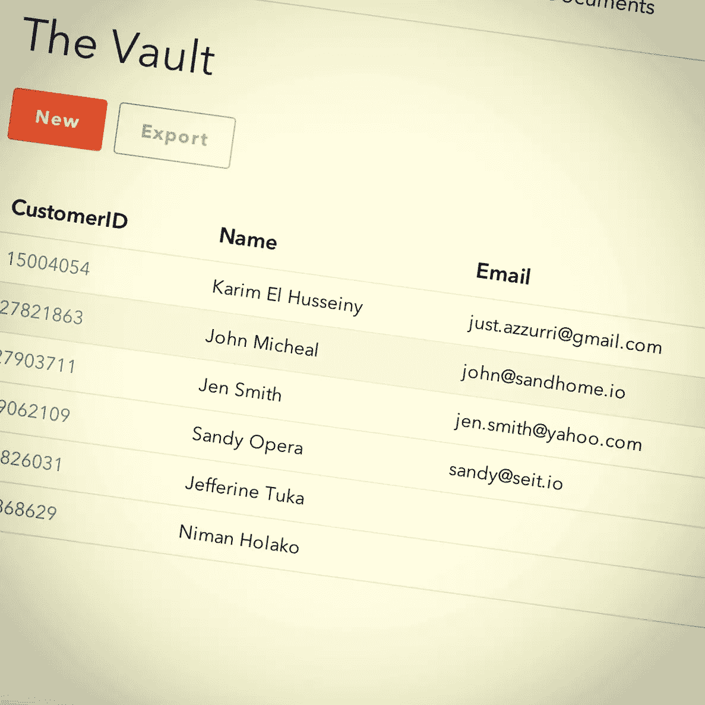
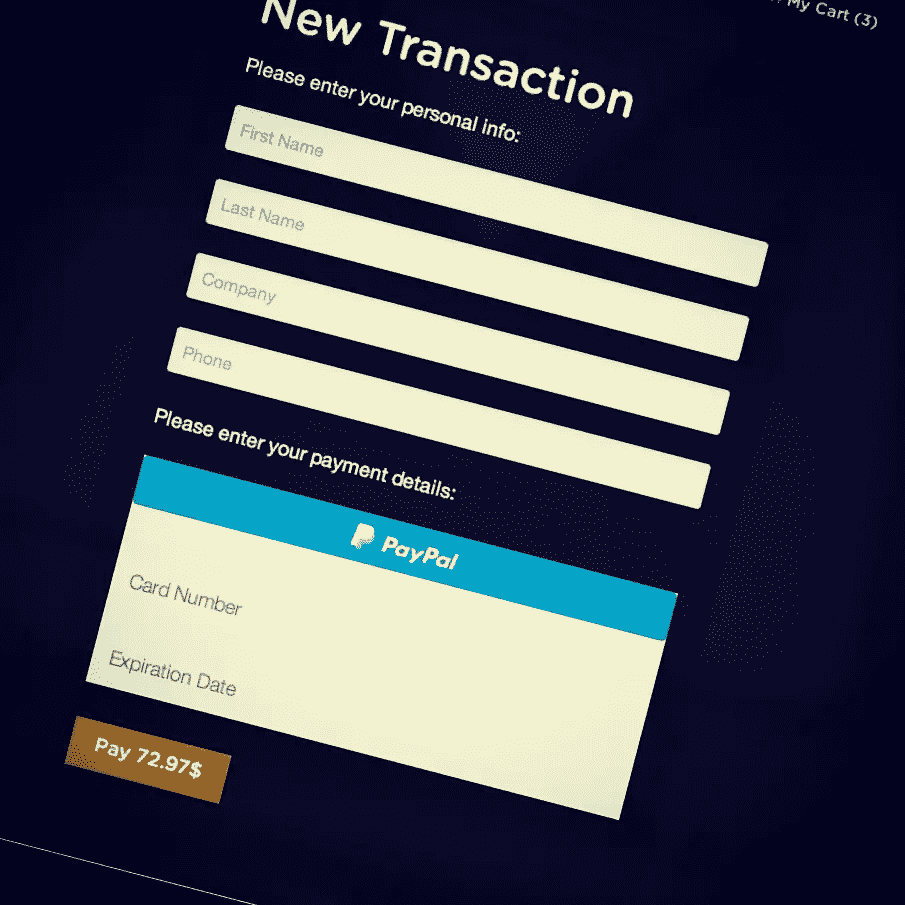
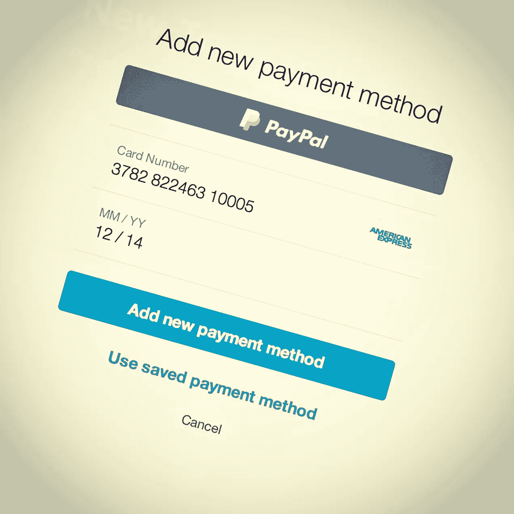
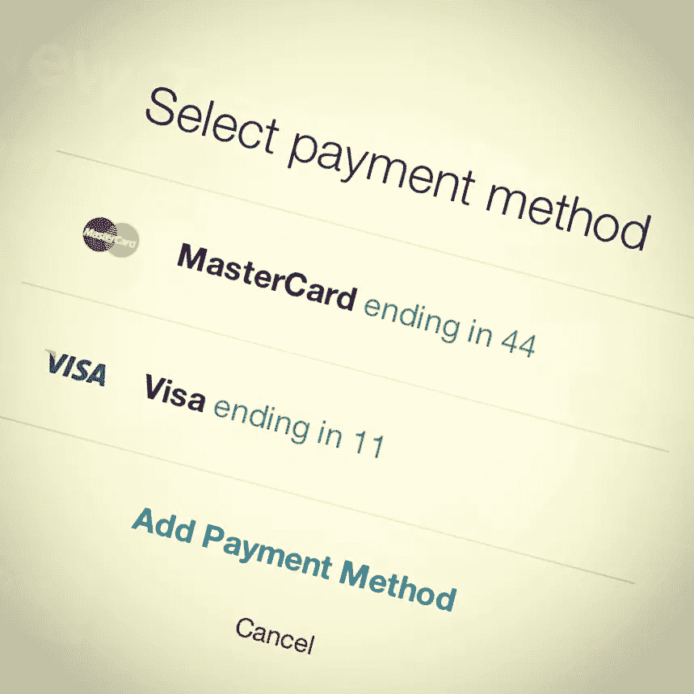

# 将 Braintree 支付集成到 Rails

> 原文：<https://www.sitepoint.com/integrate-braintree-payments-rails/>


在之前的一篇文章中，我讲述了如何从头开始使用 Rails 构建一个在线商店，解释了如何使用 Redis 构建一个购物车。本文继续沿着这条路走下去，添加了如何使用 Braintree 接受付款。Braintree 通过提供商家账户、支付网关、重复计费和信用卡存储来帮助在线企业处理信用卡支付。

> 本文的源代码与前面提到的文章在同一个存储库中，在 [Part2](https://github.com/Azzurrio/moviestore/tree/part2) 分支下。

## 步骤 1:准备申请

### 购买连接模型

我们还没有在`User` & `Movie`模型之间创建任何关系，这些模型应该代表每个用户购买的电影或每个电影的购买者。让我们使用`has_many :through`声明一个`many-to-many`关系，通过一个连接模型间接地建立关联。我们称它为`Purchase`。

用两个`foreign_keys`生成`Purchase`模型:

```
rails g model purchase movie_id:integer buyer_id:integer
```

向迁移添加一个组合外键的`index`:

```
class CreatePurchases < ActiveRecord::Migration
  def change
    create_table :purchases do |t|
      t.integer :movie_id
      t.integer :buyer_id
      t.timestamps
    end
    add_index :purchases, [:movie_id, :buyer_id], unique: true
  end
end
```

接下来，迁移您的数据库:

```
rake db:migrate
```

最后，将关联添加到模型中:

```
# Movie Model
has_many :purchases
has_many :buyers, through: :purchases

# User Model
has_many :purchases, foreign_key: :buyer_id
has_many :movies, through: :purchases

# Purchase Model
belongs_to :movie
belongs_to :buyer, class_name: 'User'
```

> 如果其他模型的名称不能从关联名称中导出，您可以使用 **`:class_name`** 和 **`:foreign_key`** 选项来提供模型名称和外键。

### 采购功能

我们需要实现几个基本方法来表示购买过程。在`User`中，添加`cart_total_price`，它返回购物车中电影的总价:

```
def cart_total_price
  total_price = 0
  get_cart_movies.each { |movie| total_price+= movie.price }
  total_price
end

def get_cart_movies
  cart_ids = $redis.smembers "cart#{id}"
  Movie.find(cart_ids)
end
```

另一种新方法是`purchase_cart_movies!`，循环播放购物车中的电影，购买电影，然后清空购物车:

```
def purchase_cart_movies!
  get_cart_movies.each { |movie| purchase(movie) }
  $redis.del "cart#{id}"
end

def purchase(movie)
  movies << movie unless purchase?(movie)
end

def purchase?(movie)
  movies.include?(movie)
end
```

### 嘲笑购买的电影

让我们假设，在购买任何电影之后，用户将有权在线观看它。我们可以通过为每部电影添加一个 YouTube 视频来模拟这个场景:

```
rails g migraiton add_video_url_to_movies
```

然后`rake db:migrate`你的数据库，给每部电影添加一些视频。我已经用一些 YouTube 网址更新了 [CSV](https://github.com/Azzurrio/moviestore/blob/part2/db/seeds_data/movies.csv) 文件，所以你可以使用它并重新设置你的数据库。

购买了电影的用户需要修改`show`视图。

```
<%if signed_in?%>
  <%if current_user.purchase? @movie %>
    <div class="flex-video">
      <iframe width="100%" height="" src="<%= @movie.video_url %>" frameborder="0" allowfullscreen></iframe>
    </div>
  <%else%>
    <%=link_to "", class: "button", data: {target: @cart_action, addUrl: add_to_cart_path(@movie), removeUrl: remove_from_cart_path(@movie)} do%>
      <i class="fi-shopping-cart"></i>
      <span><%=@cart_action%></span> Cart
    <%end%>
  <%end%>
<%end%>
```

还有，电影价格标签要改成“已购”。

```
<p class="label movie-label radius mb1">
  <%= (current_user && current_user.purchase?(@movie)) ? "Purchased" : "$#{@movie.price}" %>
</p>
```


## 步骤 2:初始化布伦特里

> **Braintree** 为企业提供在线或在移动应用程序中接受支付的能力。这是一个全栈支付平台，取代了从不同提供商处采购支付网关和商户账户的传统模式。

### 头脑树沙盒

Braintree 提供了一个沙箱，允许在没有承诺的情况下尝试 Braintree，并在投入生产之前测试您的集成。访问 Braintree [入门页面](https://www.braintreepayments.com/get-started)并注册一个沙盒帐户。


登录到您的沙盒帐户后，您将被重定向到一个仪表板，使您能够利用支付网关和金库。它还提供 PCI 兼容的信用卡处理、存储和检索。

### 沙盒密钥和配置

在沙盒仪表板内或用户帐户设置下的 API 密钥内，您会找到添加到应用程序初始化器中的应用程序密钥和配置。在生产环境中，您将使用生产 Braintree 帐户密钥替换这些密钥。

现在，让我们回到应用程序目录，将所需的 gem 添加到`Gemfile`:

```
gem 'braintree', '~> 2.33.1'
gem 'figaro', '~> 0.7.0'
```

> Figaro 是一个简单的 Rails 应用程序配置 gem，它使用 ENV 和一个 YAML 文件，通过鼓励将配置置于 Git 之外的约定，使安全配置 Rails 应用程序变得容易。

创建一个新的初始化器**/config/initializer/braintree . Rb**并添加基本的 brain tree 配置密钥作为环境变量，以安全地将密钥从版本控制中分离出来。

```
Braintree::Configuration.environment = :sandbox
Braintree::Configuration.logger = Logger.new('log/braintree.log')
Braintree::Configuration.merchant_id = ENV['BRAINTREE_MERCHANT_ID']
Braintree::Configuration.public_key = ENV['BRAINTREE_PUBLIC_KEY']
Braintree::Configuration.private_key = ENV['BRAINTREE_PRIVATE_KEY']
```

我们使用`figaro` gem 来轻松处理这些环境变量。在您的应用程序目录下运行:

```
$ rails generate figaro:install
```

这将创建一个带注释的 **config/application.yml** 文件，并将其添加到您的`.gitignore`文件中。

回到你的 Braintree 沙盒账户，在**配置代码**部分选择`Ruby`作为你的编程语言。复制服务器端配置密钥，添加到 **application.yml** 中，就大功告成了！

```
# Braintree configuration keys
BRAINTREE_MERCHANT_ID: 'use_your_merchant_id'
BRAINTREE_PUBLIC_KEY: 'use_your_public_key'
BRAINTREE_PRIVATE_KEY: 'use_your_private_key'
```

## 步骤 3:交易处理

### 布伦特里如何工作

Braintree 提供补充的客户端和服务器 SDK。它们代表了客户端加密解决方案，结合了 Braintree 的传统服务器到服务器(S2S)方法和创新的透明重定向(TR)解决方案的优点。简而言之，布伦特里机制可以描述如下:

1.  应用程序后端使用 Ruby SDK 为前端生成一个客户端令牌，前端使用该客户端令牌初始化 JavaScript SDK。
2.  Braintree 提供的 JavaScript 库使用公钥加密敏感数据，并在表单发布到服务器之前与 Braintree 通信。
3.  一旦数据到达 Braintree 的服务器，就会使用密钥对的私钥进行解密，然后向您的客户端代码返回一个支付方式随机数。您的代码将这个 nonce 传递到您的服务器。
4.  您的服务器端代码向 Ruby SDK 提供支付方法 nonce，以执行 Braintree 操作。

### 创建交易控制器

生成一个“事务”控制器，负责处理布伦特里操作:

```
$ rails g controller transactions new
```

配置 **routes.rb** 文件，将事务限制为仅执行`new`、`create`动作:

```
resources :transactions, only: [:new, :create]
```

显然，我们应该在访问这些控制器动作之前调用`authenticate_user!`，确保`current_user`已经向购物车添加了一些商品。

```
class TransactionsController < ApplicationController
  before_action :authenticate_user!
  before_action :check_cart!

  # Other Code

  private
  def check_cart!
    if current_user.get_cart_movies.blank?
      redirect_to root_url, alert: "Please add some items to your cart before processing your transaction!"
    end
  end
end
```

### 生成客户端令牌

在`new`动作中，生成客户端令牌并将其传递给 Braintree JS SDK 初始化器。将变量从 Rails 应用程序传递到 JavaScript 有多种方式。其中之一就是使用 [Gon](https://github.com/gazay/gon) 宝石。Gon 允许我们在控制器中设置变量，然后从 JavaScript 访问它们。让我们以通常的方式安装`Gon`，将它添加到`Gemfile`并运行`bundle install`。

```
gem 'gon', '~> 5.1.2'
```

接下来，通过在`head`部分添加`include_gon`来更新 **application.html.erb** 布局文件。

```
<%= include_gon %>
<%= stylesheet_link_tag "application" %>
<%= javascript_include_tag "vendor/modernizr" %>
<%= csrf_meta_tags %>
```

回到我们的`transactions#new`动作，在一个`gon`对象上设置变量。生成一个客户端令牌，并在 gon 变量上将它设置为`client_token`。

```
def new
  gon.client_token = generate_client_token
end

private
def generate_client_token
  Braintree::ClientToken.generate
end
```

### 安装 Braintree JavaSript SDK

> **注意**我们使用 Javascript 作为我们的客户端。Braintree 还支持其他客户端，如 Android 和 iOS。

要设置 JavaScript SDK，只需将它包含在您的应用程序布局中:

```
<script src="https://js.braintreegateway.com/v2/braintree.js"></script>
```

Braintree Client SDK 提供了完整的支付 UI，可轻松集成到您的应用中。它使您能够通过以下集成之一接受信用卡和 PayPal 付款:

1.  **嵌入式用户界面**,通过 PayPal 选项实现全功能结账。
2.  **一个贝宝按钮**。
3.  **信用卡令牌化**使用您自己定制的信用卡结账 UI，而不是插件。

我们将使用嵌入式结帐 UI 来创建新的交易表单。

### 使用嵌入式用户界面

为了使用直接付款用户界面，请配置用户界面将添加付款方法随机数的表单:

```
<div class="form-container radius-box glassy-bg small-10 small-centered medium-8 large-6 columns">
  <h2 class="mbs">New Transaction</h2>
  <%= form_tag transactions_path do%>
    <p>Please enter your payment details:</p>
    <div id="dropin"></div>
    <%=submit_tag "Pay #{current_user.cart_total_price}$", class: "button mt1" %>
  <%end%>
</div>
```

接下来，在 **transactions.js.coffee** 内部，初始化 Braintree Javascript SDK，给它我们使用`gon`生成的`client_token`，指定`dropin`集成，将支付 UI 添加到表单中。

```
$ ->
  unless typeof gon is 'undefined'
    braintree.setup(gon.client_token, 'dropin', { container: 'dropin' });
```

我们必须在 **carts/show.html.erb** 视图中显示一个结帐按钮，将用户重定向到新的交易表单。

```
<%=link_to "Checkout", new_transaction_path, class: "button" unless current_user.get_cart_movies.blank?%>
```


现在，访问新交易以查看完整的支付 UI，包括一个卡输入表单和一个由 Braintree 插件 UI 支持的 PayPal 按钮。

当用户完成支付表单并提交时，我们的客户端代码会生成一个支付方法随机数，供我们的服务器使用。敏感的、未加密的数据不包含在提交给我们服务器的表单中，因此，绝不会通过我们的系统。其他的，非支付领域将为我们所用。这意味着我们可以执行自定义验证，而不会面临安全风险或额外的[PCI 合规性](http://en.wikipedia.org/wiki/Payment_Card_Industry_Data_Security_Standard)要求，即让未加密的信用卡数据通过我们的环境。

### 创建交易记录

提交交易所需的最少属性是:交易金额和支付方式随机数。记住，随机数是由 JavaScript SDK 客户端代码提供的。

```
class TransactionsController < ApplicationController
  before_action :authenticate_user!
  before_action :check_cart

  def new
    gon.client_token = generate_client_token
  end

  def create
    @result = Braintree::Transaction.sale(
              amount: current_user.cart_total_price,
              payment_method_nonce: params[:payment_method_nonce])
    if @result.success?
      current_user.purchase_cart_movies!
      redirect_to root_url, notice: "Congraulations! Your transaction has been successfully!"
    else
      flash[:alert] = "Something went wrong while processing your transaction. Please try again!"
      gon.client_token = generate_client_token
      render :new
    end
  end

  private

  def generate_client_token
    Braintree::ClientToken.generate
  end

  def check_cart
    if current_user.get_cart_movies.blank?
      redirect_to root_url, alert: "Please add some items to your cart before processing your transaction!"
    end
  end

end
```

交易结果可能成功也可能不成功。当`@result.success?`返回`true`时，表示您的交易已被接受并存储为授权操作:

```
@result.transaction.status
#=> "authorized"
```

否则，如果验证拒绝交易被授权，它将返回`false`。结果对象将包含指示哪些参数无效的验证错误，以便您可以在视图中呈现它们:

```
@result.errors
```

此外，结果表明交易是使用 PayPal 帐户还是信用卡创建的:

```
@result.transaction.payment_instrument_type == PaymentInstrumentType::CreditCard
#=> true
```

好的，让我们测试一下我们的功能。**添加**一些电影到你的购物车，进入**我的购物车**页面，点击**结账**重定向到交易表单。**使用其中一个[信用卡号](https://developers.braintreepayments.com/javascript+ruby/reference/general/testing#credit-card-numbers)输入**随机信用卡信息，点击**支付**按钮提交您的支付信息。

如果一切正常，所选电影将被成功购买，您将可以在线观看它们。

现在，当访问您的沙盒帐户并点击**高级搜索**下的**交易**链接时，您可以搜索和浏览您的应用程序创建的所有交易。在这里，我们可以看到我们最新的交易，其状态为**授权**。

### 处理选项

您可能会注意到，布伦特里插件 UI 没有显示一些字段，如 CVV 和 AVS。建议将检查 CVV 作为帮助防止欺诈的初步方法。要添加它们，您必须为您的沙盒帐户启用和配置它们的规则。

将鼠标悬停在顶栏菜单的设置下拉菜单上，并点击**处理**选项。选项在**基本欺诈保护**下，然后您可以启用和配置它们的验证规则。在完成&保存您的配置之后，这些字段将会出现在 UI 中，它们的验证将会按照您配置的那样工作。

## 第四步:与顾客打交道

### 布伦特里拱顶

如果我们想把用户的信用卡和他们的账户关联起来，这样他们就不必每次结账时都添加信用卡的详细信息，该怎么办？。Braintree 提供了 Vault 技术来处理这个问题。利用保险库可以安全地存储客户的信用卡信息，而无需客户每次从我们的网站购买产品时重新输入信息。



### 创建客户

在保险库中创建新客户将返回一个用于访问该客户信息的 ID。因此，我们需要将`braintree_customer_id`添加到`User`模型中来存储这个客户 ID:

```
$ rails g migration add_braintree_customer_id_to_users
$ rake db:migrate
```

此外，在`User`模型中编写一个方法来检查用户是否有支付信息:

```
def has_payment_info?
  braintree_customer_id
end
```

接下来，为客户详细信息创建一个分部表单，并在`new`交易表单中有条件地呈现它:

```
# views/transactions/new.html.erb

<%= form_tag transactions_path do%>
  <%= render 'customer_form' unless current_user.has_payment_info? %>
  <p>Please enter your payment details:</p>
  <div id="dropin"></div>
  <%=submit_tag "Pay #{current_user.cart_total_price}$", class: "button mt1" %>
<%end%>

# views/transactions/_customer_form.html.erb`

<p>Please enter your personal info:</p>
<div class="mb1">
  <%= text_field_tag :first_name, "",placeholder: "First Name", class: "radius" %>
</div>
<div class="mb1">
  <%= text_field_tag :last_name, "",placeholder: "Last Name", class: "radius" %>
</div>
<div class="mb1">
  <%= text_field_tag :company, "",placeholder: "Company", class: "radius" %>
</div>
<div class="mb1">
  <%= text_field_tag :phone, "",placeholder: "Phone", class: "radius" %>
</div>
```



然后，返回到`transactions`控制器，更改`generate_client_token`私有方法，通过包含`customer_id`来识别现有客户。

```
private
def generate_client_token
  if current_user.has_payment_info?
    Braintree::ClientToken.generate(customer_id: current_user.braintree_customer_id)
  else
    Braintree::ClientToken.generate
  end
end
```

更新`create`动作，以便在`current_user`没有支付信息的情况下将新客户存储在保险库中:

```
def create
  unless current_user.has_payment_info?
    @result = Braintree::Transaction.sale(
                amount: current_user.cart_total_price,
                payment_method_nonce: params[:payment_method_nonce],
                customer: {
                  first_name: params[:first_name],
                  last_name: params[:last_name],
                  company: params[:company],
                  email: current_user.email,
                  phone: params[:phone]
                },
                options: {
                  store_in_vault: true
                })
  else
    @result = Braintree::Transaction.sale(
                amount: current_user.cart_total_price,
                payment_method_nonce: params[:payment_method_nonce])
  end

  if @result.success?
    current_user.update(braintree_customer_id: @result.transaction.customer_details.id) unless current_user.has_payment_info?
    current_user.purchase_cart_movies!
    redirect_to root_url, notice: "Congraulations! Your transaction has been successfully!"
  else
    flash[:alert] = "Something went wrong while processing your transaction. Please try again!"
    gon.client_token = generate_client_token
    render :new
  end
end
```

请注意，如果 Braintree Client SDK 成功使用支付方法 nonce，则该 nonce 将与已识别的客户相关联。为此，我们保持交易销售不变，以防`current_user`已经有支付信息。


### 存储多张信用卡

再次测试支付场景，您将看到之前输入的信用卡详细信息已经在那里了！您可以点击直接支付或更改支付方式来输入新的信用卡详细信息，这些信息也将链接到您的 Braintree 客户，并可用于将来的交易。





## 还需要更多吗？

您现在已经熟悉了 Braintree API，并且了解了如何处理他们的客户端和服务器 SDK。该应用程序可以接受来自用户信用卡的付款，并将它们存储在金库中。

使用 Braintree 还可以做更多的事情，包括为用户提供可以升级、降级或取消的订阅计划。也许我会在以后的文章中解决这个问题…

## 分享这篇文章