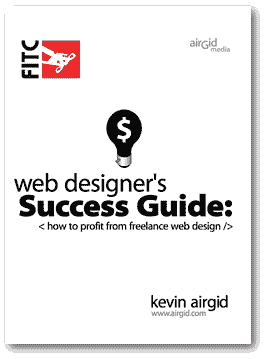
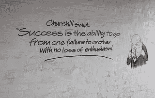
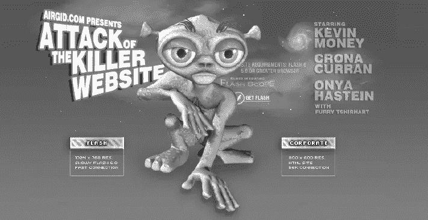
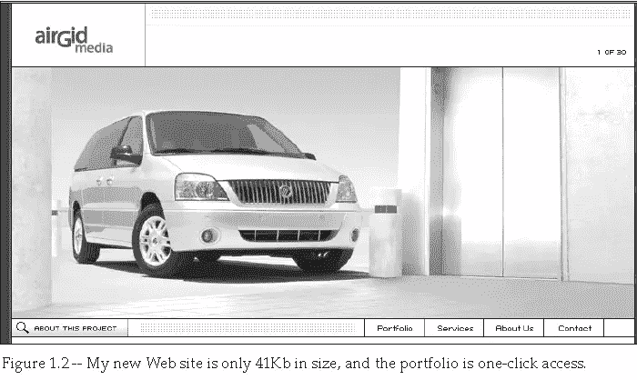

# 设计师必读之二:网页设计师的成功指南

> 原文：<https://www.sitepoint.com/web-designers-success-guide/>

继我上次[对史蒂夫·克鲁格的优秀作品*的评论*](https://www.sitepoint.com/review-dont-make-me-think/ "Review: fon't make me think")之后，今天我将看看凯文·艾尔吉德的 *[网页设计师的成功指南:如何从自由网页设计](http://www.airgid.com/blog/everything-creative/web-designers-success-guide-free-ebook/ "Site: Web Designers Success Guide")* 中获利。

这是另一本书，无论是新手还是有经验的设计师都应该至少浏览一下。即使你还没有考虑投身到可怕的自我雇佣的世界中，这本书也包含了很好的建议，让你在决定成为自由职业者时做好准备。

这本书开篇就明智地讨论了你是否真的准备好成为一名自由职业者。在这里，凯文根据自己的经验给出了建议(事实上，这本书里的一切都是如此)，并描述了任何设计师可能决定成为自由职业者的两个突出原因:乐趣或恐惧。

他在这里所说的要点是，许多设计师倾向于为了乐趣而开始做一些小工作，并从那里开始发展。

照片:gareth1953 原版

另一方面，恐惧因素是当你被迫处于一种情况，比如裁员，这意味着你不得不做些事情来赚钱。

最棒的是，他直言不讳地阐述了现实情况。也就是说，如果你双脚都跳了进去，那么当(没有)赚钱的时候，你很可能会大吃一惊。

> 他说，如果你先建立一个小客户群，对你的心理健康和银行存款余额都有好处。

除此之外，凯文建议你要么存足够的钱来度过前三个月，要么建立一个信用额度。这种建议是无价的。

对于那些以前从未经商的人来说，这是一个残酷的现实——可能会非常令人沮丧——发现实际上没有人在询价，你也没有赚到钱。

## 进入正题

接下来，第一章讲述创业的具体细节，首先看一下将会带来商机的网站。设计师经常按照自己的品味创建自己的网站，并没有真正考虑客户会怎么想。

凯文自己的第一个商业网站(见上图)与此非常相似。

虽然它受到了如此多的关注，以至于他不得不升级它的主机，但它却没有收到一个潜在客户的询问。这是由于它的下载时间和你必须点击四次才能访问相关信息的事实。

他的第二次尝试(见上图)要轻松得多，也更有企业感，当然，在吸引客户方面效果更好。这是非常宝贵的建议；虽然聪明地创建一个网站让你的创造力真正得到释放是很诱人的，但当涉及到商业时，这不是最好的一步。

## 吹响你的号角

第二章是关于自我推销，这可能是很多设计师和创意类型的人普遍存在的问题(我知道我过去也有过！)

照片:mgstanton

“吹嘘”自己、自己的才能和工作的能力，对我们很多人来说都不是天生的，但如果你在做生意，想要吸引新客户，这是必不可少的。

让我们面对现实吧，他们不会为你这么做，他们也不太可能认为你作为一个全新的自由职业者的不稳定的自信是可爱的。保证你自我宣传，做好就看你自己了。

这一章的另一个很好的建议是谷歌你自己。特别是对于我们这些已经在网络上生活了很多年的人来说，可能有一些你过去说过的话现在可能会后悔。如果是这样的话，它应该被发现并且最好被处理掉。

如果这是不可能的——那么，预先警告就是预先武装，对吗？

## 可行的建议

除了以上所述，本章和前面的章节以及后面的章节都有大量可行的建议。从在电子邮件活动中寻找合适的目标人群，到免费的广告机会，凯文确实确保了这本书在作为自由职业者建立自己的事业时具有真正的价值。

他研究了如何建立你的办公室，你应该关注哪些硬件和软件(虽然其中一些现在可能已经过时了，但如果你能把 2006 年可用的东西应用到现在，它仍然是相关的)，甚至是你能感受到的“幻灭感”。

至于后者，作为一名新的自由职业者，你不太可能有办法租一间办公室，甚至为你的家庭办公室配备令人敬畏的家具。虽然这可能会让你觉得你的办公室不会成为下一个谷歌，但凯文还是回到了现实主义，他说没有客户会真正看到它，所以不要花你没有装备的钱。

## 当好工作变坏时

摄影:Hebe Aguilera

Kevin 甚至根据自己的经验给出了有用的建议，告诉我们当事情出错时该怎么做。虽然作为一名自由职业者，永远不会有任何问题，每个客户都会很高兴，这是很好的想法，但这真的只有在设计师的天堂才会发生。

事情可能会出错，而且确实会出错，作为老板，你必须拿出勇气来处理它，即使你想做的只是躲在桌子底下，直到一切都消失。

Kevin 详细描述了他所犯的错误，他如何从中吸取教训，甚至当他解雇了一个糟糕的客户时(另一个需要学习的是，有时，有一些糟糕的客户不值得与之打交道)。

这一部分非常有用，很好地说明了当你为自己工作时会有多困难。

## 分享爱

第五章是关于如何分享你的知识以获得额外的收入。这是一个与今天的情况非常相关的建议，因为有一个巨大的机会，网站的形式会为你这样做付费。

凯文列举了以下潜在的收入增长:

*   书
*   演讲约会
*   博客

同样，所有这些都伴随着关于如何获得演出、关于博客部分要说/写什么的提示，甚至是关于如何安装和设置 WordPress 的合理深入的解释。这已经有点过时了，因为大多数主机都直接从 cPanel 提供一键安装，但仍然很有用。

## 房间里的累赘

照片:MTSOfan

第六章探讨了我保证会让每个新自由职业者挠头拔毛的事情——定价。当你开始知道要收多少钱时，这是很困难的。

网络也无济于事，正如凯文正确指出的那样，你应该对你在网上发现的所有关于定价的东西有所保留。

他讨论了固定费率和每小时收费模式，这两种模式对他最有效，以及如何有效地管理每个项目。

在第七章中，我们继续讨论内容管理系统，以及教客户如何更新他们自己的网站的价值。如今，由于 WordPress 越来越受欢迎，并被如此多的网站采用，这当然要容易得多。它很容易使用，大多数人都能很快学会如何写博客。由于这个原因，这可能是最不相关的一章，因为它确实涉及到如何使用各种软件为一个站点设置贡献者。

## 结论

这是一本很棒的书，它为你成为一名自由职业者提供了可行且有用的建议。对我来说，最棒的是它完全现实，没有粉饰——做生意可能压力很大，风险也很大。

然而，对于那些仍然想冒险一试的人来说，这本书提供了帮助你开始和发展可持续业务的建议。

## 分享这篇文章