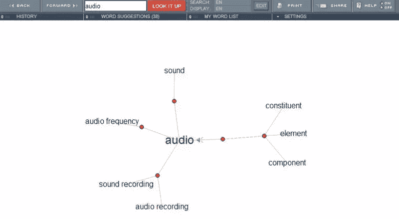
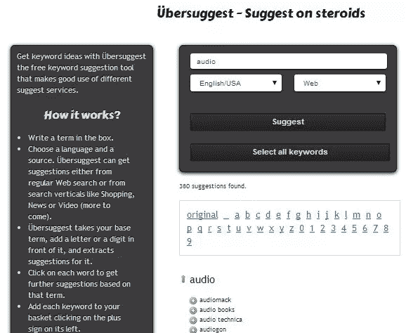
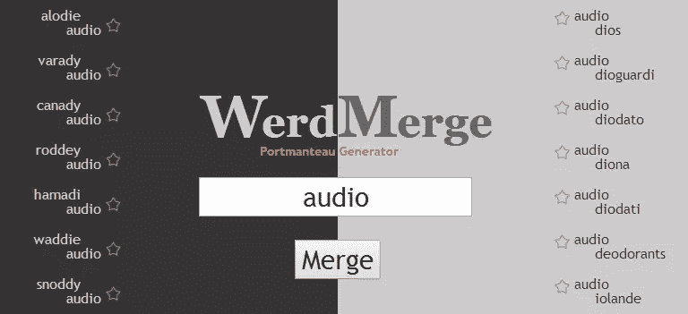
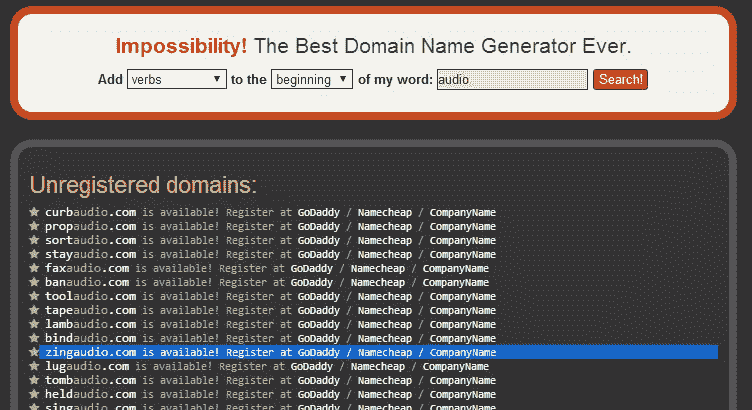
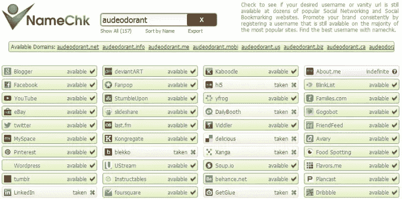
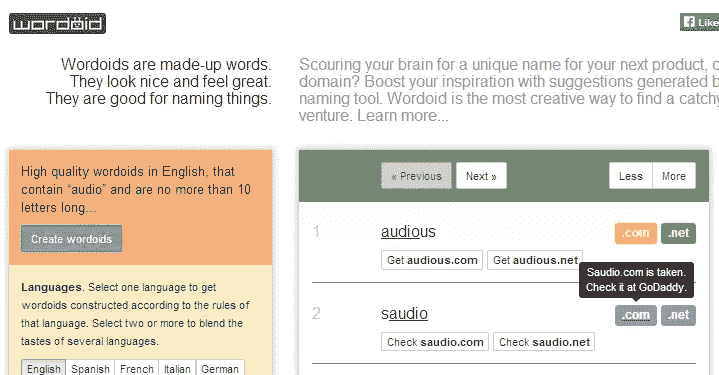
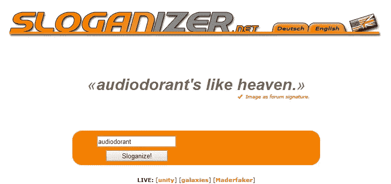

# 给你的创业公司命名的五大工具

> 原文：<https://www.sitepoint.com/top-5-tools-naming-your-startup/>

所以你有了一个很棒的创业点子。你肯定这是下一个大事件，你准备好开始把它变成现实。

但首先你需要一个名字。

如果你是伊万·威廉姆斯，你可能已经想出了一个像 Odeo 或者 Twitter 这样的名字。

相反，你有 100 个名字创意——它们都很糟糕。现在你在寻求外界的帮助。

给你的创业公司命名很难，但是碰巧的是，有一些有用的工具可以帮助你找到让你出名的品牌。

以下是五个最好的工具(加上一些没有成功的额外工具)。

### 视觉同义词库

命名过程的第一步是为您的品牌名称搜索一个基本词或词根，您可以修改或扩展它来创建您的最终品牌名称。

一旦你心中有了一个基本词，寻找可能更好的替代品牌名称是一个好主意。这就是[可视化同义词库](http://www.visualthesaurus.com/)的用武之地！

跟随 Evan 的脚步，如果你正在创办一家播客公司，你可能会想选择“音频”,而视觉词库会给你一系列同义词或与词根意思相似的词。

虽然这是一项付费服务，但它提供 14 天的无风险试用。

### UberSuggest

如果你要开始一个在线产品，为什么不把它命名为人们已经在搜索的东西呢？UberSuggest 告诉你的正是这一点。

输入你的基本单词，UberSuggest 会在上面附加字母和数字，然后检查建议。它显示了人们通常搜索包含你的基本词，按字母顺序排列。

UberSuggest 递归搜索建议，这意味着如果你点击一个建议，你会看到基于该建议的进一步建议，以此类推。

您可以在浏览列表时列出候选术语，然后稍后将列表转移到您的剪贴板。

### WerdMerge

一个*组合词*是通过将两个或更多的单词组合在一起并连接共享的字母或声音而生成的。Pinterest (pin 和 interest)就是一个组合词的例子。

WerdMerge 帮助你生成组合词，从你的基本词开始。

您可以点击 WerdMerge 中的建议单词来生成更多的组合体。

### 不可能

如果 portmanteaus 不起作用，你可以试试[不可能性](http://impossibility.org/)，这是一个通过在你的基本单词前附加或前置一定长度的形容词、名词或动词来寻找未注册域名的工具。让我们试试我们的基本词“音频”

您可以自定义是在基本单词的开头还是结尾添加单词，以及新单词的长度和性质。

### 纳梅奇克

一旦你相当确定一个名字，你应该开始考虑为这个名字注册域名和社交账户。当你坐下来放松时，NameChk 会为你做这些。只需输入您的潜在姓名，NameChk 会告诉您这些用户名是否可以在不同的社交网络上使用，以及您可以注册的可能域名。让我们挑选一个组合包，在不同的网站上查看它的可用性。

NameChk 可以节省大量时间。一旦你把你的清单缩小到几个最喜欢的，通过 NameChk 运行它们，以避免以后不愉快的惊喜。

### 奖励工具

还没名字吗？这里有几个额外的工具也很有用——或者只是很有趣。

[假词](http://fakeword.com/)是一个随机名称生成器，顾名思义，它会生成“kuzzooroo”或“azoofile”之类的无意义术语。

[Wordoid](http://wordoid.com/) 是一个命名工具，可以生成朗朗上口的名字，这些名字或者是随机的，或者包含一个指定的单词。可惜也显示了被取的域名！

Sloganizer 可以帮你想出一个新名字的口号。只要输入你的品牌，看魔术。

Sloganizer 基于随机集合生成标语，因此在使用它们之前应该小心。还有，生成的一些台词真的很搞笑。“呜啦啦，音响师”怎么样？

### 一项艰巨但重要的任务

选择一个伟大的品牌名称不是一件容易的事情，但是从长远来看这真的很重要。

当你陷入困境时，像这样的工具会是一个很大的帮助。

你遵循了什么过程来成功地命名你的品牌？你使用过这些工具来帮助你吗？

请在下面的评论中告诉我们！

## 分享这篇文章