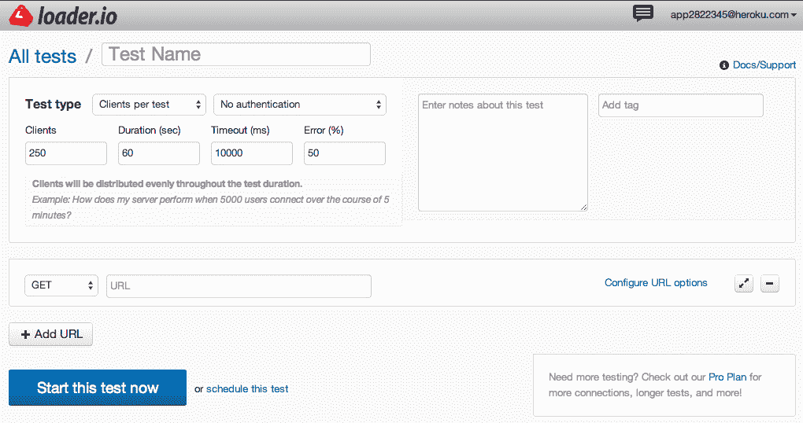
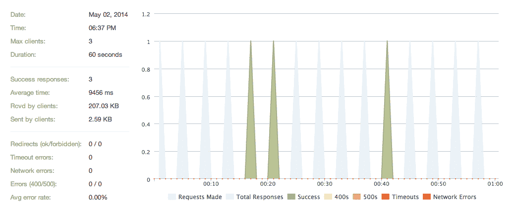
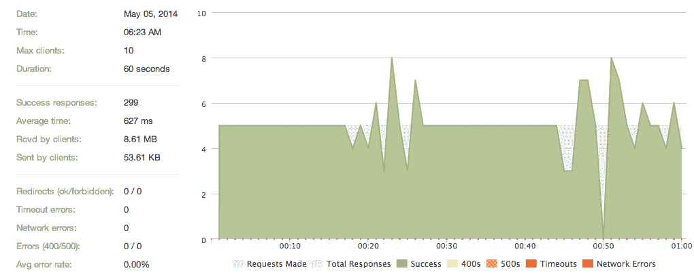

# 使用 Loader.io 进行压力测试

> 原文：<https://www.sitepoint.com/stress-testing-loader-io/>

如果你正在做一个严肃的项目，你希望它能够扩展。关于规模，你只有在真正需要的时候才会关注它。

我是巴西一家足球社交网络的首席技术官。说得好听点，足球在我的国家很大。今年夏天，我们将营销重点放在了世界杯上，准备让我们的应用程序支持尽可能多的用户。为此，我们必须进行基准测试和改进，但是我们如何进行负载测试呢？我们应该使用什么工具？这些只是我们开始应对这一挑战时出现的一些问题。

这时候我们发现了 [Loader.io](http://loader.io) 。

## 它从哪里来的？

**Loader.io** 是一个压力测试服务。它不仅仅是一个工具，因为它帮助你集中精力测试什么。它是由 [**SendGrid**](http://sendgrid.com/) 开发的，他们这样描述这项服务:

> > Loader.io is a free load test service that allows you to stress test your web application/API with thousands of concurrent connections
> > .

## 如何设置

Loader.io 试图模拟用户及其对应用程序的影响，而不是专注于代码。这给出了一个更真实的结果，但它并不是一个指南，显示了您应该关注哪些方面来提高性能。Loader.io 将揭示伸缩性问题，但修复方法取决于您。在我们的案例中，结果令人信服，我们能够找到我们的扩展问题。

首先，你需要一个 Loader.io 账户(别担心，它们不会填满你的收件箱)。注册时，您需要选择一个计划，免费的计划将满足您的初始需求。

创建帐户后，Loader.io 会要求您确认您的域。如果你需要，他们甚至可以帮助你。

Heroku 用户被覆盖，Loader.io 是一个插件，这使得使用该服务非常简单。

## 你的第一次测试

将 Loader.io 添加到应用程序后，使用 web 界面添加您的第一个测试:

有几个简单的选项来设置您的测试。该界面将引导您进入最符合您需求的场景:

*   每个测试的客户端*(客户端将在整个测试期间均匀分布。)*
*   每秒客户端数*(每秒将启动客户端数)*
*   保持客户端负载*(在整个测试期间，将保持恒定的客户端数量。)*

您选择的场景取决于您的应用程序的通常用户行为。在大多数情况下，您会想要创建多个测试来覆盖多个场景。

第一个测试准备就绪后，Loader.io 将运行它并显示结果。整个过程简单，结果也容易理解。我一会儿将浏览一些测试结果。

## 作为文化的压力测试

今天，我们习惯于为我们的应用程序编写测试/规范。这是红宝石文化的一部分。另一方面，压力测试并不是一个常见的优先事项。更多的时候，开发者和公司只是在灾难发生后才想到。

我认为 **Loader.io** 有助于让压力测试成为应用开发中更常见的实践。除了我到目前为止展示的所有东西，Loader.io 最好的特性之一是它的 API。它使得将您的测试集成到您的部署例程中成为可能。这是一个重大的胜利，有助于您保持代码的高质量和高性能以及可伸缩性。

## 真实案例

以下是我在决定是时候对我们的世界杯应用程序进行压力测试后的第一次测试结果(不用说，在这之后我真的很担心):

Loader.io 的结果指出，当 15 个请求在同一分钟内命中时(每 4 个中有 1 个)，**只有 3 个收到响应**。每次响应的平均时间是 9456 毫秒**(准确地说，是 9.5 秒)**。呀！

我从更新微小的细节开始，试图找出缩放问题。然后，我继续重构代码、添加索引和更新数据库结构。之后，我在所有可能的地方添加了缓存和堆肥缓存。

我 3 个晚上没睡觉，但是结果很惊人。这是第一次测试 3 天后的测试结果:

这一次不是一分钟 15 个请求，而是 300 个请求**(每秒 5 个)**。该应用程序现在有 299 个成功响应，平均响应时间为 627 毫秒**。是啊，太棒了。**

## 包裹

如果您对您的应用程序很认真，那么您需要尽快在可伸缩性方面下功夫。让压力测试成为你的开发文化的一部分是保证你在需要的时候准备好扩展你的应用程序的最好方法。

有很多工具可以帮助你对你的应用进行压力测试，但是 [Loader.io](http://loader.io) 绝对是我迄今为止用过的最好的工具之一。试试看。

## 分享这篇文章