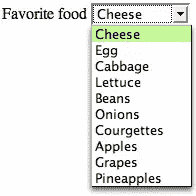

# 选择(HTML 元素)

> 原文：<https://www.sitepoint.com/select-html-element/>

## 描述

选择表单控件是一系列[选项](https://reference.sitepoint.com/html/option)元素的容器，这些元素在浏览器中显示为下拉菜单(即下拉列表)。除非使用 [multiple](https://reference.sitepoint.com/html/select/multiple) 属性，否则控件将允许用户从嵌套选项元素的内容生成的选项列表中选择一项。根据所使用的浏览器和操作系统，select 的呈现略有不同，并且众所周知，使用 CSS 样式化它是一个麻烦的 HTML 元素(因为显示是从操作系统继承的，而不是由浏览器提供的)。如果页面上没有足够的空间让列表显示在控件下方，它将在控件上方打开。下图显示了 Firefox 中扩展的选择列表。



## 例子

这个例子展示了一个非常简单的`select`元素:

```
<form>
  <label for="favoritefood">Favorite food</label>
  *<select name="favoritefood" id="favoritefood">*
    <option>Cheese</option>
    <option>Egg</option>
    <option>Cabbage</option>
    ⋮
  *</select>*
</form>
```

## 将此用于…

该元素用于允许访问者从一长串项目中进行选择。另一种方法是使用无线电输入选项，但这需要所有选项同时显示在页面上；选择控件通常显示在较小的页面空间中。

## 分享这篇文章