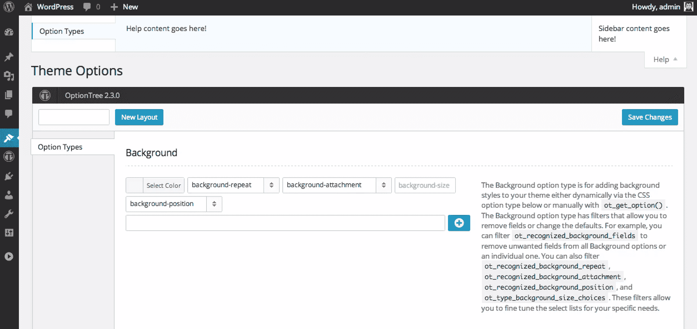

# option tree——WordPress 的主题选项 UI 生成器

> 原文：<https://www.sitepoint.com/optiontree-theme-options-ui-builder/>

你上一次对为你的 WordPress 主题建立一个管理面板感到兴奋是什么时候？很有可能你仍然在手工构建它，并且花费了大量的时间。这篇文章的目标是向你介绍 OptionTree，一个为 WordPress 构建的主题选项 UI。

### 选项树允许您做什么

OptionTree 将允许您建立一个强大的主题管理页面，包含各种功能，从一个简单的文本字段，到日期选择器和文件上传字段。还可以创建可重复的字段、选项卡式部分、自定义图库、CSS 编辑器等等。想想在不到一个小时的时间里，为你的定制文章类型和分类构建完整的管理选项和定制元盒。这就是 OptionTree 的全部，它为你设置了许多预先配置的选项类型，你可以在几分钟内使用它们，而不是几个小时。



期权树(来源:https://wordpress.org/plugins/option-tree/screenshots/)

## 在您的站点上安装选项树

使用 OptionTree 时，有两种可能的安装模式。第一个选项是**插件模式**，这将是 WordPress 希望你使用插件的传统方式。这意味着，OptionTree 是通过插件页面安装和激活的，并通过 WordPress 插件目录升级。第二个选项是**主题模式**，在这里你可以在你的主题目录中的某个地方包含 OptionTree，并利用你对主题升级路径的灵活性和控制。

下面，我将带你为每种安装模式设置 OptionTree。

#### 插件模式

1.  安装[选项树](https://wordpress.org/plugins/option-tree/ "Download OptionTree")并激活插件。要获得帮助，请参考 WordPress Codex 中的[管理插件](http://codex.wordpress.org/Managing_Plugins "Manage Plugins")页面。
2.  创建主题选项。
    *   主题选项 UI 生成器(**不推荐高级主题**)。
        *   只需通过主题选项 UI 构建器——一个易于使用的拖放界面——创建您的主题选项。
    *   手工打造。
        *   在你的主题中创建一个包含目录。
        *   在新的 inccludes 目录中创建 theme-options.php 文件。
        *   加载 theme-options.php 文件通过你的 functions.php 文件对你的主题。

#### 主题模式

这两种安装模式有一些相同的步骤，但是主题模式有 3 个主要区别。

1.  OptionTree 包含在你的主题目录中。
2.  您必须过滤 ot_theme_mode，以便它返回 true。
3.  您必须停用和/或删除选项树的插件版本。

##### 装置

1.  下载 OptionTree 的最新版本并解压缩。zip 目录。
2.  将选项树目录放在主题的根目录下。例如，服务器路径应该是/WP-content/themes/your-theme/option-tree/。
3.  将下面的代码添加到您的 functions.php 的最开始，以便它在其他任何事情之前执行。

```
/**
 * Activates Theme Mode
 */
add_filter( 'ot_theme_mode', '__return_true' );

/**
 * Loads OptionTree
 */
require( trailingslashit( get_template_directory() ) . 'option-tree/ot-loader.php' );
```

##### 在你的主题中加载你的主题选项

通过将以下代码添加到您的 functions.php 来加载 theme-options.php 文件

```
/**
 * Loads Theme Options
 */
require( trailingslashit( get_template_directory() ) . 'inc/theme-options.php' );
```

## 综合

通过 ot_get_option()函数可以将定制主题选项集成到主题中。如果没有保存任何值，则返回$default 或 false。

```
<?php echo ot_get_option( $option, $default ); ?>
```

## 探索选项树选项类型

让我们来探究 OptionTree 默认附带的一些 OptionTree 选项类型。

### 文本

文本选项类型主要用于保存字符串值。例如，任何字符长度相当短的可选或必需文本

```
// OptionTree Text Option Type

// Example code when being used as a Metabox or
// Exported OptionTree file to be used in Theme Mode
array(
    'id'          => 'spyr_demo_text',
    'label'       => __( 'Text', 'text-domain' ),
    'desc'        => __( 'Your description', 'text-domain' ),
    'type'        => 'text',
    'section'     => 'your_section',
)

// Get the value saved on Theme Options Page
$spyr_demo_text = ot_get_option( 'spyr_demo_text' );

// Get the value saved for a Page, Post or CPT ( Within the loop )
$spyr_demo_text = get_post_meta( $post->ID, 'spyr_demo_text', true );

// Wrap the value in a P tag and echo it
echo wpautop( $spyr_demo_text );
```

### 文本区域

Textarea 选项类型是一个大型字符串值，用于主题中的自定义代码或文本，并且有一个 **WYSIWYG** 编辑器，可以对其进行过滤以更改其显示方式。比如可以过滤 *wpautop* 、 *media_buttons* 、 *tinymce* 和 *quicktags* 。

```
// OptionTree Textarea Option Type

// Example code when being used as a Metabox or
// Exported OptionTree file to be used in Theme Mode
  array(
    'id'          => 'spyr_demo_textarea',
    'label'       => __( 'Textarea', 'text-domain' ),
    'desc'        => __( 'Your description', 'text-domain' ),
    'type'        => 'textarea',
    'section'     => 'your_section',
    'rows'        => '5',
  )

// Get the value saved on Theme Options Page
$spyr_demo_textarea = ot_get_option( 'spyr_demo_textarea' );

// Get the value saved for a Page, Post or CPT ( Within the loop )
$spyr_demo_textarea = get_post_meta( $post->ID, 'spyr_demo_textarea', true );

//  Whether to use wpautop for adding in paragraphs
// Defaults to True
add_filter( 'ot_wpautop' , 'spyr_textarea_ot_wpautop', 10, 1 );
function spyr_textarea_ot_wpautop( $field_id ) {
    if( 'spyr_demo_textarea' == $field_id ) {
        return false;
    }
}

// Remove the Media upload buttons for a particular field
// Defaults to True
add_filter( 'ot_media_buttons' , 'spyr_textarea_ot_media_buttons', 10, 1 );
function spyr_textarea_ot_media_buttons( $field_id ) {
    if( 'spyr_demo_textarea' == $field_id ) {
        return false;
    }
}

// Disable the Visual and Text views for a particular field
// Defaults to True
add_filter( 'ot_tinymce' , 'spyr_textarea_ot_tinymce', 10, 1 );
function spyr_textarea_ot_tinymce( $field_id ) {
    if( 'spyr_demo_textarea' == $field_id ) {
        return false;
    }
}
```

### 简单文本区

Textarea 简单选项类型是一个大型字符串值，用于主题中的自定义代码或文本。Textarea Simple 没有 WYSIWYG 编辑器，你可以用它来存储你的 Google Analytics 代码，并确保它在没有 p 标签的情况下正确显示。

```
// OptionTree Textarea Simple Option Type

// Example code when being used as a Metabox or
// Exported OptionTree file to be used in Theme Mode
array(
    'id'          => 'spyr_demo_textarea_simple',
    'label'       => __( 'Textarea Simple', 'text-domain' ),
    'desc'        => __( 'Your description', 'text-domain' ),
    'type'        => 'textarea-simple',
    'section'     => 'your_section',
    'rows'        => '5',
),

// Get the value saved on Theme Options Page
$spyr_demo_textarea_simple = ot_get_option( 'spyr_demo_textarea_simple' );

// Get the value saved for a Page, Post or CPT ( Within the loop )
$spyr_demo_textarea_simple = get_post_meta( $post->ID, 'spyr_demo_textarea_simple', true );

//  Whether to use wpautop for adding in paragraphs
// Defaults to False in Textarea Simple
add_filter( 'ot_wpautop' , 'spyr_textarea_simple_ot_wpautop', 10, 1 );
function spyr_textarea_simple_ot_wpautop( $field_id ) {
    if( 'spyr_demo_textarea_simple' == $field_id ) {
        return true;
    }
}
```

### 文本块标题为

标题为选项类型的文本块仅用于主题选项页面。它将允许您创建和显示 HTML，并在文本块上方有一个标题。然后，您可以使用标题为的 Textblock 添加一组更详细的说明，说明如何在您的主题中使用这些选项。你永远不会在你的主题模板文件中使用它，因为它不会保存一个值。

### 收音机

单选选项类型显示一组选项。它允许用户选择一个值，并将该值作为字符串返回，以便在自定义函数或循环中使用。

```
// OptionTree Radio Option Type

// Example code when being used as a Metabox or
// Exported OptionTree file to be used in Theme Mode
array(
    'id'          => 'spyr_demo_radio',
    'label'       => __( 'Radio', 'text-domain' ),
    'desc'        => __( 'Your description', 'text-domain' ),
    'type'        => 'radio',
    'section'     => 'your_section',
    'choices'     => array( 
        array(
        'value'       => 'yes',
        'label'       => __( 'Yes', 'text-domain' ),
        ),
        array(
        'value'       => 'no',
        'label'       => __( 'No', 'text-domain' ),
        ),
        array(
        'value'       => 'maybe',
        'label'       => __( 'Maybe', 'text-domain' ),
        )
    )
)

// Get the value saved on Theme Options Page
$spyr_demo_radio = ot_get_option( 'spyr_demo_radio' );

// Get the value saved for a Page, Post or CPT ( Within the loop )
$spyr_demo_radio = get_post_meta( $post->ID, 'spyr_demo_radio', true );
```

### 检验盒

复选框选项类型显示一组选项。它允许用户检查多个选项，并将该值作为数组返回，以便在自定义函数或循环中使用。

```
// OptionTree Checkbox Option Type

// Example code when being used as a Metabox or
// Exported OptionTree file to be used in Theme Mode
array(
    'id'          => 'spyr_demo_checkbox',
    'label'       => __( 'Checkbox', 'text-domain' ),
    'desc'        => __( 'Your description', 'text-domain' ),
    'type'        => 'checkbox',
    'section'     => 'your_section',
    'choices'     => array( 
        array(
        'value'       => 'no',
        'label'       => __( 'No', 'text-domain' ),
        ),
        array(
        'value'       => 'Yes',
        'label'       => __( 'Yes', 'text-domain' ),
        )
    )
)

// Get the value saved on Theme Options Page
// This will always return an array
$spyr_demo_checkbox = ot_get_option( 'spyr_demo_checkbox' );

// Get the value saved for a Page, Post or CPT ( Within the loop )
// This will always return an array
$spyr_demo_checkbox = get_post_meta( $post->ID, 'spyr_demo_checkbox', true );
```

### 发布复选框

帖子复选框选项类型显示帖子 id 列表。它允许用户在自定义函数或循环中检查多个 post IDs。

```
// OptionTree Post Checkbox Option Type

// Example code when being used as a Metabox or
// Exported OptionTree file to be used in Theme Mode
array(
    'id'          => 'spyr_demo_post_checkbox',
    'label'       => __( 'Post Checkbox', 'text-domain' ),
    'desc'        => __( 'Your description', 'text-domain' ),
    'type'        => 'post-checkbox',
    'section'     => 'your_section',
),

// Get the value saved on Theme Options Page
// This will always return an array
// Only the Post IDs will be returned
$spyr_demo_post_checkbox = ot_get_option( 'spyr_demo_post_checkbox' );

// Get the value saved for a Page, Post or CPT ( Within the loop )
// This will always return an array
// Only the Post IDs will be returned
$spyr_demo_post_checkbox = get_post_meta( $post->ID, 'spyr_demo_post_checkbox', true );

// Display only the latest 3 posts from a specific category (14)
add_filter( 'ot_type_post_checkbox_query', 'spyr_post_checkbox_custom_query', 10, 2 );
function spyr_post_checkbox_limit_posts( $query, $field_id ) {
    if( 'spyr_demo_post_checkbox' == $field_id ) {
        return array_merge( $query, array( 'posts_per_page' => 3, 'cat' => 14 ) );
    }
}
```

### 页面复选框

页面复选框选项类型显示页面 id 列表。它允许用户在自定义函数或循环中检查多个页面 id。

```
// OptionTree Page Checkbox Option Type

// Example code when being used as a Metabox or
// Exported OptionTree file to be used in Theme Mode

array(
    'id'          => 'spyr_demo_page_checkbox',
    'label'       => __( 'Page Checkbox', 'text-domain' ),
    'desc'        => __( 'Your description', 'text-domain' ),
    'type'        => 'page-checkbox',
    'section'     => 'your_section',
),

// Get the value saved on Theme Options Page
// This will always return an array
// Only the Page IDs will be returned
$spyr_demo_page_checkbox = ot_get_option( 'spyr_demo_page_checkbox' );

// Get the value saved for a Page, Post or CPT ( Within the loop )
// This will always return an array
// Only the Page IDs will be returned
$spyr_demo_page_checkbox = get_post_meta( $post->ID, 'spyr_demo_page_checkbox', true );

// Display only top level pages
add_filter( 'ot_type_page_checkbox_query', 'spyr_page_checkbox_top_level_only', 10, 2 );
function spyr_page_checkbox_top_level_only( $query, $field_id ) {
    if( 'spyr_demo_page_checkbox' == $field_id ) {
        return array_merge( $query, array( 'post_parent' => 0 ) );
    }   
}

// Display only sub-pages from a parent page
add_filter( 'ot_type_page_checkbox_query', 'spyr_page_checkbox_sub_pages', 10, 2 );
function spyr_page_checkbox_sub_pages( $query, $field_id ) {
    if( 'spyr_demo_page_checkbox' == $field_id ) {
        return array_merge( $query, array( 'post_parent' => 7 ) );
    }   
}
```

### 自定义帖子类型复选框

自定义文章类型选择选项类型显示任何可用的 WordPress 文章类型或自定义文章类型的 id 列表。它允许用户在自定义函数或循环中检查多个 post IDs。在 *post_type* 字段中至少需要一个有效的 *post_type* 。

```
// OptionTree Custom Post Type Checkbox Option Type

// Example code when being used as a Metabox or
// Exported OptionTree file to be used in Theme Mode

array(
    'id'          => 'spyr_demo_custom_post_type_checkbox',
    'label'       => __( 'Custom Post Type Checkbox', 'text-domain' ),
    'desc'        => __( 'Your description', 'text-domain' ),
    'type'        => 'custom-post-type-checkbox',
    'section'     => 'your_section',
    'post_type'   => 'movie',
)

// Get the value saved on Theme Options Page
// This will always return an array
// Only the Page IDs will be returned
$spyr_demo_page_checkbox = ot_get_option( 'spyr_demo_custom_post_type_checkbox' );

// Get the value saved for a Page, Post or CPT ( Within the loop )
// This will always return an array
// Only the Page IDs will be returned
$spyr_demo_page_checkbox = get_post_meta( $post->ID, 'spyr_demo_custom_post_type_checkbox', true );

// Add a second CPT to the list
add_filter( 'ot_type_custom_post_type_checkbox_query', 'spyr_cpt_checkbox_include_trailers', 10, 2 );
function spyr_cpt_checkbox_include_trailers( $query, $field_id ) {
    if( 'spyr_demo_custom_post_type_checkbox' == $field_id ) {
        return array_merge( $query, array( 'post_type' => 'movie_trailers' ) );
    }       
}
```

### 类别复选框

类别复选框选项类型显示类别 id 列表。它允许用户检查多个类别 id，并将该值作为数组返回，以便在自定义函数或循环中使用。

```
// OptionTree Category Checkbox Option Type

// Example code when being used as a Metabox or
// Exported OptionTree file to be used in Theme Mode

array(
'id'          => 'spyr_demo_category_checkbox',
'label'       => __( 'Category Checkbox', 'text-domain' ),
'desc'        => __( 'Your description', 'text-domain' ),
'type'        => 'category-checkbox',
'section'     => 'your_section',
),

// Get the value saved on Theme Options Page
// This will always return an array
// Only the Category IDs will be returned
$spyr_demo_category_checkbox = ot_get_option( 'spyr_demo_category_checkbox' );

// Get the value saved for a Page, Post or CPT ( Within the loop )
// This will always return an array
// Only the Category IDs will be returned
$spyr_demo_category_checkbox = get_post_meta( $post->ID, 'spyr_demo_category_checkbox', true );

// Hide categories without a post
add_filter( 'ot_type_category_checkbox_query', 'spyr_ot_type_category_checkbox_hide_empty', 10, 2 );
function spyr_ot_type_category_checkbox_hide_empty( $query, $field_id ) {
    if( 'spyr_demo_category_checkbox' == $field_id ) {
        return array_merge( $query, array( 'hide_empty' => true ) );
    }   
}
```

### 标签复选框

标签复选框选项类型显示标签 id 列表。它允许用户检查多个标签 id，并将该值作为数组返回，以便在自定义函数或循环中使用。

```
// OptionTree Tag Checkbox Option Type

// Example code when being used as a Metabox or
// Exported OptionTree file to be used in Theme Mode

array(
    'id'          => 'spyr_demo_tag_checkbox',
    'label'       => __( 'Tag Checkbox', 'text-domain' ),
    'desc'        => __( 'Your description', 'text-domain' ),
    'type'        => 'tag-checkbox',
    'section'     => 'your_section',
)

// Get the value saved on Theme Options Page
// This will always return an array
// Only the Category IDs will be returned
$spyr_demo_tag_checkbox = ot_get_option( 'spyr_demo_tag_checkbox' );

// Get the value saved for a Page, Post or CPT ( Within the loop )
// This will always return an array
// Only the Category IDs will be returned
$spyr_demo_tag_checkbox = get_post_meta( $post->ID, 'spyr_demo_tag_checkbox', true );
```

### 分类复选框

分类复选框选项类型显示分类 id 列表。它允许用户检查多个分类法 id，并将该值作为数组返回，以便在自定义函数或循环中使用。

```
// OptionTree Taxonomy Checkbox Option Type

// Example code when being used as a Metabox or
// Exported OptionTree file to be used in Theme Mode

array(
    'id'          => 'spyr_demo_taxonomy_checkbox',
    'label'       => __( 'Taxonomy Checkbox', 'text-domain' ),
    'desc'        => __( 'Your description', 'text-domain' ),
    'type'        => 'taxonomy-checkbox',
    'section'     => 'your_section',
    'taxonomy'    => 'category,post_tag', // Comma separated list
)

// Get the value saved on Theme Options Page
// This will always return an array
// Only the Category IDs will be returned
$spyr_demo_taxonomy_checkbox = ot_get_option( 'spyr_demo_taxonomy_checkbox' );

// Get the value saved for a Page, Post or CPT ( Within the loop )
// This will always return an array
// Only the Category IDs will be returned
$spyr_demo_taxonomy_checkbox = get_post_meta( $post->ID, 'spyr_demo_taxonomy_checkbox', true );

// Hide categories and tags not having a post
add_filter( 'ot_type_taxonomy_checkbox_query', 'spyr_ot_type_taxonomy_checkbox_hide_empty', 10, 2 );
function spyr_ot_type_taxonomy_checkbox_hide_empty( $query, $field_id ) {
    if( 'demo_taxonomy_checkbox' == $field_id ) {
        return array_merge( $query, array( 'hide_empty' => false ) );
    }       
}

// Override taxonomy via code
add_filter( 'ot_type_taxonomy_checkbox_query', 'spyr_ot_type_taxonomy_checkbox_add_genre', 10, 2 );
function spyr_ot_type_taxonomy_checkbox_add_genre( $query, $field_id ) {
    if( 'demo_taxonomy_checkbox' == $field_id ) {
        return array_merge( $query, array( 'taxonomy' => 'genre' ) );
    }       
}
```

### 挑选

选择选项类型用于列出您希望从选择列表中选择的任何内容。

```
// OptionTree Select Option Type

// Example code when being used as a Metabox or
// Exported OptionTree file to be used in Theme Mode

array(
    'id'          => 'spyr_demo_select',
    'label'       => __( 'Select', 'text-domain' ),
    'desc'        => __( 'Your description', 'text-domain' ),
    'type'        => 'select',
    'section'     => 'your_section',
    'choices'     => array( 
            array(
                'value'       => 'yes',
                'label'       => __( 'Yes', 'text-domain' ),
            ),
            array(
                'value'       => 'no',
                'label'       => __( 'No', 'text-domain' ),
            ),
            array(
                'value'       => 'maybe',
                'label'       => __( 'Maybe', 'text-domain' ),
            )
        )
)

// Get the value saved on Theme Options Page
$spyr_demo_select = ot_get_option( 'spyr_demo_select' );

// Get the value saved for a Page, Post or CPT ( Within the loop )
$spyr_demo_select = get_post_meta( $post->ID, 'spyr_demo_select', true );
```

### 后期选择

文章选择选项类型显示文章 id 列表。它将返回一个用于自定义函数或循环的 post ID。

```
// OptionTree Post Select Option Type

// Example code when being used as a Metabox or
// Exported OptionTree file to be used in Theme Mode

array(
    'id'          => 'spyr_demo_post_select',
    'label'       => __( 'Post Select', 'text-domain' ),
    'desc'        => __( 'Your description', 'text-domain' ),
    'type'        => 'post-select',
    'section'     => 'option_types',
)

// Get the ID value saved on Theme Options Page
$spyr_demo_post_select = ot_get_option( 'spyr_demo_post_select' );

// Get the ID value saved for a Page, Post or CPT ( Within the loop )
$spyr_demo_post_select = get_post_meta( $post->ID, 'spyr_demo_post_select', true );

// Get the Post's title
$title = get_the_title( $spyr_demo_post_select );

// Get the permalink 
$link = get_permalink( $spyr_demo_post_select );

// Limit the number of posts displayed on the drop down for selection
add_filter( 'ot_type_post_select_query', 'spyr_ot_type_post_select_query_set_limit', 10, 2 );
function spyr_ot_type_post_select_query_set_limit( $query, $field_id ) {
    if( 'spyr_demo_post_select' == $field_id ) {
        return array_merge( $query, array( 'posts_per_page' => 10 ) );
    }       
}

// Populate the drop down select from posts belonging to this category (14)
add_filter( 'ot_type_post_select_query', 'spyr_ot_type_post_select_query_set_cat', 10, 2 );
function spyr_ot_type_post_select_query_set_cat( $query, $field_id ) {
    if( 'spyr_demo_post_select' == $field_id ) {
        return array_merge( $query, array( 'cat' => 14 ) );
    }       
}
```

### 页面选择

页面选择选项类型显示页面 id 列表。它将返回一个用于自定义函数或循环的页面 ID。

```
// OptionTree Page Select Option Type

// Example code when being used as a Metabox or
// Exported OptionTree file to be used in Theme Mode

array(
    'id'          => 'spyr_demo_page_select',
    'label'       => __( 'Page Select', 'text-domain' ),
    'desc'        => __( 'Your description', 'text-domain' ),
    'type'        => 'page-select',
    'section'     => 'option_types',
)

// Get the ID value saved on Theme Options Page
$spyr_demo_page_select = ot_get_option( 'spyr_demo_page_select' );

// Get the ID value saved for a Page, Post or CPT ( Within the loop )
$spyr_demo_page_select = get_post_meta( $post->ID, 'spyr_demo_page_select', true );

// Get the Post's title
$title = get_the_title( $spyr_demo_page_select );

// Get the permalink 
$link = get_permalink( $spyr_demo_page_select );

// Populate the drop down select with subpages from a pre-defined Parent page (7)
add_filter( 'ot_type_page_select_query', 'spyr_ot_type_page_select_query_set_parent', 10, 2 );
function ot_type_page_select_query_set_parent( $query, $field_id ) {
    if( 'spyr_demo_page_select' == $field_id ) {
        return array_merge( $query, array( 'post_parent' => 7 ) );
    }       
}
```

### 自定义帖子类型选择

自定义文章类型选择选项类型显示任何可用的 WordPress 文章类型或自定义文章类型的 id 列表。它将返回一个用于自定义函数或循环的 post ID。在 *post_type* 字段中至少需要一个有效的 *post_type* 。

```
// OptionTree Custom Post Type Select Option Type

// Example code when being used as a Metabox or
// Exported OptionTree file to be used in Theme Mode

array(
    'id'          => 'spyr_demo_custom_post_type_select',
    'label'       => __( 'Custom Post Type Select', 'text-domain' ),
    'desc'        => __( 'Your description', 'text-domain' ),
    'type'        => 'custom-post-type-select',
    'section'     => 'your_section',
    'post_type'   => 'movie',
)

// Get the ID value saved on Theme Options Page
$spyr_demo_custom_post_type_select = ot_get_option( 'spyr_demo_custom_post_type_select' );

// Get the ID value saved for a Page, Post or CPT ( Within the loop )
$spyr_demo_custom_post_type_select = get_post_meta( $post->ID, 'spyr_demo_custom_post_type_select', true );

// Get the Post's title
$title = get_the_title( $spyr_demo_custom_post_type_select );

// Get the permalink 
$link = get_permalink( $spyr_demo_custom_post_type_select );

// Override Custom Post Type via code
add_filter( 'ot_type_custom_post_type_select_query', 'spyr_ot_type_cpt_select_query_set_cpt', 10, 2 );
function spyr_ot_type_cpt_select_query_set_cpt( $query, $field_id ) {
    if( 'spyr_demo_custom_post_type_select' == $field_id ) {
        return array_merge( $query, array( 'post_type' => 'movie' ) );
    }   
}
```

### 类别选择

类别选择选项类型显示类别 id 列表。它允许用户只选择一个类别 ID，并将返回该值用于自定义函数或循环。

```
// OptionTree Category Select Option Type

// Example code when being used as a Metabox or
// Exported OptionTree file to be used in Theme Mode

array(
    'id'          => 'spyr_demo_category_select',
    'label'       => __( 'Category Select', 'text-domain' ),
    'desc'        => __( 'Your description', 'text-domain' ),
    'type'        => 'category-select',
    'section'     => 'your_section',
)

// Get the ID value saved on Theme Options Page
$spyr_demo_category_select = ot_get_option( 'spyr_demo_category_select' );

// Get the ID value saved for a Page, Post or CPT ( Within the loop )
$spyr_demo_category_select = get_post_meta( $post->ID, 'spyr_demo_category_select', true );

// Get the Category name
$name = get_the_category_by_ID( $spyr_demo_category_select );

// Get the category description
$cat_desc = category_description( $spyr_demo_category_select );

// Get the Archive link for this category
$link = get_category_link( $spyr_demo_category_select );

// Hide categories with zero posts from the drop down list
add_filter( 'ot_type_category_select_query', 'spyr_ot_type_category_select_hide_cats', 10, 2 );
function spyr_ot_type_category_select_hide_cats( $query, $field_id ) {
    if( 'demo_category_select' == $field_id ) {
        return array_merge( $query, array( 'hide_empty' => true ) );
    }   
}
```

### 标签选择

标签选择选项类型显示标签 id 列表。它允许用户只选择一个标签 ID，并将返回该值用于自定义函数或循环。

```
// OptionTree Tag Select Option Type

// Example code when being used as a Metabox or
// Exported OptionTree file to be used in Theme Mode

array(
    'id'          => 'spyr_demo_tag_select',
    'label'       => __( 'Tag Select', 'text-domain' ),
    'desc'        => __( 'Your description', 'text-domain' ),
    'type'        => 'tag-select',
    'section'     => 'your_section',
)

// Get the ID value saved on Theme Options Page
$spyr_demo_tag_select = ot_get_option( 'spyr_demo_tag_select' );

// Get the ID value saved for a Page, Post or CPT ( Within the loop )
$spyr_demo_tag_select = get_post_meta( $post->ID, 'spyr_demo_tag_select', true );

// Get the Tag's name
$tag = get_term_by( 'id', $spyr_demo_tag_select, 'post_tag', OBJECT, '' );
$name = $tag->name;

// Get the Archive link for this tag
$link = get_tag_link( $spyr_demo_tag_select );
```

### 分类选择

分类选择选项类型显示分类 id 列表。它允许用户只选择一个分类法 ID，并将返回该值用于自定义函数或循环。

```
// OptionTree Taxonomy Select Option Type

// Example code when being used as a Metabox or
// Exported OptionTree file to be used in Theme Mode

array(
    'id'          => 'spyr_demo_taxonomy_select',
    'label'       => __( 'Taxonomy Select', 'text-domain' ),
    'desc'        => __( 'Your description', 'text-domain' ),
    'type'        => 'taxonomy-select',
    'section'     => 'your_section',
    'taxonomy'    => 'category,post_tag', // Defaults to Categories and Tags
)

// Get the ID value saved on Theme Options Page
$spyr_demo_taxonomy_select = ot_get_option( 'spyr_demo_taxonomy_select' );

// Get the ID value saved for a Page, Post or CPT ( Within the loop )
$spyr_demo_taxonomy_select = get_post_meta( $post->ID, 'spyr_demo_taxonomy_select', true );

// Override Taxonomy via code
add_filter( 'ot_type_taxonomy_select_query', 'spyr_ot_type_taxonomy_select_set_tax', 10, 2 );
function spyr_ot_type_taxonomy_select_set_tax( $query, $field_id ) {
    if( 'spyr_demo_taxonomy_select' == $field_id ) {
        return array_merge( $query, array( 'taxonomy' => array( 'genre' ) ) );
    }   
}
```

### 侧栏选择

这种选项类型使得用户可以选择一个 WordPress 注册的侧边栏用于特定的区域。通过使用提供的两个过滤器， *ot_recognized_sidebars* 和*ot _ recognized _ sidebars _ { $ field _ id }*，我们可以选择特定内容区域上可用的侧边栏。

例如，如果我们创建了一个 WordPress 主题，它提供了改变博客侧边栏的能力，而我们不想让页脚侧边栏出现在这个区域，我们可以手动或者使用一个正则表达式来取消设置这些侧边栏，如果我们有一个像 *footer-sidebar-$i* 这样的通用名称。

```
// OptionTree Sidebar Select Option Type

// Example code when being used as a Metabox or
// Exported OptionTree file to be used in Theme Mode
// This option type will read all of your available 
// Sidebars on your theme, so there is very little work to do here
array(
    'id'          => 'spyr_demo_sidebar_select',
    'label'       => __( 'Sidebar Select', 'text-domain' ),
    'desc'        => __( 'Your description', 'text-domain' ),
    'type'        => 'sidebar-select',
    'section'     => 'your_section',
)

// Get the ID value saved on Theme Options Page
$spyr_demo_sidebar_select = ot_get_option( 'spyr_demo_sidebar_select' );

// Get the ID value saved for a Page, Post or CPT ( Within the loop )
$spyr_demo_sidebar_select = get_post_meta( $post->ID, 'spyr_demo_sidebar_select', true );

// Call the sidebar
dynamic_sidebar( $spyr_demo_sidebar_select );
```

## 结论

在本文中，我们介绍了 OptionTree，它涵盖了一些最基本的字段，并研究了如何从主题选项页面或从帖子、页面甚至自定义帖子类型访问它们的值。

## 分享这篇文章