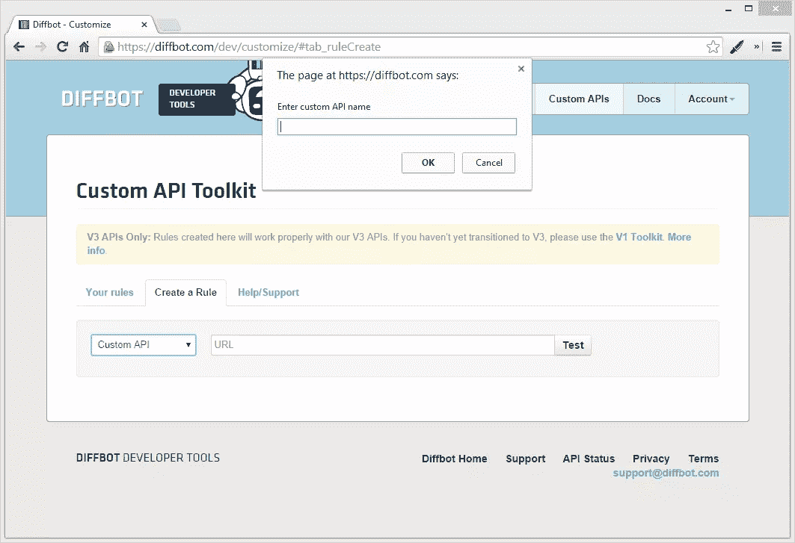
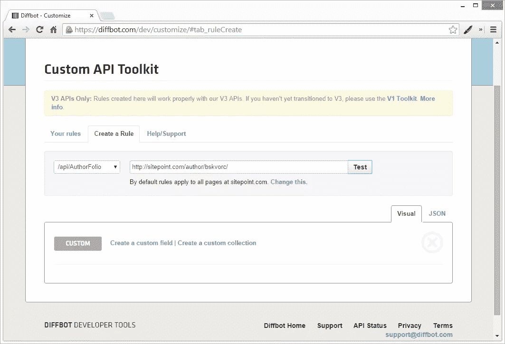
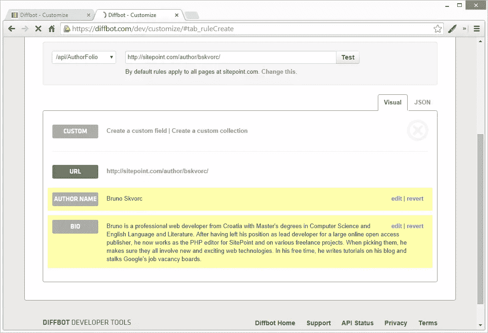
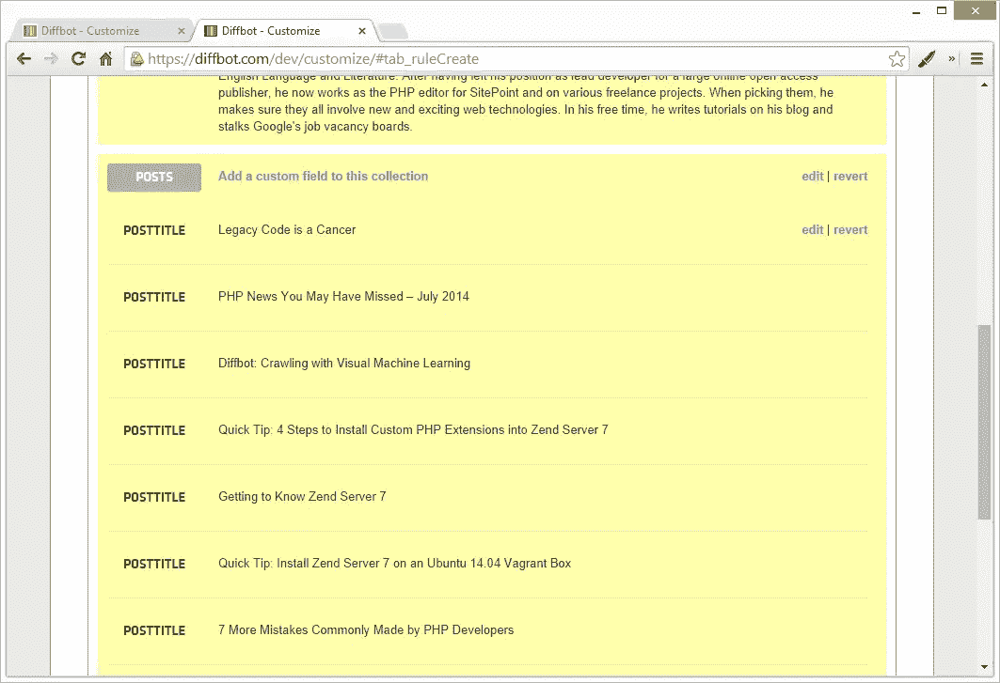
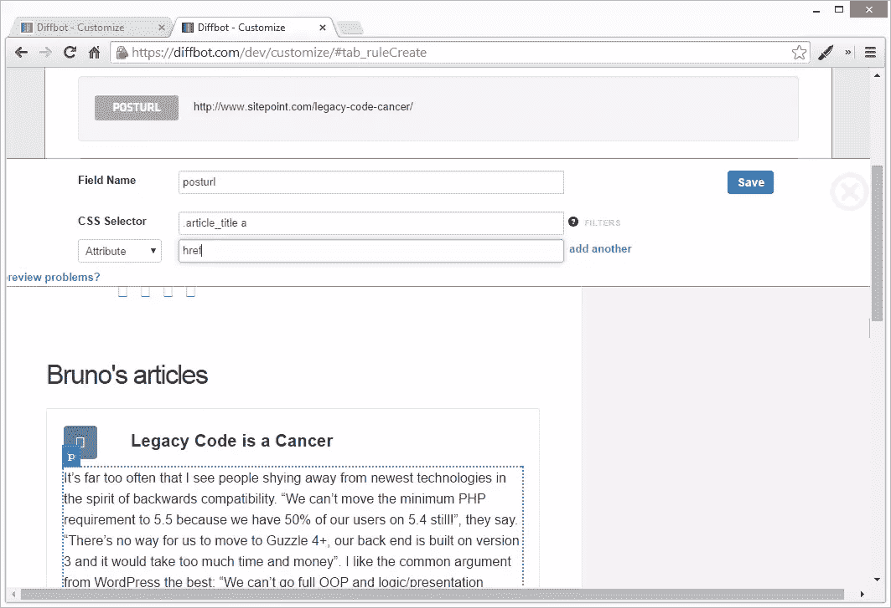
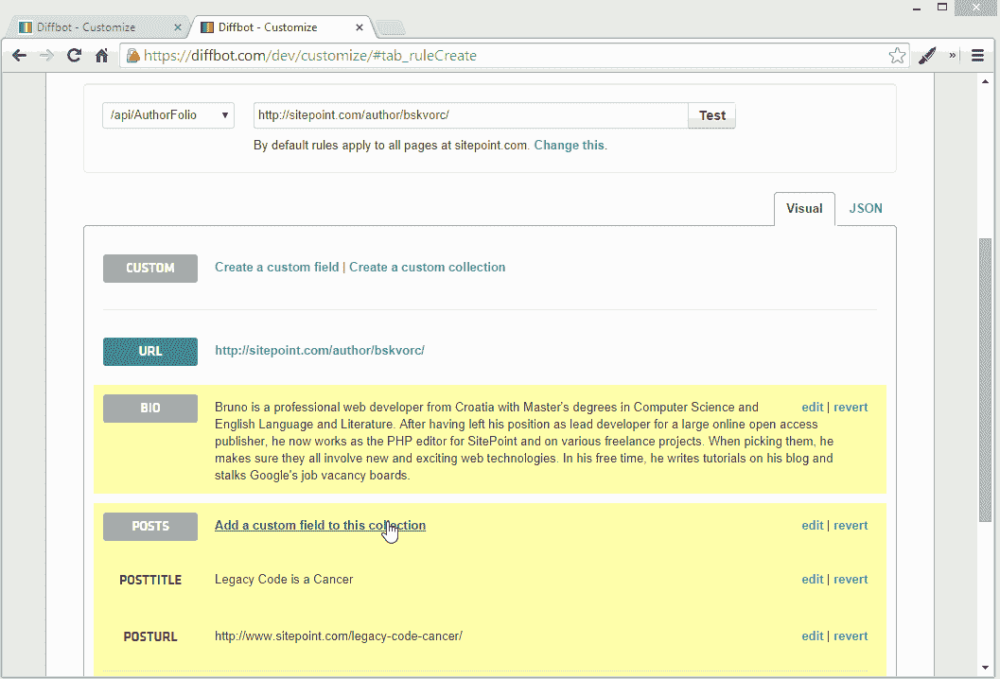
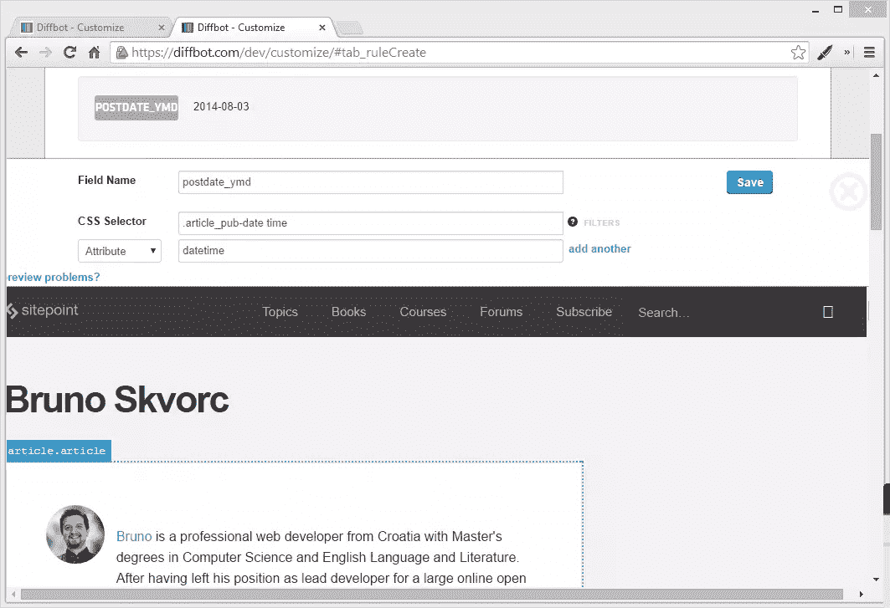
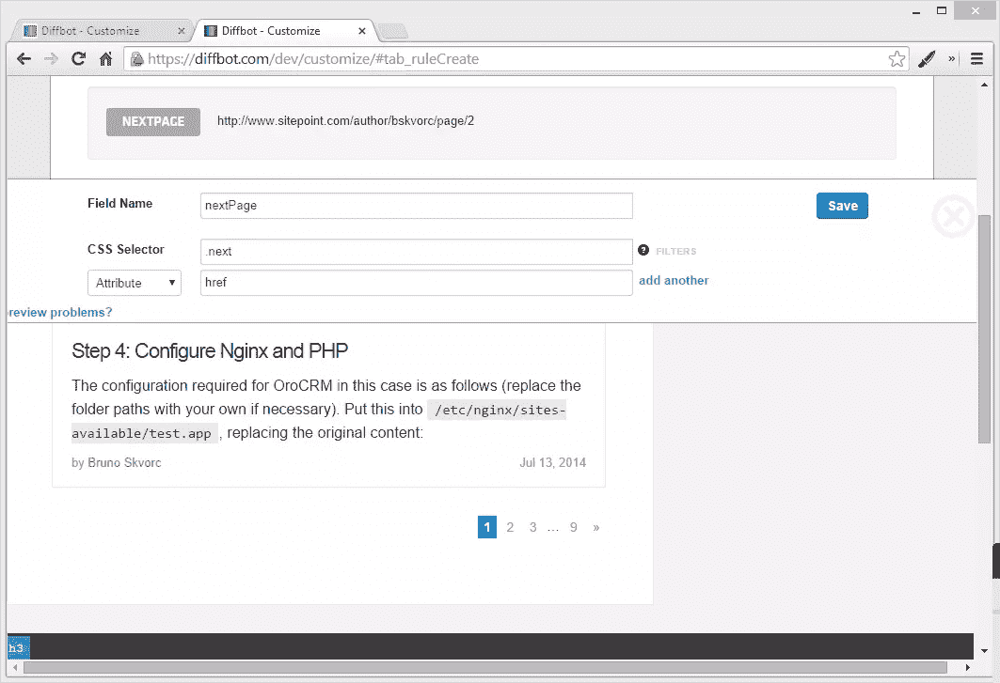
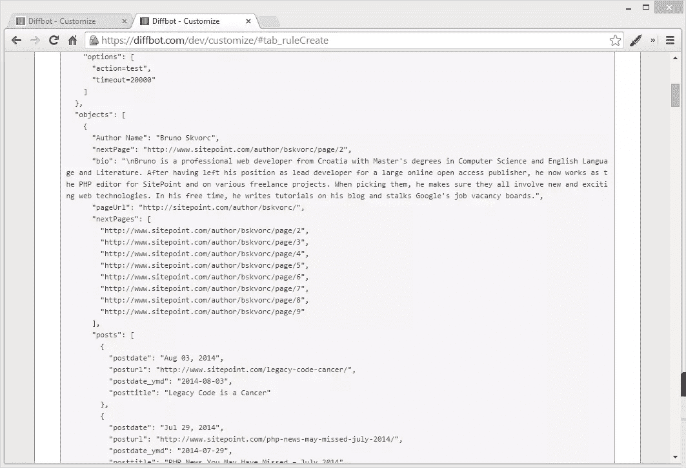

# 使用 Diffbot 分析 SitePoint 作者作品集

> 原文：<https://www.sitepoint.com/analyze-sitepoint-author-portfolios-diffbot/>

作为 SitePoint 的 PHP 频道的执行编辑，我要和几十个作者、几百个话题和一个经常爆满的收件箱打交道。当频道如此之大且由一个人操作时，过滤掉不活跃的作者并将多产的作者推到队列的顶部是很困难的，因此寻求机器人的帮助才有意义。

我最近开始构建一个深入的工作分析工具，它可以帮助我进行社交传播、评论、活动跟踪、个性分析、语言编辑等，希望很快实现我大部分工作的自动化，其中一个关键组成部分是作者活动。具体来说，跟踪他们在任何一周、一月或一季出版了多少。

## 作者简介

每个 SitePoint 作者都有一个个人资料页面，上面列出了他们的简历、他们的社交网络链接和他们发表的文章。例如，这里是[矿](https://www.sitepoint.com/author/bskvorc/)，这里是[彼得的](https://www.sitepoint.com/author/pnijssen/)。每个帖子片段都有我追踪活动所需的相关信息:日期、标题和 URL。通过获取一个作者的所有帖子，我们可以按日期对它们进行分组，并提取一些统计数据。

诚然，出版时间取决于多种因素——从我自己将评论挤入当前工作队列的能力，到赞助商和其他渠道偏好。尽管如此，任何见解都是好的见解，而且由于我的工具帮助我自动化了部分工作流程，评审将会更快地进行。

也就是说，我们如何可靠地获取这些作者数据？

## 到 API 还是不到 API

合理的方法是使用 API。像调用`https://api.sitepoint.com/v1/author/bskvorc?area=posts`这样的事情会使整个任务变得轻而易举。唉，SitePoint 没有 API，我们被迫抓取它，除非我们有数据库访问权限(为了演示的目的，让我们假设我们没有)。

Diffbot 来救援了！我们在之前已经[写过关于 Diffbot 的文章，所以如果你还没有熟悉它的话，可以看看我们的](https://www.sitepoint.com/blog/)[介绍文章](https://www.sitepoint.com/diffbot-crawling-visual-machine-learning/)。简而言之，我们将使用 Diffbot 自动抓取作者个人资料的所有页面，提取我们需要的数据，并以 JSON 格式取回。

## 入门指南

我假设您已经设置了一个 Diffbot 测试帐户，这样您就可以继续了。通过阅读本教程的内容，你会学到如何将自定义 API 应用于任何在线文章类型的知识，并且能够成功地收获你遇到的任何网站。

使用您提供的令牌立即进入 Diffbot 开发人员仪表板。在“自定义 API”下，转到“创建规则”并选择“自定义 API”。您将被要求为自定义 API 命名。我用的是“AuthorFolio”。

一旦创建了 API 端点，您就可以进入测试链接。出于演示的目的，我使用了我自己的作者简介:[https://www.sitepoint.com/author/bskvorc/](https://www.sitepoint.com/author/bskvorc/)

测试执行后，您将看到的第一个屏幕是空白的:

## 域限制

默认情况下，这些规则适用于所有的`https://www.sitepoint.com.*`链接。您可以通过点击 dev dash 中测试 URL 下的“change this”来更改它。

在打开的文本字段中，用`(http(s)?://)?(.*\.)?sitepoint.com/author/.*`替换`(http(s)?://)?(.*\.)?sitepoint.com.*`。

我们向规则集添加了另一个 URL 段，使其适用于一组更具体的页面，从而防止干扰我们可能会在 sitepoint.com 域中使用的任何其他 API。AuthorFolio API 现在只对作者页面做出反应。

> Diffbot API 要求您在定义自定义字段之前定义一个域正则表达式，否则您必须在更改正则表达式之后重新定义它们。这在未来会有所改变，但就目前而言，请记住这一点。

## 您的第一个自定义字段

让我们从简单的事情开始。我们先抓取作者姓名。

1.  单击“创建自定义字段”
2.  使用预览窗口点击作者姓名
3.  检查预览窗口上方的预览是否输出了正确的名称
4.  如果是的话，给这个字段起一个名字(比如“作者”)，然后点击保存

预览弹出窗口消失后，您应该会看到 author 字段被填充。

重复这一过程，以获得生物。您应该会得到这样的结果:

## 你的第一个收藏

由于“文章”是一个重复的实体(在作者简介的每一页上都有几篇文章)，我们不能使用一个简单的字段来获取它们——否则只能获取一篇文章。相反，我们使用一个集合。

自定义 API 集合是重复出现的元素集合。当您定义一个集合时，您定义了出现多次的内容，然后将规则应用于该集合。这将创建一个包含所有匹配项的桶，并将它们作为 JSON 数组返回。让我们演示一下，让它更清楚。

1.  单击“创建自定义收藏”
2.  将其命名为“帖子”
3.  在“CSS 选择器”下面加上`.search-results-list article`,因为这是每个帖子的 CSS 描述。
4.  点击“保存”

一旦屏幕重新加载，您的新集合将被保存，但您不会看到里面的任何值。但是，它会让您知道它找到了多少个实例(在我的例子中是 10 个，因为 SitePoint 的 author profiles 每 10 个结果就分页一次)。

### 帖子标题

既然已经定义了集合，我们就可以添加字段了。先说帖子标题。

1.  单击“向此收藏添加自定义字段”
2.  给它起名叫“后题”
3.  在“CSS 选择器”下，放置`.article_title`并点击保存

一旦结果重新加载，你应该能够通过点击“显示更多结果”列出所有 10 篇文章。

### 发布 URL

要获得文章的 URL，我们需要定位文章标题中链接的`href`属性。

1.  单击“将自定义字段添加到此收藏”并将其命名为“posturl”
2.  在“CSS 选择器”下放置`.article_title a`
3.  添加一个属性过滤器，设置`href`为属性，如下:

请注意预览已经显示了正确的 URL。保存并等待重新加载，然后注意集合中的每个“Post”实例现在都有两个属性:title 和 url。

### 迟签日期

通过 Dev 工具查看 post 框架的类，可以很容易地从 post 框架的底部提取日期。我把这个字段称为“postdate”。

但是通过查看开发工具，我们注意到 SitePoint 使用了 [`time`](http://css-tricks.com/time-element/) HTML 元素来表示发布日期。这对我们有利，因为它让我们也可以提取一个标准化的 Y-M-D 日期，供其他应用程序使用。`time`元素使用`datetime`属性作为数据值，这就是我们要获取的。让我们创建一个新字段:“postdate_ymd”。

1.  创建一个名为“postdate_ymd”的新字段。
2.  目标和之前一样的 CSS 选择器:`.article_pub-date`但是在混合中添加了`time`元素，所以看起来像这样:`.article_pub-date time`。
3.  添加一个属性过滤器，放入`datetime`，然后保存。

瞧啊。我们现在有了 Y-m-d 日期时间值。

### 页码

我们已经提取了几乎所有我们现在需要的值——但所有这些仅适用于作者简介的第一页。如果你向下滚动到底部，你会注意到一些分页链接。这是否意味着我们必须向每个页面发出自定义 API 调用，然后手动连接提取的值？当然不是，那会很乏味。Diffbot 的 API 足够智能，当它看到分页模式时可以识别它们，所以我们需要做的就是告诉它“下一页”链接在哪里，它会为我们处理事情。事实上，它非常聪明，实际上会自动合并它找到的所有页面的内容，并将我们的提取规则应用到最终合并的页面。

要使用 Diffbot 的自定义 API 激活自动分页，我们需要定义一个新字段，并将其命名为“nextPage”。

1.  创建一个名为“nextPage”的新字段(全局，外部集合)
2.  向下滚动到底部，然后单击下一页链接(>>)
3.  为`href`添加属性过滤器

一旦你保存并重新加载结果，你就应该有一整套的文章供你使用。如果您查看 JSON 输出，您将会看到`numPages`属性，并且整个集合应该比您到目前为止只在第一页上测试时所使用的要大得多。您还应该获得“下一页”集，即它可以自动推断出的第一页之后的所有页面:

## 结论

在这篇文章中，我们看了用 Diffbot 爬行的网站，diff bot 是一种从渲染页面中可视化提取数据的机器人。我们使用它来获取一个 SitePoint 作者的姓名、简历和所有帖子链接，并自动对结果进行分页。通过定期调用 API URL，如在`http://diffbot.com/api/AuthorFolio?token=xxxxxxxxx&url=https://www.sitepoint.com/author/bskvorc/`中，我们可以得到纯 JSON 格式的结果，供其他应用程序使用。在后续的文章中，我们将研究一些更高级的技术来避免分页时集合的重复，并且我们将添加更具体的域规则。敬请期待！

有问题吗？评论？贴在下面！

## 分享这篇文章