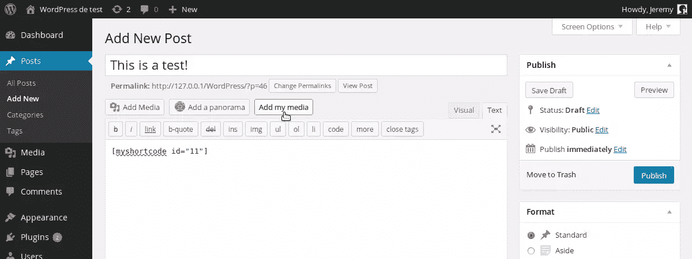

# 向 WordPress 内容编辑器添加媒体按钮

> 原文：<https://www.sitepoint.com/adding-a-media-button-to-the-content-editor/>

使用 WordPress 在文章中插入媒体文件并不复杂，因为默认情况下有一个专用按钮。然而，如果你使用媒体文件开发插件，这个按钮不会帮助你的用户插入你的功能所需的代码。

幸运的是，可以添加你自己的媒体按钮，所以你可以让它做任何你想做的事情。

在本教程中，我们将回顾如何在正确的位置添加一个媒体按钮，如何在用户点击它时打开媒体窗口，最后，如何获得选中的项目，以便将它们同时插入到可视和 HTML 编辑器中。

## 添加媒体按钮

添加我们的媒体按钮是第一步，也是最简单的一步。就像在 WordPress 中定制许多东西一样，我们将使用动作把我们的按钮放在正确的位置。

首先在你的插件或主题的专用文件中创建一个新函数(例如 functions.php)。对于本教程，我将使用一个名为`add_my_media_button()`的函数。将你的函数与`media_buttons`动作挂钩，顾名思义，这是当 WordPress 显示媒体按钮时调用的动作。

```
add_action('media_buttons', 'add_my_media_button');
```

可以想象，我们现在需要修改函数，以正确的方式显示按钮。我们希望我们的按钮具有与默认按钮相同的样式。

媒体按钮不是真正的按钮，它们是按钮样式的链接，WordPress 为这种样式提供了一个类，名为“ *button* ”。

```
function add_my_media_button() {
    echo '<a href="#" id="insert-my-media" class="button">Add my media</a>';
}
```

我们给按钮一个 ID。这样，我们将能够在以后用 JavaScript 检索它。

我们的自定义媒体按钮已经准备好了:它有正确的样式和几乎正确的位置。事实上，默认情况下，我们的新按钮放在默认按钮之前。如果我们想把它放在后面，可以通过向`add_action()`调用传递第三个参数来改变函数的优先级。

事实上，显示默认媒体按钮的功能的优先级为 10。为我们的函数指定一个较低的值会将我们的按钮放在默认按钮之前。如果我们想把它放在后面，我们可以指定一个更大的值。

```
add_action('media_buttons', 'add_my_media_button', 15);
```

就是这样！现在我们必须让我们的按钮更有用。



## 打开媒体窗口

要打开媒体窗口，我们将使用 JavaScript 和 jQuery，jQuery 默认包含在 WordPress 中。首先，我们创建一个 JS 文件。我选择把它命名为`media_button.js`，但是，当然，你可以自由选择你自己的名字。

### 包括 JavaScript 文件

如果你熟悉 WordPress，你应该知道 CMS 给了我们一个合适的方法来包含我们需要的 JS 文件。为此，我们创建了一个函数，其中使用了 WordPress 函数`wp_enqueue_script()`。

```
function include_media_button_js_file() {
    wp_enqueue_script('media_button', 'path/to/media_button.js', array('jquery'), '1.0', true);
}
```

如您所见，我们将 jQuery 指定为依赖项。感谢最后一个参数，我选择把脚本放在页脚，但是如果你愿意，你也可以把它放在页眉。

我们创建了一个函数，以便让 WordPress 仅在必要时包含我们的脚本。为此，我们将使用另一个动作:`wp_enqueue_media`，当 WordPress 调用媒体按钮所需的所有脚本时，就会触发这个动作。

```
add_action('wp_enqueue_media', 'include_media_button_js_file');
```

### 建造窗户

为了能够使用 jQuery 函数`$()`，我们将`media_button.js`文件的内容封装在`jQuery()`函数中。然后，我们创建一个新的函数，当用户点击我们的按钮时，它将打开媒体窗口。

```
jQuery(function($) {
    $(document).ready(function(){
            $('#insert-my-media').click(open_media_window);
        });

    function open_media_window() {
    }
});
```

媒体窗口是`wp.media`对象的一个实例。它的构造函数接受一个参数，这个参数是另一个包含窗口属性的对象。所以上面的`open_media_window_()`函数可能包含以下内容:

```
function open_media_window() {
    var window = wp.media({
            title: 'Insert a media',
            library: {type: 'image'},
            multiple: false,
            button: {text: 'Insert'}
        });
}
```

`title`属性将显示为窗口的标题。注意，`button`属性的值是一个允许`text`属性设置按钮标签的对象，用户将点击该按钮来验证其选择。

WordPress 将使用`library`属性来过滤窗口中显示的媒体文件。在本例中，只能选择图像。此外，由于`multiple`属性的`false`值，用户将不能选择多个文件。

这些属性都不是 WordPress 真正需要的。但是，如果您不指明标题，您的窗口将是无标题的。默认情况下，`multiple`属性被设置为`false`，显示的媒体文件不会被过滤。

## 使用媒体窗口

### 检索用户的选择

下面的代码放在我们上面创建的 open_media_window()函数中。

目前，我们的窗户已经建造好了，但是还没有打开。要打开窗口，您可以使用`open()`方法，但是在此之前，您可能想要检索用户的选择。

为此，我们将使用 WordPress 为媒体窗口创建的特殊事件:`select`。给这个事件附加一个函数需要使用`on()`方法。

```
window.on('select', function(){
        var selection = window.state().get('selection');
    });
```

用户的选择现在存储在变量`selection`中。根据是否允许多选，这个变量的用法是不同的。

如果用户只能选择一个文件，可以用`first()`方法检索。然后你可以把获得的对象转换成 JSON，以便获得你想要的信息。将上述`window.on`事件替换为:

```
window.on('select', function(){
        var first = window.state().get('selection').first().toJSON();
    });
```

这个 JSON 对象包含了您所需要的关于所选文件的所有内容。例如，您可以用`id`属性访问文件的 ID，而文件的 URL 可以通过`url`属性访问。

如果您想知道可以使用哪些属性，例如，您可以在浏览器的控制台中列出所有属性。

```
for (attr in first)
    console.log(attr);
```

如果用户可以选择多个文件，您可以将选择转换为数组。然后，您可以使用`toJSON()`方法检索每个文件的数据，就像第一种情况一样。将上述`window.on`事件替换为:

```
window.on('select', function(){
        var files = window.state().get('selection').toArray();
        var first = files[0].toJSON();
    });
```

对`files`数组进行排序:`0`条目包含用户选择的第一个文件，`1`条目包含第二个文件，依此类推。

### 在编辑器中插入文本

既然我们检索了用户的选择，我们将在编辑器中插入一些文本。为此，我们将使用 WordPress 函数`wp.media.editor.insert()`，它接受一个参数:在光标当前位置插入的文本。

```
// Assume that we converted the first selected file to JSON
wp.media.editor.insert('[myshortcode id="' + first.id + '"]');
```

使用这个功能的好处是 WordPress 会自动在可视和 HTML 编辑器中插入我们的文本。

## 最佳化

我们的窗户已经可以使用了。然而，一个问题仍然存在:它将在每次用户点击按钮时被重建，所以我们将改变这种行为。

```
function open_media_window() {
    if (this.window === undefined) {
        this.window = wp.media({
                title: 'Insert a media',
                library: {type: 'image'},
                multiple: false,
                button: {text: 'Insert'}
            });

        var self = this; // Needed to retrieve our variable in the anonymous function below
        this.window.on('select', function() {
                var first = self.window.state().get('selection').first().toJSON();
                wp.media.editor.insert('[myshortcode id="' + first.id + '"]');
            });
    }

    this.window.open();
    return false;
}
```

首先我们检查窗口是否已经被创建，如果没有，我们就创建它。然后，我们打开窗口，用指令`return false;`完成`open_media_window()`功能，以防止链接的默认行为。

请注意，防止上述问题的方法不止一种。然而，方案总是相同的，你可以很容易地适应你最喜欢的方法。

## 最后

您现在知道了如何添加媒体按钮，以及如何使用它在编辑器中插入一些与用户选择相关的文本。如果你列出了我们上面创建的`data`变量的属性，你可能会注意到 WordPress 给了我们所有关于所选媒体文件的信息，这意味着你可以对它做任何你想做的事情。

## 分享这篇文章