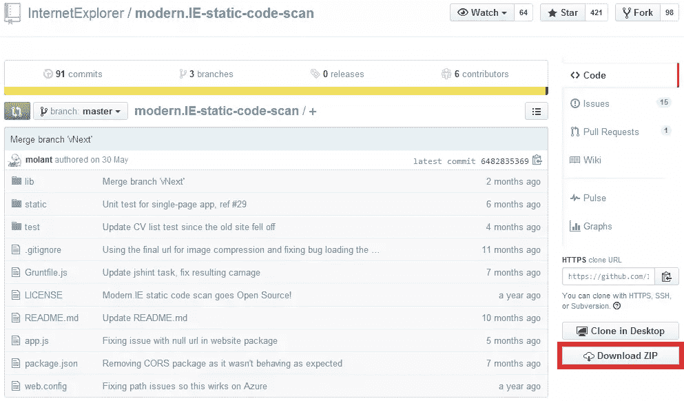
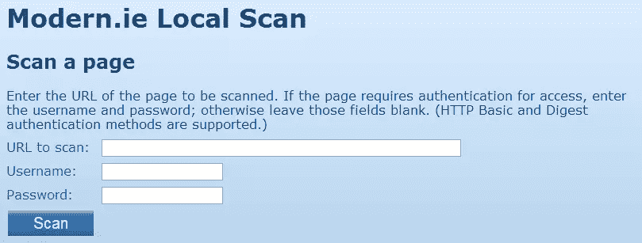
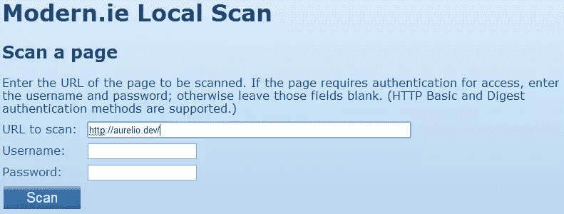

# 如何用 Modern 在本地测试你的站点？工业管理学(Industrial Engineering)

> 原文：<https://www.sitepoint.com/test-site-locally-modern-ie/>

*本文由 [Modern 赞助。即](https://modern.ie/)。感谢支持 SitePoint 的赞助商！*

不缺少前端工具来帮助我们测试代码的质量。这些工具的一些例子是 JSHint 和 JSLint，用于测试我们的 JavaScript 文件， [W3C 标记验证器](http://validator.w3.org/)，用于测试我们的 HTML 代码是否有效并按照规范编写，以及 [W3C CSS 验证器](http://jigsaw.w3.org/css-validator/)，用于验证我们的样式表，但还有更多。

最近在 SitePoint 上，我们一直在强调另一个这样的工具:微软的 [Modern。即](http://modern.ie/)。该服务包括扫描您的网站，以确定常见的编码问题，并生成报告(也可作为一个. pdf 文件)。该报告包含每个测试的结果以及一些关于如何修复或改进它的建议。通过这种方式，您可以确保您的代码遵循当前的最佳实践，性能良好，并实现专为 Windows 8 设计的功能。你所要做的就是提供你想要分析的网页的网址。

Louis Lazaris 在他的文章[中写了一篇关于这个扫描工具的很好的指南。IE 识别常见编码问题](https://www.sitepoint.com/using-modern-ie-identify-common-coding-problems/)。他的文章涵盖了现场直播。在本教程中，我们将了解如何对您机器上的项目执行扫描。

## 什么是现代。IE？

[现代。IE](http://modern.ie/) 是一项服务，它提供了一系列不同的工具，从不同的角度和出于不同的目的来测试我们的网页。比如现代。IE 向[提供了几个免费的 Windows 虚拟机](https://www.sitepoint.com/virtual-machine-browser-testing-modern-ie/)，可以在 Windows、Mac 或 Linux 主机上运行任何版本的 Internet Explorer。

另一个特点是由 [BrowserStack](http://www.browserstack.com/) 支持的免费[截图自动化工具](http://modern.ie/screenshots)。该工具在一系列移动和桌面设备上加载给定的网站，并在几分钟内呈现捕获的屏幕截图。这意味着你可以获得你网站的截图，就像在 Android 上运行的 Android 浏览器上，在 Windows 8 上运行的 Firefox 和 Opera 上，甚至在你可能不容易访问的设备上看到的一样，比如使用移动 Safari 的 iPhone 4S。

如果你想了解更多关于这个和其他的特性，你可以阅读 Modern 上的文章[快速浏览器截图测试。IE](https://www.sitepoint.com/quick-browser-screenshot-testing-modern-ie/) 由 [Craig Buckler](https://www.sitepoint.com/author/craig-buckler/) 和[用 Modern 进行浏览器测试。即](https://www.sitepoint.com/testing-internet-explorer-modern-ie/)作者[詹姆斯·乔治](https://www.sitepoint.com/author/jgeorge/)。

现在您已经有了上下文，让我们深入扫描一个本地项目。

## 如何分析一个地方网站

### 安装故障诊断仪

现代的。IE 扫描网站的工具[在 GitHub](https://github.com/InternetExplorer/modern.IE-static-code-scan/) 上是免费的。要获得源代码的副本，您可以打开命令行并运行命令:

```
git clone [https://github.com/InternetExplorer/modern.IE-static-code-scan.git](https://github.com/InternetExplorer/modern.IE-static-code-scan.git)
```

你可以获取一个副本，安装它，然后开始使用一个 Git 客户端在本地扫描你的项目。

或者，您可以单击页面右侧的下载按钮，如下所示。



下载该工具后，您需要下载并安装 node . js(0.10 或更高版本)。如果您已经安装了 Node.js 版本，那么您离使用这个工具又近了一步。

现在，通过运行以下命令找到源代码并安装其依赖项:

```
npm install
```

要执行的最后一步是启动扫描服务。为此，请运行命令:

```
node app.js
```

执行前面的命令后，您将看到一条消息，显示服务的状态和正在使用的端口号(默认端口是 1337)。打开您选择的浏览器，如果您没有更改默认设置，请转到 URL[http://localhost:[端口号]/](http://localhost/1337/) ，其中[端口号]是 1337。

如果您按照说明操作并且一切顺利，您应该会看到下图所示的页面。



您现在已经准备好分析您的本地项目了。

### 创建报告

安装并配置好所有先决条件后，您现在就可以扫描网站的本地版本了。在开始之前，请记住当前可用的版本依赖于 jQuery，为了包含这个库，微软使用了 jQuery CDN。这意味着您必须有互联网连接，即使您正在测试一个离线网站，否则该工具将失败(出现错误“un catch reference error:$ is not defined”，因为它无法加载 jQuery)。

要扫描一个页面，您必须在相关字段中输入其 URL，然后单击扫描按钮，如下所示。



如果您使用鉴定系统，如 HTTP Basic 和 Digest，您可以指定用户名和密码。

一旦该过程完成，该工具将使用 JSON 格式生成一个输出。

### JSON 报告

扫描完成后，该工具会生成一组 JSON 格式的扫描结果。成功测试的输出示例如下所示:

```
 “imageCompression”: {

“testName”: “imageCompression”,

“passed”: true

} 
```

失败测试的示例如下所示:

```
 “ie11tiles”: {

	“testName”: “ie11tiles”,

	“passed”: false,

	“data”: {

		“square70”: false,

		“square150”: false,

		“wide310”: false,

		“square310”: false

		“notifications”: false

	}

} 
```

您可以使用自己的脚本解析结果，或者将其发送到 Modern。IE 网站单击创建报告按钮，如流程的第二步所示。如果您选择第二个选项，网站将以与您使用在线版本相同的方式显示报告。请注意，在本文发布时，[该工具的离线版本受到一个问题的影响，该问题不允许它在 Modern 上显示本地扫描报告。即](https://github.com/InternetExplorer/modern.IE-static-code-scan/issues/61)。

## 结论

[现代。IE](http://modern.ie/) 提供了一套很棒的工具来分析你的网站，无论是在线还是离线，以检测兼容性问题和可能的改进。多亏了这个本地版本，你可以在项目上线前测试它们，这样可以避免在你的用户和客户面前看起来很傻。

你试过现代的吗？IE？你觉得怎么样？

## 分享这篇文章