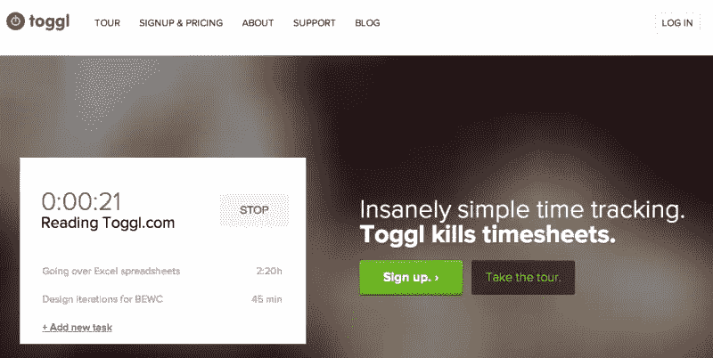

# 自由职业者:糟糕的时间估计会扼杀你的利润

> 原文：<https://www.sitepoint.com/freelancers-bad-time-estimates-killing-profits/>

有没有这样的一周，你日以继夜地工作，当你终于在周末运行你的发票时，你看着数字并想，“……等等，就这样了*？！*

作为一名自由职业者，你几乎总是在用时间换取金钱。这本身并不一定是件坏事，但当你对时间的估计不准确时，情况肯定会变得更糟。

幸运的是，错误的估计是可以修复的——请继续阅读，了解如何修复。

### 为什么我们对时间的估计如此糟糕？

你知道当你工作的时候，你有时会沉浸在一个特定的项目中，然后你抬头一看，三个小时已经过去了？

发生这种情况的原因是因为你处于心流状态。*心流状态*是指当你完全投入到你正在做的事情中时，这个任务有一点挑战性——但没有挑战到让你感到沮丧和停滞不前。

总体而言，处于心流状态是一件非常好的事情——它类似于冥想，因为它可以帮助降低焦虑水平，并增加总体幸福感。通常，当你处于心流状态时，你正在创造更高质量的工作(总是有利的！).

不好的一面是我们会忘记时间。我们记得某件事花费的时间比实际花费的时间少，这就打乱了我们的时间估计。

另一个我们在估算时忘记考虑的因素是“转换成本”当你停止做任务 A，转而做任务 B 时，有一段时间(通常是 15 到 30 分钟)你还没有完全投入到任务 B 中，但是你已经不再做任务 A 了。在这段时间里，你的工作效率会比平时低。这是多任务处理损害而不是帮助生产力的一个原因。你实际上并不是在同时做两件事，你只是在两个任务之间快速切换，而没有完全投入其中。

### 糟糕的时间估计是如何扼杀你的利润

即使你按小时定价，错误的时间估计也会扼杀你的利润。为什么？

*   不满意的客户。即使客户理解为什么项目比预期时间长，他们也有最后期限，心里有时间表。如果他们比最初计划的日期晚了三周(或三个月)才交付成果，他们就不太可能[成为回头客](https://www.sitepoint.com/increase-profits-with-client-follow-up)或者把他们的朋友和同事介绍给你。
*   更多的管理时间。这是随作品而来的作品，并不总是收费的。当项目范围失控时，您会有更多的电子邮件、笔记和发票需要处理。

这两件事加起来就是:用于推销和营销的时间减少，这导致你的销售漏斗中的客户减少，这导致…你猜对了…利润降低。

然而，当涉及到小时项目时，糟糕的时间估计是令人讨厌的，当涉及到包价格时，它们足以实际上使一个企业沉没。

这些包通常被称为[“产品化服务”，](http://www.business2community.com/product-management/nice-little-package-productize-service-0939305#!bs3Mtz)为一组可交付内容创建一个固定价格，例如，一个固定费用用于徽标和社交图标，另一个固定费用用于整个网站更名，等等。有一个固定的价格通常会让你的潜在客户更容易决定他们需要什么，并且，据说，会让双方都更容易。

但当自由职业者根据糟糕的时间估计制定一揽子价格时，问题就来了。服务套餐最终花费了他们两到三倍的时间——这就是一个自由职业者每周工作 60 个小时却仍然身无分文的原因。

### 如何创建更好的时间估计

#### 系统化和简化您的服务

无论你是出售打包服务还是按小时定价，如果你将服务系统化和合理化，你都可以做出更好的时间估计，并更快地完成工作。

**系统化。**创建包含服务流程每个步骤的任务列表。不仅仅是工作本身，还包括新进员工、讨论项目的预约、给客户发送你的笔记、来回发送电子邮件等等。通常，我们会忘记服务附带的管理任务，并且不会将它们纳入我们的时间估计中，正如您可以想象的那样，这对利润率来说并不太好。

列出任务清单比你想象的要节省更多的时间，因为它不仅让你看到了步骤是什么(以及什么可以简化——见下文),而且你不必考虑特定客户的下一步，你已经计划好了。当您与多个客户一起工作时，在整个项目的几个点上节省几分钟的时间会越来越多。

精简:一旦你有了任务清单，寻找那些可以自动化或精简的事情。

这里有一些建议:

*   尽可能地自动化事情，使用摄入问卷(以及插件或工具，如 [Gravity Forms](http://www.gravityforms.com/) 或 [Wufoo](http://www.wufoo.com/) ，调度工具，如 [ScheduleOnce](http://www.scheduleonce.com/) ，等等。
*   如果你已经有了一些自动化的东西，但不太清楚如何将这些部分连接起来，看看 [Zapier](https://zapier.com/) 。
*   考虑为客户常见的问题创建一个沟通模板列表，这样您就可以复制和粘贴(当然，然后修改)，而不必对不同的客户一遍又一遍地解释相同的问题。

#### 给你的时间估计添加填充

未能添加足够的填充物是“过度工作且报酬过低的自由职业者”现象的一个主要因素。

因此，在为您的服务编制了任务列表之后，为列表中的每项任务创建一个时间估计。理想情况下，你是基于你实际跟踪的时间(应用程序建议马上就来！)，但实际上你可能不得不猜测一些事情。同样，不要忘记包括管理任务。

现在你已经制定了任务，在每项任务之间增加 15 分钟(考虑到前面提到的转换成本)。

最后全部加起来…再乘以 1.5。

这可能听起来像很多填充。

但是每次我自己做这个练习，或者让客户或学生做，然后跟踪结果，最终的结果是增加的估计值与他们实际花费的时间更接近。

不是每个客户都花费相同的时间和精力。有时候需要几个来回才能把事情做好。一个客户可能会使用你提供的所有版本，下一个客户可能会对第一个版本感到满意。如果你提供套餐价格，你需要考虑这两种客户，并创建一个涵盖他们的范围。

想一想:如果你有一个客户使用了你的预估时间，你还能在这个项目上赚到足够的工资吗？

#### 追踪你的时间

有几次我提到了时间追踪，这可能会让你想知道你到底应该怎么做。

这里有三个工具可以提供帮助:

##### **Toggl**

价格:免费计划，付费计划每月 5 美元起(30 天免费试用)

如果你正在寻找一个简单的时间跟踪解决方案，Toggl 是你最好的选择。好处包括多种方式来跟踪你的时间(在线工具、桌面应用和移动应用)和一个可接受的价格点。

##### 收获

价格:免费计划，付费计划每月 12 美元起(30 天免费试用)

与 Toggl 相比，Harvest 功能更加全面，内置了发票和支付网关(Stripe、PayPal 等)。它还集成了谷歌应用程序，所以如果你是一个大风扇，那么一定要看看收获。(就是我用的，我爱死了！)

##### 新书

**价格:**有限免费计划，付费计划每月 20 美元起(30 天免费试用)

与其说 Freshbooks 是一个专用的时间跟踪工具，不如说它是一个会计解决方案，但是如果你想让会计功能(资产负债表、损益报告等等)伴随着你的时间跟踪，它是一个可靠的选择。

### 这是你的作业

厌倦了一周都在自杀却没有任何表现吗？今天留出一些时间，通过以下步骤来改进您的评估:

1.  创建服务任务列表。
2.  使用任务列表找出哪些可以简化或完全删除。
3.  基于任务列表创建准确的时间估计。
4.  选择一个时间跟踪工具，测试你对任务列表的时间估计。
5.  请确保相应地更改您的服务价格。
6.  享受一周正常的工作，挣一份可以维持生活的工资！

## 分享这篇文章