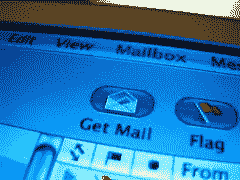
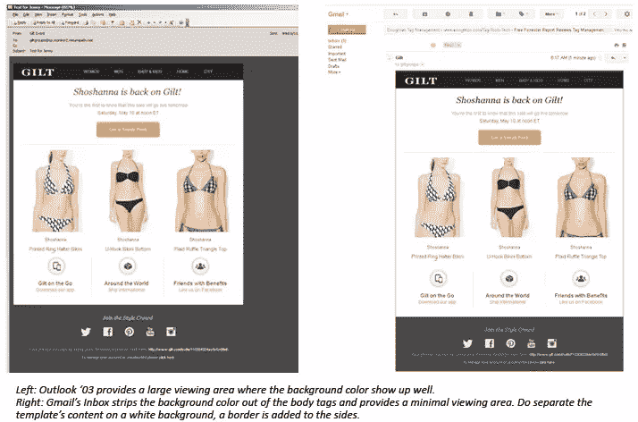

# 电子邮件设计最佳实践规则:编码实践

> 原文：<https://www.sitepoint.com/rules-best-practice-email-design-coding-practices/>

图片:珍珠

在“最佳实践电子邮件”系列的第一部分，我们讨论了[电子邮件布局](https://www.sitepoint.com/best-practice-email/ "Rules for Best Practice Email Design: Layout")。在第二部分中，我们关注的是[的邮件内容](https://www.sitepoint.com/rules-best-practice-email-design-content/ "Rules for Best Practice Email Design: Content")。在“电子邮件最佳实践规则”的最后一部分中，我们将深入了解最佳编码实践。

既然你已经知道如何创建一个设计良好的图形电子邮件，以适应电子邮件客户端和网络浏览器的差异，那么是时候让你的电子邮件*在每个收件箱中工作*了。

正如我们在[第一部分](https://www.sitepoint.com/best-practice-email/ "5 Rules for Best Practice Email Design")中提到的，一封图片邮件可能看起来和感觉起来像一个网页，但是它的编码就像一个网页吗？嗯*当然*——如果那个网页是在 20 世纪 90 年代编码的。

为电子邮件编写标记把 HTML 带回了老派。这些提示将帮助那些不记得法兰绒、寻呼机和随身听时代的人，或者那些认为桌子只是用来吃饭或存储数据的人。

## 1)使用表格进行布局

为了确保你的布局在所有收件箱中正确呈现，使用表格——许多表格——全部嵌套在一起。这个技巧挑战了现代的 web 开发，因为表格现在主要用于表格数据，而不是用于网页布局。

自从 CSS 成为一种合适且更灵活的网页布局方式后，使用表格——这种老式的网页编码方式——理所当然地遭到了网页开发者的反对。然而，在为一封图片邮件标记 HTML 时，情况就不一样了，在这种情况下，表格不仅可以接受，而且还是*首选的*方法。

尽管我们的直觉可能会告诉我们并非如此，但令人清醒的事实是，表格似乎是让多列布局在所有可能的收件箱中工作的唯一可靠方法。

对非常简单的布局使用 div 可以很好地工作，但是要彻底测试 div 以确保它们的行为符合预期。Outlook、Yahoo 和 Hotmail 都不太支持 position 和 float，所以明智的做法是确保你的其他 CSS 属性在不同的客户端中不会失败。

表格为所有客户端提供了最一致的支持，并且长期以来一直是电子邮件编码的标准。无论他们在设计模板时感觉多么过时或陌生，使用 div 表格或其他方法都有可能在所有收件箱中获得最佳效果。

## 2)将你的风格串联起来

Gmail 和其他电子邮件客户端不可避免地会从 HTML 文档的标签中去掉一些(如果不是全部)CSS。由于这个原因——再加上外部样式表在电子邮件中不是一个选项——将你的 CSS 样式内联。

这使得许多重复的样式应用于每个元素，完全消除了类的奢华和便利，但是它*将*提供最大的一致性，并保留一个设计良好的模板。一些电子邮件服务提供商，如 MailChimp 和 CampaignMonitor，现在提供转换工具，使您的 CSS 内联，并减轻必须为每个元素重复样式的头痛。

**此规则的例外:**针对移动设备布局的媒体查询。媒体查询总是被写成 topline CSS 并包含类，当被支持时，它们为移动用户在更小的屏幕上查看电子邮件设计提供了不同的体验。

## 3)始终避免使用速记 CSS

当编写电子邮件时，没有很多捷径可以让生活变得更容易，不幸的是，使用速记 CSS 似乎也不例外。

在字体、填充和定义十六进制值方面，对速记 CSS 的支持通常是不一致的(尽管使用带边框的速记格式有时确实有效)。编写电子邮件的一贯原则是:如果你要尝试，就在任何地方测试它。确保速记属性的行为符合您的预期，并且不依赖默认值——定义它们。

简而言之，从 CSS 中去掉一些字符的好处不太可能值得它所带来的新的渲染问题。

## 4)将您的背景颜色包装在它自己的表格中

类似于去掉样式标签，一些电子邮件客户端也会去掉正文标签。因此，明智的做法是在围绕模板其余部分的单独表格中定义背景颜色，并将宽度设置为 100%。

默认情况下，大多数电子邮件客户端在白色背景上显示邮件。显示的背景数量因客户端而异，横幅广告、工具栏和菜单等其他因素也会影响消息窗格的整体大小。

确保邮件模板在邮件视图窗格中清晰显示的另一个好方法是:在整个模板周围或模板两侧添加边框。如果模板中的内容出现在白色背景上，这将包围设计，并在消息和窗格之间创建一些空间。

## 5)对图像进行切片

图片是优秀电子邮件设计的关键，通常链接到一个或几个网页。

不幸的是，并不是所有地方都支持图像地图(可能根本不链接您的图像)。再说一次，走长路是最好的解决方案:将所有这些图像切片，并分别链接每个图像。这将使您能够验证每个链接的工作，也将更快地下载较小的图像。

虽然这一系列的限制看起来令人望而生畏，但是电子邮件客户端已经走过了漫长的道路，并将继续变化和发展。曾几何时，电子邮件根本没有 CSS 支持，标记需要大量的空单元格和间隔 gif 来获得恰到好处的填充。

最近，实现电子邮件 HTML 的标准化已经成为国际公认的目标。W3 集团的电子邮件标准工作组将于 9 月开会讨论一个新的长期使用的 HTML 语法标准。

电子邮件有着令人自豪的历史和悠久的遗产，但它正朝着正确的方向发展。

## 分享这篇文章