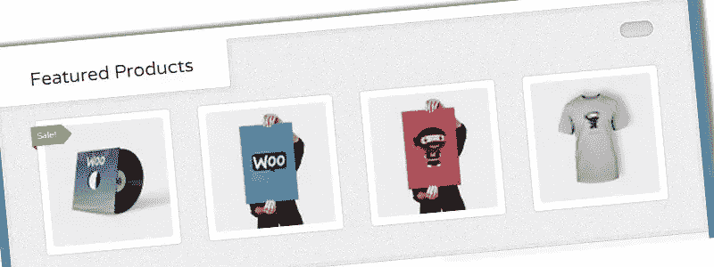
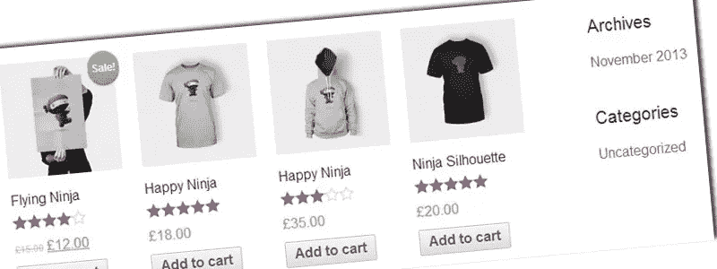
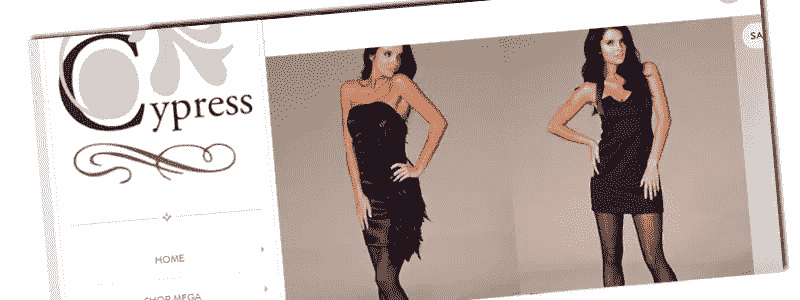
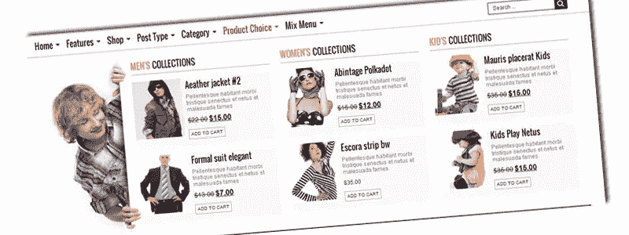
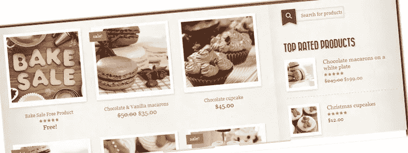
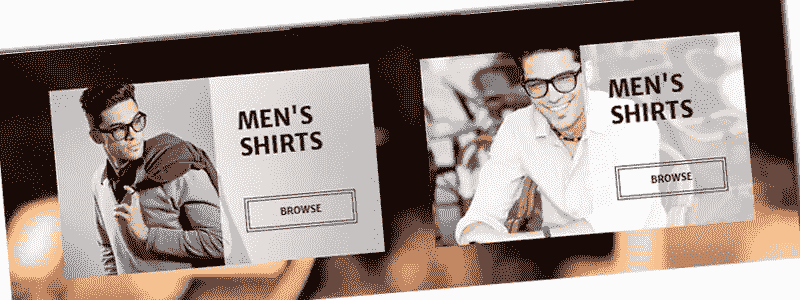
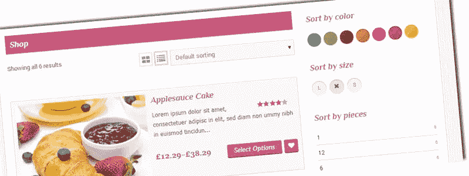
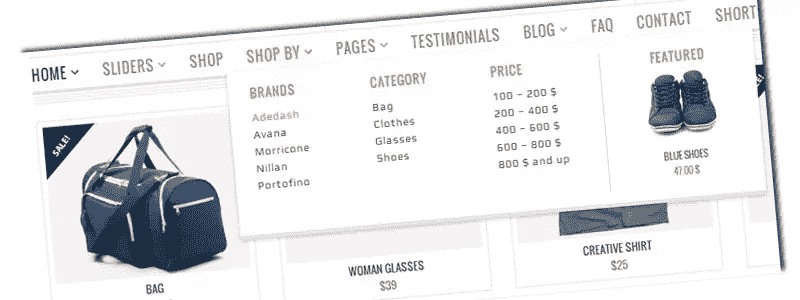
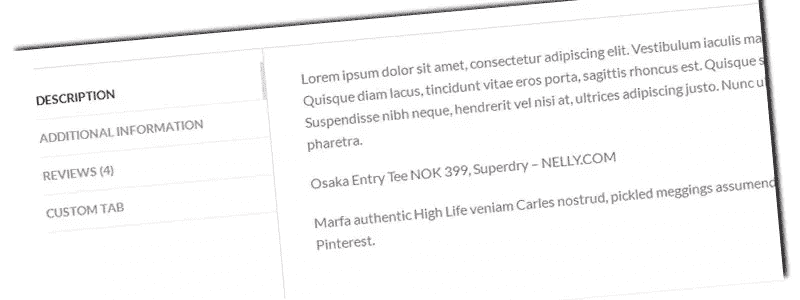
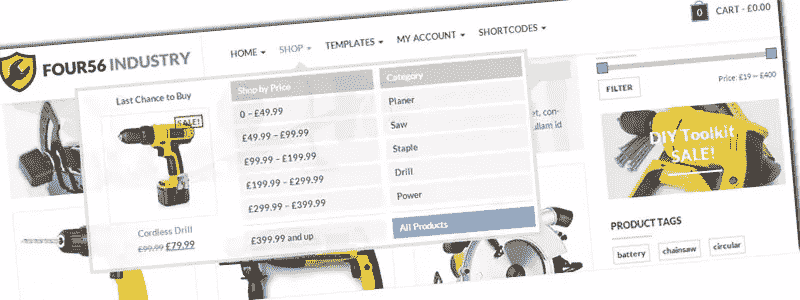

# 10 个最佳网络商务主题

> 原文：<https://www.sitepoint.com/10-of-the-best-woocommerce-themes/>

在[开始使用 WooCommerce](https://www.sitepoint.com/getting-started-with-woocommerce/) 之后，你需要做的第一件事就是添加一个吸引人但又实用的主题。

与普通网站相比，网上商店更需要高度关注可用性。每次访问者在你的网站上迷路，你很可能会失去销售，这当然是不理想的。因此，值得花时间研究并为你的商店找到合适的主题。

## woo 商务主题

有数百个免费和付费的 WooCommerce 主题可供选择。

在这篇文章中，我将向你展示一些最好的 WooCommerce 主题。这些主题从通用主题到特定的主题，比如时尚或食物。

通过使用相关的图片和颜色，小众主题通常被用来给商店一个特殊的外观和感觉。然而，和任何 WordPress(以及 WooCommerce)主题一样，你仍然可以随心所欲地定制它。

这里有十个最佳的 WooCommerce 优化主题，可以让你充分利用 WooCommerce 丰富的功能。

### 1.[伍尔科](http://www.woothemes.com/products/wootique/)

这是 WooCommerce 插件的默认主题。

它是免费的，也是一个很好的入门主题。我在自己的 WooCommerce 演示中使用了这个。

虽然简单，但它非常实用，我特别喜欢它们展示特色产品的方式。

如果你只是想尝试 WooCommerce 或者想经营一个简单的店铺，这个主题绰绰有余。

### 2.[购物](http://themehall.com/preview/shopping/)

购物是 WordPress 主题库中最受欢迎的免费 WooCommerce 主题之一。

这是一个简单而实用的主题，与 Wootique 有些相似之处。然而，它有一个主要的区别。购物有求必应。这意味着你甚至可以在不增加成本的情况下经营一家专业的移动商店。

我还喜欢对元素细节的关注，比如你添加到购物车中的产品旁边的复选标记。

### 3.[柏树](http://aligator-studio.com/cypress/)

想标新立异吗？去柏树。

你可能会觉得这个主题丑陋而讨厌，或者非常美丽而独特。它有一个垂直导航，允许一个页面的外观和感觉。它还具有滑块和移动横幅。

当然完全夸张了，但是如果你把这个给你的客户看，他们会发疯的。

请记住，虽然使用这些类型的沉重的主题可能需要一些优化，让他们加载足够快，为您的访客。

### 4. [Alphashopper](http://www.republikwp.com/alphashopper/)

哇，多好的主题啊。可能有点过头了，但是请记住，这些演示站点是通过使用每一个可能的简短代码和功能来创建的。

Alphashopper 主题巧妙地将常规的 WordPress 主题与 WooCommerce 功能整合在一起。别忘了看导航。尤其是看起来非常专业的“产品选择”项。

这个主题不是一个你可以轻易或快速设置的主题，因为你需要确保所有的元素都能正常工作。然而，一旦你花时间，你的店会看起来非常专业。

### 5.[复古](http://retro.olegnax.com/shop/)

已经[认为](http://www.forbes.com/sites/allbusiness/2013/10/24/10-best-paid-wordpress-themes-of-2013/2/)是最好的 WordPress 主题之一，Retro 有一个设计完美的商店。

通过使用正确的颜色和样式，它在给你的商店一种真正的复古感觉方面做得很好。事实上，我非常喜欢这种风格，我已经在我的[战争电影网上商店](http://www.warmovies.guru/)中使用了它。不过，它的功能足够多，甚至可以让你出售[巧克力纸杯蛋糕](http://retro.olegnax.com/product/chocolate-cupcake/)。

然而，与通用主题相比，这种样式确实缩小了它的使用范围。尽管如此，如果你正在寻找一个合适的主题，我强烈推荐你把这个列入你的候选名单。

### 6.坎廷

如果你喜欢基于照片的主题，你会喜欢 Kancing。

大型产品照片与全屏滑块和横幅相结合。

它也不仅仅停留在主页或商店页面上。产品页面采用相同的风格，这使得它成为销售时尚或设计产品的完美 WooCommerce 主题。

### 7.[调整跳线](http://templatation.com/justshop-theme-layout6/)

我猜这些人在制作这个主题的时候一定很饿。至少所有使用的图片应该让他们感到饥饿！

如果你在经营一家附带网上商店的餐馆，这将是一个完美的主题。为什么？嗯，这个主题结合了一个制作精美的网络商店和展示一个餐厅菜单的能力。

虽然我承认这确实使这个主题的使用非常有限，但如果这正是你所需要的，这是一个很好的选择。即使你省略了菜单选项，它仍然是一个很棒的主题，旁边还有一些不错的过滤器。

### 8.[巴扎尔](http://demo.yithemes.com/bazar/)

巴扎尔是一个通用主题的完美例子。

该主题有一个相当中性的布局，并有一些聪明的功能，如“商店”功能，这是在截图中显示。

产品页面是经过深思熟虑的，例如，一个联系方式的良好集成。

还有特定的网络商店[短码](http://demo.yithemes.com/bazar/shortcodes/shop-shortcode/)，可以让你相当轻松地插入不同的产品滑块。

### 9.[扁平的](http://flatsome.uxthemes.com/)

另一个伟大的通用主题是 Flatsome。

这个主题的特别之处在于它提供了各种布局和样式选项。

这里只是几个:垂直标签，产品外观书，甚至 Pinterest 风格。

有如此多的款式可供选择，你可以制作几个不同的商店，而不会让它们看起来一模一样。

顺便说一下，不要让演示中使用的时尚图片欺骗了你，这个 WooCommerce 主题可以用于许多不同类型的产品。

### 10.四五六行业

这个主题展示了通过使用正确的图片和颜色，将一个通用主题变成一个特殊的外观是多么容易。

在演示中，他们通过使用大量的黄色赋予了它工业的外观。这种颜色与工业工具密切相关，因为大多数领先制造商将其产品制成黄色。是的，真的可以这么简单。

它还提供了一种非常巧妙的方式来显示产品评级(分类视图中每个产品下面的横条)。我非常喜欢导航菜单中的“最后一次购买机会”功能(见截图)。

这是我个人非常喜欢的一个主题，可能在不久的将来会用到。

## 结论

虽然这个列表只是数百个可用的 WooCommerce 主题中的一小部分，但每个主题都很好地展示了 WordPress 与 WooCommerce 的结合是多么强大。

通过巧妙运用颜色、图片和样式，当你的访问者访问你的网上商店时，你可以真正吸引他们，就像访问实体店一样。结合 WooCommerce 这个功能丰富的插件，你可以建立一个专业的网络商店。

如果你有一个很棒的在线 WooCommerce 商店或主题来展示自己，请在评论中分享。

## 分享这篇文章