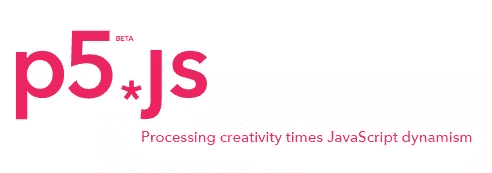

# processing . js vs P5 . js–有什么区别？

> 原文：<https://www.sitepoint.com/processing-js-vs-p5-js-whats-difference/>

几天前， [P5.js](http://p5js.org/) 被放归野外。这是一个遵循处理原则的可视化编程的 JavaScript 库。

根据[本帖](https://www.sitepoint.com/drawing-processing-ruby/):

> Processing 是一种环境/编程语言，旨在使可视化、交互式应用程序非常容易编写。它可以用于从教孩子如何编码到可视化科学数据的任何事情。

这是魔法背后的部分语言，就像这样:

[//www.youtube.com/embed/O8tT0GXTOPo](//www.youtube.com/embed/O8tT0GXTOPo)

还有这个:

[//www.youtube.com/embed/gWU7VIrzYlQ](//www.youtube.com/embed/gWU7VIrzYlQ)

当然，你可以在这里找到一切。

但是，如果我们之前有 [processing.js](http://processingjs.org/) 的话，P5.js 是什么？

## P5.js 是什么？



P5.js 是一个 JavaScript 库

> 让艺术家、设计师、教育工作者和初学者可以使用编码，并为今天的网络重新解释这一点

所以，这听起来像是自我加工。但是真正的是什么呢？

放松点，困惑的读者，我们会讲到的！先在这里看他们惊人热情的介绍[，然后再回来。](http://hello.p5js.org/)

成功了吗？现在明白了吗？没有吗？好的。我们来分解一下。

## Processing.js 和 P5.js 的区别

TL；DR: P5 是处理语言的直接 JS 端口。Processing.js 是一个转换器，它将纯处理代码动态解释为 js。后者需要你学加工，而不是 JS，反之亦然。

* * *

*实时编译 vs 语言翻译* : Processing.js 是一个库，它获取原始处理代码(类似于 Java，有类型和所有类型)并将其动态转换为 JavaScript。你在 [Processing.js](http://processingjs.org) 网站的浏览器中看到的例子，实际上是被实时翻译成 js 的纯处理代码。例如，这种转换类似于在没有内置 Dart VM 的浏览器中使用 Dart2js 运行 Dart 代码时得到的结果。另一方面，P5 是处理到 JS 代码的完全转换——所有的函数最终都将被翻译，并且您将使用 JavaScript 编写。

在 Processing.js 中，您需要定义一个带有数据源的画布区域，该区域会导致一个 PDE 文件(一个带有处理源代码的文件)。也有[种可供选择的方法](http://processingjs.org/learning/)，但简单来说，就是这样。在 P5 中，您直接编写 JS 代码，它会像您在网站上包含的任何其他 JS 文件一样被执行。

*扩展*:另一个区别是 P5 可以用[插件库](http://p5js.org/libraries/)扩展。例如，p5.dom.js 库添加了使用 p5 创建和操作 HTML 元素的选项，向您的草图添加滑块、按钮、表单元素等——很像我们在上一节链接的 Hello 视频中演示者所做的。

注意，在这两者中，只有 P5 得到了[处理基金会](http://processing.org/foundation/)的官方支持，这里甚至还有处理用户[的过渡手册。](https://github.com/lmccart/p5.js/wiki/Processing-transition)

## 民众

让我们来看一个演示比较，以了解它的全部要点。我制作了一个 Github 库，其中包含用每种方法编写的相同演示。

```
git clone https://github.com/Swader/processing
```

在`processing`文件夹中，你有两个子文件夹:`processing`和`p5`。每一个都将包含`demo1`和`demo2`子目录，其中包含一个`index.html`文件。这是您可以在浏览器中运行并测试的内容。第一个样本来自 P5 网站——一个连续绘制的椭圆，当鼠标点击时，它会变成黑色。

注意 Processing.js 用 Ajax 请求(通过 XHR)加载了`pde`文件，所以如果您试图通过运行`index.html`在浏览器中打开它，将会得到一个跨源错误。为了让它正常运行，您可能应该设置一个虚拟服务器，通过它来访问示例。最好用一个流浪者盒子里的[家园改进版](https://www.sitepoint.com/quick-tip-get-homestead-vagrant-vm-running/)的实例来完成——你将在五分钟内启动并运行。

### P5.js

在这种情况下，我们需要包含我们的草图代码的`sketch.js`文件，以及运行它的`index.html`文件。`sketch.js`代码如下:

```
function setup()  { createCanvas(640,  480);  }  function draw()  {  if  (mouseIsPressed)  { fill(0);  }  else  { fill(255);  } ellipse(mouseX, mouseY,  80,  80);  }
```

`index.html`文件仅包含以下内容:

```
<head>  <script  language="javascript"  src="../p5.js"></script>  <!-- uncomment lines below to include extra p5 libraries -->  <!--<script language="javascript" src="../addons/p5.dom.js"></script>-->  <!--<script language="javascript" src="../addons/p5.sound.js"></script>-->  <script  language="javascript"  src="sketch.js"></script>  </head>  <body>  </body>
```

### Processing.js

对于这个例子，我们需要一个带有处理代码的`pde`文件。在我们的例子中，这是带有以下 P5 翻译代码的`sketch.pde`:

```
void setup()  { size(640,  480);  }  void draw()  {  if  (mousePressed)  { fill(0);  }  else  { fill(255);  } ellipse(mouseX, mouseY,  80,  80);  }
```

然后，我们有了我们的`index.html`文件:

```
<head>  <script  language="javascript"  src="../processing.min.js"></script>  </head>  <body>  <canvas  data-processing-sources="sketch.pde"></canvas>  </body>
```

### 分析

乍一看，没有明显的区别。两个示例的运行速度大致相同，性能良好，并且具有相似的语法。然而，如果你正在使用谷歌 Chrome，并转到`chrome://flags`，然后激活帧速率计数器(见下图)，你会注意到 Processing.js 画布中的绘制保持稳定的帧速率，约为 58 至 60，而 P5 在绘制时低至 50，空闲时又回到 60。另一个有趣的事实是，处理一直使用硬件加速*，即使你的光标在画布区域之外。另一方面，如果画布上没有挂起的更改(光标在绘图区域之外)，P5 会暂停渲染，从而在不绘图时减轻负载。*

 *

## 演示 2

让我们现在做另一个演示——一个简单的粒子效果。这个粒子发射器将在随机方向上产生引力敏感粒子，我们将从另一个角度来看帧速率。我们将要使用的例子是 [this](https://www.processing.org/examples/simpleparticlesystem.html) 。

### Processing.js

`sketch.pde`的代码来自上面链接的示例:

```
ParticleSystem ps;  void setup()  { size(640,360); ps =  new  ParticleSystem(new  PVector(width/2,50));  }  void draw()  { background(0); ps.addParticle(); ps.run();  }  // A simple Particle class  class  Particle  {  PVector location;  PVector velocity;  PVector acceleration;  float lifespan;  Particle(PVector l)  { acceleration =  new  PVector(0,0.05); velocity =  new  PVector(random(-1,1),random(-2,0)); location = l.get(); lifespan =  255.0;  }  void run()  { update(); display();  }  // Method to update location  void update()  { velocity.add(acceleration); location.add(velocity); lifespan -=  1.0;  }  // Method to display  void display()  { stroke(255,lifespan); fill(255,lifespan); ellipse(location.x,location.y,8,8);  }  // Is the particle still useful?  boolean isDead()  {  if  (lifespan <  0.0)  {  return  true;  }  else  {  return  false;  }  }  }  // A class to describe a group of Particles  // An ArrayList is used to manage the list of Particles  class  ParticleSystem  {  ArrayList<Particle> particles;  PVector origin;  ParticleSystem(PVector location)  { origin = location.get(); particles =  new  ArrayList<Particle>();  }  void addParticle()  { particles.add(new  Particle(origin));  }  void run()  {  for  (int i = particles.size()-1; i >=  0; i--)  {  Particle p = particles.get(i); p.run();  if  (p.isDead())  { particles.remove(i);  }  }  }  }
```

### 孕烯醇酮

从上面翻译过来的 P5 的代码如下:

```
var ps;  function setup()  { createCanvas(640,  360); ps =  new  ParticleSystem(new p5.Vector(width/2,  50));  }  function draw()  { background(0); ps.addParticle(); ps.run();  }  function  Particle(lvector)  {  this.location = lvector.get();  this.acceleration =  new p5.Vector(0,0.05);  var random1 =  Math.random()  *  ((Math.random()  >  0.5)  ?  -1  :  1);  var random2 =  Math.random()  -  ((Math.random()  >  0.5)  ?  1  :  2);  this.velocity =  new p5.Vector(random1, random2);  this.lifespan =  255.0;  }  Particle.prototype.run =  function()  {  this.update();  this.display();  }  Particle.prototype.update =  function()  {  this.velocity.add(this.acceleration);  this.location.add(this.velocity);  this.lifespan -=  1.0;  }  Particle.prototype.display =  function()  { stroke(255,  this.lifespan); fill(255,  this.lifespan); ellipse(this.location.x,  this.location.y,  8,  8);  }  Particle.prototype.isDead =  function()  {  return  (this.lifespan <  0);  }  function  ParticleSystem(location)  {  this.origin = location.get();  this.particles =  [];  }  ParticleSystem.prototype.addParticle =  function()  {  this.particles.push(new  Particle(this.origin));  }  ParticleSystem.prototype.run =  function()  {  var p;  for  (var i =  this.particles.length -  1; i >=  0; i--)  { p =  this.particles[i]; p.run();  if  (p.isDead())  {  this.particles.splice(i,  1);  }  }  }
```

### 分析

我们再次看到 Processing.js 的帧速率稍微好一点。P5 保持在 56 左右，而 Processing.js 看起来保持在 58 左右。在这两种情况下，Processing.js 在性能方面都取得了胜利。

## 结论

P5js 是一个年轻而雄心勃勃的项目，旨在以一种比迄今为止的处理更加平易近人的方式将可视化编程带给大众。虽然它目前被迫在某种程度上降低功能，但该团队正在努力将处理语言的其余部分移植到 JS 上。

与 Processing.js 相比，使用 P5 的优势在于:

*   编写您可能已经熟悉的 JS 代码
*   由加工基金会正式支持
*   用 DOM 库插件操纵 HTML DOM 给你的 P5 草图添加通用的 HTML 元素等等
*   不绘图时对资源的消耗较轻

使用 Processing.js 的优势:

*   您学习处理，并可以在更快、更易于移植到非 web 环境的环境中使用它
*   似乎有一个更稳定的帧速率，并在我们尝试的两个演示中表现更好

我们将密切关注这个库，并定期使用它。你会吗？如果你想出一些有趣的例子，请告诉我们，我们很乐意写下来！

## 分享这篇文章*