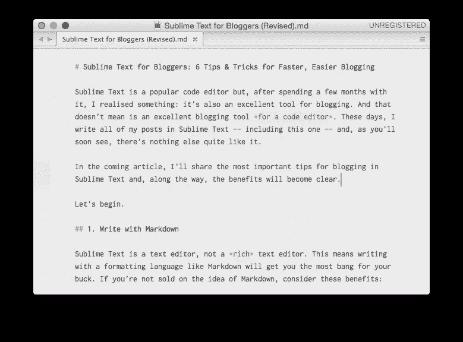
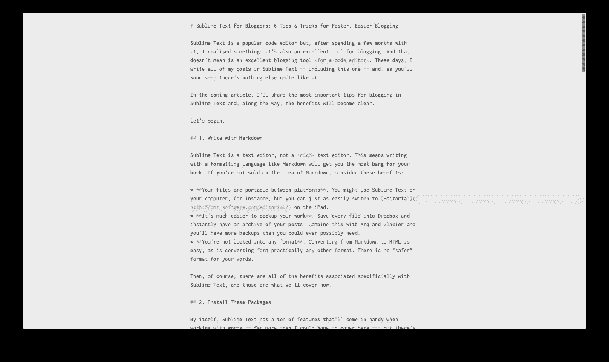
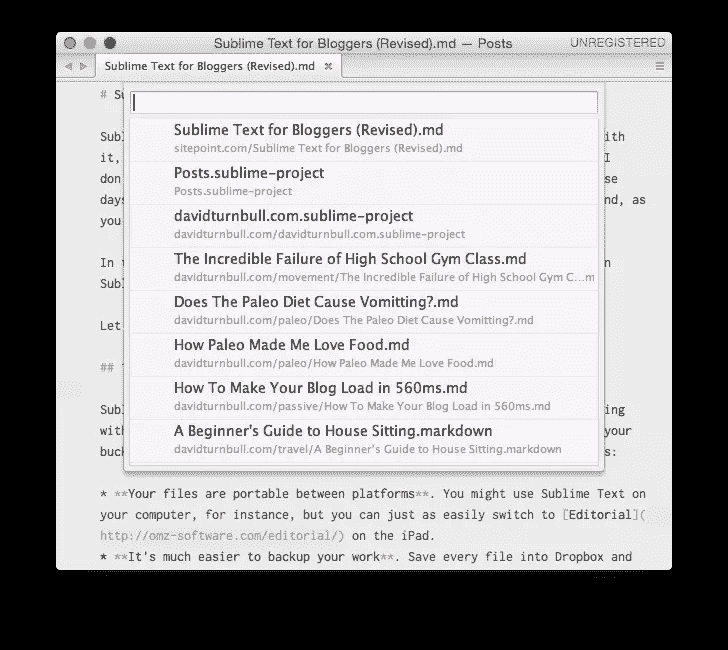
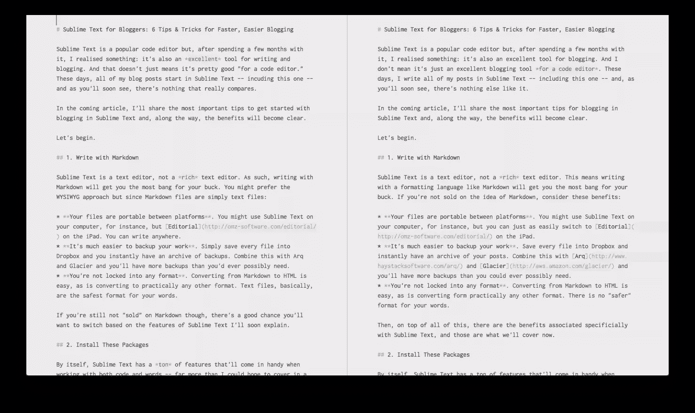

# 6 种方法将精彩的文字变成完美的博客工具

> 原文：<https://www.sitepoint.com/sublime-text-perfect-blogging-6-ways/>

Sublime Text 是一个流行的代码编辑器，但是在使用了几个月后，我意识到:它也是一个优秀的博客工具。我不是说它只是一个优秀的代码编辑器的博客工具*，我是说它是一个优秀的博客工具*时期*。这些天来，我用崇高的文字写我所有的帖子——包括这篇——而且，你很快就会看到，没有什么比这更好的了。*

在这篇文章中，我将分享用崇高的文字写博客的最重要的技巧，这样，好处将变得显而易见。

我们开始吧。

## 1.用降价写

Sublime Text 是文本编辑器，不是 *rich* 文本编辑器。这意味着用像 Markdown 这样的格式化语言写作会让你得到最大的回报。如果你不赞成降价，考虑一下这些好处:

*   **您的文件可以在不同平台之间移植**。例如，你可以在电脑上使用崇高的文本，但你也可以在 iPad 上轻松切换到[社论](http://omz-software.com/editorial/)。
*   **备份您的工作更加容易**。将每个文件保存到 Dropbox 中，你的文章就会立刻存档。将这些与 [Arq](http://www.haystacksoftware.com/arq/) 和[冰川](http://aws.amazon.com/glacier/)结合起来，你将拥有比你可能需要的更多的备份。
*   **你没有被锁定到任何格式**。从 Markdown 转换成 HTML 很容易，从其他格式转换也很容易。没有比这更安全的表达方式了。

此外，在所有这些之上，还有与崇高文本特别相关的好处，这些就是我们现在要讨论的。

## 2.安装这些软件包

Sublime Text 本身有大量的功能，在使用 words 时会很方便，但也有一个由第三方包组成的生态系统，将它带到了一个全新的水平。以下是我发现最有帮助的几个:

*   [MarkdownEditing](https://sublime.wbond.net/packages/MarkdownEditing) (上图)为 Markdown 文件添加了我所见过的最好的语法高亮——是的，甚至比 Byword 这样的专用写作应用还要好。它还通过删除行号等简化了界面。
*   [SmartMarkdown](https://sublime.wbond.net/packages/SmartMarkdown) 增加了一系列其他有用的功能，如折叠标题的能力(这对较大的文档非常有用)和更容易地创建 Markdown 列表(通过在您点击“Return”键时自动创建项目符号)。
*   [字数统计](https://sublime.wbond.net/packages/WordCount)为 Sublime 文本状态栏增加字数统计功能。它本身并不是一个出色的包，但不管怎样，它工作得很好。

但这些还只是冰山一角。有数以千计的软件包可用，其中许多是特定于作家。

要找到软件包(并了解如何安装它们)，请访问[软件包控制](https://sublime.wbond.net)。你也可以[点击这里](https://sublime.wbond.net/search/writing)找到与写作相关的包。

## 3.进入无干扰模式

就像我说的，MarkdownEditing 包简化了界面，所以你可以专注于你的文字，但 Sublime Text 本身有一个阻止分心的模式(这些模式相辅相成，而不是踩在彼此的脚趾上)。

要启用免分心模式，从“视图”菜单中选择选项或按键盘上的`Shift` + `CTRL` + `CMD` + `F`(如果你是 Mac 用户)。

在这种模式下，自动换行的长度缩短了，界面元素消失了(但是所有东西仍然可以通过快捷方式访问)，没有什么可以让你分心。仅此一点不会让你成为伟大的作家，但是:

1.  在你面前除了你的话什么都没有确实有帮助。
2.  虽然我确信它会成为标准，但并不是所有的代码编辑器都有这个特性。(而且要明确一点，这个模式和全屏模式是不一样的。)

你也有很多可定制的东西，所以如果没有分心的设置不太合你的意，几乎所有的东西都可以通过一点点调整来改变(但是那需要你去谷歌一下)。

## 4.组织项目

如果您在 Sublime Text 中打开一个文件夹(或多个文件夹)，您可以将该文件夹集合存储为一个*项目*。这里有一个例子:

目前，我正在“帖子”项目中写这篇帖子，该项目包含以下三个文件夹:

*   davidturnbull.com
*   meteortips.com
*   sitepoint.com

这些是我正在积极撰写的网站，因此，当我想写点什么时，我可以打开这个项目并立即访问我所有的博客帖子(即使这些文件夹不在我电脑上的同一个位置)。

为什么这与导航文件系统不同？

嗯，通过按键盘上的`CMD` + `P`组合键，我可以在我的项目中的所有文件之间切换，而无需触摸鼠标。这可能不是一个改变游戏规则的特性，但是:

1.  它变成了那些无意识的习惯之一，允许你在不打断你的流程的情况下在写博客文章之间切换。
2.  有大量这样的快捷方式和功能是为程序员设计的，但也可以很好地转化为编写任务。

具体如何使用项目将取决于你的偏好——例如，也许每个博客一个项目是有意义的——但无论哪种情况，它都是组织大量写作的便利功能。也许最好的比较点是在 [Scrivener](http://www.literatureandlatte.com/scrivener.php) 中的项目特征。

## 5.打开你的窗户

在我完成一篇博客文章的草稿后，我有一个严格的编辑流程，这个流程在过去几年里对我很有用:

1.  我离开岗位至少 24 小时。这个距离让我以一个新鲜的视角回到岗位。
2.  我在屏幕的一半打开初稿，在屏幕的另一半打开一个空白文档。
3.  我从零开始重写了整本书，只是用原来的草稿作为参考。

编辑有时会花更多的步骤，但从来不会更少，我认为这种僵化让人们更容易进入我的博客，也更容易在像 SitePoint 这样的大型网站上写文章。

在 Sublime 文本中，通过使用“布局”功能将窗口分成多个象限，这样的编辑是无缝的。我通常将窗口分成两个垂直窗格，但是水平窗格也是可用的，更多窗格的选项也是可用的(例如，如果您有一个大显示器并且想要另一个包含研究的窗格，这很有用)。

当结合无干扰模式时，将窗口分成多个窗格使得编辑变得尽可能简单。

## 6.导出您的作品

在崇高的文本中写博客文章当然很好。但是你如何把这些文章放到你的博客上呢？这里有几个选项可以考虑:

*   如果你是 WordPress 用户，安装 [Jetpack Markdown](http://wordpress.org/plugins/jetpack-markdown/) 插件。这将增加写文章时对 Markdown 的支持。
*   使用类似于[的标记为](http://marked2app.com)的应用程序可以很容易地将 Markdown 文件导出到 HTML(但是也有适用于这个的[包)。](https://sublime.wbond.net/packages/Markdown%20Preview)
*   转到静态博客平台，如 [Jekyll](http://jekyllrb.com) 。这是一个更大的转变，但写作体验是无可匹敌的。

然后为了以后参考，查一下 [Pandoc](http://johnmacfarlane.net/pandoc/) 。这对于博客文章来说有点过了，但是这个命令行工具允许你将 Markdown 文件转换成几乎任何格式，如果你想把你的博客文章收集在一起并把它们转换成一本书，这将是非常有用的。

## 结论

崇高的文本有很多令人喜爱的地方，我们在这里所讨论的只是一个开始。如果您已经经常使用文本编辑器，并且喜欢更紧凑的工作流程，那么就值得深入这个程序，了解更多关于它的包、定制和无数快捷方式的信息，让您的写作更加流畅。

## 分享这篇文章