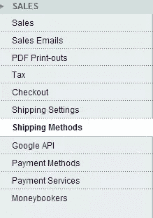
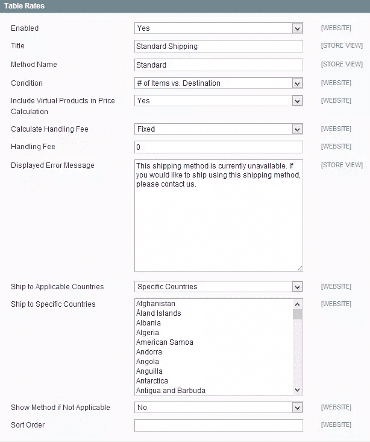
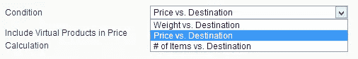
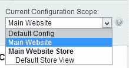
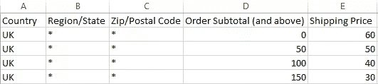

# 如何在 Magento 中设置运费表

> 原文：<https://www.sitepoint.com/set-up-table-rate-shipping-in-magento/>

如果你在经营一家向客户销售实物产品的网上企业，拥有一个灵活的、可扩展的运输政策是必不可少的。因此，重要的是要确保你的电子商务软件提供了一个简单的方法来调整和实施不同地区的运输政策，你打算出售。

行业领先的电子商务平台 Magento 是一个可扩展性更强、对开发人员更友好的系统，可以满足各种业务需求，包括设置运费。

在本教程中，我们将了解如何在 Magento 中设置运费表，使您能够根据客户的位置向他们收取不同的运费，从地区一直到邮政编码。

### 运输定价的三种方式

在我们开始之前，有一点需要注意的是，有三种主要的方式来设置餐桌价格——价格与目的地、重量与目的地以及物品数量与目的地。

本质上这意味着，如果物品的成本高，或者如果物品的重量和数量低，你可以设置更便宜的运输到某些目的地。

### 配置运费表

您可以在 Magento 后端的**系统**菜单中设置运费。

以管理员身份登录，导航至**系统>配置**，然后在**销售**下的左侧菜单中，选择**运输方式。**

这应该会在右边的窗口中弹出牌价菜单。

首先要做的是在【T2 启用】选项的下拉菜单中选择**是**来启用牌桌速率。这将关闭统一费率运输，并允许您根据您选择的标准指定不同的费率。

接下来的两个选项， **Title** 和 **Method Name** ，允许您创建不同的表费率运输策略，然后您可以从中进行选择。对于本教程，我们将保留名称为`Standard Shipping`和`Standard`。

下一个选项决定了如何计算运费。在我们的示例中，我们将使用价格与目的地，所以继续在下拉选项中选择它。

### 设置您的餐桌价格

现在是时候开始自己设定牌桌价格了。保存当前配置，然后在左上方**当前配置范围**菜单中，选择**主网站**。

这会将当前的运输政策应用到您的主网站。

右侧的“牌价”菜单现在看起来类似于这样:

特别是，您会注意到一个新的**导出 CSV** 和**导入**选项。Magento 需要一个 CSV 文件，因此您需要在电子表格中手动创建所需的运费，然后将其导入您的网站。

您将从模板文件创建 CSV。要下载模板，点击**导出 CSV** 。该文件如下所示:

文件中的第一列选择适用特定运输费率的国家。第二列允许您设置该国家/地区的费率，第三列选择特定的邮政编码。对于本例，我们将为这两列保留一个`*`值，这意味着我们将向英国的每个人收取相同的运费。

在**订单小计(及以上)**和**运费价格**栏中，您可以确定每种运费的价格。这些值将代表您为网上商店设置的任何货币。在上面的例子中，值代表以英镑为单位的价格。

价格，或**订单小计(及以上)**列，本质上是指任何消费 0 或以上的客户将被收取相应的运费。在这种情况下，基本发货是 60，如最后一列所示。相反，任何顾客消费 50 英镑或以上，将被收取 50 英镑的运费，等等。

您将根据自己的政策手动设置所有这些运费。完成后，保存文件，然后将其导入 Magento 的“表格费率”部分。

现在，您的运费已经设定，将在客户结账时显示在前端。

## 分享这篇文章