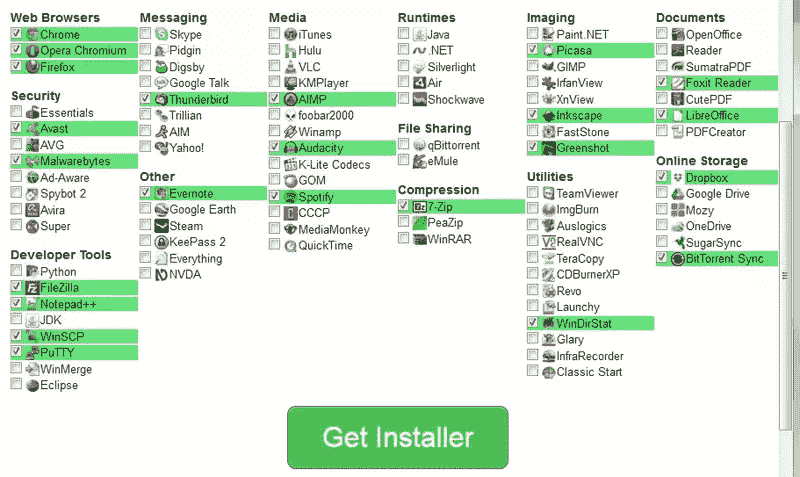
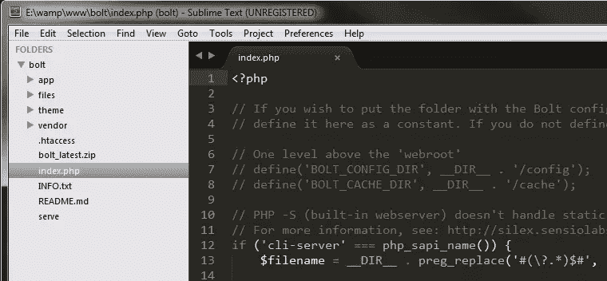
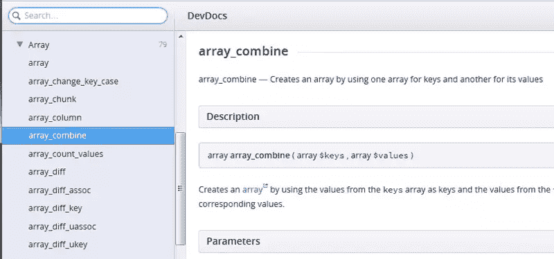
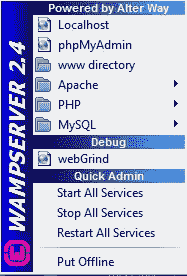
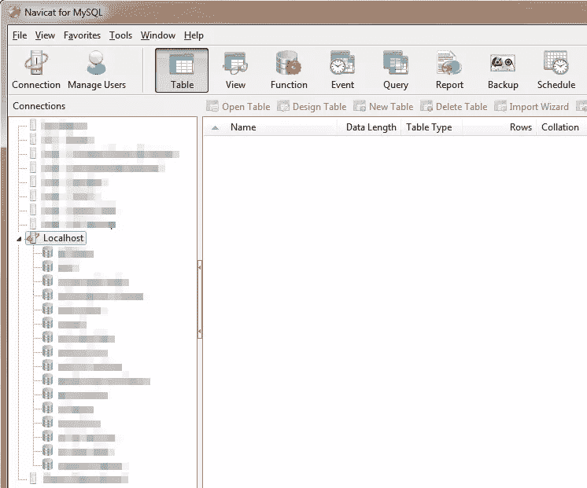
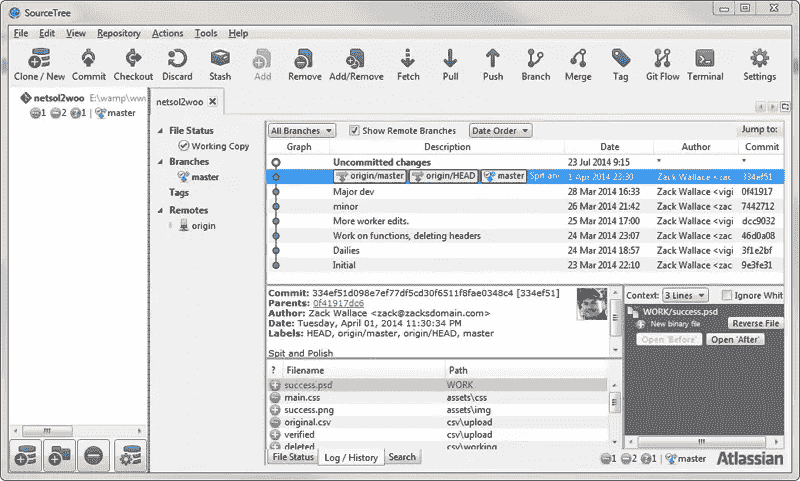

# 我如何在 Windows 上设置我的开发机器

> 原文：<https://www.sitepoint.com/how-set-up-my-development-machine-windows/>

每个开发者都不一样。这篇文章不是解释什么是“最好的”或者你“应该”做什么，它只是简单地看一看一个开发者的工具。我使用 PHP、HTML、MySQL、CSS 和 JavaScript，所以这是非常普通的 web 开发。

SitePoint 最近发表了一篇类似主题的文章，去掉了“在 Windows 中”的部分，作者是 Shaumik Daityari。他使用 Ubuntu 作为他的开发机器，所以我认为从 Windows 方面回顾类似的设置会很好。

## 全新安装

我将假设我有一个全新安装的 Windows 7 专业版，并从零开始。我使用 [Ninite](https://ninite.com/) 在一台新机器上安装所有我喜欢的工具。其中包括最新的浏览器，以及:

*   [FileZilla](https://filezilla-project.org/)
*   [记事本++](http://notepad-plus-plus.org/download/v6.6.7.html)
*   [WinSCP](http://winscp.net/eng/index.php)
*   [腻子](http://www.putty.org/)
*   [7-Zip](http://www.7-zip.org/)
*   [绿色快照](http://getgreenshot.org/)
*   [Dropbox](https://www.dropbox.com/)

这些是我安装的一些程序，但是还有更多与开发无关的程序需要获取。如果你还没有使用 Ninite 来设置一台新机器，你就错过了，它让这个过程变得简单多了！

### 关于基本工具

如前所述，我安装了所有的浏览器，所以我可以在每一个浏览器上进行本地测试。如果需要的话，有 web 服务可以向你展示你的项目如何在不同的环境和旧的浏览器上渲染。你可能想看看多浏览器渲染的[浏览器主机](http://browsershots.org/)或[浏览器服务器](https://browserling.com/)。他们都有你可以运行的免费测试。

FileZilla 是为了我的 FTP 需求，Notepad++是我的通用文本编辑器，用来代替 Windows 中的记事本(我也用[一个插件来编辑十六进制文件](http://sourceforge.net/projects/npp-plugins/files/Hex%20Editor/))。

WinSCP 是一个在我的 SFTP Linux 服务器的文件系统中工作的工具，有一个可视化的拖放界面，PuTTY 是我的远程控制台 SSH 工具。

我用 7-Zip 压缩文件，Greenshot 截屏并给它们加注释，Dropbox 是我保存个人客户的大量文件的地方，包括发票、规格表、服务器和主机信息、待办事项、培训材料和许多其他数据。我也用 Dropbox 分享截图和文件。

我还会提到 Evernote 是一款出色的笔记应用。

特别要提的是下面这些得心应手的工具: [ColorMania](http://www.blacksunsoftware.com/colormania.html) 、 [jRuler](http://jruler.software.informer.com/3.1/) ，当然还有火狐的 [Firebug](http://getfirebug.com/) 。

## 编辑们

接下来，我需要一些在 Ninite 上找不到的应用程序。我安装:

*   [崇高正文 3](http://www.sublimetext.com/3)
*   [NetBeans IDE](https://netbeans.org/)
*   [DevDocs](http://devdocs.io/)
*   [源代码管理](http://www.sourcetreeapp.com/)

这里的读者会对 Sublime 和 NetBeans 比较熟悉。我使用 Sublime 主要是为了启动项目、处理较小的项目或进行快速编辑。

当我需要所有这些额外的功能和参考时，NetBeans 适用于更大的内部项目。我所有的编辑都使用 Sublime 的“save_on_focus_lost”设置；我所做的就是做我的更改，然后点击浏览器并刷新，Sublime 会在失去焦点时自动保存。如果您打开了许多标签页，它还可以让您不必运行“全部保存”命令，因为当您单击另一个标签页时，它会保存每个标签页。只需将`"save_on_focus_lost": true"`添加到您的用户设置文件中。

已经提到的 Notepad++也可以作为一个编辑器，因为当我想在 ide 环境之外打开文件时，我经常使用它。

有许多其他工具可以编辑和查看“实时”更改，而不必保存，例如，你可以尝试使用 [JetBrains PhpStorm](http://www.jetbrains.com/phpstorm/) ，或者非常聪明的[括号](http://brackets.io/)编辑器。

PhpStorm 将花费你，但它是一个非常好的编辑器。我个人在前段时间测试的时候并没有发现括号非常健壮，尽管从那以后它可能已经改进了很多，而且它是免费的，看起来很像 Sublime。不管你选择哪个编辑器，都应该是你觉得舒服的，做你需要的。

对于我的需求，以及我所从事的项目，我对一种老式的“保存并刷新”的编辑方法很满意。Sublime 还有我用过的最好的颜色主题( [Monokai](http://eclipsecolorthemes.org/?view=theme&id=9022) )，比我用过的其他编辑器都要好。(超级提示:我在 13 点使用字体 [Consolas](http://en.wikipedia.org/wiki/Consolas) 以获得近乎完美的编辑体验！)

在 Sublime 中，我直接安装了[包控件](https://sublime.wbond.net/)。接下来我搜索一些包:例如，我已经安装了 Emmet、Phpcs 和 Xdebug Client。我使用的插件来来去去；我喜欢测试不同的代码嗅探器、编码标准助手、语言参考等等。我最近在使用 [ProcessWire](https://processwire.com/) CMS，在 Package Control 中快速搜索发现了一个用于添加 ProcessWire 片段的插件。你永远不知道你会在那里找到什么！

[DevDocs](http://devdocs.io/) 不是编辑器，是我用了一段时间的语言参考工具。它可以让你选择你感兴趣的语言，而[模糊搜索](http://en.wikipedia.org/wiki/Approximate_string_matching)工具会在你键入时找到你想要的任何功能。

如果你想对它的特性有一个大概的了解，可以看看 Bruno 关于 DevDocs 的文章。

## 服务器

所有这些都解决了，是时候让服务器运行了！这是每个人工作方式不同的地方——我的方式只是其中之一，有些人可能会说它甚至不是一个好的方式！对于我所从事的项目的数量和规模来说，这种方法对我来说非常有效，但是我确实意识到，在一个拥有大型项目的大型环境中，或者在团队中工作时，这可能不是最好的设置。

我直接在我的机器上使用 WAMP。WAMP 当然是惠普服务器应用程序的**W**windows**A**pache**M**ySQL**P**。它安装迅速，需要很少的配置，并可以随时为您的项目服务。

我还在我的办公室里使用了一台专用服务器，一台虚拟机(本地和其他硬件上的)，以及来自 [InMotionHosting](http://www.inmotionhosting.com/) 、 [DigitalOcean](https://www.digitalocean.com/) 、 [HostGator](http://www.hostgator.com/) 和其他公司的云服务器。

如果我在远程服务器上工作，我将在那里使用 PuTTY、WinSCP 和 FileZilla。如果我在本地硬件上工作，我可能会使用[远程工具](http://www.remoteutilities.com/)、[终端](https://terminals.codeplex.com/)，或者其他一些远程工具。

如果我使用虚拟机，它可能是 [VirtualBox](https://www.virtualbox.org/) ，或者是 [VMware vSphere](http://www.vmware.com/products/vsphere-hypervisor/gettingstarted.html) 。在我看来，所有这些备用服务器配置使用起来都要复杂得多，除非你经常设置它们。我甚至没有足够的空间来开始谈论流浪者或 PuPHPet，它们旨在使建立虚拟服务器变得更快更容易。在 SitePoint 中搜索“vagger”、“PuPHPet”、“Puppet”、“VirtualBox”等，了解更多关于虚拟开发服务器自动化的信息。

如果您需要精确匹配活动服务器的规格，那么您最好运行一个虚拟机并以这种方式设置精确的规格。这是流浪者发光的地方。DigitalOcean 在设置“Droplet”时也有一些选项，比如运行什么操作系统等等。无论需要什么，都有解决方案！

我使用 WAMP 进行所有的初始开发，测试框架和 CMSes，编写小应用程序来帮助自己完成项目，等等。它非常强大，可以让您根据需要并行运行不同版本的 PHP、MySQL 和 Apache。

WAMP 帮了大忙的一个例子是从 WAMP 多年前的旧备份中恢复 MySQL 数据。这些数据在一个旧版本的 MySQL 中，无法打开，所以我简单地在 WAMP 安装了一个旧版本的 MySQL，访问数据，导出数据，切换回新版本，然后导入。

## 数据库

我安装了 MySQL 的 Navicat，这是我最喜欢的数据库管理工具。它不是免费的，但是如果你专业地使用它，它也不是很贵。您可以管理远程数据库、导入和导出多种格式、合并数据库、复制结构、读取服务器变量和状态、修复数据库、同步数据、自动备份、构建报告和查询，等等。

像 PHPMyAdmin 这样的东西可能可以让你达到 80%的目标，但是如果你使用它，Navicat 将会启用一些非常酷的东西。实际上，我把它连接到我工作的所有 MySQL 数据库，在我们所有的服务器上。对我来说，用它来导入 CSV 数据特别方便。我用过的另一个免费的 MySQL 管理器是 [MySQL Workbench](http://dev.mysql.com/downloads/workbench/) 和 [HeidiSQL](http://www.heidisql.com/) ，它们也连接到多个服务器。

## 领域

如果以这种方式开发，您很可能会在 localhost 的子目录中运行每个项目。即例如“/localhost/projectA/”和“/localhost/projectB”。这很好，但是如果您需要将您的项目复制到一个真实的 web 服务器，请注意不要使用到本地主机的硬链接！总是尝试使用相对链接，如果你必须使用硬链接，要知道将你的项目转移到另一个域需要什么(配置编辑，数据库更新等)。

在实时服务器上，项目可能运行在 web 根文件夹中，而在 WAMP，它可能是 localhost 的子文件夹。这将扔掉img/”这样的链接，斜线通常会把你带到根文件夹。在 WAMP 上，你仍然需要进入你的项目文件夹，比如“/projecimg/”。您也不想硬编码您的项目文件夹，所以使用 PHP 变量来创建链接，或者在 htaccess 或 PHP 或您使用的任何东西中设置基目录。

这对于像 WordPress 这样的 CMSes 来说尤其重要，在 WordPress 中，一些链接必须在移动之前进行更改，或者对于其他系统来说，在移动站点之后，您甚至必须在数据库中编辑配置。

## 外部访问

如果你想让你的网络之外的人访问你的服务器，就像我一样，那么你可以设置一个域或子域来指向你的 IP 地址，比如“dev.example.com”。您必须打开路由器上的端口并配置防火墙，这样才能工作。这是“本地”发展的主要缺点。如果你想让“外部访问”浏览网站，你必须向外界开放你的机器，并制定某种用户访问安全措施。

如果您需要向客户展示您的工作，他们需要一种查看您的服务器的方式，因此您可以使用 htaccess 密码，或者使用随机端口来定向端口 80 流量，或者使用 IP 白名单，或者其他一些安全措施。

如果你对世界开放，你也必须想办法阻止机器人扫描你的项目并公开网址！因为我们用的是 Apache，htaccess 是你的朋友。了解如何设置密码文件夹、IP 白名单和使用 robots 文件。

在 WAMP 内部，您将配置监听端口，并确保您将服务器设置为“在线”。

深入研究所有这些配置和安全性已经超出了本文的范围，但请注意这一点。

与此相关，您可能想看看 Patrick Catanzariti 最近关于从任何地方访问 localhost 的文章，这可能在这方面有所帮助。

## 包装它

通过这种方式设置我的开发机器，我可以使用 Navicat 创建数据库并轻松管理它们，使用 Sublime 创建新文件夹并立即处理项目。

如果我需要通过 GIT 对一个项目进行源代码控制，我有时会这样做，为此我有 [SourceTree](http://www.sourcetreeapp.com/) 。它是一个可视化工具，你们中的一些纯粹主义者可能会鄙视它，而喜欢命令行，但是我发现它在需要的时候很容易使用。我有一个 [Bitbucket](https://bitbucket.org/) 账户供这些项目居住。

我希望您发现这很有用，并可能找到一两个工具添加到您自己的开发设置中。同样，这对我很有用，因为我开发的主要是公司内部的项目和工具，所以我不需要团队，也不需要在多个地方进行开发，甚至不需要对大多数项目进行源代码控制。

外部访问受到限制。我向刚开始开发和学习编码的人推荐我的设置，因为大多数工具都是免费的，不需要命令行知识，并且很容易更改设置和配置。

请在评论中告诉我你最喜欢的 Windows 开发工具。我总是乐于尝试新工具！

## 分享这篇文章