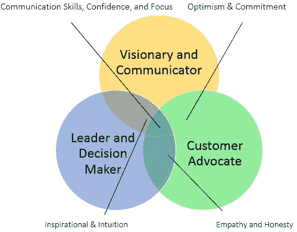
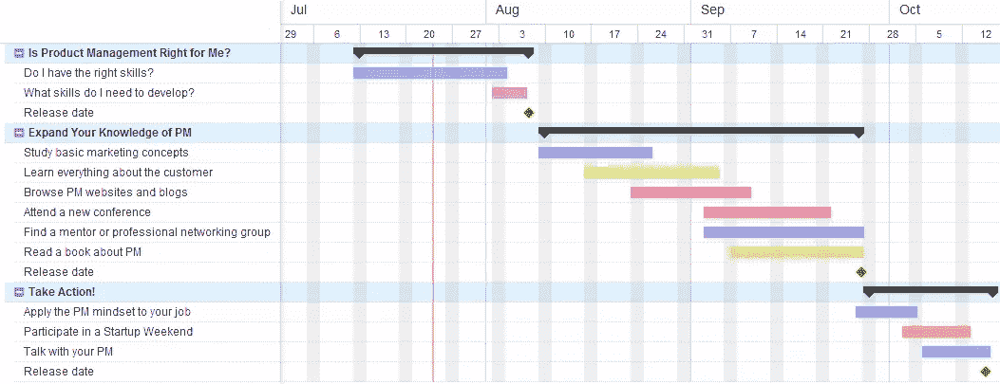

# 从开发人员到产品经理:三阶段计划

> 原文：<https://www.sitepoint.com/developer-product-manager-3-stage-plan/>

产品经理，也被称为 pm 或“迷你 CEO”，是负责在产品的生命周期中从战略上指导产品的人。他们通过管理开发团队和充当客户的集体代言人来最大化产品的投资回报率。如果你对涉及技术、商业和用户设计的动态职业感兴趣，产品管理可能适合你——尤其是如果你有开发背景的话。

对于开发人员或其他担任技术角色的员工来说，最终过渡到产品管理并不罕见。一些开发人员可能会发现他们喜欢管理产品路线图和解决客户的问题，而不是自己编写代码和构建产品。其他经验丰富的工程师可能正在寻找合适的职业过渡到管理职位。

如果你有兴趣在未来转向产品管理，这里有三个关键步骤。

## 1.决定你是否适合产品管理

你会发现世界上很少有受过正规训练的产品经理。相反，他们中的许多人在经历了开发人员、营销经理、业务分析师和销售人员的职业生涯后，已经进入了这个角色。

其中，开发人员通常有几个有助于他们成为产品经理的品质，主要是:

*   较强的解决问题的能力。
*   有产品开发和与开发团队合作的经验。
*   典型的分析技能

然而，并不是所有的开发人员都适合产品管理角色。在设定产品管理路径之前，一定要问自己这些问题。

### 我能理解并感同身受客户吗？

客户是任何业务中最重要的部分，任何产品经理的主要职责是了解他们的问题和需求。不是所有的开发人员都能够站在客户的角度来识别当前的挫折并预见未来的问题。此外，你有责任在工作场所大胆表达顾客的心声。你必须愿意随时提醒和教育每个人客户最迫切的问题。

### 我可以与多个团队互动和交流吗？

产品经理几乎与企业内部的每个团队都进行协调和互动。他们必须能够向管理层提交计划和目标，与营销部门协调新开发功能的发布，从客户支持部门接收客户反馈，并与客户自己交流。作为一名产品经理，你需要能够在与不同群体交谈时使用不同的语言。与开发团队讨论每日和每周目标可能需要不同的术语，而不是与销售团队演示最近开发的产品功能。

### 我是一个强有力的经理吗？

产品经理不仅负责监督产品，他们也是开发团队的主管。作为一名领导者，你必须对自己高效授权、帮助团队成员和激励他人的能力充满信心。您是团队的决策者，负责优先考虑并确保开发团队总是致力于业务的最高价值项目。某些决定可能很小，而其他决定可能会影响未来 3 到 6 个月的产品路线图。有时候这些决定是经过精心计划和研究的，有时候是你不得不匆忙做出的直觉决定。

在许多情况下，你必须不仅仅是一个领导者，你必须是一个有远见的人。你必须收集反馈，研究你的市场，用你的每一分创造力为你的客户设想和生产完美的产品。你的愿景必须清晰，对组织中的每一个成员都有吸引力。

你需要自信、专注、乐观、投入、有灵感、有同情心和诚实。缺少其中任何一种品质都会削弱你履行产品经理多重角色的能力。

## 2.扩展你的产品管理知识

如果你认为自己有能力成为一名成功的产品经理，那么下一步就是要确保自己有足够的领域知识，并对基本的产品管理主题和工具有深刻的理解。缺乏客户知识和缺乏营销技巧是大多数开发人员在进入产品管理领域之前必须改进的关键领域。

### 学习基本的营销概念和技术

作为一名开发人员，你应该已经对软件开发和产品的创造有了深刻的理解。但是大多数开发人员并不了解产品管理的营销方面。根据您的产品在产品管理生命周期中的位置，您应该熟悉营销策略，包括:

*   品牌管理
*   市场研究和消费者行为
*   市场细分和定位

理解这些概念将有助于您准确定位客户的需求，并定制您的产品来满足他们。虽然市场研究和市场细分主要是在产品生命周期的早期阶段完成的，但品牌管理几乎在每个阶段都是相关的。一旦你掌握了这些关键的营销概念，你也将能够有效地与营销经理合作，为企业规划营销工作。

### 了解顾客的一切

此外，大多数开发人员很少与公司的客户互动。对于潜在的项目经理来说，这是一个至关重要的问题，因为作为一名产品经理，你需要成为产品和客户两方面最重要的专家！尽管许多潜在的项目经理在产品管理的所有方面都没有经验，但他们能够成功地过渡到这个角色，因为他们在特定行业有几年甚至几十年的经验，并且完全了解客户的一切。

领域知识对于产品经理的重要性怎么强调都不为过。阅读任何行业出版物、文章和时事通讯，确保你对你的客户了如指掌。你需要知道你的客户是谁，他们在想什么，他们如何运作，他们在纠结什么，最重要的是，如何解决他们的问题。

### 更多学习方法

以下是您可以完成的任务列表，以进一步完善和扩展您的产品管理知识。

#### 浏览产品管理网站和博客

[关注产品](http://www.mindtheproduct.com/)是一个由全球各地的产品经理组成的社区。通过该网站，您可以搜索几乎所有的产品管理会议，浏览经验丰富的高级产品管理专业人士的文章，观看关于重要项目管理主题的视频和讲座，甚至通过工作公告板查看空缺职位。

由拥有二十多年产品管理经验的 Jim Anderson 博士撰写，[意外产品经理](http://theaccidentalpm.com/)博客是学习如何在全球经济中制造、营销和管理产品的绝佳资源。虽然有些帖子可能适合更有经验的产品经理，但它仍然包含大量相关信息，适合有抱负的项目经理。

#### 参加会议

每隔几周在主要城市举行的产品营，是由热情的项目经理举办的“非会议”,讨论开发和管理完美产品的最新技巧、技术和实践！每个人都参与其中，最棒的是，它是免费的。

#### 导师或专业网络小组

如果你住在大城市或附近，你应该能够找到并会见当地或区域性的产品经理协会或团体。一些最大的地区产品经理协会包括硅谷产品管理协会和波士顿产品经理协会。其他受欢迎的协会包括[产品开发&管理协会](http://www.pdma.org/)和 [280 集团](http://280group.com/)。

#### 读一本关于产品管理的书

[产品经理案头参考](http://www.amazon.com/The-Product-Managers-Desk-Reference/dp/0071591346)近 800 页，全面涵盖了产品经理工作的几乎每个方面。作为高级产品经理的参考指南，它为新人提供了丰富的信息，从分析产品的财务表现到利用讲故事来激励团队成员。

虽然《跨越鸿沟》已有近十年的历史，但它仍然是在不断变化的高科技行业中进行有效营销的相关指南。它建议营销人员应该定制策略，以补充技术采用生命周期中的单个群体，同时逐渐过渡到并定位产品，以满足该周期中下一个群体的需求。这对于缺乏营销经验的开发人员来说尤其重要。

## 3.行动起来！

当你对产品管理的不同方面有了更多的了解，并决定你是否有成功的技能和能力后，用你新获得的知识来决定你是否喜欢产品经理的角色和生活。

来源:啊哈！

### 将产品经理的心态应用到你的工作中

不管你现在是实习生、开发人员还是市场经理，试着用产品经理的心态来处理问题和项目。无论你是在建立一个资源库，还是在改进或修改文档，都要把每个小项目想象成一个产品经理。有什么问题？客户是谁？我该如何解决这个问题？

通过将产品管理思维应用到你的日常任务中，你会更好地理解产品经理如何处理问题，并逐步设计解决方案来有效地解决问题。

### 参加创业周末

[创业周末](http://startupweekend.org/)是激动人心的活动，让你在一个小而友好的环境中短期担任产品经理的角色！创业周末为营销人员、开发人员和设计师提供了会面、合作和验证令人兴奋的想法的机会！它们由世界各地的主要城市主办，只需大约 100 美元。

创业周末是绝佳的机会，因为他们给有抱负的产品经理提供了体验角色的方方面面的机会。在 54 小时的时间里，你将集思广益，采访客户，并与其他团队成员交流，以创建一个最小可行的产品。

周末结束时，每个团队都要向评委小组展示他们的想法。获胜的团队将获得奖品，从建立关系网的机会到打折的法律和公司服务。

最后，你应该对产品经理的生活有了更好的理解。你也应该有机会和其他有经验的产品经理交流和学习，并建立你的关系网。

## 结论

许多开发人员能够成功地过渡到产品管理，是因为他们出色的解决问题的技巧和与开发团队的丰富经验。但是产品管理并不适合所有人。产品经理必须是工作场所中知识渊博的客户拥护者、大胆的远见者和果断的领导者。

通过学习当前的营销技术，深入了解客户和产品，并利用其他 PM 资源，开发人员可以将自己定位为平稳过渡到当今最令人兴奋和最有回报的职业之一。

我在 OpenSesame 的产品经理 Abby Miles 的帮助下创建了这个指南。Abby Miles 在软件和在线培训行业有十年的经验，之前在 BlueVolt 担任产品经理。

## 分享这篇文章