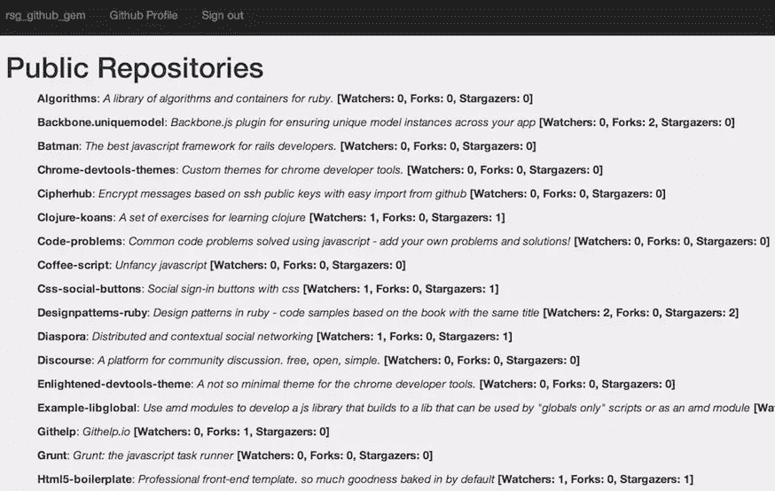

# Ruby 社交宝石:Github

> 原文：<https://www.sitepoint.com/ruby-social-gems-github/>


这是我关于 Ruby 社交宝石系列的第四部分。今天，我将重点介绍 Github 的 Octokit gem。

在本系列的前几部分中，我们介绍了 LinkedIn 和脸书等社交网站，并创建了一个简单的应用程序来处理身份验证和 API 查询。出于同样的目的，我们将使用 Octokit gem 构建一个类似的应用程序。

## 项目设置

我们将使用 [rails-composer](https://github.com/RailsApps/rails-composer) 用所需的 gem 和配置快速设置项目。

如果您不了解 rails-composer，它只是几个 rails 项目模板，您可以在启动项目时交互构建。

### 项目初始化

> 你可以从 Github [这里](http://github.com/ahmdrefat/rsg_github_gem)下载本教程的完整源代码

运行以下代码行来创建项目:

```
rails new rsg_github_gem -m https://raw.github.com/RailsApps/rails-composer/master/composer.rb
```

作曲者会问你几个关于项目模板的问题。你可以随意选择不同的选项。我将列出我选择来构建这个项目的重要选项:

*   构建一个 RailsApps 示例应用程序
*   rails-omniauth
*   雇员再培训局(Employees Retraining Board)
*   开源代码库

创建项目后，在 Github 上创建一个应用程序来获取`Client ID`和`Client Secret`。这些值保存在 Rails 应用程序的`secrets.yml`文件中。现在不要太担心这个，我们以后会回到这一步。

#### 创建 Github 应用程序

进入(你的 Github 设置)[https://Github . com/settings/applications]点击**注册新应用**按钮，然后填写表格。对于我们的目的来说，唯一重要的值是“授权回调 URL”字段，您应该用路由中定义的确切回调来填充该字段。
rails-composer 将这条路线创建为`http://localhost:3000/auth/github/callback`。

在**rsg*github*gem/config/routes . Rb**文件的第 **4** 行你会看到`get '/auth/:provider/callback' => 'sessions#create'`。这是我们的回调。r `:provider`这里是`github`，因为我们使用 OmniAuth gem 进行认证。

如果你不熟悉 OmniAuth，这里有一段来自他们的 Github 库的引文:

> OmniAuth 是一个为 web 应用程序标准化多提供者认证的库。它是为了强大、灵活和尽可能少做而创建的。任何开发人员都可以为 OmniAuth 创建策略，通过不同的系统对用户进行身份验证。从脸书到 LDAP，已经为各种事物创建了 OmniAuth 策略。

我们将在以后的教程中详细介绍 OmniAuth。

#### OmniAuth 提供者密钥和机密

在 Github 中创建应用程序后，将“客户端 ID”复制到**rsg*Github*gem/config/secrets . yml**中的`omniauth_provider_key`和`omniauth_provider_secret`中。

重启 Rails 服务器并访问(http://localhost:3000/sign in)[http://localhost:3000/sign in]。您应该被重定向到 Github 授权页面来授权您的应用程序。

嘣！我们刚刚用 Github 实现了登录，这是本教程的目标。

现在，我们将介绍 Github API，Octokit gem，然后开始构建演示项目。

## Github API 简介

Github 公开了一组非常丰富的 API，允许开发人员访问大多数(如果不是全部)Github 数据。它提供了一组 web 挂钩，让您能够构建非常有趣的应用程序。

你可以在没有认证的情况下访问 Github APIs，但是你会受到每小时请求数量的限制。下面是 Github 参考资料中关于限制的一段引文:

> 对于使用基本身份验证或 OAuth 的请求，每小时最多可以发出 5，000 个请求。对于未经身份验证的请求，速率限制允许您每小时最多发出 60 个请求。

在 [API 参考](https://developer.github.com/v3/)中，您可以看到所有不同的领域，从活动 API 到企业 API。我们将关注两个部分:**用户**和**存储库**

## Octokit.rb 宝石

OmniAuth 只是用来验证用户的 Github 帐户。我们将使用 Octokit gem 以实用的方式访问 API。下面是他们的 Github 库中的一段话:

> Octokit.rb 将 GitHub API 封装在一个平面 API 客户端中，该客户端遵循 Ruby 约定，不需要太多 REST 知识。大多数方法都有必需输入的位置参数和可选参数、头或其他选项的选项散列

让我们开始用 Octokit gem 构建演示项目的 API 查询部分。

将宝石添加到 gem 文件`gem "octokit", "~> 3.0"`并运行`bundle install`。

## 构建演示项目

在我们开始编写任何代码之前，让我们回顾一下在`session_controller`、`user`模型和路线中生成的一些代码。

### 路线

让我们把重点放在两条路线上。第一个路由用作前面提到的成功回调，您应该将它添加到 Github 应用程序中。

```
get '/auth/:provider/callback' => 'sessions#create'
```

另一条路径是失败路径，如果用户拒绝授权应用程序或发生任何其他授权错误，Github 会将用户重定向到这条路径。

```
get '/auth/failure' => 'sessions#failure'
```

### 用户模型

我们对用户模型做了一些更改，所以这不仅仅是生成的代码。下面的代码用`provider`、`uid`和`name`创建一个新用户。一旦创建了用户，我们就添加一个包含基本信息的`GithubProfile`对象和`access_token`,供以后访问 Github 时使用。

```
def self.create_with_omniauth(auth)
  new_user = create! do |user|
    user.provider = auth['provider']
    user.uid = auth['uid']
    if auth['info']
       user.name = auth['info']['name'] || ""
    end
  end

  new_user.create_github_profile auth

  new_user
end
```

稍后我们将创建`GithubProfile`模型，现在我们需要做的就是从这个模型创建一个对象并附加到当前用户。

```
def create_github_profile auth
  GithubProfile.create({user_id: id, nickname: auth[:info][:nickname]||"",
    email: auth[:info][:email]||"", name: auth[:info][:name]||"",
    image: auth[:info][:image]||"",
    location: auth[:extra][:raw_info][:location]||"",
    public_repo: auth[:extra][:raw_info][:public_repos]||"",
    public_gists: auth[:extra][:raw_info][:public_gists]||"",
    followers: auth[:extra][:raw_info][:followers]||"",
    following: auth[:extra][:raw_info][:following]||"",
    member_since: auth[:extra][:raw_info][:created_at]||"",
    access_token: auth[:credentials][:token]})
end
```

### Github 概要模型

这个模型包含每个用户 Github 概要的基本信息，以及他们对 API 的访问权标。

```
rails g model github_profile user_id:integer nickname:string email:string name:string image:string location:string public_repo:integer public_gists:integer followers:integer following:integer member_since:string access_token:string
```

将`has_one :github_profile`添加到`User`模型中，将每个概要文件与它的用户相关联。

### 会话控制器

`new`动作通过 OmniAuth `/auth/github`将用户指引到预定义的路线。OmniAuth 使用正确的参数和 URL 重定向用户 Github。你可以用`/signin`路线打这个动作。

```
def new
  redirect_to '/auth/github'
end
```

在所有的 OmniAuth 策略中，`create`动作是标准的。它提取提供者名称(在这个例子中是 T1)和这个提供者上的用户的惟一 id。如果没有具有这些参数的用户，它将使用`User`模型中的`create_with_omniauth`方法创建一个新用户。

```
def create
  auth = request.env["omniauth.auth"]
  user = User.where(:provider => auth['provider'],
                    :uid => auth['uid'].to_s).first || User.create_with_omniauth(auth)
  reset_session
  session[:user_id] = user.id
  redirect_to root_url, :notice => 'Signed in!'
end
```

### Github 控制器

该控制器显示当前用户报告。

```
rails g controller github index
```

出于演示项目的目的，我们将在这里使用最简单的查询，它为当前用户提取所有公共回购的列表。

首先，使用存储在`GithubProfile`模型中的访问令牌对客户端进行身份验证。之后只要用`client.repos`查询用户回购即可。

```
def index
  client = Octokit::Client.new(:access_token => current_user.github_profile.access_token)
  @repositories = client.repos
end
```

### 视图

准备现有的视图来显示“登录”和“注销”按钮，以及显示关于当前用户的基本信息。

用**导航*声明* links.html.erb** ，添加链接注销、登录用户 Github 个人资料。

```
<li>
  <%= link_to 'rsg_github_gem', root_path, class: 'navbar-brand' %>
</li>

<% unless current_user %>
  <li>
    <%= link_to "Sign in with Github", "/signin" %>
  </li>
<% else %>
  <li>
    <%= link_to "Github Profile", "/github" %>
  </li>
  <li>
    <%= link_to "Sign out", "/signout" %>
  </li>
<% end %>
```

我们将在 **visitors/index.html.erb** 中显示登录用户的基本信息。

```
<% if current_user %>
  <div><h3>Welcome, <%=  current_user.name %></h3></div>
  " width="100px" style="float: left;
  margin-right: 12px;">
  <div style="margin-left: 120px;">
    <h4>From: <%= current_user.github_profile.location %></h4>
    <h4>Public Repos: <%= current_user.github_profile.public_repo %></h4>
    <h4>Public Gists: <%= current_user.github_profile.public_gists %></h4>
    <h4>Followers: <%= current_user.github_profile.followers %></h4>
    <h4>Following: <%= current_user.github_profile.following %></h4>
    <h4>Member Since: <%= Date.parse current_user.github_profile.member_since %></h4>
  </div>
<% else %>
 <h1>Welcome, please login.</h1>
<% end %>
```

我们要写的最后一个视图是 **github/index.html.erb** ，它显示了当前用户的公共存储库的基本信息。

```
<h1>Public Repositories</h1>

<ul style="list-style-type: none;">
  <% @repositories.each do |repo| %>
    <li>
      <p><b><%= repo[:name].capitalize %></b>: <i><%= repo[:description].capitalize %></i> <b>[Watchers: <%= repo[:watchers] %>, Forks: <%= repo[:forks]%>, Stargazers: <%= repo[:stargazers_count] %>]</b></p>
    </li>
  <% end %>
</ul>
```

看起来是这样的:



## 领域

与访问 Github API 相关的最后一点是作用域，它定义了从用户数据中可以或不可以访问什么。您可以在**rsg*github*gem/config/initializer/OmniAuth . Rb**中的 omni auth 配置中设置作用域，如下所示:

```
Rails.application.config.middleware.use OmniAuth::Builder do
  provider :github, Rails.application.secrets.omniauth_provider_key, Rails.application.secrets.omniauth_provider_secret, scope: "user,repo,gist"
end
```

## 包扎

我希望这篇教程对使用 Octokit gem 和 Github APIs 有用，并且是一个很好的介绍。如果你想推荐下一个宝石，请在评论中提出。感谢阅读！

## 分享这篇文章