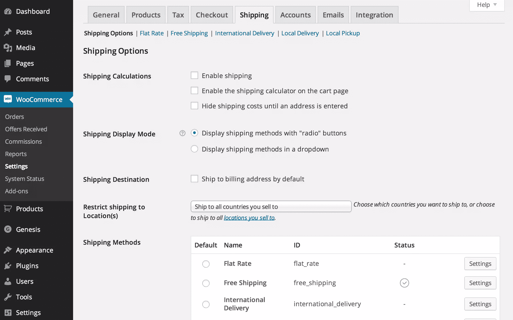

# WooCommerce 入门

> 原文：<https://www.sitepoint.com/getting-started-with-woocommerce/>

如果你想经营一家基于 WordPress 的网络商店，你可能会多次遇到这个名字 [WooCommerce](http://www.woothemes.com/woocommerce/) 。WooCommerce 被认为是[最好的 WordPress 购物车插件](https://www.sitepoint.com/5-of-the-best-wordpress-shopping-cart-plugins/)，如果不是*最好的*的话。它结合了一整套内置特性和使用许多有用扩展的能力。

用 WooCommerce 创建你的第一个网上商店相对来说比较容易，在这篇文章中我将向你展示你需要做些什么。

## 为什么选择 WooCommerce？

让我们先来看看为什么 WooCommerce 是如此完美的购物车插件:

*   它是由世界上最大的 WordPress 主题商店之一开发的。他们确保提供一流的产品，并且不收取一分钱的费用。
*   它非常直观地工作，你几乎不需要任何指示就能让它工作。
*   它的默认功能足够好，可以启动你的商店，但它们也提供一些优秀的付费扩展(数百名独立开发者也是如此)。
*   许多 WordPress 主题开发者也在制作 WooCommerce 优化主题，这样你就可以充分利用你的商店。
*   你甚至不需要拥有自己的库存(例如[我自己的商店](http://www.warmovies.guru)完全依靠亚马逊销售和交付的电影运行)。
*   WooCommerce 是唯一一个拥有自己的移动应用程序来管理商店的 WordPress 网络商店插件。

## WooCommerce 入门需要什么？

建立你的 WooCommerce 商店需要很多东西。请注意，尽管 WooCommerce 插件本身是免费的，但下面的一些项目是免费的。

域名和托管是强制性的，而且总是要花钱的。你可以免费获得主题和插件，也有可能在没有月费的情况下为每笔交易定价运输和支付网关。

实际上，如果你想要一个专业的主题和一些付费插件，你会花费几百美元，这些费用每年都会重复出现。

话虽如此，你可以用不到 100 美元一年的简单费用来经营你的商店。

那么需要什么呢？

*   **主机**:没有什么比优质主机更重要。
*   **WordPress + WooCommerce** :看似显而易见，但有些人甚至不知道 WooCommerce 是 WordPress 插件。
*   WooCommerce 已经有了一个不错的主题，但是还有数百个设计精美的 WooCommerce 主题。
*   **支付网关**:支付网关将你的商店与支付提供商连接起来，这对于收取收入非常重要。
*   **运输**:(可选)如果您销售实物产品，您可能希望将您的商店连接到一家或多家运输公司，并使用他们的实际价格。
*   **安全**:(可选)因为你是在卖东西和存储客户数据，所以你需要注意一些安全措施。

你可能会注意到我没有把插件列在这个列表中。这是因为插件本身并不是一个需求。插件只是给你的商店增加功能的一种方式，比如支付网关。

WooCommerce 已经内置了一些非常方便的集成，所以在某些情况下你甚至不需要插件。

让我们更彻底地看看上面的这些项目，看看它们对你的在线商店到底有什么帮助。

### 1.主办；主持

虽然现在已经没有真正糟糕的大型主机公司了，但是对于 WordPress 来说，主机并不总是主机。我是使用 WordPress 优化主机的坚定信徒，但是很多人不同意我的观点，称之为来自市场部的灵机一动。重要的是你网站的加载速度和正常运行时间。

这两个项目同样重要，你真的不想在这一点上便宜。没有什么比一个缓慢加载的网站或者一个经常宕机的网站更烦人的了。您可能偶尔会遇到术语缓存。简而言之，这是一种通过将动态网站转变为加载速度更快的静态网站来提高网站速度的方法。但是网络商店由于其动态特性，不能被完全缓存。

购物车就是一个很好的例子。该部分将始终保持动态，因为每个客户及其订单都是不同的。所以不要让缓存让你在寻找一个合适的 WordPress 托管公司的过程中幻灭，要经常阅读他们的评论。我在 SitePoint.com 写了一系列关于 [WordPress 托管](https://www.sitepoint.com/wordpress-hosting-compared-part-1-overview/)的文章，你可能想看看。

### 2.WordPress + WooCommerce

我将长话短说，因为这是不言自明的。

你需要做的就是安装 [WordPress](http://wordpress.org/) 本身，然后添加 [WooCommerce](https://wordpress.org/plugins/woocommerce/) 插件。

请注意，你不能使用 WordPress.com 进行网络商务。你可以在这里找到更多关于 WordPress.com 和 WordPress.org 的不同之处。

### 3.主题

WooCommerce 适用于任何主题，但您可能需要考虑 WooCommerce 优化主题。主要原因是博客主题和电子商务主题之间有巨大的差异。这可以是一些小事情，比如菜单栏中的购物车订单总数，以及推荐销售的呈现方式。WooCommerce 自带一套函数，最适合 WooCommerce 优化主题使用。

挑选一个好的主题会花费你几个小时甚至几天的时间。这样做的原因是，虽然你可以优化你的主题，但你并不真的想在几个月后不得不切换。大多数主题都有特定的设置，这些设置只适用于该主题，这意味着如果你选择切换主题，你可能需要重新构建你的站点(有时需要升级到产品级别)。此外，如果你过于频繁地切换主题，可能会让你的回头客感到困惑。尝试坚持一个新的主题至少 2-3 年。

### 4.支付网关

支付网关用于将一个或多个支付提供商集成到您的商店中。WooCommerce 已经集成了 PayPal，您只需填写您的 PayPal 帐户信息。

他们还集成了 Mijireh，可以将你连接到 69 个国家的 90 多个支付网关。

Mijireh 是你的网站和实际支付提供商之间的(付费)网关，所以它本身不是支付提供商。通过提供必要的基础设施和处理安全问题(因为您将处理信用卡信息)，它确实使在您的商店中完全集成这些提供者变得容易得多。

如果你不想使用 Mijireh 或 PayPal，WooThemes 有一整套[支付网关插件](http://www.woothemes.com/product-category/woocommerce-extensions/?prod_cat%5B%5D=1023&s=&post_type=product&prod_country=0)供你选择。

这些大多是付费插件，有些有额外的要求，如 SSL 证书。它确实能让你完全控制你的支付过程，而且如果你只使用一两家支付提供商，它可能比使用 Mijireh 更便宜。

### 5.船舶

WooCommerce 有各种内置的运输选项，如统一费率、国际或免费运输。但是所有这些方法都需要执行手动任务。除非你提供免费送货(也可以从一定数量订购)，你需要指定运费。这就是棘手的地方，因为有几个大的运输公司根据用户的位置和包裹大小有数百种不同的费率。

所有主要的航运公司都有[插件](http://www.woothemes.com/product-category/woocommerce-extensions/?prod_cat%5B%5D=1026&s=&post_type=product&prod_country=0)。这样，客户可以在他们的订购屏幕上看到实际的运费。这些插件是付费的，但当你每天都有几个订单时，它们肯定会节省你的时间。

你也可以决定外包你的履行过程。您可以将您的订单输出给发送您产品的订单执行提供商，甚至无需动手。不过，你必须在谷歌上搜索一下(提示:WooCommerce fulfillment)，因为目前 WooThemes.com 的扩展部分没有列出任何供应商。

### 6.安全性

经营网上商店意味着你需要考虑网站的安全性。虽然这听起来很可怕，但如果你没有存储任何信用卡数据，这也没那么糟糕。相信我，如果你刚刚开始，你不会想这么做的。

存储信用卡数据意味着成为 PCI-DSS 兼容，这是一个完全不同的[冒险](http://docs.woothemes.com/document/pci-dss-compliance-and-woocommerce/)。

幸运的是，当您使用我上面提到的 Mijireh 之类的支付网关时，要求不那么严格，因为它们负责必要的安全措施(它们是符合 PCI 的)。除了你的托管公司提供的以外，你实际上不需要任何额外的安全措施。

如果你认真对待你的业务和安全，你可能希望考虑一个 SSL 证书。

此证书允许在您和客户之间发送数据时提供额外保护。虽然 SSL 证书不是必需的，但它确实增加了访问者在你的商店购物时的信任度。这种增加的信任值一个证书的价格，价格通常低于每年 100 美元。

## 结论

WooCommerce 是几乎所有 WordPress 商店的优秀购物车插件。由于其直观的界面，它特别适合那些第一次使用网上商店的人。这并不意味着当你的商店受欢迎时，你需要转换系统。通过使用一个专业的主题和一些聪明的插件，你就可以运行一个专业的、高访问量的网络商店，基本上没有限制。

## 分享这篇文章