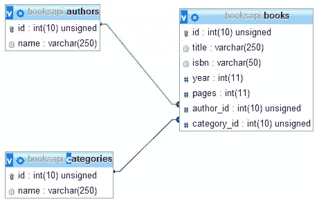

# 用 PHRoute 实现快速 PHP 路由

> 原文：<https://www.sitepoint.com/fast-php-routing-phroute/>

PHRoute 是一个有趣的包:它是一个快速的基于正则表达式的路由器，可以很容易地在中小型项目中实现。然而，它不仅仅是非常快:还有过滤器、过滤器组和命名路由。如果事情越来越大，你也可以使用一个基本的控制器系统。

也就是说，今天我们将看到如何使用它，以及如何在一个示例项目中实现它的特性。此外，我们将看到引擎盖下是什么:PHRoute 是不同人多次实验和测试的结果。

先从安装开始吧！

## 安装

您可以在几秒钟内使用 Composer 将 PHRoute 添加到您的项目中。将这一行添加到您的`composer.json`文件中:

```
{ 
        "require": 
        { 
            "phroute/phroute": "1.*" 
        } 
    }
```

键入`composer install`命令，你就可以进入了。现在，让我们继续我们的测试项目。

## 示例项目和第一个示例

为了更好地理解 PHRoute 的每个概念，最好有一个示例项目。今天我们将为图书数据库服务制作一个基本的 API。

下面是我们将要使用的数据库方案:



如果您想做一些测试，这是我使用的 SQL 模式转储(带有一些额外的虚拟数据)。

```
CREATE TABLE IF NOT EXISTS authors (id int(10) unsigned NOT NULL AUTO_INCREMENT, name varchar(250) NOT NULL, PRIMARY KEY (id)) ENGINE=InnoDB DEFAULT CHARSET=utf8 AUTO_INCREMENT=3;

    INSERT INTO authors (id, name) 
    VALUES 
    (1, 'Dan Brown'), 
    (2, 'Paulo Coelho');

    CREATE TABLE IF NOT EXISTS categories (id int(10) unsigned NOT NULL AUTO_INCREMENT, name varchar(250) NOT NULL, PRIMARY KEY (id)) ENGINE=InnoDB  DEFAULT CHARSET=utf8 AUTO_INCREMENT=3;

    INSERT INTO categories (id, name) 
    VALUES 
    (1, 'Thriller'), 
    (2, 'Novel');

    CREATE TABLE IF NOT EXISTS books (id int(10) unsigned NOT NULL AUTO_INCREMENT,   title varchar(250) NOT NULL, isbn varchar(50) NOT NULL, year int(11) NOT NULL,   pages int(11) NOT NULL, author_id int(10) unsigned NOT NULL, category_id int(10) unsigned NOT NULL, PRIMARY KEY (id), KEY author_id (author_id,category_id), KEY category_id (category_id)) ENGINE=InnoDB DEFAULT CHARSET=utf8 AUTO_INCREMENT=7;

    INSERT INTO books (id, title, isbn, year, pages, author_id, category_id) 
    VALUES 
    (1, 'The Zahir', '0-06-083281-9', 2005, 336, 2, 2), 
    (2, 'The Devil and Miss Prym', '0-00-711605-5', 2000, 205, 2, 2), 
    (3, 'The Alchemist', '0-06-250217-4', 1988, 163, 2, 2), 
    (4, 'Inferno', '978-0-385-53785-8', 2013, 480, 1, 1), 
    (5, 'The Da Vinci Code', '0-385-50420-9', 2003, 454, 1, 1), 
    (6, 'Angels & Demons', '0-671-02735-2', 2000, 616, 1, 1);
```

我们不会写任何非常复杂的东西。实际上，以非常基本的方式编写一些路由来模拟 API 请求就足够了。如果你想写一个真实世界的 API，有很多概念你必须知道，但是今天我们只是来看看 PHRoute。

在开始具体的路线之前，让我们分析一下主要的应用程序结构。这就是我们将要放入`index.php`文件中的内容。

```
<?php

    require 'vendor/autoload.php';

    function processInput($uri){        
        $uri = implode('/', 
            array_slice(
                explode('/', $_SERVER['REQUEST_URI']), 3));         

            return $uri;    
    }

    function processOutput($response){
        echo json_encode($response);    
    }

    function getPDOInstance(){
        return new PDO('mysql:host=localhost;dbname=booksapi;charset=utf8', 'root', '');
    }

    $router = new Phroute\RouteCollector(new Phroute\RouteParser);

    $router->get('hello', function(){ 
        return 'Hello, PHRoute!';   
    });

    $dispatcher = new Phroute\Dispatcher(router);

    try {

        $response = $dispatcher->dispatch($_SERVER['REQUEST_METHOD'], processInput($_SERVER['REQUEST_URI']));

    } catch (Phroute\Exception\HttpRouteNotFoundException $e) {

        var_dump($e);      
        die();

    } catch (Phroute\Exception\HttpMethodNotAllowedException $e) {

        var_dump($e);       
        die();

    }

    processOutput($response);
```

我们有三种实用方法:`processInput`、`processOutput`和`getPDOInstance`。我们将使用前两个来确保我们得到正确的输入和正确的输出。第三个将准备必要的 PDO 实例。

**注意:**`array_slice`方法的第二个参数是“3”，因为我个人的具体项目设置。随着您的基本 url 的变化而变化。

之后，我们使用对象`$router`，即`RouteController`类的实例来声明我们的路由。然后，神奇的事情发生在带有两个参数的`$dispatcher->dispatch()`方法中:`$_SERVER`请求方法(GET、POST 等。)和特定的请求 uri。有了这些信息，dispatcher 调用正确的路由并执行闭包中的代码。返回值存储在`$response`变量中，该变量被提供给方法`processOutput()`，该方法将其作为 JSON 字符串回显。

正如您所看到的，在这个具体的例子中，我们声明了一个单一的路由:`hello`。

**注意:**但是，如果你愿意，你可以增强实际结构。创建一个新文件，并将其命名为`routes.php`。然后，在`$router`对象初始化之后，立即从主`index.php`文件中包含它:您将在一个单独的文件中拥有您所有的路线。在我看来，这是一个更好的解决方案。

也就是说，您现在已经了解了我们示例的基本结构。

让我们开始我们的第一条路线吧！

## 路线

### 简单的路线

好的，让我们看看我们能对路线做些什么，以及我们能在多大程度上根据我们的需要定制它们。

我们从最简单的事情开始:作者列表。

```
$router->get('authors', function(){      
        $db = getPDOInstance();

        $sql = 'SELECT * FROM authors;';  
        $st = $db->prepare($sql, array(PDO::ATTR_CURSOR => PDO::CURSOR_FWDONLY));

        $st->execute();

        $result = $st->fetchAll(PDO::FETCH_CLASS);

        return $result;  
    });
```

在第一行中，我们声明我们的路由名称，`authors`。

我们来测试一下路线:这是结果。

```
[{"id":"1","name":"Dan Brown"},{"id":"2","name":"Paulo Coelho"}]
```

太好了！

### 添加参数

现在我们可以向前迈出一步:如果给定 id，添加一个参数来获取单个作者的详细信息，怎么样？

大概是这样的:

```
$router->get('author/{id}', function($id){      
        $db = getPDOInstance(); 

        $sql = 'SELECT * FROM `authors` WHERE `id` = :id';     

        $st = $db->prepare($sql, array(PDO::ATTR_CURSOR => PDO::CURSOR_FWDONLY));
        $st->execute(array(':id' => $id));

        $result = $st->fetchAll(PDO::FETCH_CLASS);

        return $result;
    });
```

您可以使用一个`{variable_name}`占位符传递一个参数，这个占位符与闭包的参数具有相同的名称。在这个例子中，我们有一个对应于`$id`参数的`{id}`占位符。您可以指定任何想要的参数:没有限制。

有时参数是可选的。让我们再举一个例子:如果我们使用`books` URL，我们想要检索所有数据库书籍的列表。但是，如果我们指定一个类似于`books/1`的 id，我们将得到给定类别的图书列表。

我们开始吧:

```
$router->get('books/{category_id}?', function($category_id = null){         
        $db = getPDOInstance();

        if($category_id == null)
        {
    	    $sql = 'SELECT * FROM `books`;';
    	    $params = array();
        }
        else
        {
    	    $sql = 'SELECT * FROM `books` WHERE `category_id` = :category_id;';
            $params = array(':category_id' => $category_id);
        }

        $st = $db->prepare($sql, array(PDO::ATTR_CURSOR => PDO::CURSOR_FWDONLY));
        $st->execute($params);

        $result = $st->fetchAll(PDO::FETCH_CLASS);

        return $result;   
    });
```

添加“？”参数后的占位符意味着它将是可选的。当然，在闭包声明中指定默认值是个好主意。

### 使用不同的动词

到目前为止，我们只创建了 GET 路线。其他 HTTP 动词呢？

没问题。请看这里:

```
$router->get($route, $handler);    // used for GET-only requests
$router->post($route, $handler);   // used for POST-only requests
$router->delete($route, $handler); // used for DELETE-only requests
$router->any($route, $handler);    // used for all verbs
```

让我们举一个邮政路线的例子。是时候给我们的收藏增加一本新书了！

```
$router->post('book', function(){       
        $db = getPDOInstance();
        $bookData = $_POST;

        $sql = 'INSERT INTO table_name (id, title, isbn, year, pages, author_id, category_id) VALUES (NULL, :title, :isbn, :year, :pages, :author_id, :category_id);';

        $params = array(
    	    ':title' => 'The Winner Stands Alone',
    	    ':isbn' => '978-88-452-6279-1',
    	    ':year' => 2009,
    	    ':pages' => 361,
    	    ':author_id' => 2,
    	    ':category_id' => 2
        );

        $st = $db->prepare($sql, array(PDO::ATTR_CURSOR => PDO::CURSOR_FWDONLY));
        $result = $st->exec($params);

        if($result)
        {
    	    return $db->lastInsertId();
        }
        else
        {
    	    return false;
        }
    });
```

假设我们有一个要填充图书数据的表单:它的`action`属性将指向我们现在创建的`book`路线！

现在我们要向前迈出另一步:是时候“保护”我们的路线了！

## 过滤

其实每个进入`book`邮路线的人都可以在我们的收藏里插入一本新书。这很酷，但这不是通常的情况。如果我们想保护我们的路线呢？过滤器是我们所需要的。

过滤器与路由非常相似:它们有一个名称和一个关联的闭包，当过滤器在某个地方被调用时执行。

那么，有什么区别呢？在路由之前(或之后)可以很容易地调用过滤器。

### 过滤器

我们来举个例子:

```
$router->filter('logged_in', function(){    
        if(!$_SESSION['user_id']){
            header('Location: /login');
            return false;
        }
    });

    $router->post('book', function(){       
        $db = getPDOInstance();
        $bookData = $_POST;

        $sql = 'INSERT INTO table_name (id, title, isbn, year, pages, author_id, category_id) VALUES (NULL, :title, :isbn, :year, :pages, :author_id, :category_id);';

        $params = array(
    	    ':title' => 'The Winner Stands Alone',
    	    ':isbn' => '978-88-452-6279-1',
    	    ':year' => 2009,
    	    ':pages' => 361,
    	    ':author_id' => 2,
    	    ':category_id' => 2
        );

        $st = $db->prepare($sql, array(PDO::ATTR_CURSOR => PDO::CURSOR_FWDONLY));
        $result = $st->exec($params);

        if($result)
        {
    	    return $db->lastInsertId();
        }
        else
        {
    	    return false;
        }
    }, array('before' => 'logged_in'));
```

首先，我们用`$router`对象的`filter()`方法声明了过滤器。语法与路由的语法相同。我们给它一个名字和一个将在合适的时间执行的闭包。

好吧，但是什么是“正确的时间”？

我们现在正在决定:我们刚刚向`post()`方法添加了第三个参数。第三个参数是一个数组，我们用过滤器的名称(`logged_in`)指定键`before`。从这一刻起，在每个对`book` post 路由的调用之前，`logged_in`过滤器(并执行其闭包内容)也将被调用。

在这个特定的例子中，我们检查一个会话`user_id`变量，看看用户是否登录。

还有一个`after`键，用于在路由调用后立即运行过滤器。这里有一个例子。

```
$router->filter('clean', function(){    
        // cleaning code after the route call...
    });

    $router->post('book', function(){       
        $db = getPDOInstance();
        $bookData = $_POST;

        $sql = 'INSERT INTO table_name (id, title, isbn, year, pages, author_id, category_id) VALUES (NULL, :title, :isbn, :year, :pages, :author_id, :category_id);';

        $params = array(
    	    ':title' => 'The Winner Stands Alone',
    	    ':isbn' => '978-88-452-6279-1',
    	    ':year' => 2009,
    	    ':pages' => 361,
    	    ':author_id' => 2,
    	    ':category_id' => 2
        );

        $st = $db->prepare($sql, array(PDO::ATTR_CURSOR => PDO::CURSOR_FWDONLY));
        $result = $st->exec($params);

        if($result)
        {
    	    return $db->lastInsertId();
        }
        else
        {
    	    return false;
        }
    }, array('after' => 'clean'));
```

如果需要，还可以同时指定多个过滤器。你所要做的就是使用一个字符串数组，而不是一个单独的字符串。

```
$router->filter('filter1', function(){    
        // filter 1 operations...
    });

    $router->filter('filter2', function(){    
        // filter 2 operations...
    });

    $router->post('book', function(){       
        $db = getPDOInstance();
        $bookData = $_POST;

        $sql = 'INSERT INTO table_name (id, title, isbn, year, pages, author_id, category_id) VALUES (NULL, :title, :isbn, :year, :pages, :author_id, :category_id);';

        $params = array(
    	    ':title' => 'The Winner Stands Alone',
    	    ':isbn' => '978-88-452-6279-1',
    	    ':year' => 2009,
    	    ':pages' => 361,
    	    ':author_id' => 2,
    	    ':category_id' => 2
        );

        $st = $db->prepare($sql, array(PDO::ATTR_CURSOR => PDO::CURSOR_FWDONLY));
        $result = $st->exec($params);

        if($result)
        {
    	    return $db->lastInsertId();
        }
        else
        {
    	    return false;
        }
    }, array('after' => array('filter1', 'filter2')));
```

### 过滤器组

让我们想象一个真实世界的案例:假设我们有三个 post 路由，每个实体一个(作者、书籍、类别)。分三次添加`logged_in`滤镜会很无聊。

不要担心:过滤器组是来帮忙的。

```
$router->filter('logged_in', function(){    
    if(!isset($_SESSION['user_id'])) 
    {
        header('Location: /login');
        return false;
    }
});

$router->group(array('before' => 'logged_in'), function($router){

    $router->post('book', function(){
        // book insert code...
    });

    $router->post('author', function(){
        // author insert code...
    });

    $router->post('category', function(){
        // category insert code...
    });

});
```

对于这个组，我们为三个不同的路由定义了相同的过滤器。

**注:**如果需要，还可以任意多次在其他组中嵌套组。

## 成长项目？是时候使用控制器了！

我们的项目正在成长，在单个文件中组织我们的代码库是非常繁重和草率的。用控制器呢？

是的:PHRoute 不仅仅是关于路线。当事情变得疯狂时，是时候去组织它们了。

首先，我们来看看一个控制器的结构是什么样的。看看这个例子(我们可以把它放在我们的`routes.php`文件中):

```
<?php

    class Author {
        public function getIndex()
        {
            // get author list data here...
            return $result;
        }

        public function postAdd()
        {           
            // add a new author to the database
            return $insertId;
        } 
    }

    $router->controller('author', 'Author');
```

我们创建了一个`Author`类。在这个类中我们放了两个方法:`getIndex()`和`postAdd()`。

然后，使用`$router`对象的`controller()`方法，我们将`author` url 链接到`Author`类。因此，如果我们在浏览器中输入 URL `author`，就会自动调用`getIndex()`方法。对于`postAdd()`方法也是如此，它将被绑定到`author/add` (POST) url。

这个自动解析名称的特性很有趣，但实际上还不够。

控制器部分处于开发的早期阶段，需要许多改进。其中之一是为控制器方法定义参数的可能性。或者，为控制器的某些方法定义过滤器的简单方法(而不是“全有或全无”)。

## 结论

有很多工作要做，特别是在控制器方面。作为一名开发人员，我认为有一个通用的基本控制器类来处理所有的脏工作(包括过滤器、方法参数等等)会很棒。也缺少文档。

另一方面，PHRoute 配备了一个非常快速的路由器。在该项目的 GitHub 页面上，你可以看到一些与 Laravel 的核心路由器进行比较的统计数据:结果令人惊讶。在最坏的情况下，PHRoute 要快 40 倍。

如果你想知道这个路由器背后的“引擎”的具体细节，你可以访问 GitHub 上的 [nikic 页面，在那里他解释了一切](http://nikic.github.io/2014/02/18/Fast-request-routing-using-regular-expressions.html)，有测试、基准和相关结果。

你要去试试弗鲁特吗？让我知道你对它的想法！

## 分享这篇文章