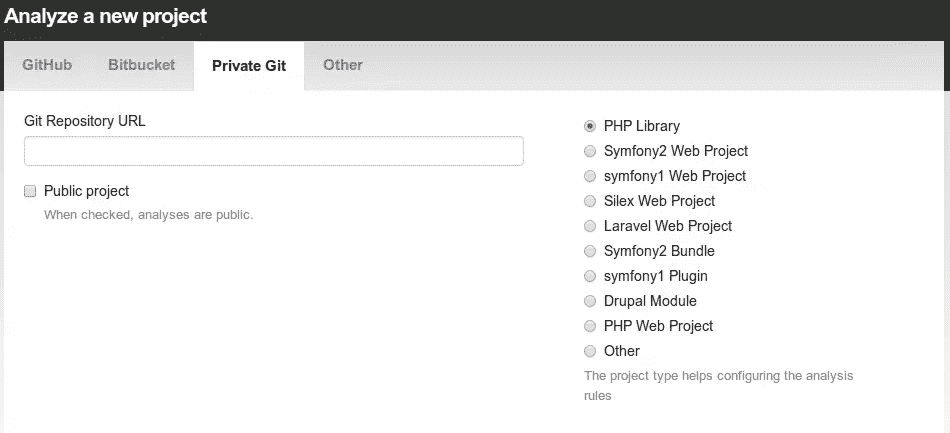
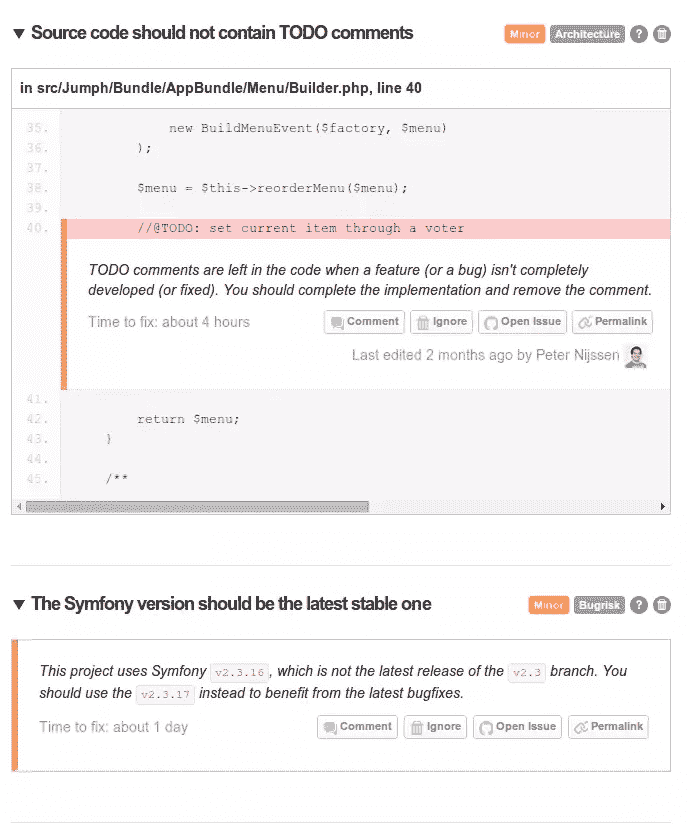
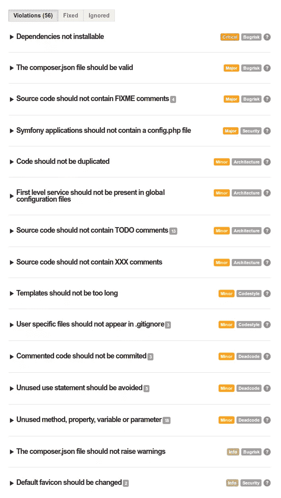

# 使用 SensioLabs Insight 检查您的代码质量

> 原文：<https://www.sitepoint.com/check-codes-quality-sensiolabs-insight/>

代码的质量和测试应用程序一样重要。最近，我们看到了[多篇](https://www.sitepoint.com/8-must-have-php-quality-assurance-tools/) [文章](https://www.sitepoint.com/continuous-integration-php-ci/)，希望它们能帮助你提供一个更稳定的应用。今天，我们将近距离观察 SensioLabs 的洞察力。如果你过去用过 [Symfony](http://symfony.com/) 或 [Silex](http://silex.sensiolabs.org/) ，你可能对 SensioLabs 很熟悉，因为它们是 Symfony 框架的主要赞助商。

## 什么是 SensioLabs 洞察？

SensioLabs Insight 是一个质量保证工具，可用于确定您的代码质量。举例来说，你可能已经知道像 PHPMD、PHPCPD 和 PHPUnit 这样的 QA 工具。虽然 SensioLabs Insight 有一些类似的检查，但它还做得更多。但是，请注意，SensioLabs Insight 并不在您的本地环境中运行，而是由 SensioLabs 提供的一项服务。

在撰写本文时，它扫描了 99 个检查点。它扫描一切，从代码中简单的东西，如`var_dump()`和`TODO:`，到安全问题和性能缺陷。你可以在[本页](https://insight.sensiolabs.com/what-we-analyse)看到他们分析的完整列表。

一般来说，你的 PHP 文件会被检查。除此之外，它还能够检查格式错误的 XML 或 YAML 文件，HTML 文件中的潜在风险，以及您的`composer.lock`是否是最新的。既然这个工具是 SensioLabs 的一部分，它当然能够检查你的 Symfony 和 Silex 项目。对于这类项目，会添加额外的检查点来查看 Symfony `config.php`文件是否被删除，以及 favicon 是否被更改。然而，SensioLabs 也能够检查你的 Laravel，Drupal 或任何一般的 PHP 项目。

最后，它是一个完整的工具，可能会向您报告比您最初想象的更多的反馈。让我们建立我们的第一个项目，并检查一个分析。

## 准备您的项目

在分析我们的第一个项目之前，我们需要先在 SensioLabs Connect 上创建一个账户。之后，我们可以准备我们的项目。如果您的项目是开源的，并且您不介意分析公开，您可以自由使用 SensioLabs Insight。您只能在他们的[定价页面](https://insight.sensiolabs.com/pricing)上看到某些功能。如果你正在做一个私人项目或者你与其他开发者合作，你需要[升级](https://insight.sensiolabs.com/pricing)为付费计划。

在您选择了一个计划之后，您可以创建一个新的项目，方法是提供一个到您的私有 git 存储库或者任何像 Github 或 Bitbucket 这样的提供者的链接。



点击分析按钮后，SensioLabs Insight 将立即开始检查您的应用程序是否存在缺陷。

## 分析你的项目

我们来看一些分析。为此，我使用了一个名为 [Jumph](https://github.com/jumph-io/Jumph) 的开源项目。Jumph 是 Symfony 2 的一个项目，已经存在了几个月了，所以下面的例子是在对 Symfony 框架进行微调之后。


SensioLabs Insight 与奖牌系统配合使用。根据发现问题的多少和问题的轻重，给你一定的勋章。你能得到的最好的奖章是白金奖章，表明 SensioLabs Insight 无法检测到任何问题。

基于这些问题，它还试图确定您还有多少工作要完成。在我的情况下，我应该花 4 天以上的时间来解决所有问题。根据经验，我可以告诉你，这不会花你太多时间。

让我们继续讨论最重要的部分:问题。在我的例子中，您将看到我正在通过 GET 请求修改资源。SensioLabs Insight 建议将其更改为 POST、PUT 或 DELETE 请求。

接下来，您将看到 SensioLabs 发现了一些重复的代码和 TODO 注释。虽然 TODO 不应该总是一个问题，但它清楚地表明您的应用程序还没有完成。

你还会注意到 Symfony 不是最新的。显然，我在我的`composer.lock`文件中使用了比当前版本更老的版本。在这种情况下，我使用的是 2.3.16，而 2.3.17 已经可用。

如果您有兴趣了解问题所在，您可以单击某个问题，它会扩展一个附加信息块。



SensioLabs Insight 清楚地指出在哪个文件和哪一行可以找到问题。你也能更清楚地描述这个问题。对于过时的 Symfony 框架，只有一个描述。

如果您是以团队的形式参与一个项目，您可以对该问题发表评论，从而允许您在团队内部讨论该问题。点击`open issue`，一个新的问题将在你的 bug 追踪器中打开，允许你向你的团队报告。如果你觉得这不是一个问题，你可以很容易地忽略它。但是请注意，你不会因为忽略问题而获得白金徽章。

SensioLabs Insight 可以检查应用程序中的更多问题。你最多只能自己尝试一下。然而，这里有一份我早些时候收到的更详细的报告，表明我的申请有一些严重的问题要处理。



你会注意到 SensioLabs Insight 做了一些你从其他 QA 工具中知道的检查。例如，代码的重复也可以通过 PHPCPD 找到，其中未使用的属性可以通过 PHPMD 找到。我不确定 SensioLabs Insight 是依靠这些工具还是自己实现的。

## 配置

到目前为止，我们只是简单地对我们的项目进行了分析。在某些时候，你可能想要排除某些测试，改变分支或者使用数据库。您可以配置您的项目，使其符合您的标准。通过编辑项目，您可以指定要使用的分支。您还有一个特殊字段，可以在其中以 YAML 格式配置您实际想要运行的工具。

例如，这是您可以用来设置项目的一部分配置。

```
ignore_branches:  - gh-pages

pre_composer_script:  |  #!/bin/bash cp app/config/parameters.yml.dist app/config/parameters.yml
    sed -i -e "s/database_user:.*/database_user: root/" app/config/parameters.yml
    sed -i -e "s/database_password:.*/database_password: Secr3t/" app/config/parameters.yml

post_composer_script:  |  #!/bin/bash  ./app/console doctrine:database:create --no-interaction ./app/console doctrine:schema:create --no-interaction ./app/console doctrine:fixtures:load --no-interaction

php_ini:  | extension=openssl.so
    extension=mcrypt.so

global_exclude_dirs:  - vendor - vendors - test - tests -  Tests  - spec - features -  Fixtures  -  DataFixtures exclude_patterns:  - app/check.php - app/SymfonyRequirements.php - web/config.php - web/app_*.php

rules: web.missing_robots_txt: enabled:  true
```

## 试验

如果你目前正在开发一个开源项目，你可以自由使用 SensioLabs Insight。有一些限制，例如您只能查看最近 5 次分析。SensioLabs 慷慨地与我们分享了一个试用密钥，允许您测试 SensioLabs 的洞察力一个月。你所需要做的就是自己注册，将你的套餐升级为你喜欢的套餐，并填写`SLI-LD-141S`作为优惠券代码。然后，您需要做的就是添加一个新项目，并检查它正在做的第一个分析。

### 结论

如果你读了我的 PHP-CI 评论，你会发现我真的很喜欢这个工具。我相信这是对我们所知的所有 QA 工具的一个受欢迎的补充。我认为该工具的强大之处主要在于它可以扫描特定的框架问题。我可以想象许多人忘记从标准 Symfony 框架中删除一些文件，这个工具跟踪这种情况。然而，我认为它对一般的 PHP 项目也非常有用——这篇文章中没有提到 SensioLabs Insight 将对您的应用程序执行的许多检查。

如果您正在使用试用优惠券代码，请在评论中与我们分享您使用 SensioLabs Insight 的体验。它让你大吃一惊还是让你立即获得了白金奖章？我很乐意在下面的评论中听到你的意见。

## 分享这篇文章