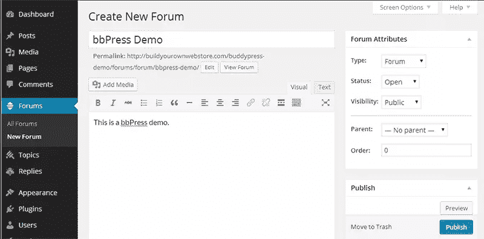
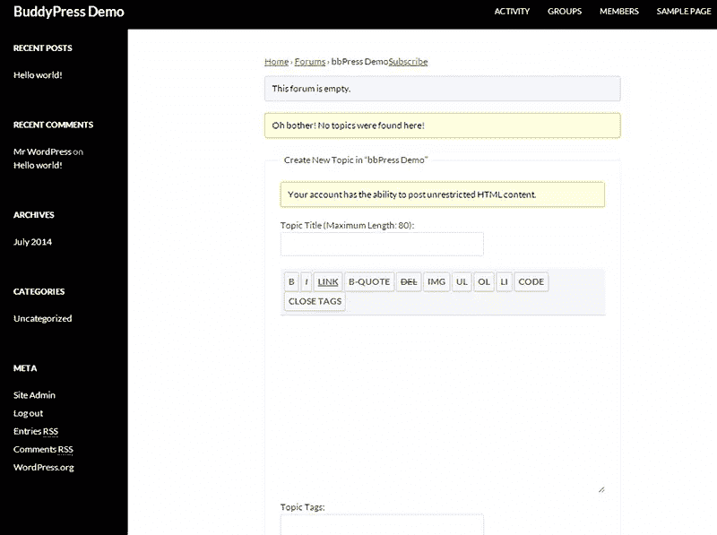
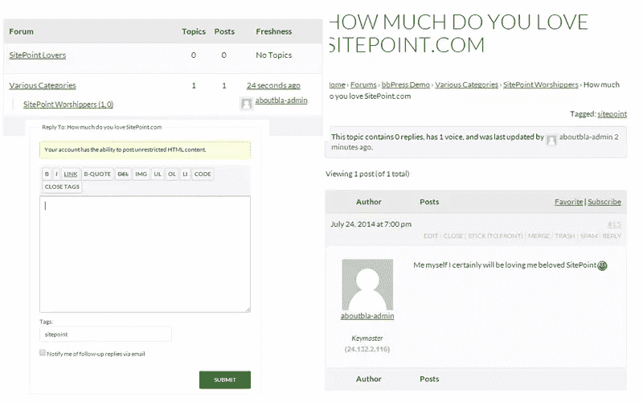
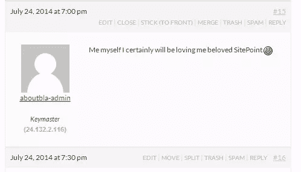
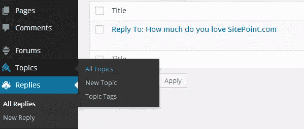
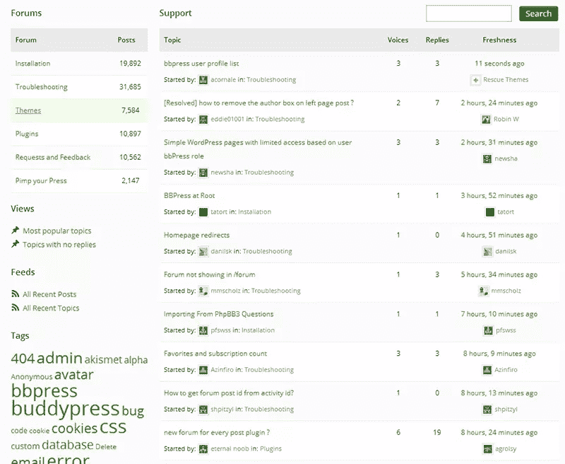

# 用 bbPress 把 WordPress 变成一个功能齐全的论坛

> 原文：<https://www.sitepoint.com/wordpress-forum-with-bbpress/>

即使在 2014 年，论坛仍然非常受欢迎，尽管较新形式的社交网络越来越受欢迎。论坛的美妙之处在于它们允许志同道合的人进行集中讨论。然而，众所周知，论坛软件运行缓慢，难以管理，并可能导致许多论坛最终失去活力。

如果你能把你最喜欢的 CMS 和博客平台变成一个功能齐全的论坛，那不是很棒吗？输入**bb 按下**。bbPress 是一个论坛应用程序，以 WordPress 插件的形式出现。通过使用 WordPress 来驱动你的论坛，你可以快速的减少用户和论坛管理者的学习曲线。bbPress 是由给我们带来 WordPress 本身的人开发的。

那么，WordPress 真的准备好了吗？CMS 能有效地变成一个拥有你所期望的所有标准功能的论坛吗？我们已经看到 WordPress 被用在许多不同的领域，所以我们知道它的潜力是存在的。

在这篇文章中，我将看看 bbPress 在 WordPress 上的安装有多简单。我还将回顾使它如此受欢迎的主要特征，以及它如何与“传统”论坛软件和其他竞争对手 WordPress 论坛插件相抗衡。

## 正在配置 bbPress

正如你在这个截图中看到的，建立一个新的基于 bbPress 的论坛就像发表一个新帖子一样简单。您可能认为这种方法永远不会成为真正有用的论坛，您是对的。至少可以说，这是相当简单的。或者是？

[bb 新闻演示](http://buildyourownwebstore.com/buddypress-demo/forums/forum/bbpress-demo/)

这只是你可以建立的基础，但是我总是喜欢一个好的起点。在添加子论坛和类别的几分钟后，人们可以开始发布主题。

这就是熟悉 WordPress 的优势所在。

所以建立一个基本的论坛是非常简单的，如果这是你想要的，你可以停止在这里阅读。

然而，我现在想添加更多的内容，所以让我们来看看它的主要特性。

## 特征

### 用户权限

我将从对论坛真正重要的一个特性开始:用户权限。

如果你想限制某些用户使用你的网站，一个可靠的许可系统是很重要的。简单地说，你不希望他们能够删除或编辑彼此的消息，或者创建新的类别。

我们都知道 WordPress 默认有一个很棒的权限系统，bbPress 插件很好地利用了它。bbPress 自带五个[预定义角色](http://codex.bbpress.org/bbpress-user-roles-and-capabilities/)，对于大多数论坛来说应该足够了。

*   **Keymaster** :管理员角色，拥有所有可能的权限。
*   **版主**:用于保持论坛整洁。除了能够删除论坛之外，几乎拥有与 Keymaster 相同的权限。
*   **参与者**:贡献论坛成员。这是新用户的默认角色。
*   **观众**:只读权限。
*   **被封**:给一直调皮的人:)

当然，如果没有一个[插件](http://codex.bbpress.org/bbpress-user-roles-and-capabilities/)来添加你自己的权限集，它就不是 WordPress 了。看到这些默认角色及其权限，可以肯定地说他们已经很好地覆盖了这一部分。

### 适度

现在让我们来看看审核帖子有多简单，这与用户权限一样重要。

bbPress 有两种调节话题和回复的方式。首先，每个柱子上都有一个控制杆。此栏使您能够执行一些方便的操作:

*   编辑/垃圾邮件/垃圾邮件:当然需要在那里。
*   **Stick (to front)** :让一个话题变得有粘性，从而把它放在类别的顶部。
*   **合并**:将一个话题移动到一个相似的话题中，连同其回复。
*   **拆分**:取一个单独的回复，将其拆分成自己的主题。

我必须说，对于一个初看起来非常简单的插件来说，这些是非常先进的特性。

第二种调节方式是使用 WP 管理。在这里，您会发现所有的主题和回复都以与显示评论相同的方式列出。它可以让你快速浏览整个列表，而不用查看每个主题或单独回复。

如果你想让它变得更简单，有一个[审核插件](https://wordpress.org/plugins/bbpressmoderation/)可用。当你的论坛变得越来越大时，这个就派上用场了。它为你提供了多种方式来通知你自己和/或你的版主新的话题，回复或任何可疑的活动(如匿名评论)。

因此，适度是 bbPress 的另一个优势。对于一个自由软件来说，我认为你不得不承认它真的非常好。它真正向你展示的是开发者真的知道他们在做什么，并把注意力放在对一个论坛来说真正最重要的事情上。

### 小工具

作为一个 WordPress 插件，bbPress 也带来了许多与众不同的特性。当然，你可以像普通 WordPress 安装一样使用小部件。

来源: [bbPress 论坛](http://bbpress.org/forums/)

使用这些部件也有助于你塑造论坛的外观。我特别喜欢论坛统计窗口小部件。

我在这张截图中使用的官方 bbPress 论坛确实给了你一个很好的洞察力，如果你准备给它更多的关注(并且有很多用户)，你的论坛看起来会有多专业。

### 短代码

也可以选择使用[短码](http://codex.bbpress.org/shortcodes/)。这是一种将论坛元素整合到帖子或页面中的简单方法。你甚至可以列出一个回复，如果你想以此为基础写一篇博文的话，这是非常完美的。

使用这些短代码也让你有机会在你的内容中推广你的论坛。这真的是独一无二的，因为像 [vBulletin](http://www.vbulletin.com/) (论坛软件领域的“老大”之一)这样的工具不能开箱即用。

它还与 BuddyPress 完全集成，允许高级用户配置文件和群组论坛。对于那些想知道更多的人，可以看看我在 BuddyPress 上的[文章。](https://www.sitepoint.com/wordpress-gone-social-buddypress/)

## 替代 WordPress 论坛插件

总的来说，如果你想运行一个非常高级的论坛，并且仍然很容易管理，bbPress 确实是一个优秀的插件。

现在让我们看看它是如何与其他一些 WordPress 论坛插件相比较的。我已经在我的[“你可能不知道 WordPress 可以做的 15 件事”](https://www.sitepoint.com/15-things-you-may-not-know-wordpress-can-do/)文章中提到过一个，那就是[for umen engine](http://www.enginethemes.com/themes/forumengine/)。

ForumEngine 带来的大多是一个漂亮的外观(轻描淡写)和一些时髦的 jQuery 技巧。然而，可管理性非常有限，因为它主要是 WordPress 帖子和评论的组合。

还有 [Simple Press](http://simple-press.com/) ，它附带了如此多的附加功能，很快就会让你不知所措。它当然带走了 bbPress 提供的简单性。

如果你在寻找更多的特性，你也可以考虑像 [phpBB](https://www.phpbb.com/) 这样的免费工具。还有一个[插件](https://wordpress.org/plugins/wp-united/)将 phpBB 连接到你的 WordPress 站点。

## 结论

起初，人们对 bbPress 对于一个论坛来说“太简单”感到有点失望，但实际上，这变成了对他们所取得成就的更多钦佩。对用户来说，管理一个论坛看起来很容易，这是非常困难的，而他们在这一点上确实成功了。

bbPress 确实提供了简单性，而没有牺牲一个论坛插件真正需要包含的最重要的功能。更好的是，它很好地利用了 WordPress 的集成。

如果你准备在安装后投入大约一个小时的时间，你很快就会有一个非常不错的 WordPress 驱动的论坛。

## 分享这篇文章