# 设计师必备的 10 款 iPhone 应用

> 原文：<https://www.sitepoint.com/10-iphone-apps-for-designers/>

[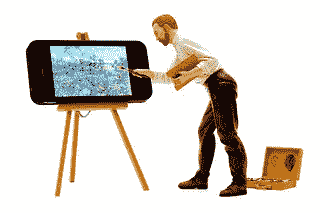](https://www.flickr.com/photos/jdhancock/12708712045/)

照片:JD Hancock

随着新的一年的到来，设计社区会有更多更好的新成员。这可以是任何东西，从纹理和画笔等新资源到正在流行的新设计趋势。

我们甚至每隔几周就会有一批新的网络和移动应用程序，这使得完成工作变得更加容易，而不必局限于一个地方。

去年，我为平面设计师推出了 22 款有创意、有用的 iPhone 应用程序，价格从免费到几美元不等，不会让你的口袋缩水。这一次，我将再带 10 个来帮助同事和鼓舞人心的设计师充分利用他们的时间和工作。这里的应用程序涵盖了一系列有助于保持工作效率的东西，其中包括绘图、笔记、排版甚至图像校正的实际应用程序。

希望你能在这一堆东西中找到对你下一个项目有帮助的东西。

## 你疯了

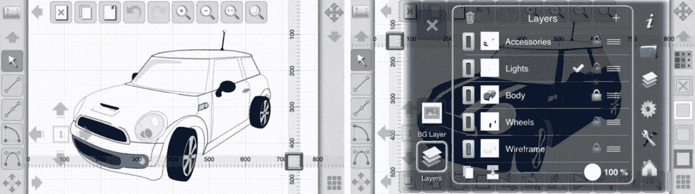

*   价格:9.37 美元
*   类别:设计和绘图
*   兼容性:iOS 5+与 iPhone、iPad 和 iPod Touch 兼容

**描述:**如果你在市场上寻找一款以设计和绘图为主要目的的高级应用，那么你有很多选择。iDesign 只是其中之一。iDesign 就像一个没有 Adobe 名称的迷你袖珍插画器。

该应用程序不仅允许您设计，还允许您创建高质量的 2D 插图和技术图纸，这使得这个应用程序非常适合任何人。

另一个很好的补充是，你可以用手指代替购买手写笔，仍然可以准确地创建没有手指障碍。该应用程序附带了大量功能，应该值得它的价格，包括多层，平滑的多点触摸缩放，iCloud 支持等等。

## 艺术工作室

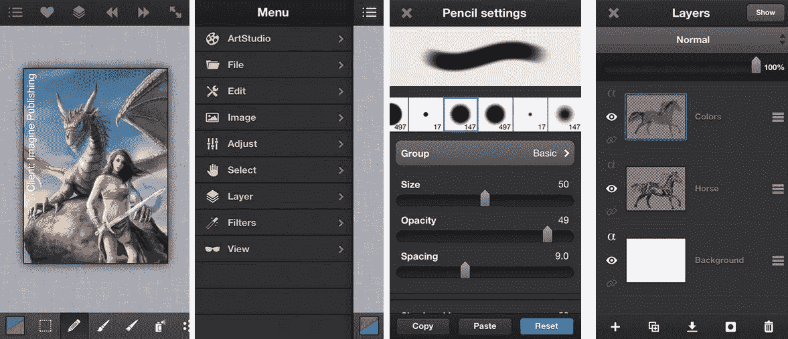

*   价格:免费
*   类别:设计和绘图
*   兼容性:iOS 4.3+与 iPhone、iPad 和 iPod Touch 兼容

**描述:**如果你需要一个移动编辑器和设计应用程序，而不需要支付任何费用，那么你最好的选择是 ArtStudio。

这个应用程序也不仅仅是为那些想要涂鸦的人准备的。如果需要，你可以素描、绘画甚至编辑你的照片。该应用程序有大量的东西，包括一系列画笔，对于那些习惯于 Corel、Photoshop 和 GIMP 等程序的人来说，这些都是熟悉的基础。

该界面也是用户友好的，所以创建应该是一件轻而易举的事，没有太多的麻烦，由于一个全新的图形引擎。该应用程序中还打包了许多其他有用的功能，包括 16 个工具，150 个高质量的笔刷，图层选项，40 个可用的过滤器和许多其他值得一试的功能。

## 配色师

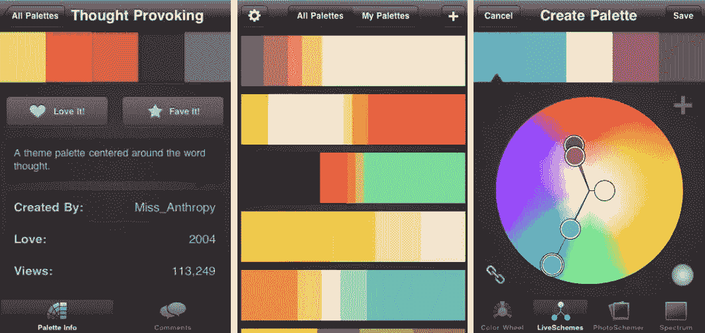

*   价格:免费
*   类别:颜色工具
*   兼容性:iOS 4.0+与 iPhone、iPad 和 iPod Touch 兼容

**描述:**你的颜色选择可以将你的设计提升到一个全新的水平，因此在你的 iPhone 设计应用程序库中拥有一个专门处理颜色的应用程序会很有帮助。

有了 ColorSchemer，你可以把你的 iOS 设备变成一本彩色圣经，随时供你使用。

除了你经常在这类应用中找到的典型颜色选项，你还可以访问由 ColorSchemer 用户创建和共享的超过 100 万个调色板。没错——有 100 万个理由去抢这个应用。

但是如果你需要更多的激励，这个怎么样？有了这个应用程序，你创建调色板的能力几乎是无穷无尽的。你可以用你已经有的照片或者你刚刚抓拍的照片来设计调色板。不仅如此，你还可以协调你的颜色，甚至可以直观地看到它们如何在内置的袖珍色轮中一起工作。

## 颜色方案

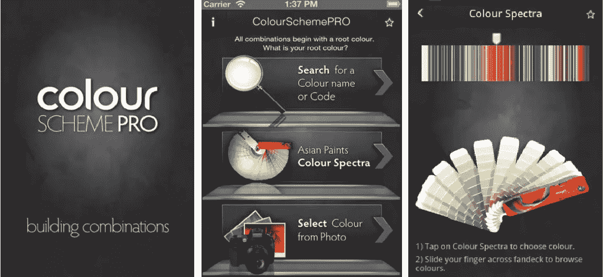

*   价格:免费
*   类别:颜色工具
*   兼容性:iOS 6+与 iPhone、iPad 和 iPod Touch 兼容

现在，如果 ColorSchemer 不是你的菜，但你仍然想要一个免费的颜色应用程序，你可以试试亚洲颜料的 ColourSchemePro。

现在，这个应用程序在处理颜色时采用了不同的方法。虽然你仍然可以通过脸书和 Twitter 等社交媒体网络分享你的调色板，但这款应用程序已经内置了一些颜色供你选择。有了这个应用程序，你只需从 Asian Paints Colour Spectra 的扇形面板中选择你想要的颜色，然后让应用程序引导你选择单色、模拟或补色方案。

别担心，你不会被这 1800 种颜色所束缚，因为你可以简单地用你自己的一张照片来做同样的事情。该应用程序允许定制你的颜色，这总是一件好事，还有一些效果，你也可以使用，虽然有限。

## 富泽尔

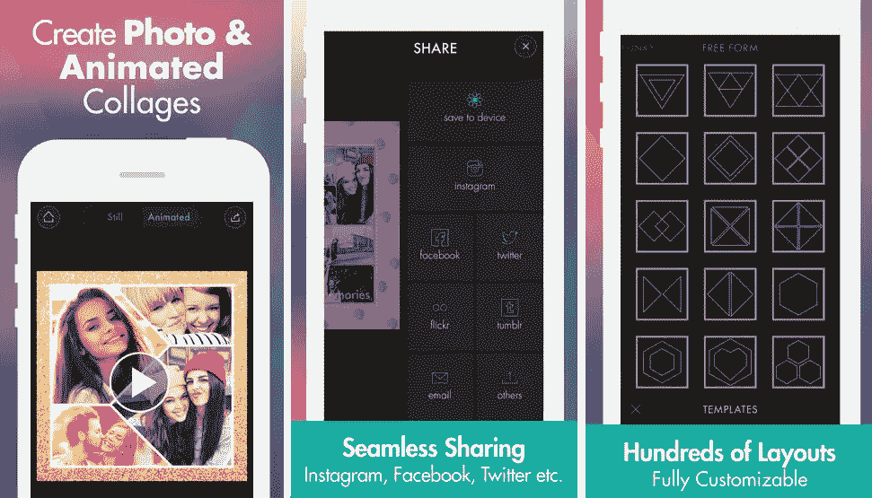

*   价格:免费
*   类别:照片编辑器
*   兼容性:iOS 7+与 iPhone、iPad 和 iPod Touch 兼容

**描述:**在过去的几年里，应用程序的一个普遍特点是，它们允许你做你曾经认为自己无法做的事情。

Fuzel 是一个漂亮、简单、有趣的应用程序，可以在几分钟内将你的照片从无聊变成值得分享的。现在，这不是你的典型的照片编辑器，你只是拍上几个过滤器，然后就可以收工了。

Fuzel 是为那些想对照片做更多事情的人设计的——在这种情况下，创建拼贴画。虽然这可能不是每个设计师都需要的，但这款应用仍然有一些很酷的功能。

您可以将照片制作成动画并创建拼贴画，这些拼贴画可以被设定为 iTunes 资料库中的音乐。自动节拍检测可用，以及三个视频长度选项，自动，手动和 Instagram。该应用程序附带了其他附加功能，以及数百种可用的布局，这些布局是完全可定制和可嵌入的资产，如贴纸和图案。

## PicLab

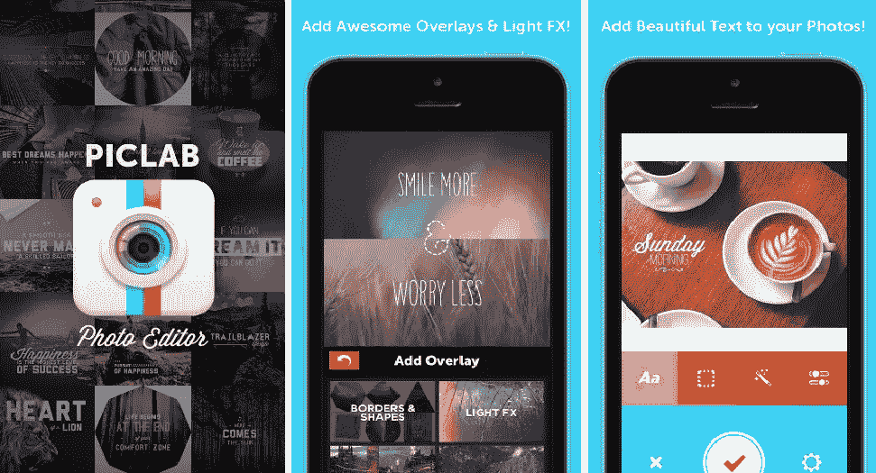

*   价格:免费
*   类别:照片编辑器
*   兼容性:iOS 6.0+与 iPhone、iPad 和 iPod Touch 兼容

**描述:**iPhone 用户可以使用的另一个照片编辑选项是 PicLab。无可否认，这个应用程序有一个漂亮而简单的界面，可以让编辑变得轻而易举。

与之前提到的 Fuzel 不同，这个应用程序不是关于创建照片拼贴，而是关于创建赏心悦目的照片编辑艺术。

你肯定会注意到这个应用程序的第一件事是它的排版功能。有大量的字体可供你选择，其中一些甚至来自著名的设计师，这很不错。由于可定制的功能，使用和添加排版变得很容易，但该应用程序并不完全是关于类型的。

照片效果也可以进行必要的编辑，还有 100 多种叠加和蒙版。还有 20 种不同的滤镜效果可以应用到您的照片上，以便快速浏览。

## 足球书籍

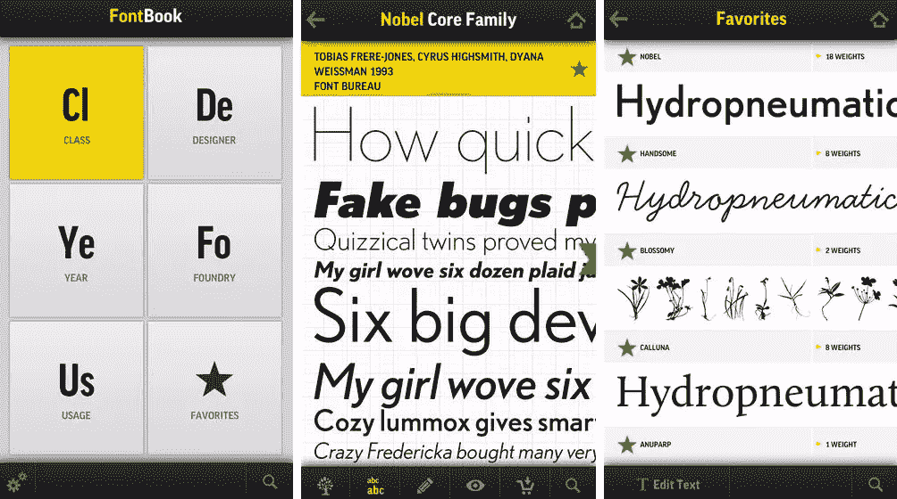

*   价格:4.99 美元
*   类别:排版
*   兼容性:iOS 5.1+与 iPhone、iPad 和 iPod Touch 兼容

**描述:**如果你曾经想随身携带原始字体纲要，现在是时候用这个 iPhone 应用程序了。

FontBook 的工作人员自 1989 年以来一直致力于记录和比较商业字体。这个应用程序是为那些真正喜欢字体的人设计的。有了大量的资源，你会发现自己能够从 8，038 个字体家族中获取 36，734 种字体，而这只是冰山一角。在 iPhone 版本中，你将能够使用新的过滤器、搜索和列表，这将让你专注于更实际的重点。

虽然该应用程序似乎有很多可供探索的库，但如果你是一个打字爱好者，价格绝对是值得的。

## 大蟒

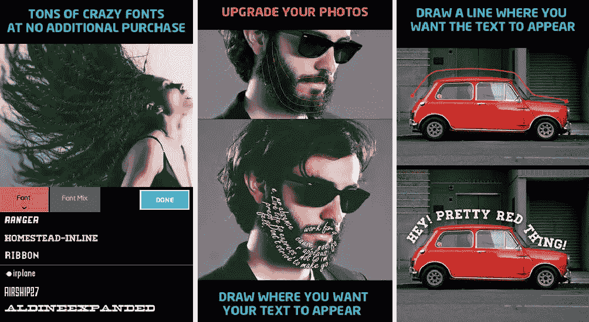

*   价格:1.99 美元
*   类别:排版
*   兼容性:iOS 5.1+与 iPhone、iPad 和 iPod Touch 兼容

描述:不是每个人都痴迷于类型，所以可能会寻找一些更休闲甚至更有创意的东西。这就是《前进的道路》出现的地方。

就排版而言，这是一个不同类型的应用程序。不是专注于创建你自己的字体或找到一套使用这个应用程序是所有关于以一种创造性的方式和一种有趣的方法添加类型到你的照片。

要添加文本，你只需用手指在你希望文本出现的地方画一条线，Path On 的真正意思是 *anywhere* 。就这个应用程序而言，没有任何限制，而且它有一些很好的功能。

有近 300 种不同的字体可供选择，您可以无限制地使用和控制。需要修复对齐，字母间距或大小的应用程序，你已经涵盖了一些其他事情。

## 墨水流可视笔记本

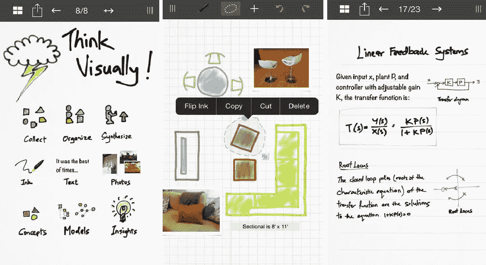

*   价格:免费
*   类别:笔记和生产力
*   兼容性:iOS 7+与 iPhone、iPad 和 iPod Touch 兼容

**描述:**虽然拥有可以随时生成酷炫效果和颜色的应用总是很好，但有时你只需要把你的想法记下来。

有一些很棒的应用程序专注于让你更有效率，Inkflow Visual Notebook 就是其中之一。该应用被描述为视觉思维和视觉思考者的文字处理器。这款应用为视觉思考者提供了很多功能，从能够在你的想法出现时记下它们，到以更适合你的思维流程的方式组织和重新安排它们。不仅如此，你还可以用全分辨率变焦随意放大，这将允许你用两个手指缩放和平移。

添加文本、照片和纸张背景等项目也非常无缝。此外，您还可以将您的作品导出为 PDF、高分辨率 JPEGs 格式，并以多种方式分享。

## 草图价值

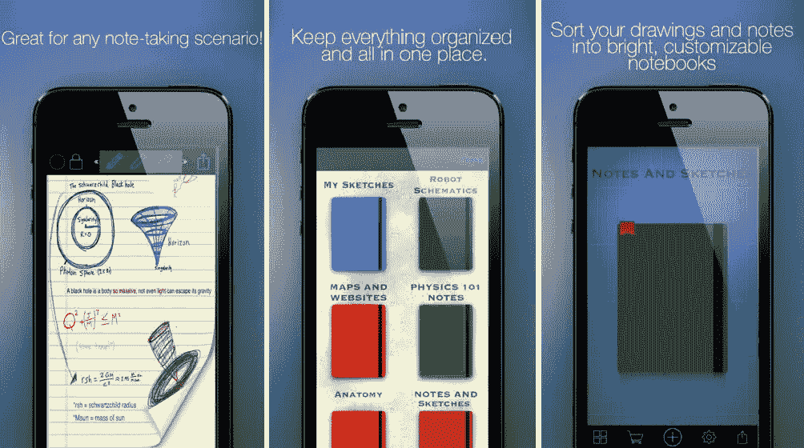

*   价格:2.99 美元
*   类别:笔记和生产力
*   兼容性:iOS 7+与 iPhone、iPad 和 iPod Touch 兼容

**描述:**如果你需要一款不仅能帮你记笔记，还能管理你的想法的应用，那么你可能会想看看 Sketchworthy。

这个应用程序可以让你管理你的草图，笔记和任何你可能已经草草写下的东西。你可以通过创建“笔记本”来管理你的工作，这相当于文件夹，但它会变得更好。

Sketchworthy 允许你在你的笔记本上标注任何事情。该注释甚至让您能够捕捉和保存地图、网站和图像。

甚至还有一个功能，你可以购买和下载任何你可能需要的纸张，这要感谢它内置的纸张商店。这意味着任何东西，从蓝图到清单等等。更不用说，如果心情不好，你可以通过社交媒体分享你的笔记。

请告诉我，你是否对以上任何应用程序有任何个人体验，或者是否有任何其他我错过的伟大的设计师 iPhone 应用程序(有很多，所以我确定我没有得到所有好的)。

## 分享这篇文章