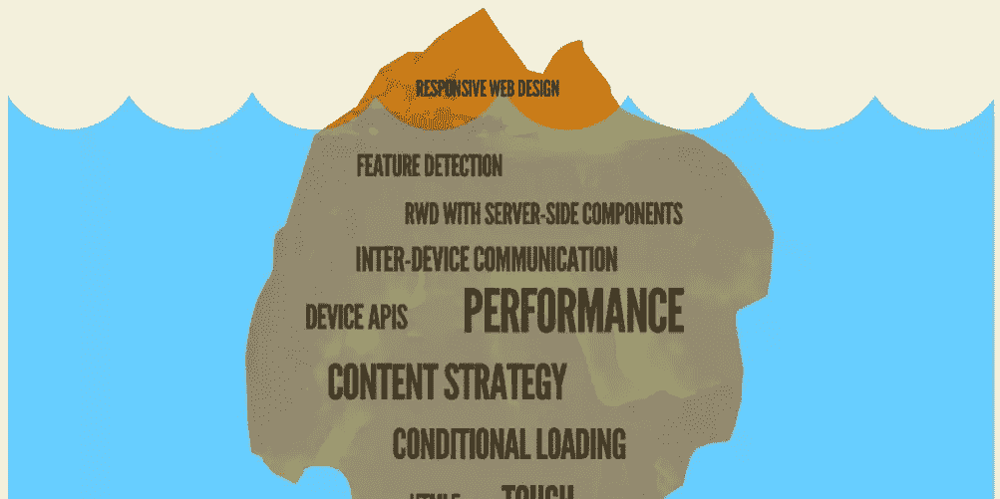

# 本周我们关注的是:响应式网页设计、CSS 特异性和 SVG 知识

> 原文：<https://www.sitepoint.com/radar-week-rwd-css-specificity-svg-knowledge/>

欢迎来到本周的《在我们的雷达上》,这是一个在不断变化的 web 开发世界中引起我们注意的趋势和主题的每周综述。

每周，我们都会收集一些文章和资源，让设计人员和开发人员的生活更加轻松，并帮助您在这个快节奏的行业中保持领先。

## 响应式网页设计

首先，响应式 Web 设计最近已经成为一种受欢迎的技术，但是它在速度和膨胀方面确实有一些缺点。因此，Dave Rupert 对响应式网页设计膨胀进行了调查，Brad Frost 查看了《纽约客》、Adobe 和《哈佛法律评论》,以了解更多关于 T2 响应式网页设计的情况以及如何加速它的发展。他还进一步探索了[适应性网页设计的原则](http://bradfrostweb.com/blog/post/the-principles-of-adaptive-design/)。

## 崇高的文本包和 MVC 研究

Sublime Text 让开发代码变得更加容易，它的包只会让事情变得更容易。这里有一些[推荐的用于前端网页设计的崇高文本包](http://martineau.tv/2014/07/sublime-text-for-front-end-development/)，它们将有助于给你一个更加精简和愉快的做事方式。在 PHP 方面，耶鲁安问[MVC 设计模式是一个问题还是一个解决方案](https://www.sitepoint.com/mvc-problem-solution/)，并深入探讨了 MVC 模式在哪些情况下有用。

## CSS 特异性和替代脚本技术

开发 CSS 时，您可能会发现某些元素的特殊性带来了挑战。这里有一些处理特异性的[技巧，比如不使用 id，避免嵌套选择器。丹·罗斯开发了一个](http://csswizardry.com/2014/07/hacks-for-dealing-with-specificity/)[响应式流体宽度可变项目导航条](https://www.sitepoint.com/responsive-fluid-width-variable-item-navigation-css/)，奥斯汀·伍尔夫带你浏览[开发的纯 CSS 屏幕外导航菜单](https://www.sitepoint.com/pure-css-off-screen-navigation-menu/)，也因其独特的汉堡图标而闻名。CSS 也可以取代许多脚本曾经使用的东西。这里有[五个你不会相信的东西，都是只用 CSS](http://modernweb.com/2014/07/30/5-things-wont-believe-built-css/) 打造的。

## 了解关于 JavaScript 的更多信息

一本好的 [JavaScript 生存指南](http://www.2ality.com/2014/07/javascript-survival-guide.html)最近出版了，它包含了为什么要学习 JavaScript 的信息，关于如何花时间正确学习它的建议，对它的力量的一些见解，以及如何和在哪里学习更多的技巧。一本名为[雄辩的 JavaScript](http://eloquentjavascript.net/) 的优秀书籍的第二版最近也出版了，可以在网上免费阅读。如果你开发 JavaScript 已经有一段时间了，并且想了解更多关于重构代码的知识，那么[《重构故事集](http://javascriptplayground.com/the-refactoring-tales/)是一本开发书籍，你也可以免费在线阅读。这份精彩的必看 JavaScript 视频列表最近引起了我的注意，它非常有助于加深你对各种基于 JavaScript 的技术的了解。

## SVG 知识概要

最后，本周(但绝不是最不重要的主题)，我有一个庞大的 SVG 信息概要给你，关于如何使用 SVG，如何创建图标和精灵，如何使用形状，图案和渐变，以及关于使用 SVG 笔画创建线条动画的细节——这个列表还在继续。这是我见过的最全面的 SVG 知识集合。

## 直到下周…

这就是这周的内容。我希望你喜欢了解最新消息。下周，我的合著者詹姆斯将为您带来更多精彩内容。

## 分享这篇文章