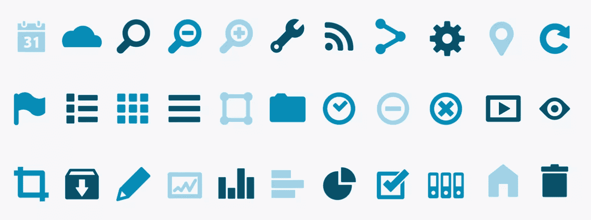
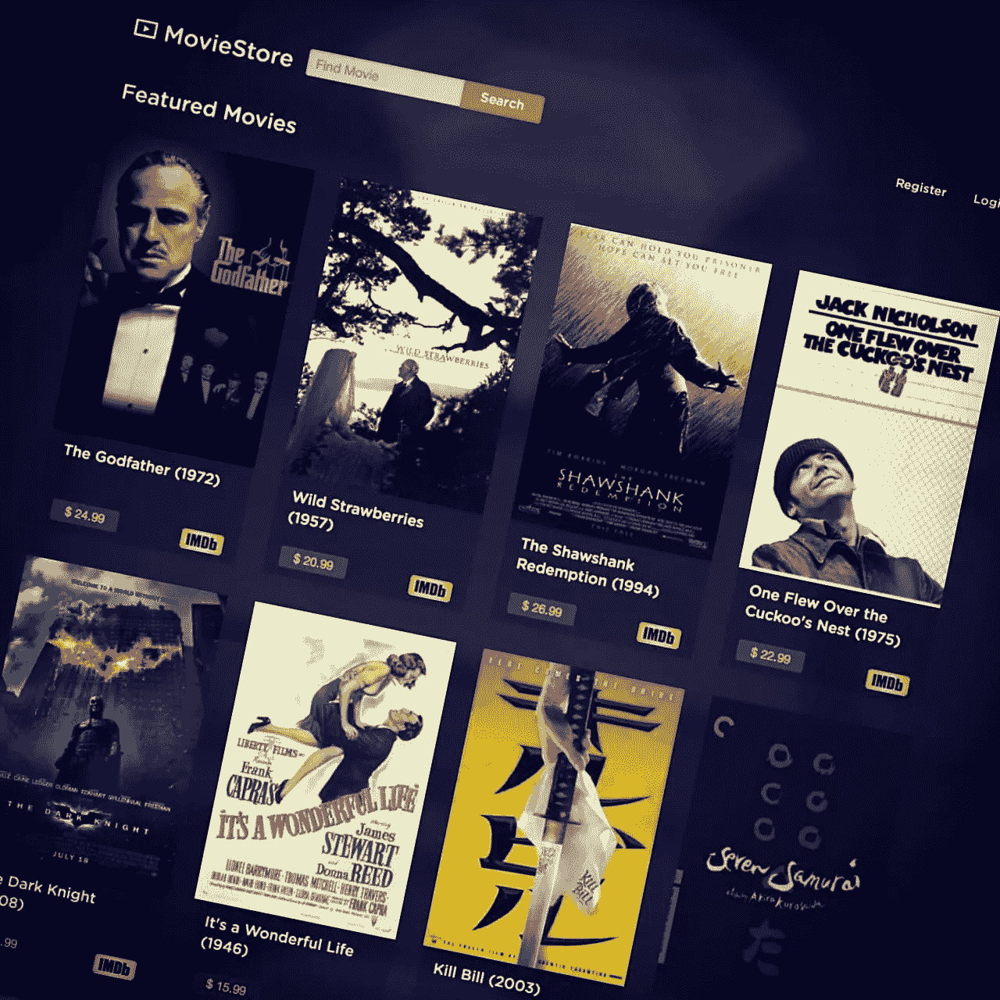
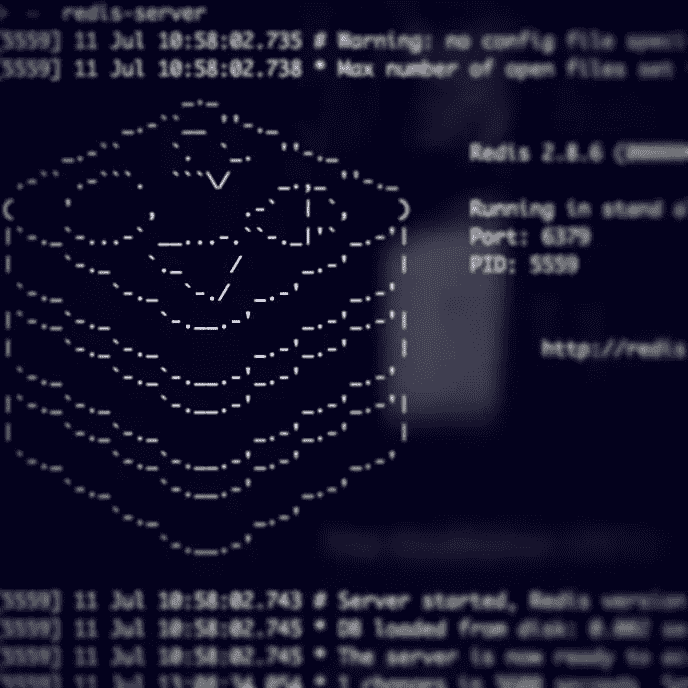
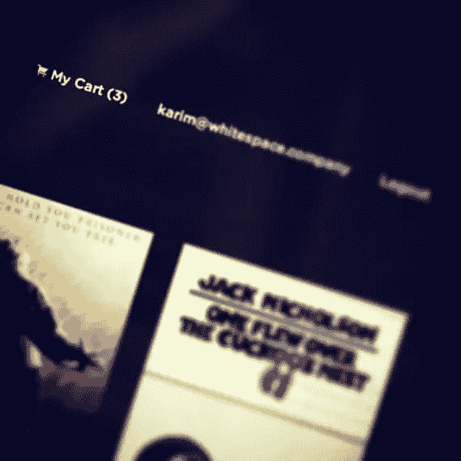

# 用 Rails 构建在线商店

> 原文：<https://www.sitepoint.com/build-online-store-rails/>

网上购物是电子商务的一种形式，它允许消费者使用网络浏览器通过互联网直接购买产品或服务，如电子书、软件和流媒体。这种购物是我们日常生活的一部分，很多知名网站都在使用，比如亚马逊、易贝，或者各种流媒体/教育网站。

这一系列将从头开始建立一个网上商店。我们将学习如何使用一些优秀的工具来使用 Rails，例如:

*   **设计响应页面的基础**
*   **Redis** 在内存中快速存储购物车商品
*   **Braintree** 接受付款并提供高级计划订阅。

我们开始吧！

### **主要特点**

*   **响应式页面:**该应用将使用响应式框架构建，为不同设备提供最佳观看效果。
*   **购物车:**允许用户在浏览网站时积累一份购物清单，然后在结账前计算订单总额。
*   **简单的支付场景:**直接从用户的信用卡中接受支付，而无需将它们存入您的商户账户。
*   **保存信用卡详细信息:**用户可以将他们的信用卡与他们的账户相关联，这样他们就不必每次想买东西时都添加信用卡详细信息。
*   **管理信用卡:**通过提供添加和移除信用卡以及在结账时选择信用卡的功能，扩展支付流程功能。
*   **订阅计划:**为用户提供多个订阅计划，允许用户升级、降级、取消所述订阅。

### **所需技能**

*   使用 Ruby on Rails 的良好体验。
*   HTML/CSS3 的中级水平。
*   JS/Coffescript 和 AJAX 的基础知识
*   理解响应式 CSS 的概念。
*   Redis(一个键值存储)的初级知识。
*   在线支付系统工作原理概述。

### **工具**

*   **Ruby 2 . 1 . 0**–编程语言
*   **轨道**–后端框架
*   **基础 5**–前端 css 框架
*   **设计**–用户认证
*   **Redis**–键值存储
*   **布伦特里**–支付系统

> **注意:**源代码可以在这个 [Github 库](https://github.com/sitepoint-editors/moviestore)上获得。

* * *

## **步骤 1:** 初始化项目

### **创建项目**

让我们创建一个新的 Rails 应用程序和框架。我们使用 mysql 作为我们的数据库:

```
$ rails new moviestore -d mysql
$ cd moviestore
```

### **脚手架**

用一些基本的模型属性生成一个`movie`支架。

```
$ rails g scaffold movie title release_year:integer price:float description:text imdb_id poster_url --skip-stylesheets
```

在这里，我们对支架使用了`--skip-stylesheets`选项，以避免生成任何样式表，因为我们将使用 Foundation。

现在我们可以创建和迁移我们的数据库。

```
$ rake db:create
$ rake db:migrate
```

### **种子文件**

我们需要一些数据来处理，所以我创建了一个名为 [`movies.csv`](https://github.com/sitepoint-editors/moviestore/blob/master/db/seeds_data/movies.csv) 的 csv 文件，其中包含一些电影记录。我把它放在`db/seeds_data`目录下。

我们将遍历 csv 文件记录，以便将它的行加载到数据库中。

```
require 'csv'
CSV.foreach(Rails.root.join("db/seeds_data/movies.csv"), headers: true) do |row|
  Movie.find_or_create_by(title: row[0], release_year: row[1], price: row[2], description: row[3], imdb_id: row[4], poster_url: row[5])
end
```

之后，您可以使用`rake`运行种子文件:

```
$ rake db:seed
```

### **路线配置**

#### **根路由**

现在，让根路径转到电影控制器的`index`动作:

```
root 'movies#index'
```

#### **剩余资源**

我们不需要`resource`提供的所有端点，比如`create`、`update`等。将可用动作限制为`index`和`show`:

```
resources :movies, only: [:show, :index]
```

同样，删除**视图**中所有不必要的文件和`MoviesController`中无用的代码。

### **完成设置**

最后，运行`rails s`并在浏览器中打开 [localhost:3000](http://localhost:3000/) ，你会看到我们的电影列表。

干得好！我们刚刚完成了最初的项目设置，但缺乏风格。让我们使用 Zurb 粉底添加一些漂亮的风格。

* * *

## **第二步:**有基础的响应式设计

> **Foundation** 是一个类似 Twitter Bootstrap 的前端框架，它建立在 SASS 而不是 LESS 之上，这使得它更容易集成到您的 Rails 应用程序中。

### **安装**

要安装 Foundation，请将这一行添加到应用程序的 Gemfile 中:

```
gem 'foundation-rails'
```

然后:

```
$ bundle install
```

### **配置基础**

运行以下命令添加基础:

```
$ rails g foundation:install
```

这会生成 Foundation 所需的一些文件，包括一个布局文件，它会询问您是否要覆盖现有的布局文件。你知道。

> **提示**添加基础宝石后必须重启服务器。

#### **覆盖基础**

如果您现在查看 **application.css** 文件，您会注意到它需要一个由基础生成器创建的`foundation_and_overrides`文件。它允许我们通过设置变量来定制基础。它包含了很多注释，告诉我们可以定制哪些变量。

#### **基金会图标字体**

自然，我们需要一个图标集来为我们的设计添加有意义的符号。幸运的是，Zurb 基金会提供图标字体，你可以从[这里](http://zurb.com/playground/foundation-icon-fonts-3)下载。将**字体**文件夹复制到 **app/assets** 文件夹，并将 **foundation-icons.css** 文件移动到 **app/assets/stylesheets** 文件夹，将其添加到您的应用程序中。



### **自定义布局**

布局现在看起来还可以，但我们还有很多可以改进的地方。我们将为页面添加一些结构，包括页眉、徽标、页脚和主要内容。
要快速做到这一点，抓取一个[基础模板的](http://foundation.zurb.com/templates.html) HTML 代码，放在我们布局页面的`标签之间。非常好用。`

 `##### **申请模板**

在对其中一个基础模板进行了一些定制之后，布局现在由 4 个主要部分组成(顶部栏、警报、主要内容和页脚):

```
<body>

  <%= render "layouts/header" %>

  <%= render "layouts/alerts" %>

  <div id="main-content" class="row full-min-height">
    <%= yield %>
  </div>

  <footer class="row">
    <div class="large-12 columns">
      <hr> <p>© MovieStore 2014</p>
    </div>
  </footer>

  <%= javascript_include_tag "application" %>

</body>
```

我们这里有两个部分来帮助组织布局。第一个是`_header`，包含了顶栏菜单:

```
<div class="row">
  <nav class="top-bar column" data-topbar>

      <ul class="title-area">
        <li class="name">
          <h1>
            <a href="/">
              <i class="fi-play-video"></i> MovieStore
            </a>
          </h1>
        </li>
        <li class="toggle-topbar"><a href="#"><span>Menu</span></a></li>
      </ul>

      <section class="top-bar-section">
        <ul class="right">
          <li><%=link_to "Register", "#" %></li>
          <li><%=link_to "Login", "#" %></li>
        </ul>
      </section>

    </nav>
</div>
```

第二个是`_alerts`，它呈现任何闪光警报或通知:

```
<%if notice.present? || alert.present? %>
  <div class="row">
    <%is_alert = alert.present? ? "alert" : ""%>
      <div data-alert class="alert-box <%=is_alert%>">
        <%=notice || alert%>
        <a href="#" class="close">&times;</a>
      </div>
  </div>
<%end%>
```

### **自定义 CSS**

#### **CSS 助手类**

在**app/样式表**目录下创建一个名为 **helpers.scss** 的新文件。我们将在这个文件中定义一些助手类来保存应用程序中最常用的 CSS。这些类的目的是使您的代码可重用、更快、更高效。这是 [OOCSS 原则](http://www.smashingmagazine.com/2011/12/12/an-introduction-to-object-oriented-css-oocss/)之一，我认为这是好的 CSS 最佳实践。如果你以前没有读过 OOCSS(面向对象的 CSS ),我鼓励你去读一读！

这里是[助手](https://github.com/sitepoint-editors/moviestore/blob/master/app/assets/stylesheets/helpers.scss)样式表。

#### **基础变量**

如前所述，我们将定制一些基础变量来改变默认的颜色和样式，比如按钮、标签、输入等等。知道你必须改变哪些变量的最好方法可以在基础文档中找到。每一节的结尾都显示了相关的变量以及如何定制它们。在**foundation _ overrides . scss**中找到这些变量，并用您想要的值更改它们。你可以在这里找到我定制的变量。

#### **自定义布局样式**

我们想增加更多的自定义布局。为此，创建一个 **layout.scss** 文件，并添加以下内容:

```
// Custom layout styles
// Default font family
@font-face {
  font-family: 'gotham-rounded';
  src: url(gotham-rounded-medium.otf);
}
// Body background
body {
  background-image: url(body_bg.png);
  background-position: center;
  color: #fff;
}
// Logo
.title-area{
  a { padding:0 !important }
  i {
    font-size: 30px;
    position: relative;
    top: 2px;
  }
}
// Topbar items
.top-bar-section ul li { background: transparent }
// Forms
.form-container {
  padding: 3% 3%;
  .switch > div {
    position: relative;
    top: -5px;
  }
}
```

### **样式页面**

#### **索引页**

使用**网格视图**将是显示电影最简单的解决方案。我们可以使用[基础网格系统](http://foundation.zurb.com/docs/components/grid.html)来做到这一点，它提供了一种在网格中平均分割列表内容的方法。让我们定制`index`页面并添加网格类:

```
<h4 class="column">Featured Movies</h4>
<div class="column">
  <ul class="movies-grid no-bullet row">
    <% @movies.each do |movie| %>
      <li class="large-3 medium-4 small-12 column">
        <div class="movie-card padly">
          <%= link_to movie, class: "poster" do %>
            <%= image_tag movie.poster %>
          <% end %>
          <div class="movie-info ell glassy-bg padmy padlx">
            <div class="title">
              <h6><%= movie.title %> <span>(<%= movie.release_year %>)</span></h6>
            </div>
            <p class="left price label movie-label radius">$ <%= movie.price %></p>
            <%= link_to movie.imdb, class: "right" do %>
              <%= image_tag asset_path("imdb_logo.png") %>
            <% end %>
          </div>
        </div>
      </li>
    <% end %>
  </ul>
</div>
```

> **Foundation Grid System** 基于 12 列，我们用 CSS 类来定义它们，因此您可以使用默认的 12 列、可嵌套的 Foundation Grid 快速轻松地创建强大的多设备布局。

我们还添加了一些我们自己的 CSS 类来改进设计并修复它的错误:

```
.movies-grid {
  .movie-card {
    width:220px;
    margin:auto;
    .poster img {
      height: 325px;
      width:100%;
    }
    .movie-info { .title { height: 4em; } }
  }
}
```

注意，我们在`@movie`上调用了`imdb`和`poster`，它们不是`Movie`模型中的属性。这是因为我已经创建了两个实例方法，它们基于其他属性返回适当的 URL。

```
class Movie < ActiveRecord::Base
  def poster
    "http://ia.media-imdb.cimg/M/#{poster_url}"
  end

  def imdb
    "http://www.imdb.com/title/#{imdb_id}/"
  end
end
```



#### **显示页面**

最后一个与样式相关的任务是根据新的布局和类重新设计`show`页面:

```
<div class="large-3 small-12 column">
  <%=image_tag @movie.poster%>
</div>

<div class="large-9 small-12 column">
  <h3>
    <%= @movie.title %>
    (<%= @movie.release_year %>)
    <%=link_to @movie.imdb do%>
      <%=image_tag asset_path("imdb_logo.png")%>
    <%end%>
  </h3>
  <p class="label movie-label radius mb1">$ <%= @movie.price %></p>

  <p><%= @movie.description %></p>
</div>
```

完美！您现在了解了如何处理 Foundation，如何覆盖它，以及如何添加您自己定制的样式表。

* * *

## **步骤 3:** 设计用户模型(认证)

为了在我们的应用程序中处理认证，我们必须用简单的注册和登录表单创建`User`模型。[设计](https://github.com/plataformatec/devise)是最简单的方法之一。

### **安装装置**

首先像我们使用的那样，将 devise gem 添加到您的**gem 文件**中，并运行`bundle`命令来安装它:

```
gem 'devise'
```

安装 device 后，运行生成器来创建描述 device 配置选项的**device . Rb**初始化器:

```
$ rails generate devise:install
```

### **添加用户模型**

创建`User`模型，并使用其生成器将其与设备相关联:

```
$ rails generate devise User
```

这将创建`User`模型，并用默认设计模块对其进行配置。生成器还配置您的 **config/routes.rb** 文件以指向设备控制器。

```
$ rake db:migrate
```

### **配置路线**

device 在我们的 **routes.rb** 文件中提供了`devise_for`方法，允许我们像这样配置 devise routes 路径名:

```
devise_for :users, path_names: { sign_in: 'login', sign_out: 'logout', sign_up: 'register' }
```

### **配置视图**

> 是一个基于 Rails 引擎的完整 MVC 解决方案，它基于模块化概念:“只使用你真正需要的东西”。

您可能已经注意到，没有为 Devise 生成视图。这是因为 Devise 的观点被包装在 gem 内部。我们只需要生成几组视图(像`register` & `login`表单)并定制它们。运行下面的生成器，给它传递一个带有`-v`标志的模块列表，它会把选中的视图复制到你的应用程序中。

```
$ rails generate devise:views -v registrations sessions
```

很好！现在，我们可以使用自定义布局来更改注册和登录表单。

#### **登记表**

**views/registrations/new . html . erb**

```
<div class="form-container radius-box glassy-bg small-10 small-centered medium-8 large-6 columns">
  <h2>Register</h2>

  <%= form_for(resource, as: resource_name, url: registration_path(resource_name)) do |f| %>
    <%= devise_error_messages! %>

    <div class="mb1"><%= f.email_field :email, autofocus: true, placeholder: "Email", class: "radius" %></div>

    <div class="mb1"><%= f.password_field :password, autocomplete: "off", placeholder: "Password", class: "radius" %></div>

    <div class="mb1"><%= f.password_field :password_confirmation, autocomplete: "off", placeholder: "Confirm password", class: "radius" %></div>

    <div><%= f.submit "Let's Go", class: "button" %></div>
  <% end %>
  <%= render "devise/shared/links" %>
</div>
```

#### **登录表单**

**views/sessions/new . html . erb**

```
<div class="form-container radius-box glassy-bg small-10 small-centered medium-8 large-6 columns">
  <h2>Login</h2>

  <%= form_for(resource, as: resource_name, url: session_path(resource_name)) do |f| %>
    <div class="mb1"><%= f.email_field :email, autofocus: true, placeholder: "Email", class: "radius" %></div>

    <div class="mb1"><%= f.password_field :password, autocomplete: "off", placeholder: "Password", class: "radius" %></div>

    <% if devise_mapping.rememberable? -%>
      <div class="switch round small mb1">
        <div class="inline-block left prm"><%= f.check_box :remember_me %> <%= f.label :remember_me %></div>
        <span>Remember me</span>
      </div>
    <% end -%>

    <div class="clear"><%= f.submit "Let me in", class: "button" %></div>
  <% end %>

  <%= render "devise/shared/links" %>
</div>
```


#### **顶栏用户部分**

既然我们现在已经有了登录和注销的用户，编辑 **layout/_header.html.erb** 文件中的 topbar 部分，根据 device`signed_in?`助手显示正确的链接。

```
<ul class="right">
  <%if signed_in?%>
    <li><%=link_to current_user.email, edit_user_registration_path%></li>
    <li><%=link_to "Logout", destroy_user_session_path, method: :delete%></li>
  <%else%>
    <li><%=link_to "Register", new_user_registration_path%></li>
    <li><%=link_to "Login", new_user_session_path%></li>
  <%end%>
```

## **第四步:**购物车

在这一步中，我们希望添加一个购物车，这样用户就可以将他们想要购买的电影添加到购物车中。他们还将能够访问购物车页面，浏览他们添加到购物车的电影，如果需要，可以删除其中任何一部电影。

为了实现这个场景，有一些有用的工具，如[卡特](https://github.com/gillies-dunlop/carter) & [act *as* 购物车](https://github.com/crowdint/acts_as_shopping_cart)，但是我更喜欢使用 [Redis](http://redis.io/) 从头构建它。Redis 速度非常快，有一些特性将完美地满足我们的需求。

> Redis 是一个开源的高级内存键值存储。它通常被称为数据结构服务器，因为键可以包含字符串、散列、列表、集合和排序集。

### **设置指南**

#### **安装**

如果你运行的是 OS X，安装 Redis 最简单的方法就是使用自制软件。

然后，将以下宝石添加到我们的**宝石文件**中，并运行`bundle`

```
gem 'redis', '~> 3.0.1'
gem 'hiredis', '~> 0.4.5'
```

默认情况下，`redis`使用 Ruby 的套接字库与 Redis 对话。因为我们会有一些大的回复(比如我们的应用程序中会用到的`SMEMBERS` list 命令)，所以我们使用了一个名为`hiredis`的替代连接驱动程序，它以牺牲可移植性为代价优化了速度。

最后，我们可以通过运行以下命令来启动它:

```
$ redis-server
```



#### **初始化全局对象**

创建一个名为**/config/initializer/redis . Rb**的初始化文件，我们将在其中设置 Redis 连接。将创建一个全局变量，以便在我们的应用程序的其余部分轻松访问。另外，在实例化客户端对象时，指定`hiredis`作为驱动程序。

```
$redis = Redis.new(:driver => :hiredis)
```

不错！现在，我们已经成功地设置了 Redis，可以在我们的应用程序中使用它了。

### **推车控制器**

首先，生成一个购物车控制器，将`show`作为参数传入，因为这是我们将使用的唯一动作。

```
$ rails g controller carts show
```

#### **路线**

因为我们为每个用户处理一个购物车，`cart`可以是一个[单一资源](http://guides.rubyonrails.org/routing.html#singular-resources)。添加带有`show`动作的`only`选项，并为`add`和`remove`动作定义两条非 RESTful 路线。

```
resource :cart, only: [:show] do
  put 'add/:movie_id', to: 'carts#add', as: :add_to
  put 'remove/:movie_id', to: 'carts#remove', as: :remove_from
end
```

#### **控制器动作**

在`CartsController`中，我们将使用`SMEMBERS`、`SADD`和`SREM` Redis 命令在一个名为`current_user_cart`的唯一集合中列出、添加和删除电影 id，用`current_user.id`标识。关于 Redis 命令的更多细节，我推荐你查看他们的[文档](http://redis.io/commands)，它非常清晰和有用。

```
class CartsController < ApplicationController
  before_action :authenticate_user!

  def show
    cart_ids = $redis.smembers current_user_cart
    @cart_movies = Movie.find(cart_ids)
  end

  def add
    $redis.sadd current_user_cart, params[:movie_id]
    render json: current_user.cart_count, status: 200
  end

  def remove
    $redis.srem current_user_cart, params[:movie_id]
    render json: current_user.cart_count, status: 200
  end

  private

  def current_user_cart
    "cart#{current_user.id}"
  end
end
```

我们添加了`:authenticate_user!`作为一个`before_action`回调函数，将控制器动作的访问权限限制在已登录的用户。同样，在添加&移除动作中，我们用`current_user.cart_count`作为响应，它是`User`模型中的一个实例方法，使用`SCARD`命令返回当前用户购物车中的电影数量:

```
def cart_count
  $redis.scard "cart#{id}"
end
```

最后要做的是将`My Cart`链接添加到顶栏菜单，这样用户可以随时直接访问它。还有，
让我们呈现他们购物车中的电影数量:

```
<li>
  <%= link_to cart_path do%>
    <i class="fi-shopping-cart"></i>
    My Cart
    (<span class="cart-count"><%=current_user.cart_count%></span>)
  <%end%>
</li>
```



#### **添加到购物车按钮**

创建一个“添加到购物车”按钮来处理`add`和`remove`动作。我们会将它添加到电影`show`页面中:

```
<%if signed_in?%>
  <%=link_to "", class: "button", data: {target: @cart_action, addUrl: add_to_cart_path(@movie), removeUrl: remove_from_cart_path(@movie)} do%>
    <i class="fi-shopping-cart"></i>
    <span><%=@cart_action%></span> Cart
  <%end%>
<%end%>
```

我们将`movies#show`动作中的`@cart_action`实例对象定义为:

```
def show
  @movie = Movie.find(params[:id])
  @cart_action = @movie.cart_action current_user.try :id
end
```

它调用`@movie`上的`cart_action`方法，检查该电影是否是当前用户购物车上的成员。它返回适当的文本来呈现按钮标签，并在我们的 coffescript 中使用，我们将在后面看到。

```
def cart_action(current_user_id)
  if $redis.sismember "cart#{current_user_id}", id
    "Remove from"
  else
    "Add to"
  end
end
```

这里我们使用了`SISMEMBER` Redis 命令，它确定一个给定值是否是一个集合的成员。


#### **添加/删除请求**

我们需要使用一些`jQuery`脚本和 AJAX 请求来连接“添加到购物车”按钮。

```
$(window).load ->
  $('a[data-target]').click (e) ->
    e.preventDefault()
    $this = $(this)
    if $this.data('target') == 'Add to'
      url = $this.data('addurl')
      new_target = "Remove from"
    else
      url = $this.data('removeurl')
      new_target = "Add to"
    $.ajax url: url, type: 'put', success: (data) ->
      $('.cart-count').html(data)
      $this.find('span').html(new_target)
      $this.data('target', new_target)
```

我们使用前面提到的设置为`@cart_action`的`target`数据属性来检查当前电影的状态。因此，我们可以指定 ajax `url`为`add_to_cart`或`remove_from_cart`，因为我们使用`addurl` & `removeurl`数据属性将它们传递给我们的脚本。
成功完成 ajax 请求后，用新数字设置位于顶栏菜单中的购物车电影计数，更改按钮的标签，并用新值设置`target`数据属性。

> **注意**:我已经禁用了`Turbolinks.js`，所以我们可以尽可能保持我们的脚本简单。你可以简单地从 **application.js** 文件中删除`require turbolinks`行。

#### **我的购物车页面**

现在，最后要做的是在`carts/show`页面上表示购物车商品。让我们添加一些 HTML 标签:

```
<div id="mycart" class="small-10 small-centered medium-8 large-8 column">
  <div class="p1 glassy-bg mb1 text-center radius-l1 radius-r1">
    <h4>My Cart</h4>
    <p class="mb0"> You've selected <span class="cart-count"><%=current_user.cart_count%></span> movies!</p>
  </div>

  <% @cart_movies.each do |movie|%>
  <div data-equalizer class="cart-movie large-12 column mb1">
    <div class="column large-2 text-center p0" data-equalizer-watch>
      <%=link_to movie do%>
        <%=image_tag movie.poster, class: "radius-l1"%>
      <%end%>
    </div>
    <div class="column large-7 glassy-bg text-center" data-equalizer-watch>
        <p class="scale ptm"> <%= movie.title %> </p>
    </div>
    <div class="column large-3 primary-bg text-center radius-r1" data-equalizer-watch>
      <%=link_to "" , data: {targetUrl: remove_from_cart_path(movie)} do%>
        <i class="fi-x right"></i>
      <%end%>
      <h4 class="scale">$ <%= movie.price %></h4>
    </div>
  </div>
  <%end%>
</div>
```

> 由 Foundation 提供的均衡器是在你的页面上创建等高内容的一个好方法。你可以在这里找到更多关于它如何工作的细节[。](http://foundation.zurb.com/docs/components/equalizer.html)

在 **carts.scss** 文件中给它一点特殊的样式:

```
#mycart {
  .scale {
    position: relative;
    top: 35%;
    transform: translateY(-35%);
  }
  .fi-x {
    position: relative;
    top: 10px;
    right: -5px;
  }
}
```

最后，编写一个类似的脚本来激活`remove`图标功能。

```
$(window).load ->
  $('#mycart .fi-x').click (e) ->
    e.preventDefault()
    $this = $(this).closest('a')
    url = $this.data('targeturl')
    $.ajax url: url, type: 'put', success: (data) ->
      $('.cart-count').html(data)
      $this.closest('.cart-movie').slideUp()
```

哇，看起来现在一切都很顺利。干得好！


## **还有更多事要做**

在我们可以说我们的网上商店已经完成之前，还有更多工作要做。在我的下一篇文章中，我将介绍如何将 Braintree 与我们接受支付的应用程序集成在一起。感谢阅读！

## 分享这篇文章`