# 为移动应用程序使用 Spine 的 2D 动画教程

> 原文：<https://www.sitepoint.com/2d-animation-tutorial-using-spine-mobile-apps/>

在迪士尼动画制作人弗兰克·托马斯和奥利·约翰逊的经典著作《生命的幻觉》中，角色动画艺术被描述为手工制作，

> "看起来能够思考、做出决定并按照自己的意志行动的绘画."

对于需要创造人、昆虫、鸟类和栩栩如生的植物来让他们的手机游戏栩栩如生的移动应用开发者来说，动画，尤其是生物的动画，似乎是一个主要的障碍。许多人转向精灵表，使用纹理打包器等软件将一系列图画转变为“移动的画面”，就像迪士尼动画制作人所做的那样，一帧一帧地移动，每个精灵都轻微移动，以在顺序播放时产生移动人物的幻觉，就像老式的翻页书一样。

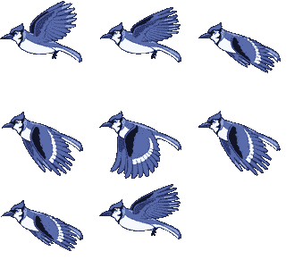

然而，如果精灵表很复杂的话，它会给移动应用带来一些问题。首先，它们很难编辑和维护，因为更改 sprite 工作表的任何元素都意味着精确地替换 sprite 工作表的所有元素。一个错误和动画看起来不稳定和“不真实”。

此外，sprite 工作表会消耗应用程序中一定量的纹理内存。首先，你需要一个嵌入到 sprite 表中的动画元素的副本，可能有几十个图像打包到一个. png 文件中。第二，您可能希望对 sprite 工作表进行内容缩放，以便它在 retina 屏幕上看起来更好，因此您需要一个@2x 版本的 sprite 工作表，使用更多的内存。对于包含许多复杂动画的快速移动游戏，sprite sheets 可能会很快成为一个维护和内存问题。

一定有更好的办法！

进入 Spine，由[深奥软件](http://esotericsoftware.com/)开发的易用且设计精良的软件。Spine 是作为 Kickstarter 项目创建的，并迅速成为许多移动游戏开发者的首选工具。正如一位 [Corona](http://coronalabs.com/) 开发者所说，

> “……试用了大约 2 秒钟后就买了..这是自 Corona 以来基于 Corona 的游戏发生的最酷的事情！”

Spine 不是逐帧创建动画，而是通过创建骨骼动画来工作。简而言之，您创建一个骨架并将其“穿上”皮肤，应用关键帧，然后在很短的时间内创建一个动画。一旦你理解了软件的基础，这是一个直观的过程。在本教程中，我将展示如何创建一个简单的两部分动画:一只蜜蜂有两种状态，飞舞和暂停。

首先，您至少需要 Spine 的试用版。在[esotericsoftware.com/spine-download](http://esotericsoftware.com/spine-download)下载。请注意，除非你购买了该软件的一个版本，否则你无法导出任何文件以在你的移动应用程序中使用，无论是 60 美元的基本版还是 249 美元的专业版。独立开发者需要的大多数功能都包含在 Essential 中，所以如果在试用版向您展示了 Spine 的功能后，您认为可以在您的项目中使用它，我建议您购买它。

你将需要一些艺术来开始你的动画。如果您创建自己的动画元素，请确保在 Pixelmator、Fireworks 或 Photoshop 中，在每个动画元素各自的图层上绘制这些元素。头部、颈部、手臂、躯干和腿部都需要位于各自的层上。我去了 VectorStock.com，买了一张蜜蜂的图片。下载包括一个 Illustrator 文件，它允许你分离出我想要制作动画的蜜蜂的四个元素:头、躯干和两只翅膀。我将这些元素保存为四个独立的部分。png 文件。将动画元素放入将成为其在应用程序中的最终位置的文件夹是一个好主意，这样您就不必在以后更改图像的路径。

在开始之前，考虑将基本图像的占位符添加到 Spine，以便正确放置骨骼。您可以将其与图像片段一起导入，并在动画过程结束时将其删除。你可能更喜欢设置它的不透明度低或着色，以提醒自己以后删除它。

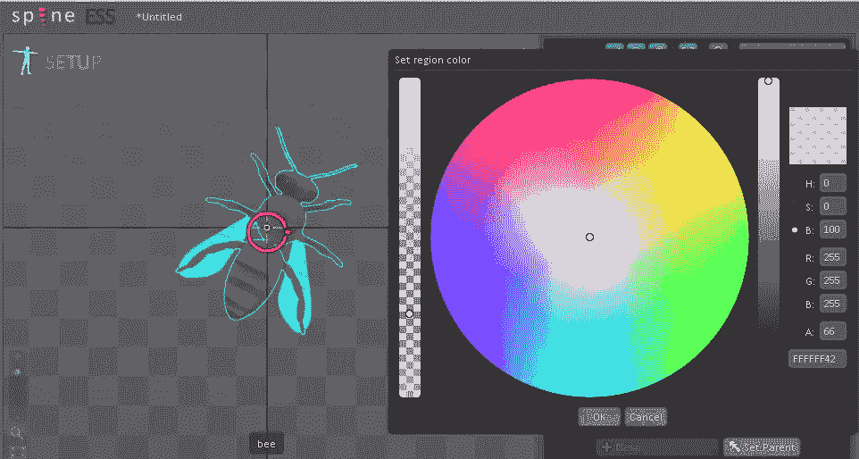

我首先在 Spine 中创建了一个新的“骨骼”(Cmd+n / Ctrl+n)，并绘制了动画的四个元素——头部、身体和两个翅膀。我恰当地命名了骨骼的每一根“骨头”。为此，请确保您处于 Spine 的“设置”区域(“设置”文本会在设置和动画状态之间切换，如果您单击它)。单击工具箱中的“创建”,将骨骼绘制到网格上。如果你卡住了，确保你的屏幕如下图所示。

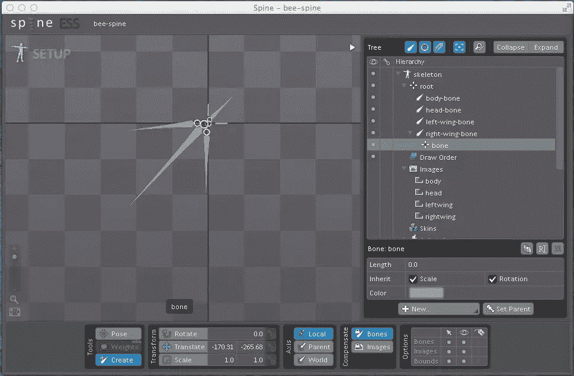

一旦你对骨骼的外观感到满意，你就需要导入给骨骼“蒙皮”的图像。如果你告诉 Spine 浏览哪个文件夹，它会导入你的动画需要的图像。我也给这些图片起了名字。

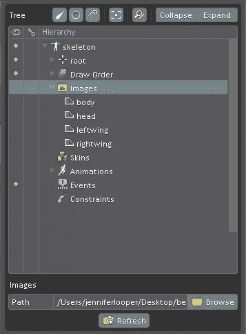

将皮肤(图像)从右侧面板拖到骨骼上。要确保元素以正确的顺序显示，您可以在面板中选择一个元素，然后单击“+”或“-”将其在插槽顺序中上移或下移。

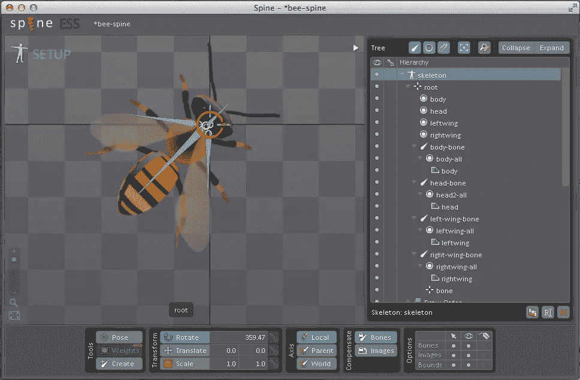

接下来，通过选择您刚刚导入的皮肤的一个元素，并在右侧面板中单击“设置父对象”，将骨骼连接到皮肤。一旦为皮肤元素指定了骨骼父元素，就可以通过拖动骨骼来排列姿势。

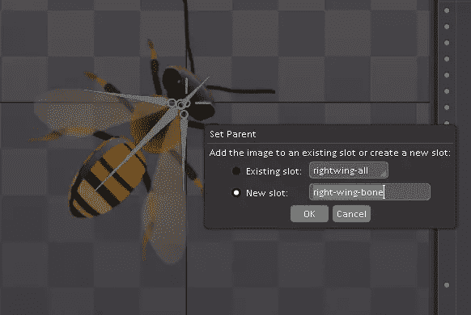

现在皮肤和骨骼已经排列好了，你可以开始制作动画了！作为演示，我创建了一个“懒蜜蜂”游戏界面。这是一个示例 Corona SDK 应用程序，其中蜜蜂在一个蜂窝上休息。给蜜蜂喂食花粉，点击蜂房，蜜蜂就可以飞到它的新空间了。如果你不给蜜蜂喂食，它会停留在蜂巢上的“休息”模式，只是轻微地移动。

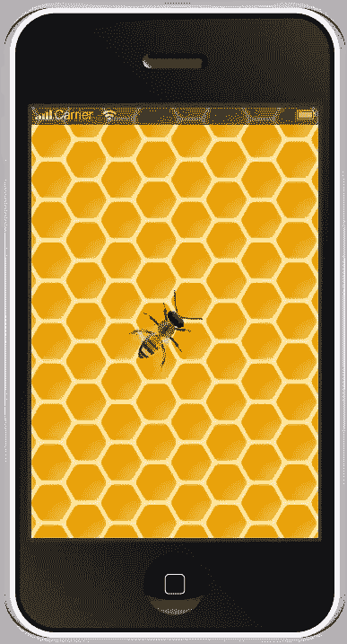

单击左侧的“设置”文本切换到动画屏幕。这是我们开始体验闪光似曾相识的地方，因为我们将开始为关键帧分配姿势。对于“懒惰的蜜蜂”，我需要创建两个动画，一个是脉冲翅膀运动的“休息”状态，一个是循环翅膀颤动和身体摆动效果的“飞行”状态。

为此，点击右边树中的“动画”,生成一个新的动画。点击关键帧 0，选择为“循环开始”，选择 15 为“循环结束”。然后连续单击每个关键帧，并稍微移动骨骼(附有皮肤)以使翅膀和身体移动。对于“飞翔”动画，翅膀移动得更剧烈、更快，这是通过“回放”按钮控制的设置。对于“休息”动画，翅膀只移动一点点，并且只在八个关键帧上移动。

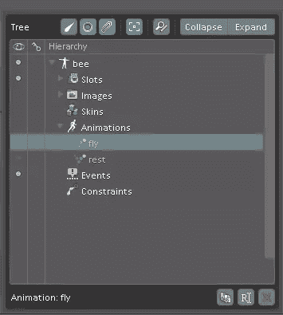

对于每个关键帧，旋转、平移(移动)或缩放特定骨骼，然后单击属性旁边的“关键点”按钮保存关键帧。未更改的关键帧按钮开始为绿色，已编辑的关键帧为橙色，更改并存储后，按钮变为红色。一个好的技巧是启用“自动关键点”,这样 Spine 会自动记住骨骼的关键帧。

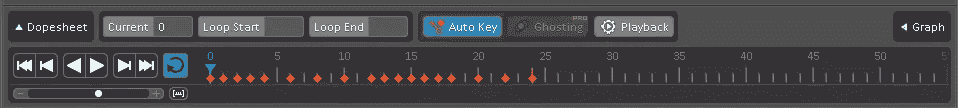

保存所有动作后，要循环播放动画，请单击“重复”按钮，然后单击“播放”按钮。这将显示您是否有错位的骨头或任何不自然移动的东西。如有必要，逐个关键帧进行更改，确保通过关键帧按钮存储每个编辑。点击“摄影表”查看动画的更多细节。通过在“回放”区域编辑来更改回放速度，可从“回放”按钮进入。

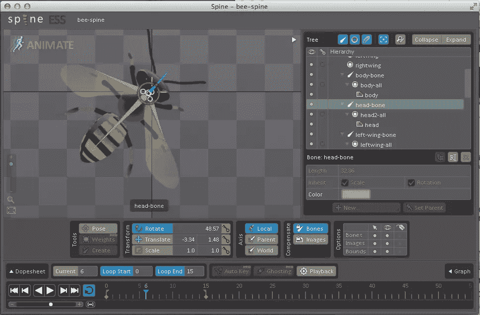

对你的动画满意吗？现在是时候导出了。为此，您需要一个付费许可证。有几个导出选项，甚至还有一个内置的 texturepacking 工具，这样您就可以将所有图像打包成一个。png 并生成一个地图，如果你喜欢建立精灵。

出于我的目的，我将动画保存为一个. json 文件。你可以把它保存成“漂亮的打印”格式，以便于阅读和调试。

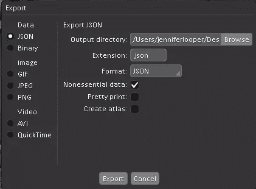

要在你的移动应用中使用你的新动画，你需要一个由深奥的软件构建的[运行时。我将 Corona SDK 运行时导入到我的应用程序中。](https://github.com/EsotericSoftware/spine-runtimes)

已完成的项目可在 [github](https://github.com/sitepoint-examples/lazy-bee) 上获得。一旦。json 文件和图像可以访问你的主代码库，你可以添加粒子效果和按钮来将你的动画附加到给定的事件中(下面的代码是 [lua](http://www.lua.org/) )。

```
--include the Spine library

 local spine = require "spine-corona.spine”
 include the json file generated by Spine
 local json = spine.SkeletonJson.new()
 local skeletonData = json:readSkeletonDataFile("animations/bee.json")

 --draw the skeleton using the data

 local skeleton = spine.Skeleton.new(skeletonData)

 --dress the skeleton with the image files

 function skeleton:createImage (attachment)
         return display.newImageRect("animatioimg/" .. [attachment.name](http://attachment.name) .. ".png",100,100)
end

--place the animation on the screen in the right position

skeleton.group.x = display.contentWidth/2
skeleton.group.y = display.contentHeight/2
skeleton.flipX = false
skeleton.flipY = false

--get ready to make it move

local stateData = spine.AnimationStateData.new(skeletonData)
local state = spine.AnimationState.new(stateData)

--set it to its ‘rest’ state

state:setAnimationByName(0, "rest", true, 0)
```

你可以在这里看到最终产品:

[//www.youtube.com/embed/2qPrSaJ_UgQ](//www.youtube.com/embed/2qPrSaJ_UgQ)

在本教程中，我已经概述了最低限度你可以做的脊椎。当你需要用动画来活跃你的界面时，我强烈推荐你在游戏和移动应用中使用它。有了这个工具，复杂的动画变得易于管理，即使是最小的独立开发商店。

感谢 Laura Tallardy，脊柱动画应用程序的插画师和开发者。在她的最新应用程序[公主拼图](https://itunes.apple.com/app/id892532469)中查看她的脊椎动画，应用程序预告片可以在[这里](https://www.youtube.com/watch?v=v7ZpQEY6H-U)找到

## 分享这篇文章